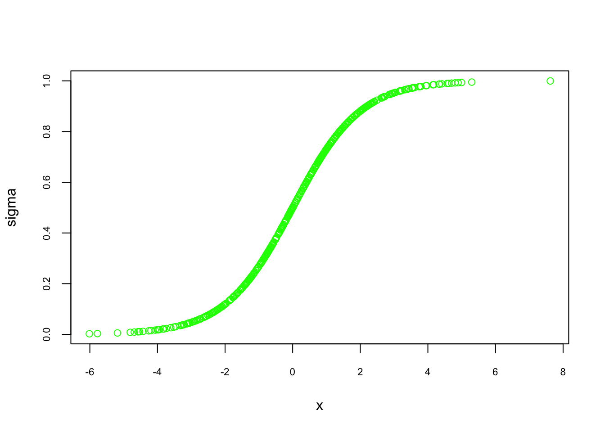
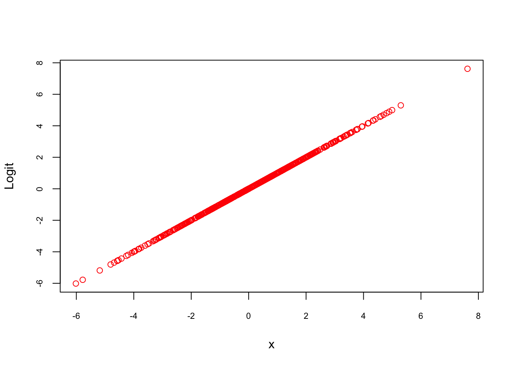
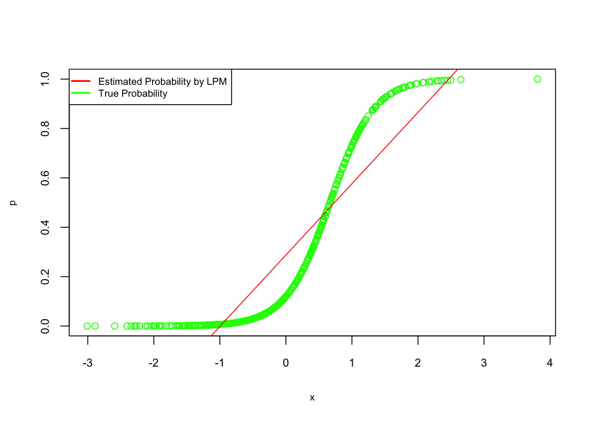
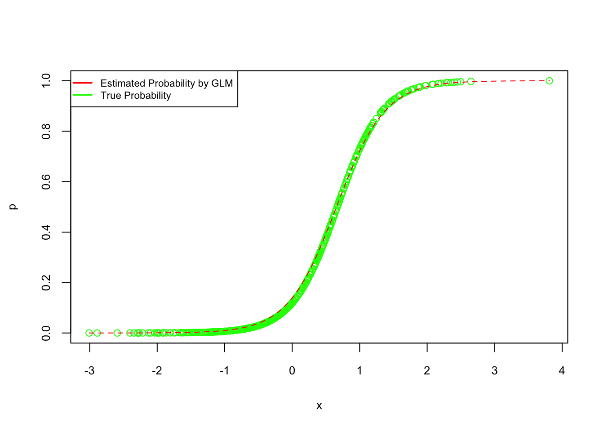

# Parametric Estimation - Basics

Statistical analysis relies on choosing appropriate models to interpret data and make inferences. This chapter focuses on parametric estimations, which assume a specific data distribution and provide structured, interpretable insights. Widely used in applied econometrics, these models offer simplicity and efficiency but may lack flexibility when the data deviate from assumed patterns. We will explore the foundational concepts of parametric estimation, examine key models like the Linear Probability Model (LPM) and logistic regression, and compare their applications, strengths, and limitations. This will build a comprehensive understanding before transitioning to the broader discussion of data modeling and algorithmic modeling in the next section. Following this, we will examine the differences between parametric and nonparametric models before exploring specific parametric methods like LPM and logistic regression.

## The Dichotomy of Statistical Modeling

Statistical modeling can be broadly divided into data modeling and algorithmic modeling. Data modeling, rooted in parametric assumptions, focuses on understanding variable relationships and making causal inferences. Algorithmic modeling, often associated with machine learning, emphasizes predictive accuracy without strict distributional assumptions. While traditional econometrics has focused on causal inference, recent advancements in machine learning have expanded its toolkit, facilitating the use of both modeling approaches. The following sections will explore these distinctions further, providing a solid foundation for understanding how parametric and nonparametric models are applied in practice.

### Data versus Algorithmic Approaches:

In statistical modeling, a fundamental distinction exists between two approaches: data modeling and algorithmic modeling. These perspectives offer different philosophies on extracting insights from data and have significantly shaped the evolution of statistics. This chapter explores their contrast, drawing on insights from Leo Breiman's seminal work *"Statistical Modeling: The Two Cultures"* (Breiman, 2001) and subsequent reflections from leading statisticians (Gelman, 2021; Ogburn & Shpitser, 2021). Readers are encouraged to consult Breiman's paper and the *Observational Studies* special issue (2021) for a deeper understanding of this discussion.

The concept of the "two cultures" in statistical modeling echoes CP Snow's 1959 work on the divide between traditional and scientific cultures. In 2001, Breiman applied this notion to statistics, arguing that around 98% of statisticians adhered to the data modeling culture, which prioritizes interpretability through simplified models. He advocated for the broader adoption of algorithmic models, particularly in cases where predictive accuracy is a primary objective.

**Data Modeling**, or classical statistical modeling, assumes that the data follow a specific probabilistic structure, such as linear or logistic regression models. These models prioritize interpretability, often facilitating clear insights into variable relationships. Model validation typically relies on goodness-of-fit tests, and parametric assumptions provide a structured approach to inference. However, when data are high-dimensional or complex, strict reliance on parametric models may lead to oversimplified or biased conclusions.

**Algorithmic Modeling:** often associated with machine learning, takes a more flexible approach by focusing on function estimation. Methods like neural networks, decision trees, and ensemble techniques emphasize predictive accuracy without relying heavily on assumptions about data distribution. While these models often excel in large-scale applications, they are typically less interpretable, posing challenges in fields where understanding the reasoning behind predictions is critical.

Breiman (2001) argued that the dominance of data modeling limited statisticians' engagement with real-world problems that could benefit from algorithmic methods. He highlighted scenarios where algorithmic models, particularly in fields like medical diagnosis and financial forecasting, had demonstrated superior predictive performance. In response, statisticians like Cox (2001) and Efron (2001) acknowledged the strengths of algorithmic models but cautioned against the potential loss of interpretability. They emphasized the importance of methodological diversity and the thoughtful application of both approaches.

Gelman (2021) further reflected on Breiman’s perspective, critiquing his dismissal of Bayesian methods and advocating for their integration into modern statistical practice. He emphasized that algorithmic modeling could complement data modeling, especially in complex tasks such as hierarchical modeling and model checking. Similarly, Ogburn and Shpitser (2021) explored the role of algorithmic modeling in causal inference, arguing that machine learning can improve the estimation of the causal effect when used alongside traditional econometric methods.

In econometrics, the initial reaction to Breiman’s paper was one of confusion, as the field was predominantly focused on causal inference rather than prediction. Econometricians were more concerned with estimating association and causal effects, leading to a divergence from Breiman’s prediction-centered approach. Prominent statisticians such as Cox (2001), Efron (2001), and Gelman (2021) weighed in on Breiman’s arguments, providing thoughtful critiques and extensions of his viewpoints. Cox emphasized the importance of methodological diversity and cautioned against applying models mechanically. Efron, while praising Breiman’s openness to new ideas, questioned the heavy emphasis on prediction in Breiman’s work. In response, Breiman clarified that algorithmic modeling should not replace data modeling but rather complement it, particularly when tackling complex prediction problems where traditional methods struggle.

The evolving convergence of econometrics and machine learning illustrates the growing acceptance of algorithmic models in causal research. While econometricians historically prioritized causal effect estimation, the incorporation of machine learning techniques has expanded their toolkit. This shift allows for improved estimation of average treatment effects and treatment effects conditional on observable characteristics, as highlighted by recent applications in supply and demand estimation and returns to education (Athey & Imbens, 2019). Since then, the integration of these methods has continued to advance rapidly, contributing to more accurate and robust causal analysis.

Over the past two decades, Breiman’s algorithmic perspective has gained significant traction. The rise of deep learning and machine learning, especially in prediction and classification tasks, has underscored the value of algorithmic approaches in a variety of scientific fields. Moreover, the integration of machine learning into econometric methods has expanded the field’s focus to include causal discovery, creating a productive convergence between the two cultures. This development highlights the growing recognition that predictive accuracy and causal analysis can complement each other. For further reflections on the relevance of Breiman’s work, see the commentaries in *Observational Studies* (2021).

In summary, the two cultures are not mutually exclusive. A balanced approach that leverages the strengths of both data and algorithmic modeling can improve research outcomes. By acknowledging the limitations and advantages of each, statisticians and econometricians can make more informed methodological choices. This perspective will remain essential as data complexities grow and the demand for accurate, interpretable insights continues to rise. Building on this discussion of data and algorithmic modeling, we now turn to another fundamental distinction in statistical analysis: parametric versus nonparametric models. This contrast further highlights how methodological choices are influenced by the balance between interpretability and predictive accuracy.


### Parametric versus Nonparametric Models

Leo Breiman's distinction between data and algorithmic modeling has a nuanced relationship with parametric and nonparametric models. The data modeling approach, often associated with parametric models, operates under strict assumptions about the underlying data distribution. These models—such as linear regression, logistic regression, ANOVA, and Poisson regression—rely on assumptions like normality or binomial distributions. Parametric models excel in their simplicity and interpretability, providing efficient ways to make inferences about the population, particularly when the data align well with their underlying assumptions. In these cases, parametric models offer clarity in estimating distribution parameters such as the mean and standard deviation. However, their reliability diminishes when the data deviate from these assumptions, potentially leading to biased or inaccurate predictions and conclusions.

On the other hand, the algorithmic modeling approach aligns more naturally with nonparametric models, which make no specific assumptions about the data distribution. Techniques like k-Nearest Neighbors, kernel density estimation, and decision trees such as CART fall under this category. These models offer greater flexibility and adaptability, particularly in situations where the underlying distribution is unknown or does not meet the assumptions of parametric models. Nonparametric models are especially effective for handling ordinal or categorical data and are often used when parametric models are unsuitable. While they offer robustness and the ability to model complex, nonlinear relationships that parametric models struggle with, nonparametric models typically require larger datasets for effective learning and can be less efficient in terms of statistical power. This flexibility comes at the cost of interpretability, making nonparametric models less desirable in contexts where understanding the model’s inner workings is critical.

It is important to note that the distinction between Breiman's two cultures and the choice between parametric and nonparametric models is not rigid. The data modeling approach, traditionally focused on inference and understanding the underlying structure of the data, can still incorporate nonparametric techniques when necessary. Conversely, the algorithmic approach, often associated with complex, black-box models, can utilize parametric models in contexts where simplicity or interpretability is valued. This fluidity highlights that the decision between parametric and nonparametric models should be guided by the characteristics of the data and the research objectives.

A balanced perspective also acknowledges the role of semi-parametric models, which combine elements of both parametric and nonparametric methods. For example, the Cox proportional hazards model is a widely used semi-parametric model in survival analysis. By incorporating both parametric assumptions and nonparametric components, semi-parametric models offer a compromise that provides interpretability while maintaining flexibility. Such models are particularly useful in fields where understanding the relationship between variables is crucial, but the underlying data distribution is complex or unknown.

Parametric models are well-suited for situations where the underlying data distribution is known and the focus is on estimating parameters within this framework. Their clarity and efficiency make them valuable tools in applications ranging from economics to the natural sciences. In contrast, nonparametric models offer a flexible alternative, particularly valuable when dealing with data that do not conform to specific distributional assumptions or when the distribution is unknown. These models have proven indispensable in fields such as machine learning, where handling high-dimensional, complex data requires adaptive techniques without the constraints of parametric assumptions.

Ultimately, the decision to use parametric or nonparametric models transcends the boundaries of Breiman's two cultures. It is shaped by the specific context, the nature of the data, and the goals of the analysis. As the lines between data modeling and algorithmic modeling continue to blur, so too does the distinction between parametric and nonparametric models. Both approaches provide valuable tools for understanding and predicting complex phenomena, and their ongoing interaction reflects the evolving nature of statistical modeling in modern data analysis.

As we continue exploring the intricacies of statistical modeling, the next section will focus on Parametric Estimations, where we will discuss two examples: linear probability models and logistic regression. Having already covered OLS in previous chapters, we will build on that foundation. Following this, we will turn our attention to Nonparametric Models, introducing flexible approaches that do not depend on specific distributional assumptions and highlighting their usefulness in addressing more complex data structures in the next chapter.

## Parametric Estimations

In previous chapters, we covered the OLS method, simulating with polynomial functions to estimate the relationship between predictors and a continuous outcome. OLS is a regression method used in both data modeling and machine learning, where the goal is to estimate the parameters, \( \beta \), of a known functional form that is linear in its coefficients. This aligns with the parametric data modeling approach discussed earlier, where we assume we know the form of the data-generating process.

However, when the outcome variable is binary, OLS can still be used but shifts into the realm of classification. In this case, the model is called the Linear Probability Model (LPM). Like OLS, LPM assumes a linear relationship between the predictors \( X \) and the response \( Y \), with \( \beta \) representing the parameters to be estimated. The key difference is that the outcome is now binary, taking values of 0 or 1. Despite this change, the functional form remains the same as in OLS.

Now, we will explore LPM, a simple model for binary classification, and demonstrate it using a simulation. This discussion will provide the groundwork for the next section, where we will cover logistic regression.

### Linear Probability Model (LPM)

The LPM is a straightforward method for predicting binary outcomes. It models the probability of an event occurring (e.g., high mpg or low mpg) as a linear function of the predictor variables:

\begin{equation} \mathbb{P}(Y = 1 | X) = X \beta \end{equation}

Here, \( \beta \) represents the coefficients estimated using least squares, and \( X \) contains the predictor variables. Similar to OLS, LPM uses the identity link function to directly relate the probability of \( Y = 1 \) to the linear combination of the predictors. However, one limitation of LPM is that it can predict probabilities outside the range of [0, 1], making it less suitable for classification in some cases. Nonetheless, it provides a simple and intuitive starting point for binary classification tasks.

We will demonstrate the LPM by simulating a dataset and predicting whether a vehicle has high or low fuel efficiency (mpg). First, we create a binary variable \( mpg \), where 1 indicates high efficiency and 0 indicates low efficiency.


``` r
# Load necessary libraries
library(fueleconomy)
library(ggplot2)

# Load and prepare data
data(vehicles)
df <- as.data.frame(vehicles)

# Keep only complete cases
data <- df[complete.cases(df), ]

# Create binary mpg variable: 1 if hwy > mean(hwy), 0 otherwise
data$mpg <- ifelse(data$hwy > mean(data$hwy), 1, 0)

# Convert character variables to factors
for (i in 1:ncol(data)) {
  if(is.character(data[,i])) data[,i] <- as.factor(data[,i])
}

# Fit Linear Probability Model (LPM)
model_lpm <- lm(mpg ~ fuel + 0, data = data)
summary(model_lpm)
```

```
## 
## Call:
## lm(formula = mpg ~ fuel + 0, data = data)
## 
## Residuals:
##     Min      1Q  Median      3Q     Max 
## -0.8571 -0.4832 -0.2694  0.5168  0.7306 
## 
## Coefficients:
##                                 Estimate Std. Error t value Pr(>|t|)    
## fuelCNG                         0.362069   0.065383   5.538 3.09e-08 ***
## fuelDiesel                      0.479405   0.016843  28.463  < 2e-16 ***
## fuelGasoline or E85             0.269415   0.015418  17.474  < 2e-16 ***
## fuelGasoline or natural gas     0.277778   0.117366   2.367   0.0180 *  
## fuelGasoline or propane         0.000000   0.176049   0.000   1.0000    
## fuelMidgrade                    0.302326   0.075935   3.981 6.87e-05 ***
## fuelPremium                     0.507717   0.005364  94.650  < 2e-16 ***
## fuelPremium and Electricity     1.000000   0.497942   2.008   0.0446 *  
## fuelPremium Gas or Electricity  0.857143   0.188205   4.554 5.27e-06 ***
## fuelPremium or E85              0.500000   0.053081   9.420  < 2e-16 ***
## fuelRegular                     0.483221   0.003311 145.943  < 2e-16 ***
## fuelRegular Gas and Electricity 1.000000   0.176049   5.680 1.36e-08 ***
## ---
## Signif. codes:  0 '***' 0.001 '**' 0.01 '*' 0.05 '.' 0.1 ' ' 1
## 
## Residual standard error: 0.4979 on 33370 degrees of freedom
## Multiple R-squared:  0.4862,	Adjusted R-squared:  0.486 
## F-statistic:  2631 on 12 and 33370 DF,  p-value: < 2.2e-16
```

This model predicts the probability of \( \text{mpg} = 1 \) (high fuel efficiency) based on the type of fuel used. In this case, the identity link function relates the probability directly to the linear function of the predictor variables.

We can examine the predicted probabilities and classification accuracy using a threshold of 0.5 for \( \text{mpg} = 1 \).


``` r
# Predicted probabilities for mpg = 1
mpg_hat <- fitted(model_lpm)

# Classify based on threshold of 0.5
mpg_pred <- ifelse(mpg_hat > 0.5, 1, 0)

# Summary of predicted probabilities
summary(mpg_hat)
```

```
##    Min. 1st Qu.  Median    Mean 3rd Qu.    Max. 
##  0.0000  0.4832  0.4832  0.4824  0.5077  1.0000
```

``` r
# Table of predicted vs actual mpg values
table(Predicted = mpg_pred, Actual = data$mpg)
```

```
##          Actual
## Predicted     0     1
##         0 12993 11712
##         1  4287  4390
```

The predicted values above show how the LPM operates in practice. However, as seen, the predicted probabilities are not restricted between 0 and 1, which is one of the limitations of the LPM. We will address these issues by introducing a more suitable classification model in the next section.

Although LPM provides a simple approach to classification, its limitations make it unsuitable for more complex tasks. To overcome these issues, we will explore logistic regression in the following section, a more robust model that ensures predicted probabilities are always between 0 and 1.

### Logistic Regression

After discussing the Linear Probability Model (LPM) in the previous section, which demonstrated a simple yet limited approach for binary classification, we now turn to a more robust method: Logistic Regression. While LPM assumes a linear relationship between predictors and the probability of the outcome, it can predict probabilities outside the [0, 1] range and lacks flexibility in modeling nonlinear relationships. This is where Logistic Regression becomes crucial. By using a nonlinear function, it overcomes the issues associated with LPM, particularly in cases where probabilities must be confined within valid bounds.

Logistic Regression is widely used across various fields, including healthcare for predicting disease presence, finance for assessing credit risk, and marketing for customer churn prediction. Its ability to provide interpretable probabilities makes it a preferred choice in many real-world applications.

Logistic Regression is also a special case of a Generalized Linear Model (GLM), using the logistic function as its link function to model the relationship between predictors and a binary outcome. This connection to GLMs allows it to apply linear modeling principles while ensuring the output remains within the valid probability range.

We begin by introducing key notation for logistic regression, a method widely used in economics and statistics to model the probability of a binary outcome. Let \(Y\) denote a binary dependent variable, taking values \( Y = 1 \) (e.g., success, event occurs) or \( Y = 0 \) (e.g., failure, event does not occur), and let \( \mathbf{X} \) represent a vector of explanatory variables (predictors). The goal is to estimate the conditional probability of \( Y = 1 \) given \( \mathbf{X} = \mathbf{x}\) :

\begin{equation} p(\mathbf{x}) = P(Y = 1 | \mathbf{X} = \mathbf{x}) \end{equation}

Since \(Y\) is binary, the probability of the complementary outcome, \( Y = 0 \), is:

\begin{equation} P(Y = 0 | \mathbf{X} = \mathbf{x}) = 1 - p(\mathbf{x}) \end{equation}

In logistic regression, we model this probability using the logistic function, also known as the sigmoid function, which maps a linear combination of predictors into the interval \([0, 1]\). The general form of the logistic function is:

\begin{equation} p(x) = \frac{L}{1 + e^{-k(x - x_0)}} \end{equation}

Here, \(L\) denotes the upper asymptote (the maximum value of the function), \(k\) governs the steepness of the curve, and \(x_0\) is the value of \(x\) at which the function reaches \(L/2\), the midpoint of its range.

In statistical applications like logistic regression, we typically standardize this function. The standard logistic function, commonly employed in logistic regression, arises by setting \(L = 1\) (to bound probabilities between 0 and 1), \(k = 1\) (for a standard slope), and \(x_0 = 0\) (centering the function at zero):

\begin{equation} p(\mathbf{x}) = \frac{1}{1 + e^{-z}} \end{equation}

where \(z = \beta_0 + {\beta}^\top f(x)\) is the linear predictor, with \(\beta_0\) as the intercept and \(\mathbf{\beta}\) as the vector of coefficients corresponding to \(\mathbf{x}\).

This function, often denoted \(\sigma(z)\), is also called the sigmoid or expit function (the inverse of the logit). It can be equivalently expressed as:

\begin{equation} \sigma(z) = \frac{e^z}{1 + e^z} = \frac{1}{1 + e^{-z}} \end{equation}

In this context, \(z\) encapsulates the effect of the predictors on the log-odds of the outcome. For a simple case with one predictor \(x\), we have \(z = \beta_0 + \beta_1 x\). If \(\beta_0 = 0\) and \(\beta_1 = 1\), then \(z = x\), reducing the expression to the standard form:

\begin{equation} p(x) = \frac{1}{1 + e^{-x}} \end{equation}

The primary advantage of the logistic function is its ability to map any real-valued input to a value between 0 and 1, making it ideal for modeling probabilities. The curve’s S-shape is particularly useful in binary classification tasks, as it reflects scenarios where the relationship between the input and the outcome probability is nonlinear. Near the midpoint, the probabilities change most rapidly, while the changes slow down as the values approach the asymptotes at 0 and 1. This characteristic is especially relevant in practical applications, such as predicting the probability of disease presence based on medical indicators or assessing loan default likelihood based on financial variables. In summary, the logistic function’s bounded nature and flexible shape provide an effective way to model the probabilities of binary outcomes, making it a foundational component of logistic regression models.

While logistic regression resolves the probability range issue, it still relies on a parametric form, assuming a linear relationship between the predictors and the log-odds of the outcome. This can be a limitation when dealing with more complex data structures. In such cases, more flexible models like decision trees or neural networks may be preferred. Nevertheless, logistic regression remains a valuable tool when interpretability and clear probabilistic predictions are essential.

To better understand how the logistic function maps inputs to probabilities, we can visualize its characteristic S-shaped curve for different values of \( z \):

<div class="figure">

<p class="caption">(\#fig:para3)S-shaped curve of the logistic function</p>
</div>

As \(x\) moves toward large positive or negative values, the predicted probabilities approach 1 or 0, respectively. This nonlinear mapping is particularly useful in real-world scenarios where marginal effects diminish at extreme values. For instance, in predicting the effect of savings on home ownership, small changes in savings may have little effect at both low and high savings levels. The logistic function captures this behavior through its characteristic S-shaped curve.

In logistic regression, the probability of the outcome is modeled as:

\begin{equation}
p(x) = P[Y=1 | X=x] = \frac{1}{1 + e^{-(\beta_0 + \beta_1 x)}}
\end{equation}

This equation highlights the nonlinearity of the relationship between the predictor and the probability of \(Y=1\), driven by the logistic function. While a small change in \(x\) near the middle of the curve may result in a significant change in probability, the effect diminishes as the curve flattens at the tails.

To further understand this, consider the scenario of predicting home ownership based on savings. At extremely low savings, the probability of owning a home remains close to zero, even with slight increases in savings. Similarly, once savings are sufficiently high, further increases have little effect, as the probability approaches one. This diminishing effect is a key characteristic of the nonlinearity of the logistic function.

The logistic function can also be expressed in terms of log-odds, which linearizes the relationship:

\begin{equation}
\ln\left(\frac{p(x)}{1 - p(x)}\right) = \beta_0 + \beta_1 x
\end{equation}

Here, the term \(\frac{p(x)}{1 - p(x)}\) represents the odds of the outcome occurring, and the logarithm of the odds is referred to as the logit. This transformation is fundamental in logistic regression, allowing for a direct interpretation of the coefficients \(\beta_0\) and \(\beta_1\) in terms of their effect on the log-odds.

We can visualize this relationship by plotting the log-odds transformation of the predicted probabilities:


``` r
p_x <- sigma 
Logit <- log(p_x / (1 - p_x)) 
plot(Logit ~ x, col = "red", cex.axis = 0.7) 
```

<div class="figure">

<p class="caption">(\#fig:para4)Log-odds transformation of predicted probabilities</p>
</div>

As expected, the log-odds form a linear relationship with \(x\), confirming the underlying assumption of logistic regression. This linearity in the logit space allows logistic regression to model complex, nonlinear relationships in the probability space while maintaining interpretability and computational efficiency.


### Linear vs. Logistic Probability Models

When deciding between linear and logistic models, the choice depends on the nature of the data and the desired output. The Linear Probability Model (LPM) is simple to implement but can predict probabilities outside the [0, 1] range and struggles with nonlinearity.Logistic regression solves these issues by using the logistic function, which maps predicted values within the [0, 1] range.

In many scenarios, researchers turn to logistic regression for binary outcomes. While the linear model may be suitable for certain cases, logistic regression is more appropriate when the relationship between the predictors and the probability of the outcome is nonlinear. To compare both models, consider the following representations:

\begin{equation}
P[Y = 1|\mathbf{X}=\mathbf{x}]=E[Y | \mathbf{X}=\mathbf{x}] = \beta_{0}+\beta_{1} x_{1}+\beta_{2} x_{2}+\ldots+\beta_{k} x_{k}
\end{equation}

\begin{equation}
\ln \left(\frac{P[Y=1|\mathbf{X}]}{1-P[Y=1|\mathbf{X}]}\right)=\beta_{0}+\beta_{1} x_{1}+\ldots+\beta_{k} x_{k}
\end{equation}

In the linear model, \( P \) is a linear function of the predictors, while in the logistic model, the log-odds of \( P \) is linear. The logistic model requires maximum likelihood estimation (MLE), while LPM can be estimated using OLS.

The logistic function is defined as:

\begin{equation}
p(\mathbf{x})=E[Y | \mathbf{X}=\mathbf{x}]=P[Y=1 | \mathbf{X}=\mathbf{x}]=\frac{1}{1+e^{-(\beta_{0}+\beta_{1} x_{1}+\cdots+\beta_{p-1} x_{p-1})}}
\end{equation}

One key advantage of LPM is its interpretability. In a linear model, a coefficient like \( \beta_{2} = 0.05 \) means a one-unit increase in \( x_2 \) raises the probability of \( Y = 1 \) by 5 percentage points. On the other hand, in logistic regression, \( \beta_1 = 0.05 \) means a one-unit increase in \( x_1 \) leads to a 0.05 increase in the log-odds, which is harder to interpret directly.

The logistic model is essential when it fits the data better, especially when probabilities are nonlinear. However, in many cases, both models give similar results, but the logistic model’s estimates are more complex to interpret.

#### Simulation Example:

Let’s illustrate this with a simulation.


``` r
#Creating random data
set.seed(1)
n <- 500
x = rnorm(n)
z = -2 + 3 * x

#Probabilities are defined by a logistic function
p = 1 / (1 + exp(-z))

#Bernoulli distribution defines Y as 1 or 0
y = rbinom(n, size = 1, prob = p)

#Create the data
data <-  data.frame(y, x)
head(data)
```

```
##   y          x
## 1 0 -0.6264538
## 2 0  0.1836433
## 3 0 -0.8356286
## 4 0  1.5952808
## 5 0  0.3295078
## 6 0 -0.8204684
```

``` r
table(y)
```

```
## y
##   0   1 
## 353 147
```

Next, fit the data using LPM:


``` r
lpm <- lm(y ~ x, data = data)
summary(lpm)
```

```
## 
## Call:
## lm(formula = y ~ x, data = data)
## 
## Residuals:
##      Min       1Q   Median       3Q      Max 
## -0.76537 -0.25866 -0.08228  0.28686  0.82338 
## 
## Coefficients:
##             Estimate Std. Error t value Pr(>|t|)    
## (Intercept)  0.28746    0.01567   18.34   <2e-16 ***
## x            0.28892    0.01550   18.64   <2e-16 ***
## ---
## Signif. codes:  0 '***' 0.001 '**' 0.01 '*' 0.05 '.' 0.1 ' ' 1
## 
## Residual standard error: 0.3504 on 498 degrees of freedom
## Multiple R-squared:  0.411,	Adjusted R-squared:  0.4098 
## F-statistic: 347.5 on 1 and 498 DF,  p-value: < 2.2e-16
```


``` r
#Plot the fitted probabilities against the true values
plot(x, p, col = "green", cex.lab = 0.7, cex.axis = 0.8)
abline(lpm, col = "red")
legend("topleft", c("Estimated Probability by LPM", "True Probability"), lty = c(1, 1),
pch = c(NA, NA), lwd = 2, col = c("red", "green"), cex = 0.7)
```

<div class="figure">

<p class="caption">(\#fig:para7)True vs. estimated probabilities from LPM</p>
</div>


``` r
#Plot the fitted probabilities against the true values
plot(x, p, col = "gray", cex.lab = 0.7, cex.axis = 0.8)
abline(lpm, col = "black")
legend("topleft", c("Estimated Probability by LPM", "True Probability"), lty = c(1, 1),
pch = c(NA, NA), lwd = 2, col = c("black", "gray"), cex = 0.7)
```

Now, fit a logistic regression:


``` r
logis <- glm(y ~ x, data = data, family = binomial)
summary(logis)
```

```
## 
## Call:
## glm(formula = y ~ x, family = binomial, data = data)
## 
## Coefficients:
##             Estimate Std. Error z value Pr(>|z|)    
## (Intercept)  -1.8253     0.1867  -9.776   <2e-16 ***
## x             2.7809     0.2615  10.635   <2e-16 ***
## ---
## Signif. codes:  0 '***' 0.001 '**' 0.01 '*' 0.05 '.' 0.1 ' ' 1
## 
## (Dispersion parameter for binomial family taken to be 1)
## 
##     Null deviance: 605.69  on 499  degrees of freedom
## Residual deviance: 328.13  on 498  degrees of freedom
## AIC: 332.13
## 
## Number of Fisher Scoring iterations: 6
```


``` r
#Plot the fitted probabilities for logistic regression
plot(x, p, col = "green", cex.lab = 0.8, cex.axis = 0.8)
curve(predict(logis, data.frame(x), type = "response"), add = TRUE, col = "red", lty = 2)
legend("topleft", c("Estimated Probability by GLM", "True Probability"), lty = c(1, 1),
pch = c(NA, NA), lwd = 2, col = c("red", "green"), cex = 0.7)
```

<div class="figure">

<p class="caption">(\#fig:para9)True vs. estimated probabilities from logistic regression</p>
</div>


``` r
#Plot the fitted probabilities for logistic regression
plot(x, p, col = "gray", cex.lab = 0.8, cex.axis = 0.8)
curve(predict(logis, data.frame(x), type = "response"), add = TRUE, col = "black", lty = 2)
legend("topleft", c("Estimated Probability by GLM", "True Probability"), lty = c(1, 1),
pch = c(NA, NA), lwd = 2, col = c("black", "gray"), cex = 0.7)
```

As shown, logistic regression yields estimates consistent with the data-generating mechanism, whereas LPM tends to fit a straight line. The fitted logistic regression equation is:

\begin{equation}
\log\left(\frac{1-\hat{p}(x)}{\hat{p}(x)}\right) = -1.8253 + 2.7809x
\end{equation}

This demonstrates the suitability of logistic regression for binary outcomes where nonlinear probability predictions are required.

Parametric models, with their clear interpretability and efficient estimation, remain central to econometric analysis. Techniques such as the Linear Probability Model and logistic regression are invaluable tools for understanding binary outcomes and estimating relationships within structured data.  Other common parametric models include Probit models, Poisson regression, and Tobit models, each designed to handle specific types of dependent variables such as binary, count, or censored data. These models offer interpretability and efficiency when the underlying assumptions about the data are met. However, in many real-world cases, these models are not without limitations, particularly when assumptions about the data distribution are violated. As we move into the next chapter, we will explore nonparametric models that relax many of these assumptions, offering greater flexibility in capturing complex relationships. By understanding both parametric and nonparametric approaches, you will be equipped to make informed decisions about which model best suits your analytical objectives. This comprehensive perspective will enable more robust and nuanced interpretations of data in applied research.


