# Classification

Supervised learning encompasses two central tasks: regression and classification. Both aim to learn a mapping from input features (variables) to an outcome using labeled training data. What distinguishes them is the type of outcome being predicted. Regression models predict continuous outcomes such as prices, income, test scores, temperatures, electricity consumption, or hospital expenditures. Classification models, on the other hand, predict discrete categories—like whether someone is employed or not, if an email is spam, whether a student will pass an exam, if a customer will make a purchase, or if a tumor is malignant. In education, regression might be used to model test scores based on study habits, while classification might flag students at risk of dropping out. In economics and the social sciences, regression helps forecast earnings or housing prices, while classification is used to predict defaults or categorize employment status. In healthcare, regression may predict recovery times or cholesterol levels, while classification supports decisions such as identifying disease presence or classifying high-risk patients.

While regression models typically optimize for metrics like mean squared error by fitting a continuous prediction surface, classification models focus on finding decision boundaries that best separate the classes and are evaluated using measures like accuracy, precision, recall, and the area under the ROC curve.

Common regression methods include linear regression, ridge and lasso regression, support vector regression, decision trees, random forests, and boosting. Classification methods range from logistic model, K-Nearest Neighbors, decision trees, support vector machines, random forests, and neural networks.

This chapter focuses exclusively on classification. We introduce the general framework, discuss kNN in depth as an accessible starting point, evaluate model performance using metrics beyond accuracy, and walk through real applications using the MNIST dataset. We also illustrate how ROC curves, AUC, and threshold selection inform decision-making.

## Classifying Handwritten Digits

Reading handwritten letters and numbers is no longer a challenging task for machines. For instance, post offices routinely use software that reads zip codes and sorts mail accordingly. Such applications rely heavily on classification algorithms. To explore how this works, we turn to a real dataset: MNIST, a widely used benchmark in machine learning for digit recognition. As described on Wikipedia

> The MNIST database (Modified National Institute of Standards and Technology database) is a large database of handwritten digits that is commonly used for training various image processing systems. The MNIST database contains 60,000 training images and 10,000 testing images. Half of the training set and half of the test set were taken from NIST's training dataset, while the other half of the training set and the other half of the test set were taken from NIST's testing dataset. There have been a number of scientific papers on attempts to achieve the lowest error rate; one paper, using a hierarchical system of convolutional neural networks, manages to get an error rate on the MNIST database of 0.23\%.
>

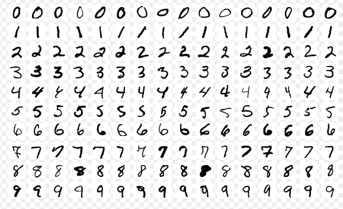

These images are converted into $28 \times 28 = 784$ pixels and, for each pixel, there is a measure that scales the darkness in that pixel between 0 (white) and 255 (black).  Hence, for each digitized image, we have an indicator variable $Y$ between 0 and 9, and we have 784 variables that identifies each pixel in the digitized image. Let's download the data. ([More details about the data](http://yann.lecun.com/exdb/mnist/)
.     


``` r
#loading the data
library(tidyverse)
library(dslabs)

#Download the data to your directory.  It's 21 MB!
mnist <- read_mnist() 
save(mnist, file = "mnist.Rdata")
load("mnist.Rdata")
str(mnist)
```

```
## List of 2
##  $ train:List of 2
##   ..$ images: int [1:60000, 1:784] 0 0 0 0 0 0 0 0 0 0 ...
##   ..$ labels: int [1:60000] 5 0 4 1 9 2 1 3 1 4 ...
##  $ test :List of 2
##   ..$ images: int [1:10000, 1:784] 0 0 0 0 0 0 0 0 0 0 ...
##   ..$ labels: int [1:10000] 7 2 1 0 4 1 4 9 5 9 ...
```

For the train set, we have two nested sets: `images`, which contains all 784 features for 60,000 images.  Hence, it's a $60000 \times 784$ matrix. And, `labels` contains the labels (from 0 to 9) for each image. 
  
The digitizing can be understood from this image better:
  
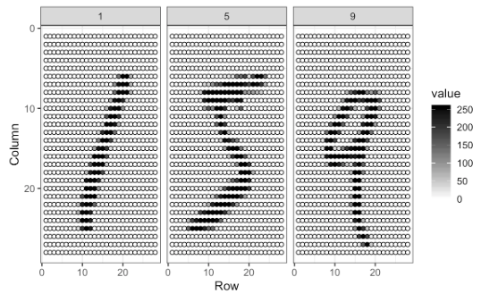

For each image, the pixels are features with a label that shows the true number between 0 and 9.  This methods is called as "flattening", which is a technique that is used to convert multi-dimensional image into a one-dimension array (vector).
  
For now, we will use a smaller version of this data set given in the `dslabs` package, which is a random sample of 1,000 images (only for 2 and 7 digits), 800 in the training set and 200 in the test set, with only two features: the proportion of dark pixels that are in the upper left quadrant, `x_1`, and the lower right quadrant, `x_2`. 


``` r
data("mnist_27")
str(mnist_27)
```

```
## List of 5
##  $ train      :'data.frame':	800 obs. of  3 variables:
##   ..$ y  : Factor w/ 2 levels "2","7": 1 2 1 1 2 1 2 2 2 1 ...
##   ..$ x_1: num [1:800] 0.0395 0.1607 0.0213 0.1358 0.3902 ...
##   ..$ x_2: num [1:800] 0.1842 0.0893 0.2766 0.2222 0.3659 ...
##  $ test       :'data.frame':	200 obs. of  3 variables:
##   ..$ y  : Factor w/ 2 levels "2","7": 1 2 2 2 2 1 1 1 1 2 ...
##   ..$ x_1: num [1:200] 0.148 0.283 0.29 0.195 0.218 ...
##   ..$ x_2: num [1:200] 0.261 0.348 0.435 0.115 0.397 ...
##  $ index_train: int [1:800] 40334 33996 3200 38360 36239 38816 8085 9098 15470 5096 ...
##  $ index_test : int [1:200] 46218 35939 23443 30466 2677 54248 5909 13402 11031 47308 ...
##  $ true_p     :'data.frame':	22500 obs. of  3 variables:
##   ..$ x_1: num [1:22500] 0 0.00352 0.00703 0.01055 0.01406 ...
##   ..$ x_2: num [1:22500] 0 0 0 0 0 0 0 0 0 0 ...
##   ..$ p  : num [1:22500] 0.703 0.711 0.719 0.727 0.734 ...
##   ..- attr(*, "out.attrs")=List of 2
##   .. ..$ dim     : Named int [1:2] 150 150
##   .. .. ..- attr(*, "names")= chr [1:2] "x_1" "x_2"
##   .. ..$ dimnames:List of 2
##   .. .. ..$ x_1: chr [1:150] "x_1=0.0000000" "x_1=0.0035155" "x_1=0.0070310" "x_1=0.0105465" ...
##   .. .. ..$ x_2: chr [1:150] "x_2=0.000000000" "x_2=0.004101417" "x_2=0.008202834" "x_2=0.012304251" ...
```
  
## Linear Classifiers

To begin our exploration of classification methods, we start with linear classifiers. These models define a decision rule based on a linear combination of the input features, which results in a boundary—called a hyperplane—that separates observations into different categories. In simple two-dimensional problems, this boundary is just a line; in higher dimensions, it becomes a flat surface that divides the feature space. For example, in our reduced MNIST dataset containing only digits 2 and 7, each image is represented by just two features: the proportion of dark pixels in the upper-left and lower-right corners. A linear classifier attempts to draw a straight line between these two digit classes using these features, assigning new observations based on which side of the line they fall. We begin with one of the simplest linear classifiers: the Linear Probability Model (LPM). 
  
\begin{equation}
\operatorname{Pr}\left(Y=1 | X_{1}=x_{1}, X_{2}=x_{2}\right)=\beta_{0}+\beta_{1} x_{1}+\beta_{2} x_{2}
\end{equation} 
  

``` r
# LPM requires numerical 1 and 0
y10 = ifelse(mnist_27$train$y == 7, 1, 0)
train <- data.frame(mnist_27$train, y10)

plot(train$x_1, train$x_2,
     pch = ifelse(train$y10 == 1, 16, 17),  # 7s: circle, 2s: triangle
     col = ifelse(train$y10 == 1, "dodgerblue", "darkorange"),
     cex = 0.72,
     xlab = "x₁", ylab = "x₂")
```

<div class="figure">
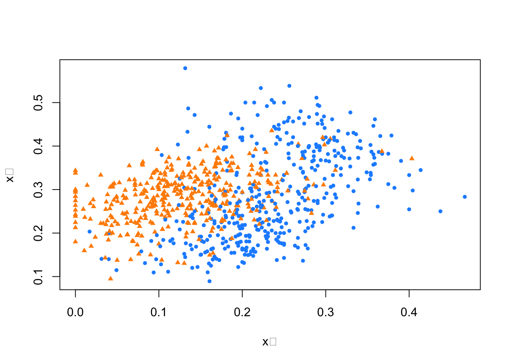
<p class="caption">(\#fig:knn5)Training data: blue circle for 7s and orange triangle for 2s</p>
</div>

Here, the blue circle dots are 7 and triangle dots are 2.  Note that if we use 0.5 as a decision rule such that it separates pairs ($x_1$, $x_2$) for which $\operatorname{Pr}\left(Y=1 | X_{1}=x_{1}, X_{2}=x_{2}\right) < 0.5$ then we can have a hyperplane as  

\begin{equation}
\hat{\beta}_{0}+\hat{\beta}_{1} x_{1}+\hat{\beta}_{2} x_{2}=0.5 \Longrightarrow x_{2}=\left(0.5-\hat{\beta}_{0}\right) / \hat{\beta}_{2}-\hat{\beta}_{1} / \hat{\beta}_{2} x_{1}.
\end{equation}
  
If we incorporate this into our plot for the train data:  


``` r
model <- lm(y10 ~ x_1 + x_2, train)
tr <- 0.5
a <- tr - model$coefficients[1]
a <- a / model$coefficients[3]
b <- -model$coefficients[2] / model$coefficients[3]

plot(train$x_1, train$x_2,
     pch = ifelse(train$y10 == 1, 16, 17),  # 7s: circle, 2s: triangle
     col = ifelse(train$y10 == 1, "dodgerblue", "darkorange"),
     cex = 0.72,
     xlab = "x₁", ylab = "x₂",
     main = "Linear Decision Boundary by LPM")

abline(a, b, col = "purple", lty = 2, lwd = 2.8)
```

<div class="figure">
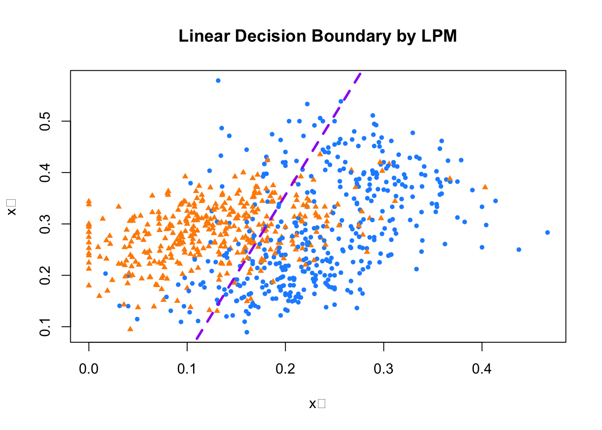
<p class="caption">(\#fig:knn6)Linear decision boundary fitted by the LPM</p>
</div>


Play with the threshold and observe how the decision boundary shifts. As you vary this cutoff between 0 and 1, the dividing line moves, changing which side certain observations fall on and, in turn, altering the number of correct and incorrect classifications. This line is the estimated hyperplane, and since it’s defined by a linear combination of the features, the resulting decision boundary is linear—hence why the LPM is referred to as a *linear classifier*.

But what if a straight line isn’t flexible enough to separate the two classes effectively? Could adding nonlinear components, such as interaction terms or polynomial transformations of the features, lead to a better separation of 2s and 7s in our plot? Let’s explore how changing our model in this way affects its performance.


``` r
model2 <- lm(y10 ~ x_1 + I(x_1 ^ 2) + x_2, train)
summary(model2)
```

```
## 
## Call:
## lm(formula = y10 ~ x_1 + I(x_1^2) + x_2, data = train)
## 
## Residuals:
##      Min       1Q   Median       3Q      Max 
## -1.14744 -0.28816  0.03999  0.28431  1.06759 
## 
## Coefficients:
##             Estimate Std. Error t value Pr(>|t|)    
## (Intercept)  0.09328    0.06571   1.419   0.1562    
## x_1          4.81884    0.55310   8.712  < 2e-16 ***
## I(x_1^2)    -2.75520    1.40760  -1.957   0.0507 .  
## x_2         -1.18864    0.17252  -6.890 1.14e-11 ***
## ---
## Signif. codes:  0 '***' 0.001 '**' 0.01 '*' 0.05 '.' 0.1 ' ' 1
## 
## Residual standard error: 0.3891 on 796 degrees of freedom
## Multiple R-squared:  0.3956,	Adjusted R-squared:  0.3933 
## F-statistic: 173.7 on 3 and 796 DF,  p-value: < 2.2e-16
```

``` r
tr <- 0.5
s <- model2$coefficients
a = tr / s[3]
b = s[1] / s[3]
d = s[2] / s[3]
e = s[4] / s[3]
x22 = a - b - d * train$x_1 - e * (train$x_1 ^ 2)

plot(train$x_1, train$x_2,
     pch = ifelse(train$y10 == 1, 16, 17),  # 7s: circle, 2s: triangle
     col = ifelse(train$y10 == 1, "dodgerblue", "darkorange"),
     cex = 0.72,
     xlab = "x₁", ylab = "x₂",
     main = "Nonlinear Decision Boundary by LPM")

lines(train$x_1[order(x22)], x22[order(x22)],
      col = "purple", lty = 2, lwd = 2.8)
```

<div class="figure">
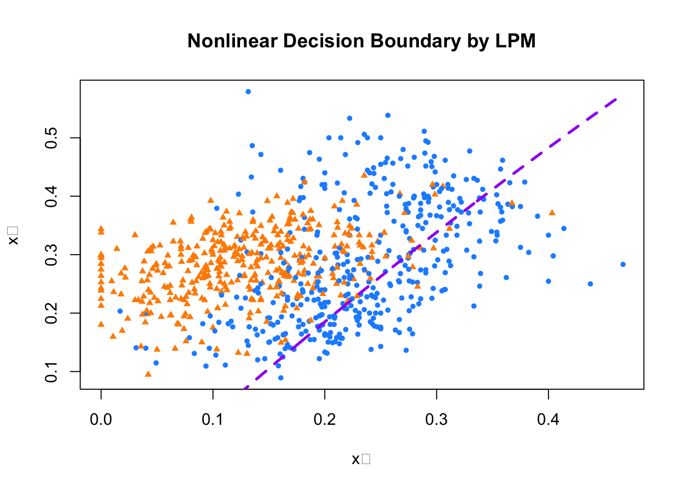
<p class="caption">(\#fig:knn7)Linear decision boundary fitted using a polynomial LPM</p>
</div>

The coefficient of the polynomial term in our extended LPM is small and statistically insignificant, and visually, the classification appears worse than the linear case. This shows that simply adding nonlinear terms doesn’t always improve performance—especially when the relationship between features and class labels is not well captured by the chosen polynomial form.

Would logistic regression provide a better decision rule? Even without estimating the model, we can describe how it works. Logistic regression models the probability that $Y = 1$ using the logistic (sigmoid) function:

$$
P(Y=1 \mid x)=\frac{\exp(w_0 + \sum_i w_i x_i)}{1 + \exp(w_0 + \sum_i w_i x_i)}
$$

This function smoothly maps any real-valued linear combination of predictors to a probability between 0 and 1. The complementary probability for class 0 is:

$$
P(Y=0 \mid x)=1 - P(Y=1 \mid x) = \frac{1}{1 + \exp(w_0 + \sum_i w_i x_i)}
$$

Taking the odds ratio of class 1 to class 0 yields:

$$
\frac{P}{1 - P} = \exp(w_0 + \sum_i w_i x_i)
$$

We classify an observation as $Y = 1$ when this odds ratio exceeds 1, i.e., when $P > 0.5$. Taking the logarithm of both sides, the condition becomes:

$$
w_0 + \sum_i w_i x_i > 0
$$

So, the decision boundary is defined by the linear equation:

$$
\hat{\beta}_0 + \hat{\beta}_1 x_1 + \hat{\beta}_2 x_2 = 0 \quad \Longrightarrow \quad x_2 = -\frac{\hat{\beta}_0}{\hat{\beta}_2} - \frac{\hat{\beta}_1}{\hat{\beta}_2} x_1
$$

This confirms that the decision boundary in logistic regression, like in the LPM, is a straight line. Both models are therefore classified as **linear classifiers**, and they tend to work well only when the classes are approximately linearly separable.

But what if the actual relationship between the features and the class label is nonlinear? In such cases, linear classifiers may perform poorly. This motivates the use of more flexible, **nonparametric methods**, such as **k-nearest neighbors**, which can adapt to more complex boundaries and capture subtle patterns in the data without imposing a specific functional form.
 
## k-Nearest Neighbors

**k-Nearest Neighbors (kNN)** is a simple yet powerful nonparametric method used for both classification and regression. Unlike models that assume a specific functional form, kNN makes predictions based on local patterns in the data. For classification, a new observation is assigned to the most common class among its $k$ nearest neighbors in the feature space. For regression, the predicted value is the average of the outcomes of these neighbors. In essence, kNN estimates relationships in the data using a logic similar to bin smoothing—by relying on nearby points rather than fitting a global model.
 
 
<div class="figure">
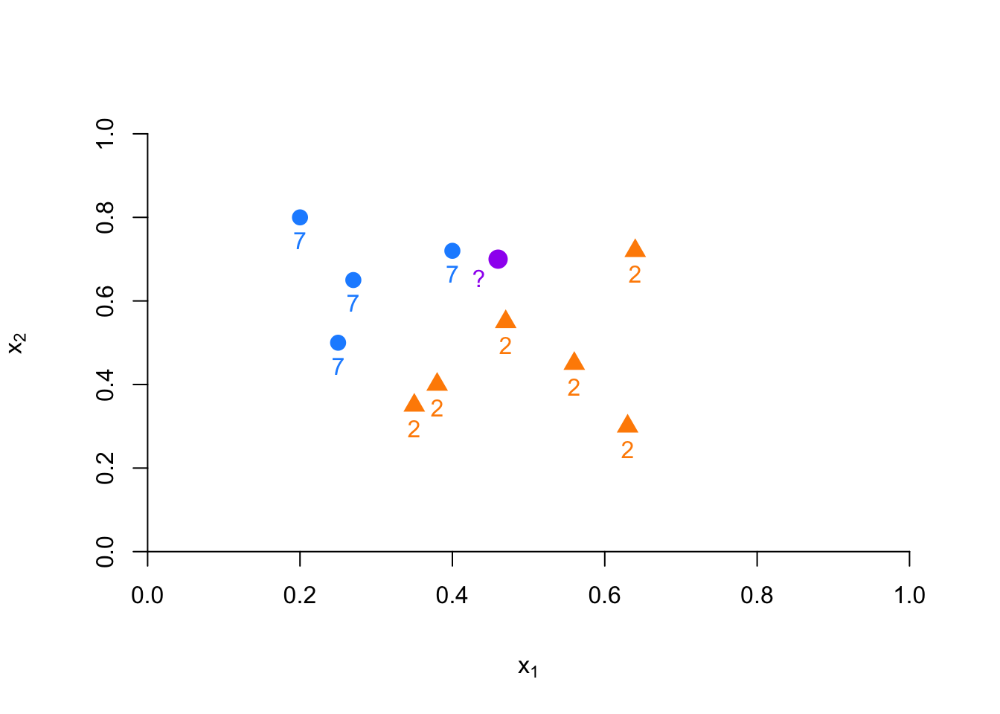
<p class="caption">(\#fig:knn8)Example of kNN classification based on nearest neighbors</p>
</div>


Suppose we have to classify (identify) the red dot as 7 or 2.  Since it is a nonparametric approach, we have to define bins.  If the number of observations in bins set to 1 ($k = 1$), then we need to find one observation that is nearest to the red dot.  How?  Since we know to coordinates ($x_1, x_2$) of that red dot, we can find its nearest neighbors by some distance functions among all points (observations) in the data. A commonly used distance metric in kNN is the **Euclidean distance**, defined as:

$$
d(x, x') = \sqrt{(x_1 - x_1')^2 + \ldots + (x_n - x_n')^2}
$$

This gives the straight-line distance between two points. Depending on the nature of the data, alternative distance metrics may be more appropriate. For instance, Manhattan distance sums the absolute differences across features, Chebyshev distance considers the maximum difference along any single dimension, and Hamming distance is used for binary features. Since our features are continuous, Euclidean distance is a natural choice here.

To apply kNN, we compute this distance between the point we want to classify and every other observation in the dataset. For example, if we are comparing one red dot to ten other points, we must calculate ten distances. In practice, we often compute the full pairwise distance matrix for all $n$ observations, resulting in an $n \times n$ symmetric distance matrix.

For example, for two dimensional space, we can calculate the distances as follows


``` r
x1 <- c(2, 2.1, 4, 4.3)
x2 <- c(3, 3.3, 5, 5.1)

EDistance <- function(x, y){
  dx <- matrix(0, length(x), length(x))
  dy <- matrix(0, length(x), length(x))
  
  for (i in 1:length(x)) {
    dx[i,] <- (x[i] - x)^2
    dy[i,] <- (y[i] - y)^2
    dd <- sqrt(dx^2 + dy^2)
  }
  return(dd)
}
  
EDistance(x1, x2)
```

```
##            [,1]       [,2]       [,3]       [,4]
## [1,] 0.00000000 0.09055385 5.65685425 6.88710389
## [2,] 0.09055385 0.00000000 4.62430535 5.82436263
## [3,] 5.65685425 4.62430535 0.00000000 0.09055385
## [4,] 6.88710389 5.82436263 0.09055385 0.00000000
```

``` r
plot(x1, x2, col = "red", lwd = 3)
#segments(x1[1], x2[1], x1[2:4], x2[2:4], col = "blue" )
#segments(x1[2], x2[2], x1[c(1, 3:4)], x2[c(1, 3:4)], col = "green" )
#segments(x1[3], x2[3], x1[c(1:2, 4)], x2[c(1:2, 4)], col = "orange" )
segments(x1[4], x2[4], x1[1:3], x2[1:3], col = "darkgreen" )
```

<div class="figure">
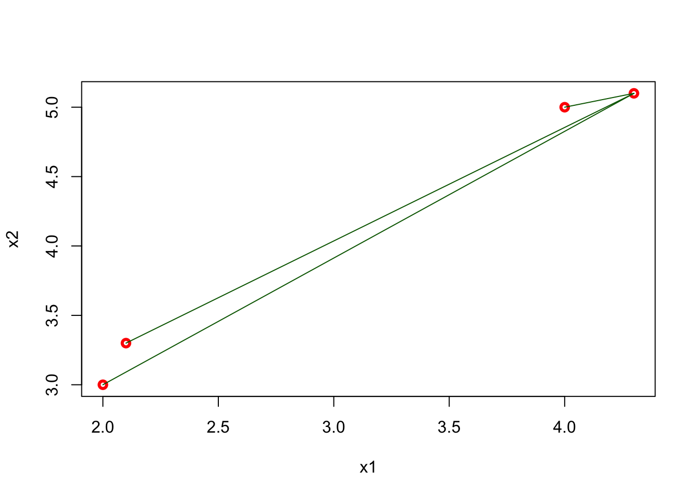
<p class="caption">(\#fig:knn9)Distances from the last point to all other points in 2D space</p>
</div>

The matrix shows all distances for four points and, as we expect, it is symmetric.  The green lines show the distance from the last point ($x = 4.3,~ y = 5.1$) to all other points.  Using this matrix, we can easily find the k-nearest neighbors for any point.
  
When $k=1$, the observation that has the shortest distance is going to be the one to predict what the red dot could be. This is shown in the figure below:


<div class="figure">
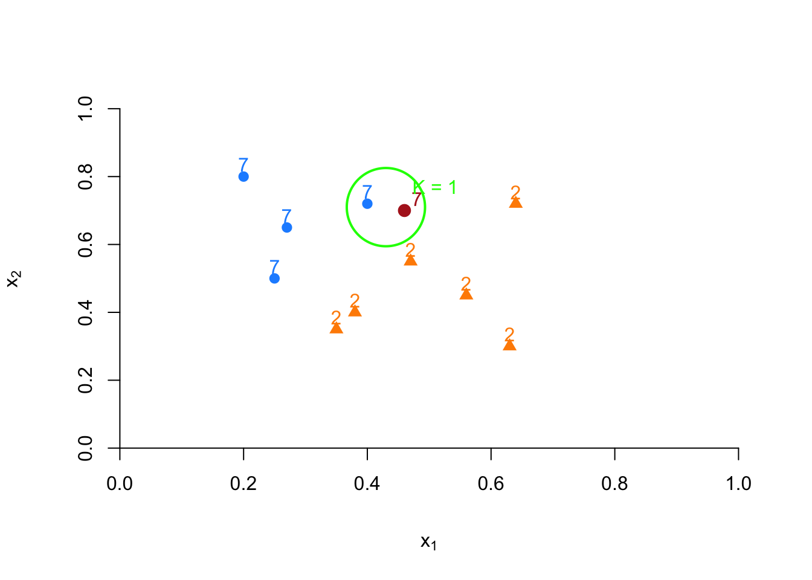
<p class="caption">(\#fig:knn10)Example of kNN classification based on nearest neighbor</p>
</div>

If we increase $k$ to 3, we classify the point based on a majority vote among the 3 nearest neighbors. Suppose two are 7s and one is a 2, then the red dot is classified as 7:  


<div class="figure">
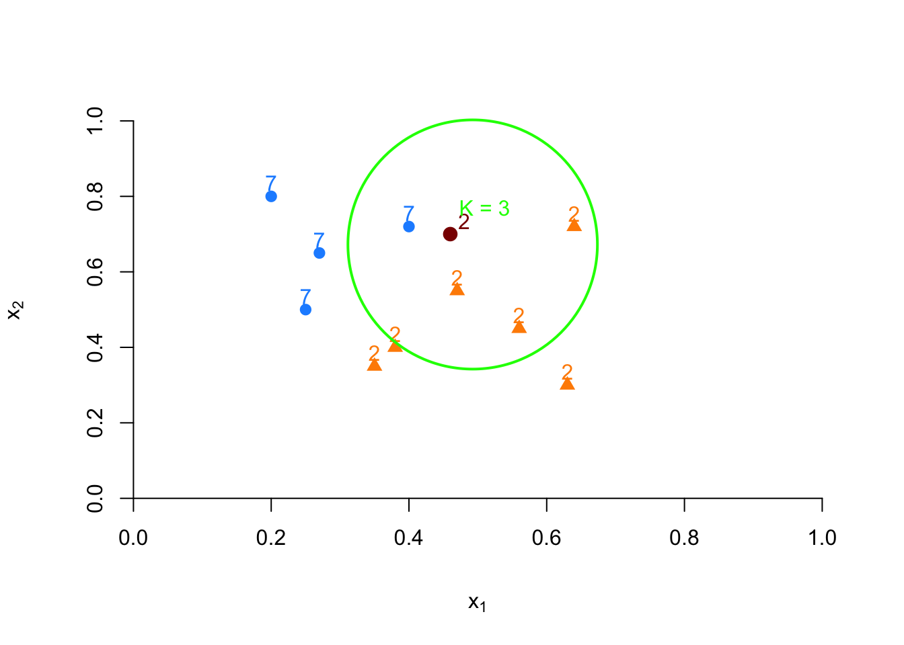
<p class="caption">(\#fig:knn11)Example of kNN classification based on 3 nearest neighbors</p>
</div>

Formally, kNN estimates the probability that $Y = 1$ as:

$$
\hat{P}_{k}(Y=1 | X=x)=\frac{1}{k} \sum_{i \in \mathcal{N}_{k}(x, D)} I(y_i = 1)
$$

Based on this probability, we assign the class using a simple rule:

$$
\hat{C}_k(x) = 
\begin{cases}
1 & \text{if } \hat{P}_k(Y=1 \mid x) > 0.5 \\
0 & \text{otherwise}
\end{cases}
$$

For instance, if $\hat{P}(Y=7 | x_1=4, x_2=3) = \frac{2}{3}$, we classify the red dot as 7.

The parameter $k$ in k-Nearest Neighbors is a **hyperparameter** that controls the smoothness of the decision boundary. A small $k$ (e.g., $k = 1$) often leads to overfitting, as the model becomes highly sensitive to noise in the training data. On the other hand, a very large $k$ results in oversmoothing, where the model averages over many observations and fails to capture relevant local patterns—leading to underfitting. Choosing the right $k$ is crucial and is typically done through validation techniques that evaluate predictive accuracy.

Before diving into practical tuning, it’s helpful to visualize what decision boundaries look like under different values of $k$. One way to do this is by examining **Voronoi diagrams**, which represent how the space is partitioned based on the nearest neighbors:


``` r
set.seed(1)
x1 <- runif(50)
x2 <- runif(50)

library(deldir)
tesselation <- deldir(x1, x2)
tiles <- tile.list(tesselation)

plot(tiles, pch = 19, close = TRUE,
     fillcol =  hcl.colors(4, "Sunset"),
     xlim = c(-0.2:1.1)) 
```

<div class="figure">
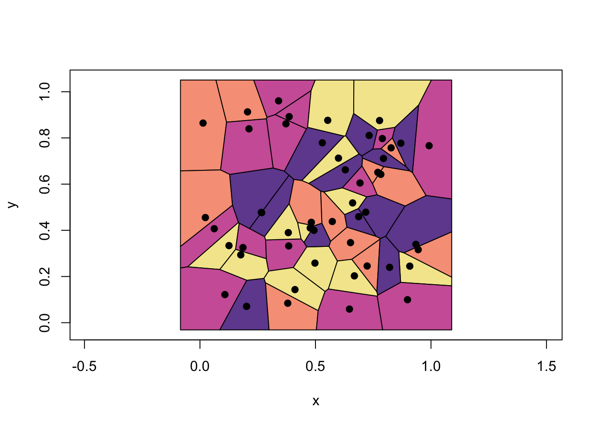
<p class="caption">(\#fig:knn12)Example of Voronoi cells associated with 1-NN</p>
</div>

     
These Voronoi cells are polygons that surround each training point, with edges defined by the perpendicular bisectors between neighboring points. For 1-nearest neighbor classification, any new point is assigned to the same class as the training point whose cell it falls into. The decision boundary is formed by the borders between adjacent cells of different classes. In practice, plotting the actual boundary between classes involves overlaying class labels and merging same-colored regions, which reflect the union of Voronoi cells for each class.

To see how decision boundaries evolve with different values of $k$, we use the `knn3()` function from the *Caret* package on the `mnist_27` dataset. While we won't assess model accuracy here, the visual comparison of boundaries illustrates the tradeoff between overfitting and oversmoothing. 


``` r
library(tidyverse)
library(caret)
library(dslabs)

# With k = 2
model1 <- knn3(y ~ ., data = mnist_27$train, k = 2)

x_1 <- mnist_27$true_p$x_1
x_2 <- mnist_27$true_p$x_2
df <- data.frame(x_1, x_2)

p_hat <- predict(model1, df, type = "prob")
p_7 <- p_hat[, 2]  # Probability for class 7

df <- data.frame(x_1, x_2, p_7)

# Define custom color and shape mappings
my_colors <- c("2" = "darkorange", "7" = "dodgerblue")
my_shapes <- c("2" = 17, "7" = 16)

p1 <- ggplot() +
  geom_point(data = mnist_27$train,
             aes(x = x_1, y = x_2, color = factor(y), shape = factor(y)),
             size = 1.5, stroke = 0.2) +
  stat_contour(data = df, aes(x = x_1, y = x_2, z = p_7),
               breaks = c(0.5), color = "blue") +
  scale_color_manual(values = my_colors) +
  scale_shape_manual(values = my_shapes) +
  labs(color = "Digit", shape = "Digit") +
  theme_minimal()
plot(p1)
```

<div class="figure">
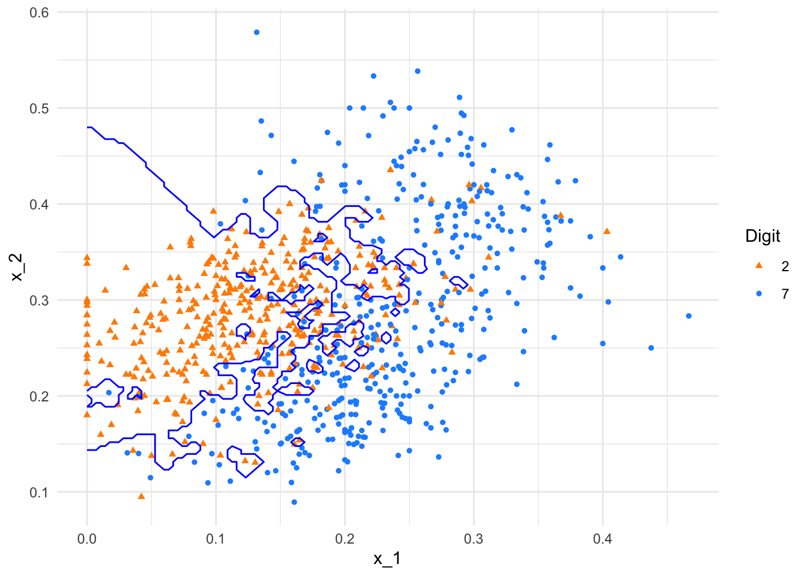
<p class="caption">(\#fig:knn13a)kNN decision boundary with k = 2</p>
</div>


``` r
# With k = 400
model2 <- knn3(y ~ ., data = mnist_27$train, k = 400)

p_hat <- predict(model2, df, type = "prob")
p_7 <- p_hat[, 2]

df <- data.frame(x_1, x_2, p_7)

p1 <- ggplot() +
  geom_point(data = mnist_27$train,
             aes(x = x_1, y = x_2, color = factor(y), shape = factor(y)),
             size = 1.5, stroke = 0.2) +
  stat_contour(data = df, aes(x = x_1, y = x_2, z = p_7),
               breaks = c(0.5), color = "blue") +
  scale_color_manual(values = my_colors) +
  scale_shape_manual(values = my_shapes) +
  labs(color = "Digit", shape = "Digit") +
  theme_minimal()
plot(p1)
```

<div class="figure">
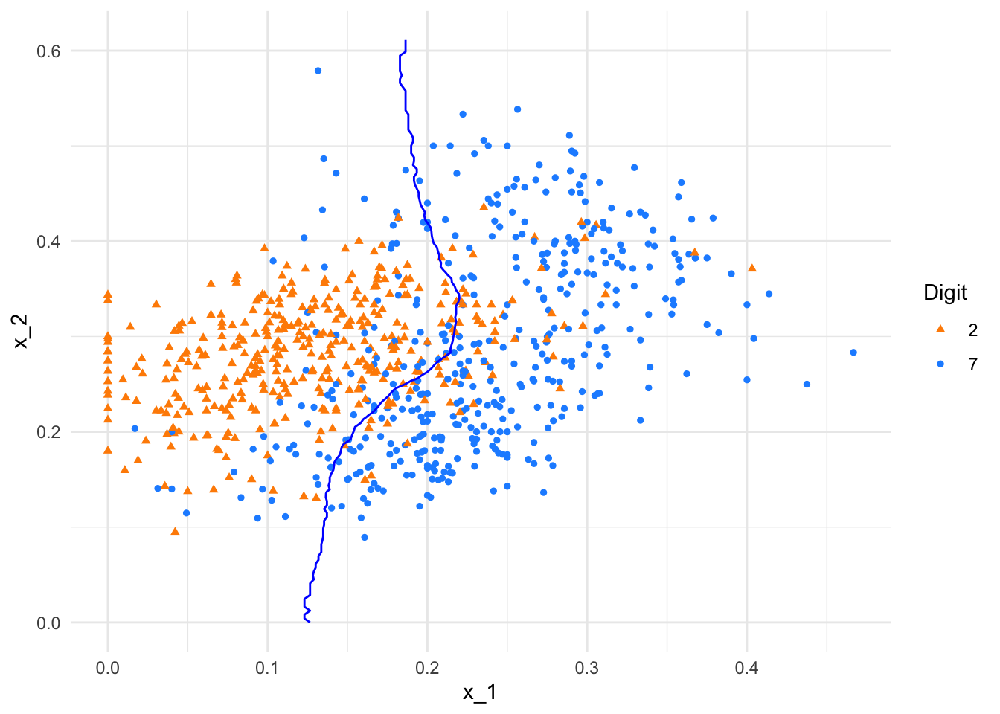
<p class="caption">(\#fig:knn13b)kNN decision boundary with k = 400</p>
</div>

As shown, the boundary with $k = 2$ is highly flexible, capturing local patterns but also overfitting noise. In contrast, the decision boundary with $k = 400$ is overly smooth, essentially collapsing to a linear boundary that ignores finer distinctions. These examples emphasize the importance of tuning $k$ to balance bias and variance for better predictive performance.

So far we’ve relied on Euclidean distance to define “nearness,” but kNN can use a variety of distance measures depending on the application:

Manhattan Distance (also known as L1 distance) is the sum of absolute differences 

\begin{equation}
d\left(\mathbf{x}, \mathbf{y}\right)=\left|x_{1}-x_{2}\right|+\left|y_{1}-y_{2}\right|
\end{equation}


``` r
# Manhattan Distance
MDistance <- function(x, y){
  n <- length(x)
  dd <- matrix(0, n, n)
  
  for (i in 1:n) {
    for (j in 1:n) {
      dd[i, j] <- abs(x[i] - x[j]) + abs(y[i] - y[j])
    }
  }
  return(dd)
}
```

The Chebyshev distance is the maximum absolute difference between the two points. The Chebyshev distance between two points $\mathbf{x}=\left(x_{1}, x_{2}\right)$ and $\mathbf{y}=\left(y_{1}, y_{2}\right)$ is given by:

\begin{equation}
d\left(\mathbf{x}, \mathbf{y}\right)=\max \left(\left|x_{1}-x_{2}\right|,\left|y_{1}-y_{2}\right|\right)
\end{equation}


``` r
# Chebyshev Distance
CDistance <- function(x, y){
  n <- length(x)
  dd <- matrix(0, n, n)
  
  for (i in 1:n) {
    for (j in 1:n) {
      dd[i, j] <- max(abs(x[i] - x[j]), abs(y[i] - y[j]))
    }
  }
  return(dd)
}
```

### Example: Finding Nearest Neighbors with $k = 2$

Let’s now compute the distance matrix for 15 points in 2D space using the Euclidean distance function:


``` r
x1 <- c(2, 2.1, 4, 4.3, 1.5, 3.2, 6, 5.5, 7, 2.5, 4.5, 3.8, 6.2, 5, 7.3)
x2 <- c(3, 3.3, 5, 5.1, 2, 4.2, 6.5, 5.8, 7.2, 3.1, 4.7, 3.6, 6.1, 5.2, 7.6)

distanceMatrix <- EDistance(x1, x2)
print(distanceMatrix)
```

```
##              [,1]        [,2]        [,3]        [,4]      [,5]       [,6]
##  [1,]  0.00000000  0.09055385  5.65685425  6.88710389  1.030776  2.0364675
##  [2,]  0.09055385  0.00000000  4.62430535  5.82436263  1.727918  1.4560907
##  [3,]  5.65685425  4.62430535  0.00000000  0.09055385 10.957304  0.9050967
##  [4,]  6.88710389  5.82436263  0.09055385  0.00000000 12.402326  1.4560907
##  [5,]  1.03077641  1.72791782 10.95730350 12.40232639  0.000000  5.6371713
##  [6,]  2.03646753  1.45609066  0.90509668  1.45609066  5.637171  0.0000000
##  [7,] 20.15099253 18.33580377  4.58938994  3.49194788 28.637825  9.4577852
##  [8,] 14.54400564 13.14138882  2.33925202  1.52108514 21.552578  5.8768784
##  [9,] 30.59688873 28.42224833 10.21888448  8.52010563 40.573687 17.0150992
## [10,]  0.25019992  0.16492423  4.25377479  5.14758196  1.569745  1.3054501
## [11,]  6.88582602  6.08434056  0.26570661  0.16492423 11.582059  1.7083911
## [12,]  3.25993865  2.89140104  1.96040812  2.26384628  5.876878  0.5091169
## [13,] 20.08784956 18.54836111  4.98895781  3.74594447 27.758678  9.6970150
## [14,] 10.21888448  9.15205988  1.00079968  0.49010203 15.966217  3.3908111
## [15,] 35.16807785 32.75731521 12.81755437 10.95730350 45.990208 20.4012181
##             [,7]       [,8]       [,9]      [,10]      [,11]      [,12]
##  [1,] 20.1509925 14.5440056 30.5968887  0.2501999  6.8858260  3.2599386
##  [2,] 18.3358038 13.1413888 28.4222483  0.1649242  6.0843406  2.8914010
##  [3,]  4.5893899  2.3392520 10.2188845  4.2537748  0.2657066  1.9604081
##  [4,]  3.4919479  1.5210851  8.5201056  5.1475820  0.1649242  2.2638463
##  [5,] 28.6378246 21.5525776 40.5736873  1.5697452 11.5820594  5.8768784
##  [6,]  9.4577852  5.8768784 17.0150992  1.3054501  1.7083911  0.5091169
##  [7,]  0.0000000  0.5500909  1.1135978 16.8432806  3.9446293  9.7032829
##  [8,]  0.5500909  0.0000000  2.9839739 11.5820594  1.5697452  5.6371713
##  [9,]  1.1135978  2.9839739  0.0000000 26.3180280  8.8388348 16.5172395
## [10,] 16.8432806 11.5820594 26.3180280  0.0000000  4.7490631  1.7083911
## [11,]  3.9446293  1.5697452  8.8388348  4.7490631  0.0000000  1.3054501
## [12,]  9.7032829  5.6371713 16.5172395  1.7083911  1.3054501  0.0000000
## [13,]  0.1649242  0.4981967  1.3688316 16.3834093  3.4919479  8.4994176
## [14,]  1.9636955  0.4382921  5.6568542  7.6492222  0.3535534  2.9372096
## [15,]  2.0785091  4.5820519  0.1835756 30.6741601 11.4975519 20.1509925
##            [,13]      [,14]      [,15]
##  [1,] 20.0878496 10.2188845 35.1680779
##  [2,] 18.5483611  9.1520599 32.7573152
##  [3,]  4.9889578  1.0007997 12.8175544
##  [4,]  3.7459445  0.4901020 10.9573035
##  [5,] 27.7586779 15.9662175 45.9902077
##  [6,]  9.6970150  3.3908111 20.4012181
##  [7,]  0.1649242  1.9636955  2.0785091
##  [8,]  0.4981967  0.4382921  4.5820519
##  [9,]  1.3688316  5.6568542  0.1835756
## [10,] 16.3834093  7.6492222 30.6741601
## [11,]  3.4919479  0.3535534 11.4975519
## [12,]  8.4994176  2.9372096 20.1509925
## [13,]  0.0000000  1.6521804  2.5547211
## [14,]  1.6521804  0.0000000  7.8205946
## [15,]  2.5547211  7.8205946  0.0000000
```

The result is a symmetric matrix showing pairwise distances. From this, we can identify the two closest neighbors for each point. Here's a function that does exactly that:


``` r
findNN <- function(distanceMatrix, k) {
  n <- nrow(distanceMatrix)
  nearestNeighbors <- matrix(NA, n, k)
  
  for (i in 1:n) {
    sortedDistances <- sort(distanceMatrix[i, ], index.return = TRUE)
    nnIndices <- sortedDistances$ix[2:(k + 1)]
    nearestNeighbors[i,] <- nnIndices
  }
  return(nearestNeighbors)
}

nearestNeighbors <- findNN(distanceMatrix, 2)
print(nearestNeighbors)
```

```
##       [,1] [,2]
##  [1,]    2   10
##  [2,]    1   10
##  [3,]    4   11
##  [4,]    3   11
##  [5,]    1   10
##  [6,]   12    3
##  [7,]   13    8
##  [8,]   14   13
##  [9,]   15    7
## [10,]    2    1
## [11,]    4    3
## [12,]    6   11
## [13,]    7    8
## [14,]   11    8
## [15,]    9    7
```

Now that we understand how distance metrics and the value of $k$ affect the structure of kNN, we turn to a more realistic example. We’ll generate labeled and unlabeled data, and then use a simple kNN procedure to classify the new observations.

### More Realistic Example

In this example, our task is to classify new, unlabeled data points (shown as purple Xs) based on the labels of existing training data: blue circles for class 0 and orange triangles for class 1. We will implement a simple kNN classification procedure from scratch to demonstrate how it works in practice.

First, we generate the training dataset and the new points we want to classify:


``` r
n = 25

# Generate training data
set.seed(12)
x1 <- runif(n)
x2 <- runif(n)
y <- sample(c(0, 1), n, replace = TRUE)

# Generate 5 new points with unknown labels
set.seed(222)
x1_new <- runif(5)
x2_new <- runif(5)

# Set colors based on class
col_train <- ifelse(y == 1, "darkorange", "dodgerblue")

# Visualize the data with color
plot(x1, x2, xlab = "x1", ylab = "x2",
     pch = ifelse(y == 1, 17, 16),
     col = col_train, cex = 1.2, lwd = 1,
     main = "Training and New Points")

# New points as gray Xs
points(x1_new, x2_new, col = "purple", pch = 4, lwd = 2)
```

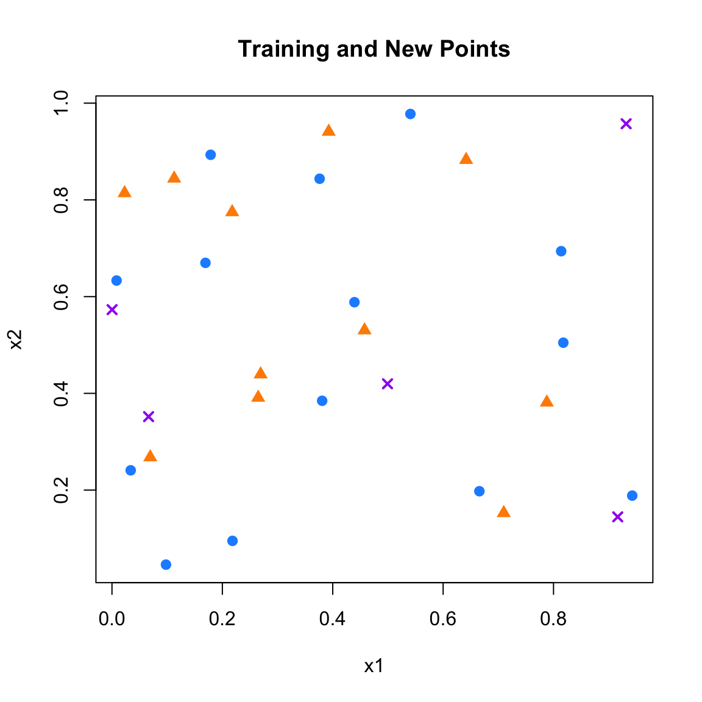

Now we apply the kNN rule with $k = 5$. For each new point, we compute its distance to every training point, find the 5 nearest neighbors, and assign the most common label among them as the predicted class:


``` r
k <- 5  
new_labels <- c()

for (i in 1:length(x1_new)) {
  # Compute distances from new point to all training points
  distances <- sqrt((x1_new[i] - x1)^2 + (x2_new[i] - x2)^2)
  
  # Identify the k closest training points
  nearest <- order(distances)[1:k]
  
  # Extract their labels
  nearest_labels <- y[nearest]
  
  # Assign the most frequent label among neighbors
  new_labels[i] <- names(which.max(table(nearest_labels)))
}

# Set training colors
col_train <- ifelse(y == 1, "darkorange", "dodgerblue")

# Set new point colors based on predicted labels
col_new <- ifelse(new_labels == 1, "darkorange", "dodgerblue")

# Plot training points
plot(x1, x2, xlab = "x1", ylab = "x2",
     pch = ifelse(y == 1, 17, 16),
     col = col_train, cex = 1.2, lwd = 1,
     main = "kNN Classification (k = 5)")

# Plot new classified points
points(x1_new, x2_new,
       pch = ifelse(new_labels == 1, 17, 16),
       col = col_new, cex = 1.5, lwd = 1.5)
```

<div class="figure">
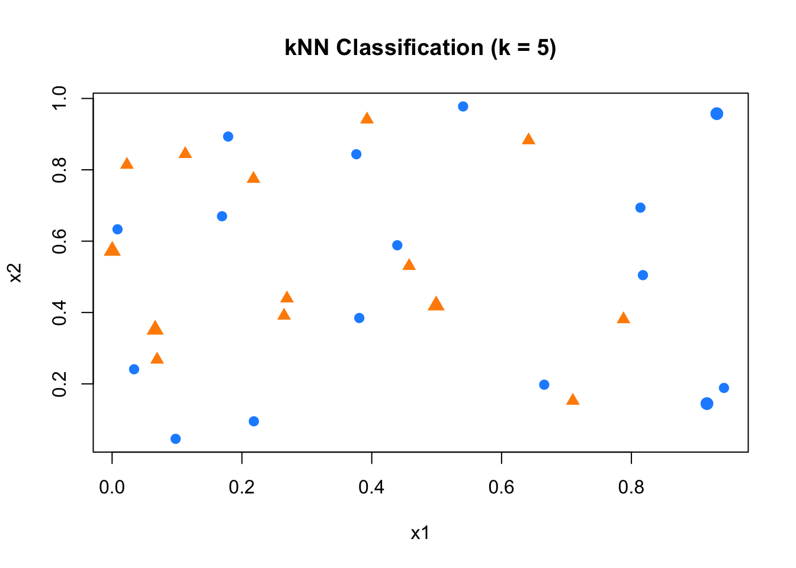
<p class="caption">(\#fig:kn6)Classifying new points using kNN with k = 5</p>
</div>

``` r
print(new_labels)
```

```
## [1] "0" "1" "1" "1" "0"
```

As shown, each new point is assigned a label based on the majority vote among its 5 nearest neighbors. This simple implementation highlights the core idea behind kNN classification: local proximity drives prediction, with no training or model fitting required. In the next step, we apply this to our real-world handwritten digit dataset, `mnist_27`.


### `mnist_27` dataset

We now apply kNN to the `mnist_27` dataset. We will use the training data to predict the labels of the validation data. We will use the Euclidean distance to find the nearest neighbors. We begin by loading and scaling the data.


``` r
#loading the data
library(tidyverse)
library(dslabs)
library(parallel)

data("mnist_27")
#str(mnist_27)

#Scale the data.  
mdata <- mnist_27$train
mdata$x_1 <- scale(mdata$x_1)
mdata$x_2 <- scale(mdata$x_2)
```

This step ensures that both features are on the same scale, which is important for distance-based algorithms like kNN.

Next, we split the data into training and validation sets, using 75% of the observations for training and the rest for validation. We then plot the two sets to visualize the separation of classes and see which points we are trying to classify


``` r
set.seed(1)
ind <- sample(nrow(mdata), nrow(mdata) * 0.75, replace = FALSE)
train <- mdata[ind, ]
val <- mdata[-ind, ]

# Color training data based on class
col_train <- ifelse(train$y == 7, "dodgerblue", "darkorange")
pch_vals <- ifelse(train$y == 7, 16, 17)

# Plot training and validation sets
plot(train$x_1, train$x_2,
     pch = pch_vals,
     col = col_train, xlab = "x1", ylab = "x2",
     lwd = 0.8, main = "Training and Validation Sets")

points(val$x_1, val$x_2,
       pch = 4, col = "purple", lwd = 1.5)
```

<div class="figure">
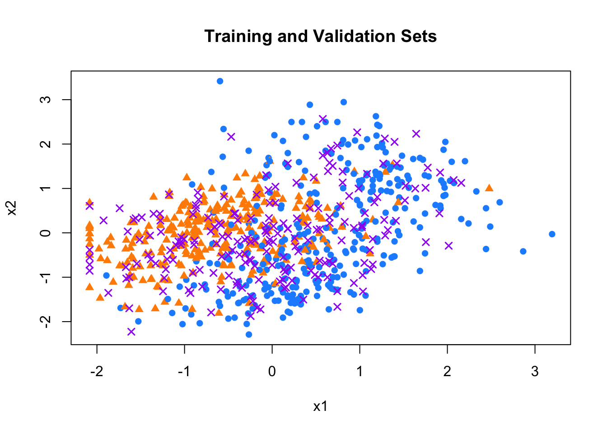
<p class="caption">(\#fig:kn8)Training and validation sets in the mnist_27 dataset</p>
</div>

To perform kNN, we define a function that takes a new point and returns a predicted label based on the majority class among its $k$ nearest neighbors in the training data


``` r
# Function to determine the label for a validation set
find_label <- function(new_point, k){
  distances <- sqrt((new_point[1] - train[, 2])^2 + (new_point[2] - train[, 3])^2)
  nearest <- order(distances)[1:k]
  nearest_labels <- train$y[nearest]
  return(names(which.max(table(nearest_labels))))
}
```

To classify the validation points, we define a function that, for a given new point, computes its Euclidean distance to all training points, identifies the $k$ nearest neighbors, and assigns the most frequent label among them. Once this function is in place, we apply it to the entire validation set and compute the prediction accuracy—the proportion of correctly classified points. Since the classes are balanced in this dataset, accuracy is an appropriate evaluation metric


``` r
# Pick your k
new_data <- val[, 2:3]
new_labels <- apply(new_data, 1, function(x) find_label(x, k = 30))
acc <- mean(new_labels == val$y)
acc
```

```
## [1] 0.835
```

### Single-run grid search for k

To investigate the sensitivity of model performance to the choice of $k$, we perform a single-run grid search. We evaluate accuracy over a range of $k$ values (from 5 to 100) and visualize how accuracy changes with $k$


``` r
# Same function as before, but now we pass k as an argument
find_label <- function(new_point, k){
  distances <- sqrt((new_point[1] - train[, 2])^2 + (new_point[2] - train[, 3])^2)
  nearest <- order(distances)[1:k]
  nearest_labels <- train$y[nearest]
  return(names(which.max(table(nearest_labels))))
}

# to compute accuracy for a grid of k's
acc <- c()
grid <- seq(5, 100, by = 2)

for (i in 1:length(grid)) {
  k <- grid[i]
  set.seed(1)
  ind <- unique(sample(nrow(mdata), nrow(mdata), replace = TRUE))
  train <- mdata[ind, ]
  val <- mdata[-ind, ]
  new_data <- val[, 2:3]
  new_labels <- apply(new_data, 1, function(x) find_label(x, k = k))
  acc[i] <- mean(new_labels == val$y)
}
plot(grid, acc, type = "o", pch = 16, col = "firebrick", lwd = 2,
     xlab = "k", ylab = "Accuracy", main = "Validation Accuracy vs k")
```

<div class="figure">

<p class="caption">(\#fig:kn11)Validation accuracy across different k values in kNN</p>
</div>

The results, shown in the figure above, reveal how model performance changes with different levels of smoothing. Too small $k$ can overfit the training data; too large $k$ may ignore local structure. We then demonstrate an equivalent approach below using `sapply` for a more concise implementation. This achieves the same result—evaluating accuracy for different values of $k$— but with cleaner code.


``` r
# Same function as before
find_label <- function(new_point, k){
  distances <- sqrt((new_point[1] - train[, 2])^2 + (new_point[2] - train[, 3])^2)
  nearest <- order(distances)[1:k]
  nearest_labels <- train$y[nearest]
  return(names(which.max(table(nearest_labels))))
}

# Function to compute accuracy with splits
compute_accuracy <- function(k) {
  set.seed(1)
  ind <- unique(sample(nrow(mdata), nrow(mdata), replace = TRUE))
  train <- mdata[ind, ]
  val <- mdata[-ind, ]
  new_data <- val[, 2:3]
  new_labels <- apply(new_data, 1, function(x) find_label(x, k = k))
  return(mean(new_labels == val$y))
}

# Compute accuracy for different values of k using `sapply`
grid <- seq(5, 100, by = 2)
acc <- sapply(grid, compute_accuracy)
plot(grid, acc, type = "o", pch = 16, col = "firebrick", lwd = 2,
     xlab = "k", ylab = "Accuracy", main = "Validation Accuracy vs k")
```

<div class="figure">
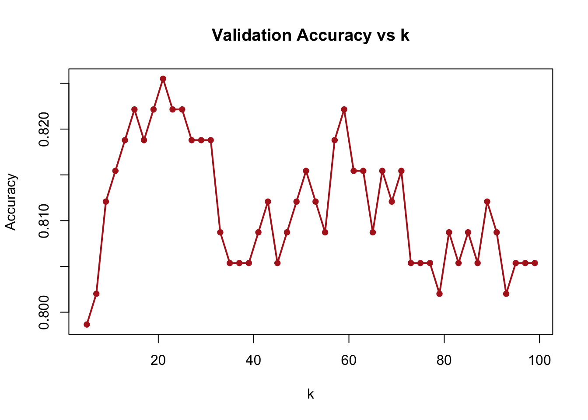
<p class="caption">(\#fig:kn12)Validation accuracy for different k values using sapply</p>
</div>

### Multi-run grid search (training the model) for k

Finally, to account for the variability that comes from random sampling, we implement a multi-run grid search. Here, for each $k$, we repeat the training-validation split 30 times, each with a different random seed. We then compute the average accuracy across runs. This gives a more stable estimate of how well each $k$ performs on average. The resulting plot below shows the smoothed average validation accuracy as a function of $k$, helping us identify the most robust value for prediction.


``` r
find_label <- function(new_point, k){
  distances <- sqrt((new_point[1] - train[, 2])^2 + (new_point[2] - train[, 3])^2)
  nearest <- order(distances)[1:k]
  nearest_labels <- train$y[nearest]
  return(names(which.max(table(nearest_labels))))
}

macc <- c()
u95 <- c()
l95 <- c()
grid <- seq(5, 100, by = 2)

for (k in 1:length(grid)) {

  acc <- c()
  
  for (i in 1:30) {
    set.seed(i)
    ind <- unique(sample(nrow(mdata), nrow(mdata), replace = TRUE))
    train <- mdata[ind, ]
    val <- mdata[-ind, ]
    new_data <- val[, 2:3]
    new_labels <- apply(new_data, 1, function(x) find_label(x, k = grid[k]))
    acc[i] <- mean(new_labels == val$y)
  }  
  macc[k] <- mean(acc)
}

plot(grid, macc, type = "o", pch = 16, col = "firebrick", lwd = 2,
     xlab = "k", ylab = "Accuracy", main = "Validation Accuracy vs k")
```

<div class="figure">
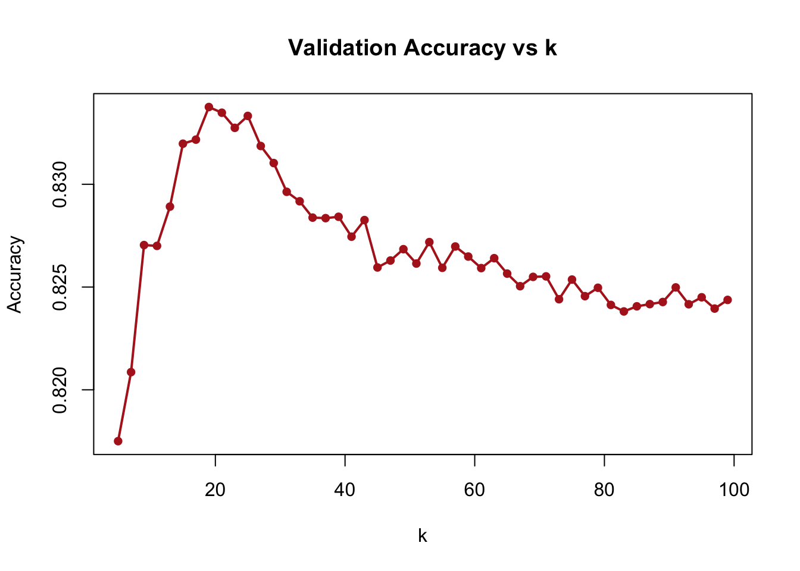
<p class="caption">(\#fig:kn13)Average validation accuracy over multiple runs for different k values</p>
</div>

To make this process more computationally efficient—especially as the number of runs or data size grows—we now turn to parallel computing to speed up the multi-run grid search.

### Grid search with parallel computing (`mclapply`)

To speed up our multi-run grid search, we can use parallel computing. In this implementation, we evaluate the accuracy of kNN across a range of $k$ values by averaging performance over multiple bootstrapped training-validation splits. Each $k$ is evaluated across 30 runs using different seeds to reduce variance. To do this efficiently, we use `mclapply` to distribute computation across available CPU cores. The function `compute_accuracy()` performs the distance calculation and majority vote prediction for a given $k$ and seed


``` r
library(doParallel)
```

```
## Loading required package: foreach
```

```
## 
## Attaching package: 'foreach'
```

```
## The following objects are masked from 'package:purrr':
## 
##     accumulate, when
```

```
## Loading required package: iterators
```

``` r
compute_accuracy <- function(params) {
  k <- params$k
  seed <- params$seed
  
  set.seed(seed)  # Set seed for reproducibility
  ind <- unique(sample(nrow(mdata), nrow(mdata), replace = TRUE))
  train <- mdata[ind, ]
  val <- mdata[-ind, ]
  new_data <- val[, 2:3]
  
  find_label <- function(new_point, k, train_data) {
    distances <- sqrt((new_point[1] - train_data[, 2])^2 
                      + (new_point[2] - train_data[, 3])^2)
    nearest <- order(distances)[1:k]
    nearest_labels <- train_data$y[nearest]
    return(names(which.max(table(nearest_labels))))
  }
  
  new_labels <- apply(new_data, 1, function(x) find_label(x, k, train))
  return(mean(new_labels == val$y))
}

# Parallel implementation
macc_parallel <- c()
grid <- seq(5, 120, by = 1)

no_cores <- detectCores() - 1
cl <- makeCluster(no_cores)
registerDoParallel(cl)

for (k in 1:length(grid)) {
  # Create parameter list with consistent seeds
  params_list <- lapply(1:30, function(i) list(k = grid[k], seed = i))
  
  # Run parallel computation
  acc <- unlist(mclapply(params_list, compute_accuracy, mc.cores = no_cores))
  macc_parallel[k] <- mean(acc)
}

stopCluster(cl)

# Plot with color and styling
plot(grid, macc_parallel, type = "o", xlab = "k", ylab = "Accuracy",
     col = "firebrick", lwd = 2, pch = 16)

abline(v = grid[which.max(macc_parallel)], lty = 2, col = "green", lwd = 2)
```

<div class="figure">
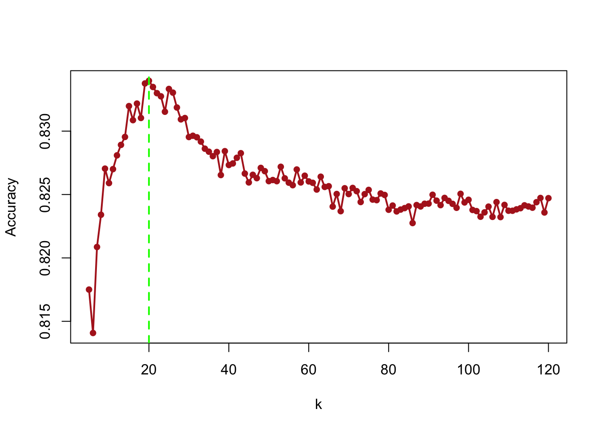
<p class="caption">(\#fig:kn14)Validation accuracy over multiple runs for different k values using parallel computing</p>
</div>

The resulting plot shows how validation accuracy varies with $k$, helping us identify the optimal value while leveraging faster execution through parallelism.

There are multiple packages in R for applying kNN. The `knn()` function from the `class` package is simple but requires all features to be numeric and does not handle scaling or factor variables automatically. On the other hand, the `knn3()` function from the `caret` package is more robust: it scales features internally and handles categorical variables without manual intervention. These features make it preferable for most applications.

### `knn3` from `caret`: Single vs Parallel Core Application

To demonstrate the computational benefits of parallelism further, we compare sequential and parallel implementations of kNN grid search using `knn3()` from the `caret` package. In both versions, we train the model across a range of $k$ values (5 to 120), repeating each experiment 30 times with different seeds.

In the **sequential version**, the code loops through each $k$, then iterates over 30 runs to average the validation accuracy.

In the **parallel version**, we achieve the same result but distribute the 30 runs for each $k$ across multiple CPU cores using `mclapply`. This reduces total runtime significantly, especially when the dataset or number of hyperparameter combinations is large


``` r
library(caret)
library(foreach)
library(doParallel)

# Define consistent parameters
grid <- seq(5, 120, by = 1)
n_iterations <- 30

# Function to compute accuracy that will be used in both implementations
compute_knn_accuracy <- function(k, seed) {
  set.seed(seed)
  ind <- unique(sample(nrow(mdata), nrow(mdata), replace = TRUE))
  train <- mdata[ind, ]
  val <- mdata[-ind, ]
  
  model <- knn3(y ~ ., data = train, k = k)
  yhat <- predict(model, val, type = "class")
  return(mean(yhat == val$y))
}

# Sequential Implementation
macc_sequential <- numeric(length(grid))
for (i in seq_along(grid)) {
  acc <- numeric(n_iterations)
  for (j in 1:n_iterations) {
    acc[j] <- compute_knn_accuracy(grid[i], j)
  }
  macc_sequential[i] <- mean(acc)
}

# Parallel Implementation
no_cores <- detectCores() - 1
cl <- makeCluster(no_cores)
registerDoParallel(cl)

# Create parameter combinations
param_grid <- expand.grid(k = grid, seed = 1:n_iterations)
macc_parallel <- numeric(length(grid))

for (i in seq_along(grid)) {
  k_params <- param_grid[param_grid$k == grid[i], ]
  acc <- unlist(mclapply(1:n_iterations, 
                        function(x) compute_knn_accuracy(k_params$k[x],
                        k_params$seed[x]), mc.cores = no_cores))
  macc_parallel[i] <- mean(acc)
}

stopCluster(cl)

# Compare results visually
par(mfrow = c(1, 2))
plot(grid, macc_sequential, type = "o", 
     xlab = "k", ylab = "Accuracy",
     main = "Sequential Implementation",
     col = "firebrick", lwd = 1.5)
abline(v = grid[which.max(macc_sequential)], lty = 2, col = "green")
text(x = 70, y = 0.82, 
     labels = paste("k =", grid[which.max(macc_sequential)], 
                   "\nAccuracy =", round(max(macc_sequential), 5)),
     pos = 4, col = "green", cex = 0.50)

plot(grid, macc_parallel, type = "o", 
     xlab = "k", ylab = "Accuracy",
     main = "Parallel Implementation",
     col = "firebrick", lwd = 1.5)
abline(v = grid[which.max(macc_parallel)], lty = 2, col = "green")
text(x = 70, y = 0.82, 
     labels = paste("k =", grid[which.max(macc_parallel)], 
                   "\nAccuracy =", round(max(macc_parallel), 5)),
     pos = 4, col = "green", cex = 0.50)
```

<div class="figure">
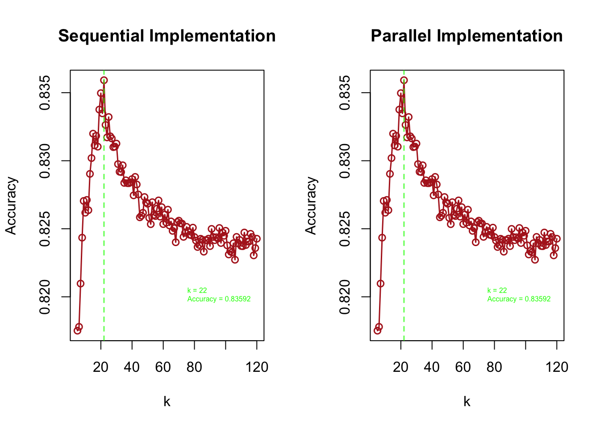
<p class="caption">(\#fig:kn15)Comparison of sequential and parallel kNN grid search: validation accuracy across k</p>
</div>

``` r
# Print summary statistics
cat("\nSequential Implementation - Optimal k:", grid[which.max(macc_sequential)],
    "\nParallel Implementation - Optimal k:", grid[which.max(macc_parallel)])
```

```
## 
## Sequential Implementation - Optimal k: 22 
## Parallel Implementation - Optimal k: 22
```
<!-- change blue to black; red to gray 40-->
The two side-by-side plots show validation accuracy across different $k$ values under both implementations. Red vertical lines mark the value of $k$ that gives the highest accuracy in each case.

In summary, kNN is a flexible and intuitive algorithm for classification and regression. It is entirely data-driven and requires no assumptions about the underlying distribution. The model’s simplicity, however, comes with tradeoffs: it can be computationally intensive, especially with large datasets, and its performance depends heavily on the choice of $k$ and the distance metric. Nonetheless, with careful tuning and tools like parallel computing, kNN remains a practical and effective method—particularly when model interpretability or minimal assumptions are important.

## Tuning in Classification

We now turn to an essential topic in classification: how to tune models and evaluate their performance. The choice of hyperparameters (like $k$ in kNN), distance metrics, and feature scaling all affect the model’s ability to generalize. But equally important is the choice of performance metrics used during training and validation.

Take kNN as an example: in our earlier applications to the `mnist_27` and `Adult` datasets, we selected the best $k$ by maximizing accuracy. But what exactly is accuracy? And is it always the best choice? Can other metrics lead to better predictions—especially in imbalanced datasets or when different types of misclassifications carry different consequences?

These questions are central to model evaluation. To answer them, we begin with a foundational concept: the confusion matrix.

### Confusion Matrix

Evaluating the performance of a classification model starts with understanding how predicted outcomes match the actual values. One of the most useful tools for this is the confusion matrix.

For binary classification, we often predict class labels by thresholding predicted probabilities. For example, using:

$$
\hat{Y} = \begin{cases}
1 & \text{if } \hat{p}(x_1, \ldots, x_k) > 0.5 \\
0 & \text{otherwise}
\end{cases}
$$

From this rule, we build a confusion matrix summarizing how many predictions are correct or incorrect:

$$
\begin{array}{ccc}
\text{Predicted vs. Reality} & Y = 1 & Y = 0 \\
\hat{Y} = 1 & \text{True Positive (TP)} & \text{False Positive (FP)} \\
\hat{Y} = 0 & \text{False Negative (FN)} & \text{True Negative (TN)}
\end{array}
$$

This table—also called the confusion table—makes it easy to visualize where the model is “confusing” one class with another.

To illustrate, consider this example[^ExClass].

[^ExClass]:Example can be seen clicking the link [example](https://en.wikipedia.org/wiki/Confusion_matrix)

$$
\begin{array}{ccc}
\text{Predicted vs. Reality} & Y = \text{Cat} & Y = \text{Dog} \\
\hat{Y} = \text{Cat} & 5 & 2 \\
\hat{Y} = \text{Dog} & 3 & 3
\end{array}
$$

There are 8 actual cats and 5 dogs. The model correctly predicts 5 cats and 3 dogs, but misclassifies 3 cats as dogs and 2 dogs as cats. The diagonal shows correct predictions; off-diagonal entries show errors.


### Why Accuracy Can Be Misleading

The most commonly reported metric is accuracy, defined as:

$$
\text{Accuracy} = \frac{TP + TN}{TP + FP + FN + TN}
$$

But this measure can be misleading—especially when classes are imbalanced. Suppose 95 of 100 observations are cats and only 5 are dogs. A classifier that labels everything as “cat” would achieve 95% accuracy, even though it fails to detect any dogs.

Thus, when evaluating classification performance, especially during training and tuning, alternative metrics are often more appropriate.

### Performance Measures Beyond Accuracy

Which metric should we use to tune classification models? This question becomes critical when class distributions are imbalanced, or when the cost of different types of misclassification varies. For example, in cancer detection, failing to identify a cancer patient (a false negative) can be far more serious than mistakenly flagging a healthy individual (a false positive). In contrast, in spam detection, false positives—wrongly classifying real emails as spam—may be more disruptive.

The confusion matrix allows us to define a wide range of metrics beyond simple accuracy. Here’s a visual summary (source: [Wikipedia – Evaluation of Binary Classifiers](https://en.wikipedia.org/wiki/Evaluation_of_binary_classifiers)):

<div class="figure">
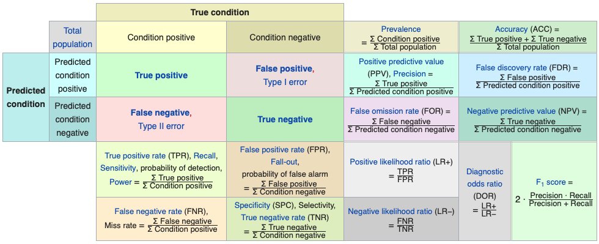
<p class="caption">(\#fig:tc1)Confusion matrix and related classification metrics</p>
</div>

Let’s walk through some of the most commonly used metrics, using a medical diagnosis example (e.g., cancer detection):

* **Accuracy**: Proportion of correctly classified patients (both cancerous and non-cancerous). Appropriate when the classes are roughly balanced (e.g., not worse than a 60–40 split).
  $(TP + TN)/n$

* **Balanced Accuracy**: Average of sensitivity and specificity. Useful when classes are imbalanced.
  $(TP/P + TN/N)/2$

* **Precision**: Of those predicted as cancer patients, how many actually have cancer?
  $TP / (TP + FP)$

* **Sensitivity** (*Recall* or *True Positive Rate*): Of all patients who have cancer, how many were correctly identified?
  $TP / (TP + FN)$

* **Specificity** (*True Negative Rate*): Of all patients without cancer, how many were correctly identified as such?
  $TN / (TN + FP)$

Here’s a schematic interpretation using the confusion matrix structure:

$$
\begin{array}{ccc}
\text{Predicted vs. Reality} & Y = \text{Cat} & Y = \text{Dog} \\
\hat{Y} = \text{Cat} & \text{TPR (Sensitivity)} & \text{FPR (Fall-out)} \\
\hat{Y} = \text{Dog} & \text{FNR (Miss Rate)} & \text{TNR (Specificity)}
\end{array}
$$

### Kappa Statistic

Kappa measures how much better a classifier performs compared to random guessing. It adjusts for the expected accuracy that would occur by chance, based on marginal class frequencies.

Consider this confusion matrix:

$$
\begin{array}{ccc}
\text{Predicted vs. Reality} & Y = \text{Cat} & Y = \text{Dog} \\
\hat{Y} = \text{Cat} & 22 & 9 \\
\hat{Y} = \text{Dog} & 7 & 13
\end{array}
$$

Total observations: $n = 51$
Observed accuracy (OA): $(22 + 13)/51 = 0.69$

To compute Kappa, we first calculate expected accuracy (EA) based on marginal totals. The contribution of true positives, for example, is:

$$
\mathrm{Pr}(\hat{Y} = \text{Cat}) \left[ \mathrm{Pr}(Y = \text{Cat} \mid \hat{Y} = \text{Cat}) - \mathrm{Pr}(Y = \text{Cat}) \right]
$$

This compares the conditional probability of correct classification (reflecting model performance) to the marginal probability (reflecting random chance). Similar logic applies for TN:

$$
\mathrm{(OA - EA)_{TN}} = \mathrm{Pr}(\hat{Y} = \text{Dog}) \left[ \mathrm{Pr}(Y = \text{Dog} \mid \hat{Y} = \text{Dog}) - \mathrm{Pr}(Y = \text{Dog}) \right]
$$

Using the joint and marginal probabilities, the general form becomes:

$$
OA - EA = \frac{m_{ij}}{n} - \frac{m_i m_j}{n^2}
$$

For this example:

* $OA - EA$ for TP = $22/51 - \frac{31 \times 29}{51^2} = 0.0857$
* $OA - EA$ for TN = $13/51 - \frac{20 \times 21}{51^2} = 0.0934$
* $1 - EA = 1 - \left( \frac{31 \times 29 + 20 \times 21}{51^2} \right) = 0.51$

So, Kappa is:

$$
\text{Kappa} = \frac{0.0857 + 0.0934}{0.51} \approx 0.3655
$$

This shows that the classifier performs better than chance, but there is still room for improvement.

### Youden’s J Statistic

A final useful metric is Youden’s J (also known as *Informedness*), which summarizes a model’s ability to avoid both false positives and false negatives:

$$
J = \text{TPR} + \text{TNR} - 1
$$

It ranges from 0 (no predictive ability) to 1 (perfect classification). This index is closely linked to the ROC curve, which we will examine next.


### ROC Curve

In classification tasks, the outcome variable $Y$ is categorical—typically coded as 0 or 1. Most classification algorithms output the predicted probability of success ($Y = 1$), not the class label directly. To obtain a class prediction, we must compare this probability to a discriminating threshold (often set at 0.5): if the predicted probability exceeds the threshold, the model predicts $Y = 1$; otherwise, it predicts $Y = 0$.

Because the threshold determines the final classification, performance measures like accuracy, sensitivity, and specificity will vary with different thresholds. To summarize model performance across all thresholds, we use the Receiver Operating Characteristic (ROC) curve, which plots the True Positive Rate (TPR) against the False Positive Rate (FPR). A good model yields high TPR with low FPR, and the better this trade-off, the closer the curve hugs the top-left corner.

The Area Under the Curve (AUC) provides a single number summarizing the overall performance: a value of 1 indicates perfect classification, and 0.5 indicates no better than random guessing.

<div class="figure">
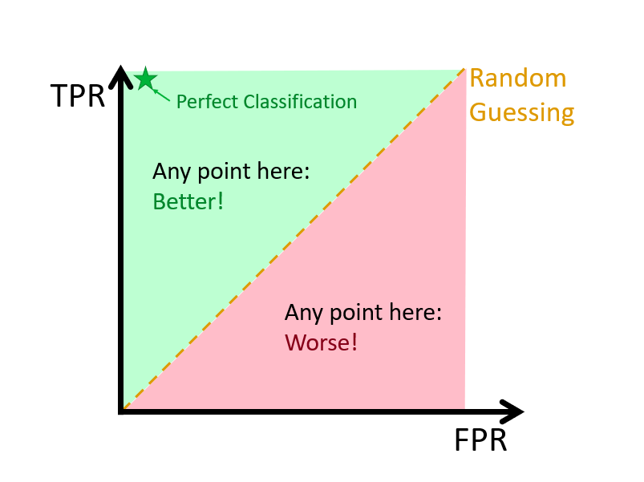
<p class="caption">(\#fig:tc2)Visualization of the ROC curve and key diagnostic regions</p>
</div>

Let's begin with a simple example. Suppose we have 100 individuals—50 with $Y = 1$ and 50 with $Y = 0$. Now imagine two extreme threshold choices:

* Threshold = 0%: the model predicts everyone as $Y = 1$

  $$
  \hat{Y} = \begin{cases}
  1 & \hat{p}(x) > 0 \\
  0 & \text{otherwise}
  \end{cases}
  \Rightarrow
  \begin{array}{ccc}
  \text{Predicted vs. Reality} & Y = 1 & Y = 0 \\
  \hat{Y} = 1 & 50 & 50 \\
  \hat{Y} = 0 & 0 & 0
  \end{array}
  $$

  TPR = 1, FPR = 1

* Threshold = 100%: the model predicts everyone as $Y = 0$

  $$
  \hat{Y} = \begin{cases}
  1 & \hat{p}(x) > 1 \\
  0 & \text{otherwise}
  \end{cases}
  \Rightarrow
  \begin{array}{ccc}
  \text{Predicted vs. Reality} & Y = 1 & Y = 0 \\
  \hat{Y} = 1 & 0 & 0 \\
  \hat{Y} = 0 & 50 & 50
  \end{array}
  $$

  TPR = 0, FPR = 0

As we adjust the threshold from 0% to 100%, we generate a series of $(\text{TPR}, \text{FPR})$ pairs. Plotting these points gives us the ROC curve, which visualizes the model’s ability to distinguish between classes at various threshold settings. A model with strong discriminative power will maintain a high TPR while keeping FPR low, resulting in a curve that approaches the top-left corner of the plot.

To illustrate this using real data, we now turn to the `mnist_27` dataset and apply the `knn3` model from the `caret` package. While standard kNN only produces class labels based on majority voting, this is not directly compatible with generating an ROC curve, which requires probabilistic outputs. But there is a workaround:

* **Standard kNN** returns only class labels based on the majority vote among the k nearest neighbors. It does not produce probabilities, so it cannot be used directly to generate ROC curves.
* **Modified kNN**, however, allows us to estimate probabilities by computing the proportion of neighbors that belong to each class. This proportion serves as an estimated probability for class membership and enables threshold-based classification.


``` r
data(mnist_27)
#str(mnist_27)

table(mnist_27$train$y) # data is well-balanced
```

```
## 
##   2   7 
## 379 421
```

``` r
#scale the data

train <- mnist_27$train
test <- mnist_27$test

train$x_1 <- scale(mnist_27$train$x_1)
train$x_2 <- scale(mnist_27$train$x_2)

test$x_1 <- scale(mnist_27$test$x_1)
test$x_2 <- scale(mnist_27$test$x_2)
```

We can modify kNN to provide probability estimates. For instance, instead of just using the majority class among the k nearest neighbors, we can calculate the proportion of neighbors belonging to each class. This proportion can act as a probability estimate for class membership.

Here, we redefine our earlier function `find_probabilities()` that, for a given test point, finds the $k=21$ nearest neighbors and returns the proportion of each class label among them. This gives us the probability that the new observation belongs to class 2 (our positive class).


``` r
find_probabilities <- function(new_point, k) {
  distances <- sqrt((new_point[1] - train[, 2])^2 + (new_point[2] - train[, 3])^2)
  nearest <- order(distances)[1:k]
  nearest_labels <- train$y[nearest]
  label_proportions <- table(nearest_labels) / k
  return(label_proportions)
}

new_data <- test[, 2:3]
new_prob <- apply(new_data, 1, function(x) find_probabilities(x, k = 21))
new_prob <- t(new_prob)
```

We then apply this function to each test point to generate a set of estimated probabilities. These will be used to simulate different threshold cutoffs.

We need to decide the positive class.  Snippet below prepares these probabilities for analysis by converting them into a named data frame and ensuring the correct interpretation of class labels—assigning class 2 as positive and class 7 as negative.


``` r
# Convert the labels in new_prob to 0 and 1
new_prob <- data.frame(new_prob)
names(new_prob) <- c("prob_2 as 1", "prob_7 as 0")
```

Here we define a function that, given a threshold, calculates the true positive rate (TPR) and false positive rate (FPR) by comparing the predicted labels (based on that threshold) to the actual test set labels. It returns not just TPR and FPR, but also confusion matrix components like true/false positives and negatives, allowing for richer diagnostics.


``` r
# Function to calculate TPR and FPR at each threshold
calculate_tpr_fpr <- function(prob, true_labels, threshold) {
  if (threshold == 0) {
    predicted_labels <- rep(1, length(prob))
  } else {
    predicted_labels <- ifelse(prob > threshold, 1, 0)
  }

  true_positive <- sum(predicted_labels == 1 & true_labels == 2)
  false_positive <- sum(predicted_labels == 1 & true_labels == 7)
  true_negative <- sum(predicted_labels == 0 & true_labels == 7)
  false_negative <- sum(predicted_labels == 0 & true_labels == 2)
  
  total_2 = sum(true_labels == 2)
  total_7 = sum(true_labels == 7)
  
  tpr <- true_positive / total_2
  fpr <- false_positive / total_7
  specificity <- true_negative / total_7
  
  return(c(tpr, fpr, specificity, true_positive, 
           false_positive, true_negative, false_negative,
           threshold, total_2, total_7))
}
```

By applying this function over a grid of thresholds (e.g., 0.01 to 0.99), we can trace the ROC curve and calculate the Area Under the Curve (AUC). This will be the focus of the next section.

### ROC Curve and AUC

Let's now visualize the performance of our classifier using the ROC curve and compute AUC, focusing on predicting digit 2.


``` r
# Define a sequence of thresholds
thresholds <- seq(0, 1, by = 0.01)

# Calculate TPR and FPR for each threshold
tpr_fpr_list <- lapply(thresholds, function(threshold) 
  calculate_tpr_fpr(new_prob[, 1], test$y, threshold))

# Convert the list to a matrix for easier handling
tpr_fpr <- do.call(rbind, tpr_fpr_list)
colnames(tpr_fpr) <- c("tpr", "fpr", "true_positive", "specificity",
                       "false_positive", "true_negative", "false_negative",
                       "threshold", "total_2", "total_7")

ggplot(data.frame(tpr = tpr_fpr[, 1], fpr = tpr_fpr[, 2]), aes(x = fpr, y = tpr)) +
  geom_line(color = "blue") +
  geom_abline(intercept = 0, slope = 1, linetype = "dashed", color = "red") +
  labs(x = "False Positive Rate", y = "True Positive Rate") +
  theme_minimal()
```

<div class="figure">
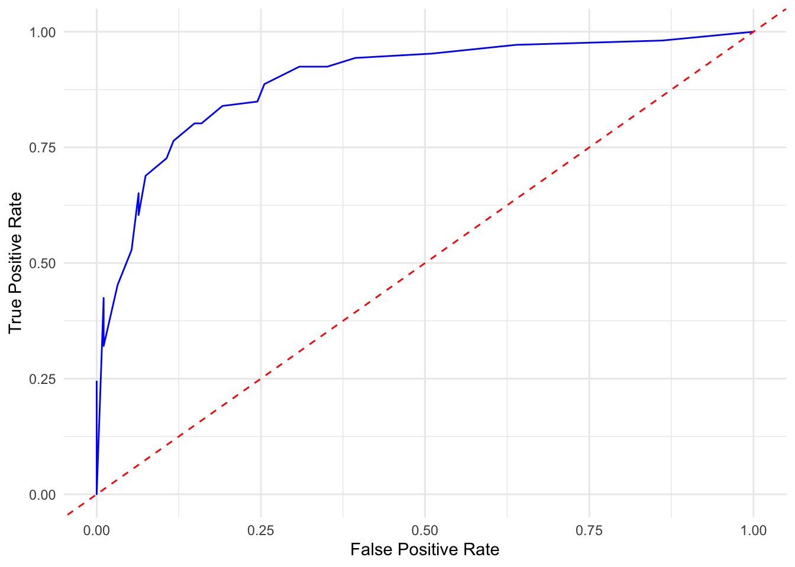
<p class="caption">(\#fig:kn20)ROC curve showing trade-off between true and false positive rates for digit 2</p>
</div>
<!-- black to blue; red to gray40 -->
The function `do.call()` is useful when applying a function like `rbind()` to a list of outputs, as it collapses the list into a single matrix or data frame, making it easier to manipulate or plot. Combined with `lapply()`, it simplifies batch computation across a sequence of inputs—in this case, thresholds.

### Using `ROCR` and `pROC` packages

**ROC with the `ROCR` Package**


``` r
# now let's use ROCR package to plot the ROC curve
library(ROCR)
pred <- prediction(new_prob[, 1], test$y == 2)
perf <- performance(pred, "tpr", "fpr")
plot(perf, lwd = 2,
     main = "ROC curve for digit 2",
     col = "blue")
abline(a = 0, b = 1, lty = 2, col = "red")
```

<div class="figure" style="text-align: center">
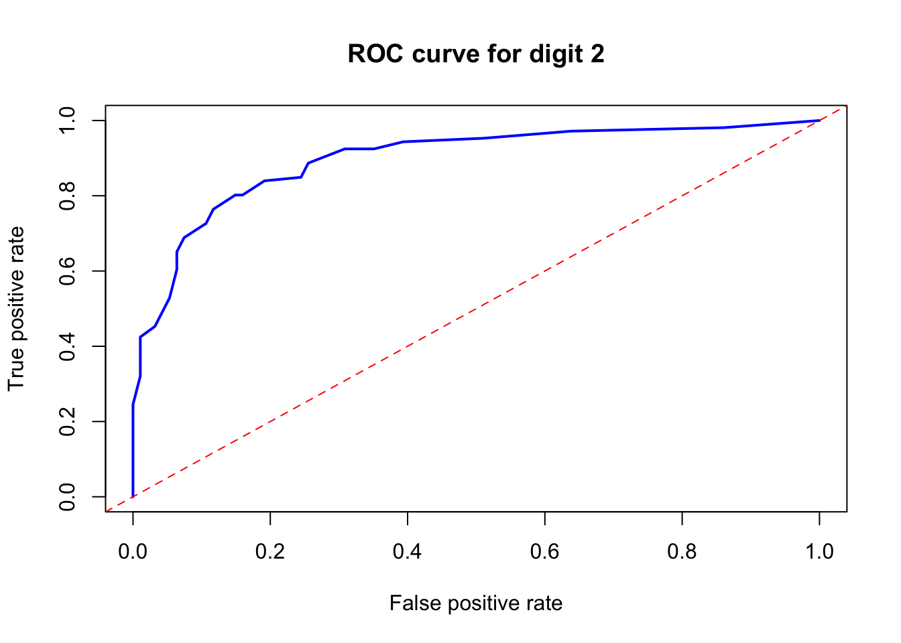
<p class="caption">(\#fig:kn21)ROC curve for digit 2 using the ROCR package</p>
</div>

This shows the ROC curve for digit 2. Let's now calculate the AUC.


``` r
# And let's calculate the AUC
auc <- performance(pred, "auc")
auc@y.values[[1]]
```

```
## [1] 0.8964773
```

The AUC is approximately 0.90, indicating excellent classification performance. The ROC curve plots sensitivity (TPR) against 1 - specificity (FPR) over all possible thresholds. The AUC summarizes this curve into a single number: the probability that the classifier will rank a randomly chosen positive case higher than a negative one.

AUC values closer to 1 indicate strong separation between classes. A value of 0.5 means the classifier performs no better than random guessing. This measure is particularly useful because it is independent of the threshold chosen to determine the positive class and provides a single measure of performance across all classification thresholds. It is also invariant to changes in the class distribution, making it a good metric for evaluating the intrinsic quality of the predictions of the model.

**ROC with the `pROC` package**


``` r
roc_obj <- roc(test$y, new_prob[, 1], levels = c("7", "2"), 
               direction = "<", percent = TRUE,
               xlim = c(100, 0), plot = TRUE,
               xlab = "False Positive Percentage", ylab = "True Positive Percentage",
               print.auc = TRUE, print.auc.col = "red", col = "blue", lwd = 2)
```

<div class="figure">
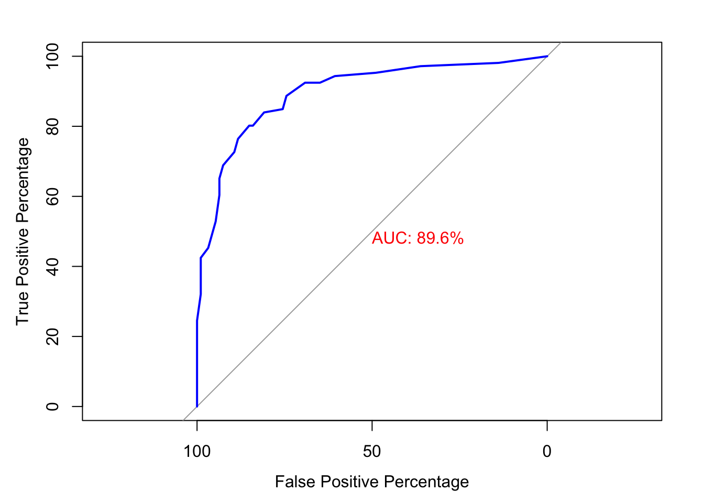
<p class="caption">(\#fig:kn23)ROC curve for digit 2 using the pROC package with AUC displayed</p>
</div>

``` r
ggroc(roc_obj, legacy.axes = TRUE, color = "blue", size = 1.2) +
  geom_abline(slope = 1, intercept = 0, linetype = "dashed", col = "red") +
  xlab("100% - Specificity") +
  ylab("100% - Sensitivity") +
  theme_minimal()
```

<div class="figure">
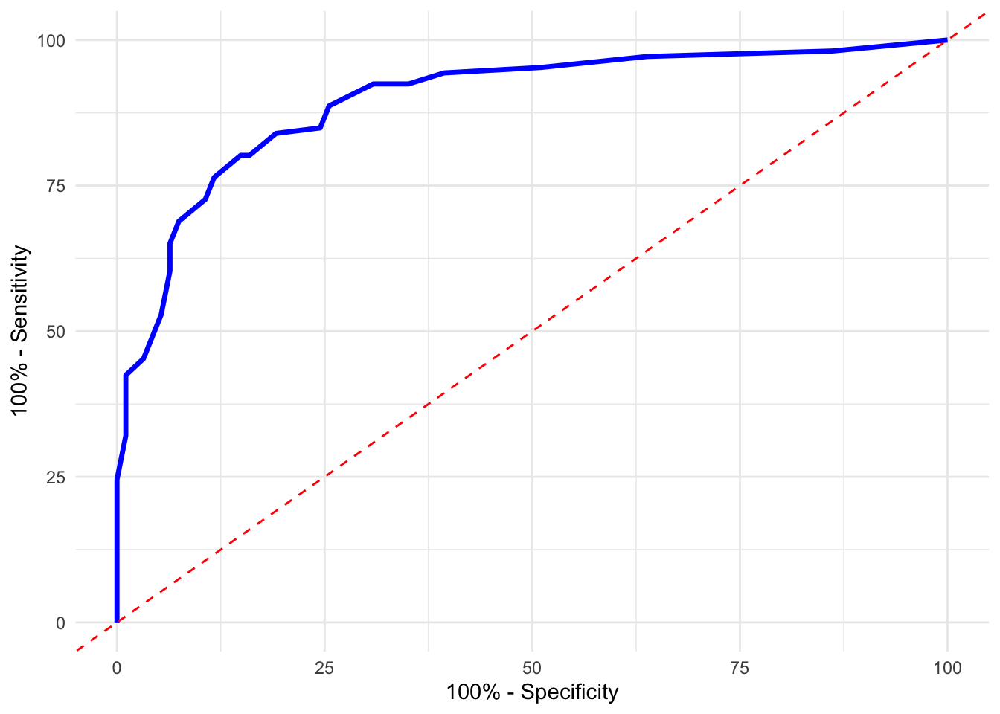
<p class="caption">(\#fig:kn23a)Specificity vs Sensitivity plot for digit 2 using the pROC package with AUC displayed</p>
</div>

These plots provide additional ways to visualize classifier performance and verify AUC, using slightly different conventions. Both confirm that our classifier distinguishes well between the digits 2 and 7.

While this chapter focuses primarily on binary classification—such as distinguishing digit 2 from digit 7—the methods discussed can be extended to multiclass problems. Common approaches include one-vs-rest (OvR), where separate binary classifiers are trained for each class against all others, and one-vs-one (OvO), which constructs a classifier for every pair of classes. For methods like kNN, multiclass classification is handled naturally by majority vote among neighbors. However, performance metrics such as AUC or Youden’s index must be adapted or replaced with multiclass alternatives, like macro-averaged precision or Cohen’s kappa, as binary-specific metrics may not fully capture performance across multiple classes.

### Tuning kNN with AUC

So far, we have used accuracy to tune the value of $k$, but AUC often provides a more robust metric, especially when class balance or threshold sensitivity matters. Instead of checking how many predictions are correct, AUC evaluates how well the model ranks positive cases above negative ones across all thresholds.

In the next code block, we calculate the AUC for a range of $k$ values using the `knn3()` function from the `caret` package. For each $k$, we perform 50 bootstrap iterations. In each iteration, we draw a sample with replacement from the training set, fit a kNN model, predict class probabilities on the out-of-bag sample, and calculate the AUC using the `ROCR` package.

The AUC values are then averaged over the 50 runs to get a stable performance estimate for each $k$. This process is parallelized across CPU cores using the `foreach` and `doParallel` packages to reduce computation time.


``` r
# Let's use the `knn3` model in the `caret` package to classify the data
library(caret)
library(foreach)
library(doParallel)
library(ROCR)

grid <- seq(5, 120, by = 1)

# Register the parallel back-end to use
no_cores <- detectCores() - 1  # reserve one core for the system
cl <- makeCluster(no_cores)
registerDoParallel(cl)

# Using foreach for parallel processing
mauc <- foreach(i = grid, .combine = 'c', .packages = c('caret', "ROCR")) %dopar% {
  
  aucc <- c()
  
  for (j in 1:50) {
    set.seed(j)
    ind <- unique(sample(nrow(train), nrow(train), replace = TRUE))
    traint <- train[ind, ]
    val <- train[-ind, ]
    
    model <- knn3(y ~ ., data = traint, k = i)
    phat <- predict(model, val, type = "prob")
    
    pred_rocr <- prediction(phat[, 1], val$y == 2)
    auc_rocr <- performance(pred_rocr, "auc")
    aucc[j] <- auc_rocr@y.values[[1]]
  }
  
  mean(aucc)

}

# Stop the cluster
stopCluster(cl)

# Plot the training AUC vs k
plot(grid, mauc, type = "o", xlab = "k", ylab = "AUC", lwd = 1.5, col = "blue")
optimal_k <- grid[which.max(mauc)]
abline(v = optimal_k, lty = 2, col = "red", lwd = 2)
text(x = 70, y = 0.89, labels = paste("k =", optimal_k, "\nAUC =", 
                      round(max(mauc),5)), pos = 4, col = "red")
```

<div class="figure">
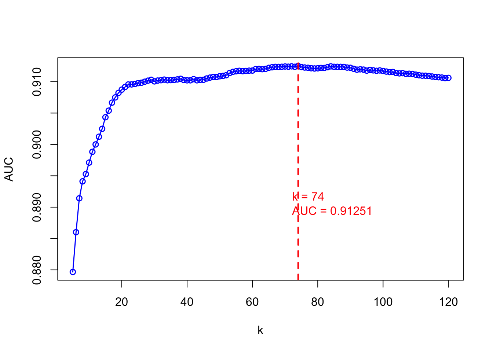
<p class="caption">(\#fig:kn24)Tuning kNN with AUC</p>
</div>

The plot shows how AUC varies with different $k$ values. The vertical red line identifies the $k$ that yields the highest AUC. Selecting $k$ based on this metric rather than accuracy can lead to more consistent performance, especially when probability ranking or threshold tuning is central to the application—such as in medical diagnosis or fraud detection.

While we use AUC-based tuning of $k$ with bootstrapped samples in this chapter, more generally, cross-validation remains a robust and widely used framework for evaluating classification models. In particular, stratified $k$-fold cross-validation—where each fold preserves the proportion of class labels—is especially valuable in classification settings to ensure fair representation of minority classes across folds. This approach is particularly important when classes are imbalanced or when comparing multiple models to avoid overfitting on random splits.

### Test Score and Threshold

After selecting the optimal $k$ value using AUC, we now assess the test performance and determine the best classification threshold. In ROC analysis, the default threshold of 0.5 may not be ideal. Instead, a more effective approach is to use **Youden’s J statistic**, which balances sensitivity and specificity by maximizing the distance from the diagonal line of random guessing in the ROC space.

Youden’s index is calculated as:
$J = \text{Sensitivity} + \text{Specificity} - 1$
or equivalently:
$J = \text{TPR} + \text{TNR} - 1$

This value ranges between 0 (no better than random) and 1 (perfect classification). The threshold corresponding to the highest Youden’s J is considered optimal, as it maximizes true positives while minimizing false positives.

To implement this, we fit a kNN model using the previously selected $k = 76$, generate predicted probabilities on the test set, and calculate the AUC. Then, using the `ROCR` package, we extract sensitivity and specificity across thresholds, compute the Youden index for each, and identify the threshold that gives the maximum value.


``` r
model <- knn3(y ~ ., data = train, k = 76)
phat <- predict(model, test, type = "prob")

# Calculate the AUC
pred_rocr <- prediction(phat[, 1], test$y == 2)
auc_rocr <- performance(pred_rocr, "auc")
auc_rocr@y.values[[1]]
```

```
## [1] 0.9096748
```

``` r
# Extract the sensitivity and specificity
perf <- performance(pred_rocr, "sens", "spec")
sensitivity <- perf@y.values[[1]]
specificity <- perf@x.values[[1]]


# Calculate Youden's Index
youden_index <- sensitivity + specificity - 1

# Find the maximum Youden's index and corresponding cutoff
max_index <- which.max(youden_index)
max_youden_index <- youden_index[max_index]

youden_index[max_index] # maximum Youden's index
```

```
## [1] 0.6870735
```

``` r
perf@alpha.values[[1]][max_index] # optimal discrimination threshold
```

```
## [1] 0.4210526
```
  
After identifying the best threshold, we generate the confusion matrix using that cutoff to evaluate the final classification performance on the test set.


``` r
# Calculate the confusion matrix at the optimal threshold

optimal_threshold <- perf@alpha.values[[1]][max_index]
predicted_labels <- ifelse(phat[, 1] > optimal_threshold, 1, 0)

confusion_matrix <- table(predicted_labels, test$y == 2)
confusion_matrix <- confusion_matrix[c(2,1), c(2,1)]
rownames(confusion_matrix) <- c("Predicted 2", "Predicted 7")
colnames(confusion_matrix) <- c("Actual 2", "Actual 7")
confusion_matrix
```

```
##                 
## predicted_labels Actual 2 Actual 7
##      Predicted 2       89       17
##      Predicted 7       17       77
```

This approach highlights the advantage of using probabilistic outputs rather than relying only on hard classification. It provides flexibility in decision-making depending on the application’s tolerance for false positives or false negatives. Although Youden’s J offers a convenient method for identifying a single optimal threshold, threshold selection is inherently context-dependent. In applications where misclassification costs differ—for example, false negatives may be costlier than false positives in medical diagnosis—it may be preferable to select a threshold that reflects this asymmetry. This connects to broader decision-theoretic approaches and cost-sensitive classification strategies, which we revisit in later chapters.

## Conclusion

Classification models are essential when outcomes fall into binary or multi-class categories. This chapter offered a comprehensive treatment of classification, using k-nearest neighbors (kNN) as a guiding example to demonstrate key ideas in performance evaluation, threshold selection, and model tuning. We showed that while kNN is conceptually simple, it becomes powerful when paired with thoughtful implementation—using parallel computing for tuning, and evaluating results with metrics like sensitivity, specificity, AUC, and Youden’s index, which are more appropriate than mean squared prediction error (MSPE) for binary outcomes.

We also emphasized that accuracy alone is often misleading, especially in the presence of class imbalance. More informative metrics and visualization tools—such as confusion matrices, ROC curves, and precision-recall trade-offs—are critical for assessing model performance. While the chapter focused on binary classification (e.g., digit 2 vs. 7), we noted that many of these tools can be extended to multiclass settings via strategies like one-vs-rest or majority voting.

Although we used kNN for illustration, the same framework can be applied to other widely used classifiers, such as logistic regression, decision trees, random forests, support vector machines, and neural networks. Swapping the model while keeping the outcome setup binary allows for broad experimentation and comparison. These models will be introduced throughout the book, often alongside real-world applications in economics, health, and policy—making this chapter a resource you can return to for essential building blocks.

After preparing and splitting the data—ideally using stratified sampling to maintain class balance—the workflow involves selecting a model, generating predictions, evaluating with robust metrics, tuning hyperparameters, and setting decision thresholds based on context. These steps form a general-purpose, model-agnostic roadmap for classification tasks and offer a practical foundation for the model selection strategies discussed in the next chapter.


