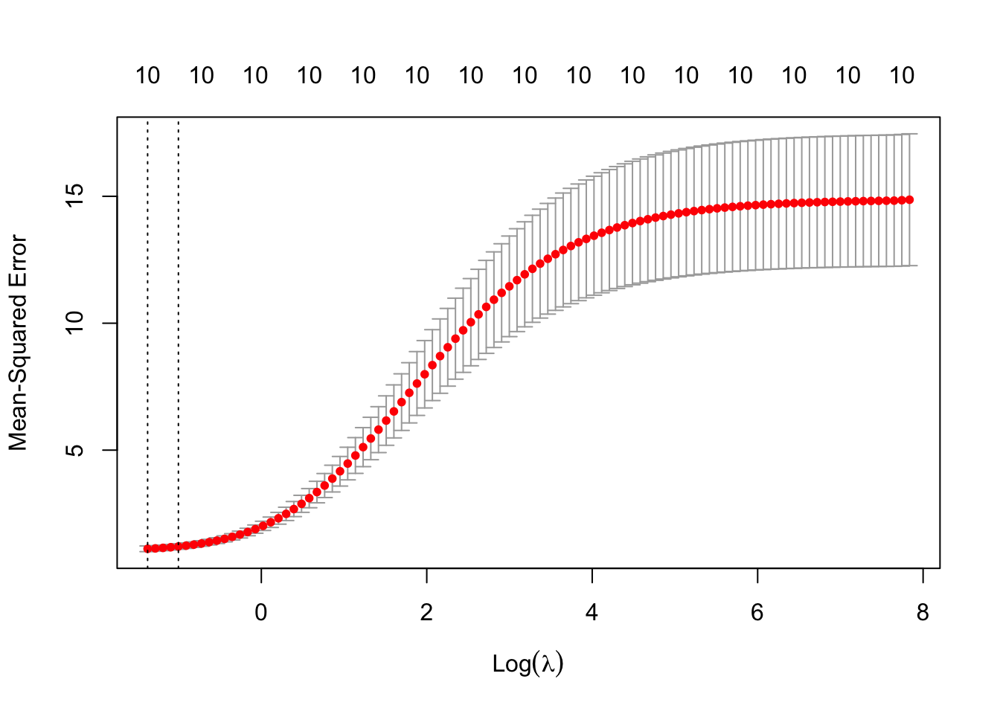
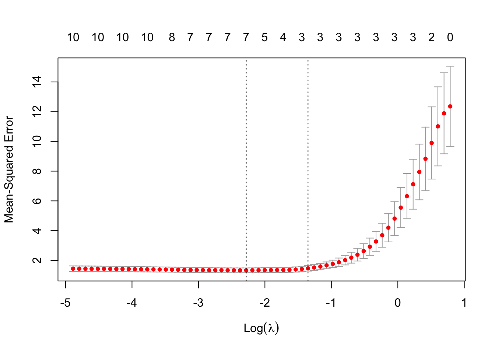
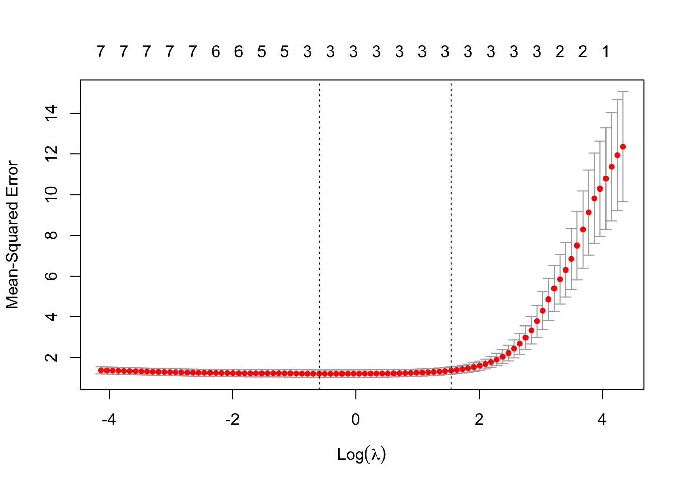
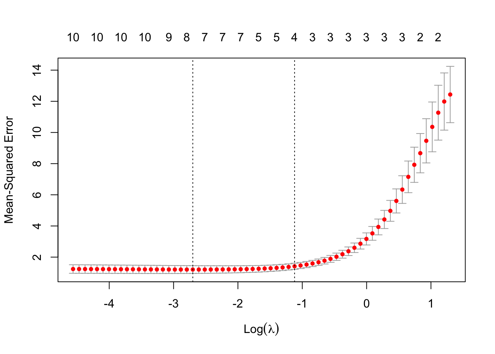

# Penalized Regression Methods

Building on the foundational concepts introduced in previous chapters, it is important to recognize that while the Ordinary Least Squares (OLS) method-discussed in Chapter 2 and detailed in Chapter 4—offers a robust framework for statistical inference by minimizing the sum of squared residuals and providing the Best Linear Unbiased Estimator (BLUE) under the Gauss-Markov assumptions, it may not always yield the best predictive performance in complex data scenarios. In the pursuit of flexible prediction or obtaining unbiased coefficients, we often transform variables in linear models into polynomials, create interaction terms, and apply various transformations to better capture complex relationships in the data. However, in the era of big data and complex models, traditional linear regression often falls short when faced with high-dimensional datasets where the number of predictors is large relative to the number of observations. In such scenarios, OLS estimates can become unstable, and exhibit high variance, leading to models that perform exceptionally well on training data but fail to generalize effectively due to overfitting , i.e unbiased coefficients but without any external validity. Moreover, multicollinearity among predictors—where high correlations make the design matrix nearly singular—can significantly inflate variance estimates and destabilize coefficient interpretations, undermining the model’s reliability. These challenges highlight the limitations of OLS in complex data settings and underscore the need for additional methodologies that can regularize the estimation process. By trading a small amount of bias for a significant reduction in variance, such methods can improve the model's predictive accuracy without compromising the integrity of its predictions.

In fields such as economics, social sciences, or health sciences, it is common practice to include a wide array of socioeconomic background variables and personal information in regression models—such as age, region, occupation, industry, and various other indicators. Researchers often improve these models by adding quadratic and cubic terms, as well as interactions among these indicators, to better capture nonlinear relationships and complex interactions within the data. This approach can result in models with hundreds or even thousands of features (variables) in a single OLS regression. When utilizing common surveys, especially panel data, incorporating these extensive sets of variables can lead to the very challenges previously discussed: the number of predictors may approach or exceed the number of observations, and multicollinearity becomes more prevalent than it might initially appear. Consequently, OLS estimates become unstable, exhibiting high variances and unreliable coefficient interpretations, which undermines the model's reliability and predictive performance. These issues further highlight the limitations of traditional OLS regression in complex data settings and underscore the need for alternative methodologies—such as penalized regression techniques—that can effectively address these challenges without compromising the integrity of the model's predictions.

Penalized regression methods, which often surpass OLS in predictive accuracy, have emerged as powerful tools in statistical modeling. Also known as shrinkage or regularization methods, these techniques focus primarily on predicting unseen data by emphasizing the critical balance between bias and variance. Rather than striving solely for unbiased estimators—the BLUE in classical statistical terms—our goal shifts toward developing models that manage this balance effectively. In this chapter, we focus on how penalized regression methods is used for prediction, and walk through each step in detail—from raw data to final results. We explain how to prepare and standardize data, fit the lasso model across a grid of penalty values, use cross-validation to select the optimal penalty, and interpret the selected coefficients. In Chapter 19 and 22, we will later return to these methods in the context of causal inference, where it plays a key role in the double machine learning framework.

These methods are particularly adept at handling overfitting, a key concern when modeling complex datasets, as previously discussed. Penalized regression techniques intentionally adjust the regression coefficients to create slightly biased estimators if it results in a lower overall prediction error on new, unseen data. We explored the possibility of biased estimators as better predictors in the final section of Chapter 5, highlighting how accepting some bias can reduce variance and improve predictive performance.

The general principle of penalization in regression models involves adding a penalty term to the model's objective function—usually the sum of squared errors—to constrain or shrink the estimated regression coefficients. This penalty discourages the model from fitting too closely to the training data, helping to avoid overfitting and manage multicollinearity. By shrinking the coefficients, the model effectively reduces their variance at the cost of introducing some bias, thereby striking a balance that improves prediction accuracy on unseen data.

In practice, penalization aims to control the complexity of the model. Regularization involves adding a penalty term to the loss function used in parameter estimation, which discourages complex models by shrinking coefficient estimates and effectively preventing overfitting. The general principle is to modify the traditional loss function by introducing a penalty that constrains the magnitude of the coefficients. This penalty term includes a regularization parameter that controls the strength of the penalty, allowing us to adjust how much we want to shrink the coefficients.

While the loss function can take various forms—such as means, quantiles, expectiles, or others depending on the modeling objective—and penalization techniques can be applied across different types of models including logistic regression, splines, tree-based methods, and neural networks, in this chapter we specifically focus on linear regression models with the MSPE as the loss function.

The general form of a regularized loss function in linear regression is:

\begin{equation}
\min_{\beta} \left\{ L(\beta) = \sum_{i=1}^{n} \left( y_i - \beta_0 - \sum_{j=1}^{p} \beta_j x_{ij} \right)^2 + \lambda P(\beta) \right\}
\end{equation}

where:

\begin{itemize}
    \item $y_i$ is the response variable.
    \item $x_{ij}$ are the predictor variables.
    \item $\beta$ are the coefficients to be estimated.
    \item $\lambda$ is the regularization parameter controlling the strength of the penalty.
    \item $P(\beta)$ is the penalty function applied to the coefficients.
\end{itemize}

The choice of the penalty function distinguishes different regularization methods. L1 and L2 refer to two types of penalty functions used in regularization methods for regression models. Ridge Regression applies an L2 penalty, penalizing the sum of the squares of the coefficients. This approach shrinks the coefficients toward zero without fully eliminating any variables, leading to smaller and more stable estimates—particularly useful when dealing with multicollinearity. Lasso Regression employs an L1 penalty, penalizing the sum of the absolute values of the coefficients. This method not only shrinks coefficients but can also set some exactly to zero, effectively performing variable selection and simplifying the model. Elastic Net Regression combines both L1 and L2 penalties, blending the strengths of Ridge and Lasso using the mixing parameter, $\alpha$. This technique is especially beneficial when dealing with highly correlated predictors, as it can handle multicollinearity while still enabling variable selection.

By selecting the appropriate penalized regression method and tuning its hyperparameters (e.g., $\lambda$ and $\alpha$), we can control the trade-off between bias and variance, increase model interpretability, and improve predictive performance. Cross-validation is commonly used to determine the optimum values for these hyperparameters. In the sections that follow, we will examine each penalized regression method in detail—walking through every step from raw data to final results. Each method will be accompanied by a thorough explanation of what the code is doing and why.

You do not need to read or understand every part of the chapter. If your primary goal is implementation, you can focus on the simulation subsections under each method to learn how to apply the relevant packages directly. That’s essentially what most books and online sources provide. However, this chapter goes far beyond that: it explains the methods conceptually and practically in a way you won’t find in most other resources. 

## Ridge Regression

Ridge Regression is one of the earliest and most fundamental techniques in the family of penalized regression methods. It was introduced by Hoerl and Kennard in 1970 to address the problems of multicollinearity in linear regression models. When predictor variables are highly correlated, the design matrix becomes close to singular, and the Ordinary Least Squares (OLS) estimates exhibit high variance and instability. Ridge Regression addresses this challenge by incorporating a penalty term into the loss function, which effectively reduces the magnitude of the coefficient estimates toward zero without completely zeroing any of them. In Ridge regression, this penalty term helps in minimizing the weight of each predictor, thereby allocating greater significance to the most crucial predictors. This approach helps decrease the variance and consequently, the risk of overfitting. When the sample size is large, the Ridge estimators are nearly identical to the unbiased OLS estimators, which we will demonstrate below.

Consider a linear regression model with \(n\) observations and \(p\) predictors \(\mathbf{y}_{i} = \mathbf{X}_{i} \boldsymbol{\beta} + \boldsymbol{\varepsilon}_{i}, \) where 
\(\mathbf{y} \in \mathbb{R}^n\) is the response vector,
\(\mathbf{X} \in \mathbb{R}^{n \times p}\) is the design matrix of predictor variables,
\(\boldsymbol{\beta} \in \mathbb{R}^p\) is the vector of coefficients to be estimated, \(\boldsymbol{\varepsilon} \in \mathbb{R}^n\) is the error term, assumed to be independently and identically distributed with mean zero and variance \(\sigma^2\).

In OLS regression, the estimates of \(\boldsymbol{\beta}\) are obtained by minimizing the residual sum of squares (RSS) as a loss function, \(\min_{\boldsymbol{\beta}} \sum_{i=1}^{n} \left( y_i - \beta_0 - \sum_{j=1}^{p} \beta_j x_{ij}\right)^2\).The OLS solution in matrix form is \( \hat{{\beta}}_{\text{OLS}} = ({X}^\top {X})^{-1} {X}^\top{y}\). In component form, \(\hat{\boldsymbol{\beta}}_{\text{OLS}}\) can be expressed as \(\hat{\beta}_{k,\text{OLS}} = \frac{\sum_{i=1}^{n} y_i x_{ik}}{\sum_{i=1}^{n} x_{ik}^2},\) as shown at the end of Chapter 5. In OLS, the variance of \(\hat{\boldsymbol{\beta}}\) is given by \(\text{Var}(\hat{\boldsymbol{\beta}}_{\text{OLS}}) = \sigma^2 (\mathbf{X}^\top \mathbf{X})^{-1},\) assuming homoscedastic errors. However, OLS coefficient and variance estimates can become unstable when dealing with multicollinearity or high-dimensional data (where \(p \approx n\) or \(p > n\)). 

When multicollinearity is present, i.e. some of the predictors are highly correlated, meaning they carry nearly the same information. In this case, the columns of \(\mathbf{X}\) are almost linearly dependent, making it difficult to distinguish the effects of different predictors. This increases the variance of \(\hat{\boldsymbol{\beta}}\), meaning small changes in the data can lead to large changes in the estimates and predictions. Similarly, in high-dimensional data, predictions become unreliable because the matrix \(\mathbf{X}^\top \mathbf{X}\) becomes close to singular (non-invertible), which occurs when there isn't enough data to provide a unique estimate for each predictor, as \(p > n\). Ridge Regression addresses these issues by adding a penalty term, referred as \(L2\), to the OLS loss function, which stabilizes the coefficient estimates and reduces their variance.

The objective function for Ridge regression is:

\begin{equation}
\min_{\boldsymbol{\beta}} \left\{ L(\boldsymbol{\beta}) = \sum_{i=1}^{n} \left( y_i - \beta_0 - \sum_{j=1}^{p} \beta_j x_{ij} \right)^2 + \lambda \sum_{j=1}^{p} \beta_j^2 \right\},
\end{equation}

where \(\mathbf{y}_i\) represents the response variable, \(x_{ij}\) are the predictors, and \(\boldsymbol{\beta} = [\beta_0, \beta_1, \ldots, \beta_p]\) is the vector of coefficients. The regularization or tuning parameter \(\lambda \geq 0\) controls the strength of the penalty applied to the coefficients. The term \(\|\boldsymbol{\beta}\|_2^2 = \sum_{j=1}^{p} \beta_j^2\) represents the squared \(L2\) norm of the coefficient vector, which is the key component of Ridge regression's penalty term.

The Ridge regression objective function can also be written in matrix form as:

\begin{equation}
L(\boldsymbol{\beta}) = (\mathbf{y} - \mathbf{X} \boldsymbol{\beta})^\top (\mathbf{y} - \mathbf{X} \boldsymbol{\beta}) + \lambda \boldsymbol{\beta}^\top \boldsymbol{\beta}
\end{equation}

where \(\mathbf{X}\) is the matrix of predictor variables, \(\mathbf{y}\) is the response vector, and \(\boldsymbol{\beta}\) is the coefficient vector. This matrix form compactly expresses the optimization problem that Ridge regression solves, while the summation form provides insight into the individual components of the solution.

The Ridge regression estimator for the coefficient \(\beta_k\) in summation notation is given by:

\begin{equation}
\hat{\beta}_{k,\text{Ridge}} = \frac{\sum_{i=1}^{n} y_i x_{ik}}{\sum_{i=1}^{n} x_{ik}^2 + \lambda}
\end{equation}

For all coefficients \(k = 1, \dots, p\), the solution in matrix form is \(
\hat{\boldsymbol{\beta}}_{\text{Ridge}} = (\mathbf{X}^\top \mathbf{X} + \lambda \mathbf{I})^{-1} \mathbf{X}^\top \mathbf{y}.
\)

The matrix formulation provides a general solution for all coefficients simultaneously, while the summation form gives more insight into how Ridge regression operates on individual predictors. 

The Ridge regression coefficient for the \(k\)-th predictor can also be expressed in terms of the OLS coefficient as:

\[
\hat{\beta}_{k,\text{Ridge}} = \frac{\hat{\beta}_{k,\text{OLS}}}{1 + \frac{\lambda}{\sum_{i=1}^{n} x_{ik}^2}}
\]

(Most texts provide the following relationship between OLS and Ridge coefficients. Orthogonality is beneficial but not necessary for either OLS or Ridge regression. In the context of Ridge regression, its primary advantage is that it simplifies the formula and interpretation of the results. 

For orthogonal covariates, we assume each predictor \( x_i \) is independent and has an equal sum of squares across observations, \( \sum_{j=1}^n x_{ji}^2 = n \) for each predictor \( i \). Also, the cross-product of different predictors equals zero, \( \sum_{j=1}^n x_{ji} x_{jk} = 0 \) for all \( i \neq k \).

We can express the Ridge estimator in terms of the OLS estimator:

\begin{equation} 
\hat{\beta}_{k,\text{Ridge}} = \frac{n}{n + \lambda} \hat{\beta}_{k,\text{OLS}}
\end{equation}

In matrix form, For orthogonal covariates, the matrix \( X^\top X \) is a diagonal matrix where each diagonal element is equal to \( n \) (the number of observations), assuming the predictors are standardized ( which we discuss next). Thus\( X^\top X = nI \). Substituting in the formula for Ridge regression, we get \( \hat{\beta}_{\text{Ridge}} = \frac{n}{n+\lambda} \hat{\beta}_{\text{OLS}} \). 

The simplification \(\frac{n}{n + \lambda}\) serves as a good approximation and conceptual aid to understand how regularization impacts coefficient estimates, particularly emphasizing uniform shrinkage in a broad sense. In practice, Ridge is particularly useful in scenarios where predictors are highly correlated or when the number of predictors is large relative to the number of observations, conditions under which OLS might perform poorly due to high variance or non-invertibility of \( X^\top X = nI \). All derivations are at the end of the chapter.)

In the OLS solution, the denominator consists only of the sum of squares of the predictor values for \(x_{ik}\). In Ridge regression, however, the regularization term \(\lambda\) is added to this denominator, which effectively shrinks the coefficient \(\hat{\beta}_{k,\text{Ridge}}\) compared to \(\hat{\beta}_{k,\text{OLS}}\). This expression shows that Ridge regression shrinks the OLS coefficient by a factor that depends on both the regularization parameter \(\lambda\) and the variability of the predictor \(x_{ik}\).When \(\lambda = 0\), the Ridge regression solution reduces to the OLS solution, meaning \(\hat{\beta}_{k,\text{Ridge}} = \hat{\beta}_{k,\text{OLS}}\). As \(\lambda\) increases, the Ridge coefficient \(\hat{\beta}_{k,\text{Ridge}}\) becomes smaller, or more shrunk, compared to \(\hat{\beta}_{k,\text{OLS}}\). Thus, these estimates called shrinkage estimators, which are biased but have lower variance than OLS estimates.

The purpose of this shrinkage is to stabilize the coefficient estimates by reducing their variance. This makes the model more robust to multicollinearity and high-dimensional data, where OLS can become unstable. By controlling the impact of large or highly correlated predictors, Ridge regression helps to reduce overfitting and improve the model's performance on unseen data.

Similar to all mean squared prediction errors, The MSPE of the Ridge estimator can also be decomposed into the sum of the squared bias and the variance as \(
\text{MSE}(\hat{\boldsymbol{\beta}}_{\text{Ridge}}) = \text{Bias}(\hat{\boldsymbol{\beta}}_{\text{Ridge}})^2 + \text{Var}(\hat{\boldsymbol{\beta}}_{\text{Ridge}}).
\)

The bias and variance of the Ridge estimator can be derived both in summation form and matrix form, and these expressions help us understand how regularization affects the estimates. To compare the MSE of Ridge regression and OLS, recall that the bias and variance for OLS were discussed at the end of Chapter 5. 

The **variance** of the Ridge estimator in summation notation for the \(k\)-th coefficient is:

\begin{equation}
\text{Var}(\hat{\beta}_{k,\text{Ridge}}) = \frac{\sigma^2 \sum_{i=1}^{n} x_{ik}^2}{\left( \sum_{i=1}^{n} x_{ik}^2 + \lambda \right)^2}
\end{equation}

This shows that Ridge regression reduces or at least maintains the variance compared to OLS, thanks to the regularization term \(\lambda\), which controls the shrinkage of the coefficients. The variance of the Ridge estimator is \textbf{always} less than or equal to the variance of the OLS estimator, which can be formally written as \(
\text{Var}(\hat{\beta}_{k,\text{Ridge}}) \leq \text{Var}(\hat{\beta}_{k,\text{OLS}}).
\)

On the other hand, the **bias** introduced by Ridge regression in summation form is:

\begin{equation}
\text{Bias}(\hat{\beta}_{k,\text{Ridge}}) = -\beta_k \frac{\lambda}{\sum_{i=1}^{n} x_{ik}^2 + \lambda}
\end{equation}

This bias arises because Ridge regression shrinks the coefficients toward zero, deviating from the true coefficient values. As \(\lambda\) increases, the bias increases because the model penalizes the size of the coefficients more aggressively, i.e. the coefficients are shrunk more toward zero.

In matrix form, the **variance** of the Ridge estimator is \(
\text{Var}(\hat{\boldsymbol{\beta}}_{\text{Ridge}}) = \sigma^2 (\mathbf{X}^\top \mathbf{X} + \lambda \mathbf{I})^{-1} \mathbf{X}^\top \mathbf{X} (\mathbf{X}^\top \mathbf{X} + \lambda \mathbf{I})^{-1}]
\). Also, in matrix form, the **bias** introduced by Ridge regression is expressed as \(
\text{Bias}(\hat{\boldsymbol{\beta}}_{\text{Ridge}}) = -\lambda (\mathbf{X}^\top \mathbf{X} + \lambda \mathbf{I})^{-1} \boldsymbol{\beta}.
\)

Both forms show that Ridge regression trades off a small amount of bias for a significant reduction in variance. The key to minimizing the MSE lies in finding the appropriate \(\lambda\), as Ridge regression reduces variance at the cost of introducing bias, but this can lead to improved prediction performance compared to OLS, particularly when dealing with multicollinearity or high-dimensional data.

When \(\lambda = 0\), Ridge regression reduces to OLS, and both MSEs are the same because the bias is zero, and the variance matches that of OLS. However, when \(\lambda > 0\), Ridge regression introduces bias but compensates by reducing the variance, thanks to the shrinkage of the coefficients. 

For small values of \(\lambda\), the bias is minimal, and Ridge regression behaves similarly to OLS. In this scenario, Ridge regression manages to reduce the variance slightly without introducing much bias. As a result, the MSE of Ridge can be lower than that of OLS, meaning Ridge regression is able to outperform OLS by stabilizing the coefficient estimates while maintaining low bias. On the other hand, when \(\lambda\) is large, the bias introduced by Ridge regression increases substantially as the model shrinks the coefficients more aggressively. Although the variance decreases with larger \(\lambda\), the overall MSE can increase due to the growing bias. In such cases, Ridge regression may underfit the data, and its MSE can become larger than that of OLS because the model is too biased to capture the true relationships in the data.

In Ridge regression, for it to have a lower MSE than OLS, the regularization parameter \(\lambda\) must satisfy the inequality:

\begin{equation}
\lambda < \frac{2 \sigma^2 \sum_{i=1}^{n} x_{ik}^2}{\beta_k^2 \sum_{i=1}^{n} x_{ik}^2 - \sigma^2}
\end{equation}

This inequality provides a threshold for \(\lambda\). If \(\lambda\) is below this threshold, Ridge regression will outperform OLS in terms of MSE. However, if \(\lambda\) exceeds this value, the bias introduced by Ridge regression becomes too large, and the OLS estimator will have a lower MSE. 

While this formula offers valuable theoretical insight, calculating the exact value of \(\lambda\) in practice is difficult. This is primarily because the formula depends on the true coefficient values \(\beta_k\) and the variance of the error term \(\sigma^2\), both of which are unknown in real-world scenarios. The whole purpose of regression is to estimate the coefficients \(\beta_k\), and we don’t have access to their true values in practice. Similarly, the true variance of the error term \(\sigma^2\) is also unknown and, while it can be estimated, this estimation introduces additional uncertainty. Therefore, because \(\beta_k\) and \(\sigma^2\) are unknown, the formula for the optimal \(\lambda\) cannot be computed exactly, making the direct calculation of \(\lambda\) impractical in real-world settings.

Even if we were able to approximate \(\beta_k\) and \(\sigma^2\), the theoretical formula for \(\lambda\) is based on several simplifying assumptions, such as independent and identically distributed (i.i.d.) errors, linearity, and no model misspecification. In real-world datasets, the relationships between variables are often more complex than the assumptions of the model. There may be nonlinearities, interactions, multicollinearity, or other complexities that affect model performance. Furthermore, the noise distribution may not follow the standard assumptions of homoscedasticity or normality. These complexities mean that the theoretically derived \(\lambda\) might not generalize well to the specific characteristics of the dataset being analyzed.

Cross-validation is a practical, data-driven method for finding \(\lambda\) because it directly tests how different values of \(\lambda\) perform on unseen data, without relying on theoretical assumptions about the true model or unknown parameters like \(\beta_k\) and \(\sigma^2\). While the theoretical formula for \(\lambda\) is valuable for understanding the trade-off between bias and variance, cross-validation is the preferred method in real-world applications. It avoids the need for unknown parameters, accounts for complexities in the data, and directly optimizes the model’s performance on unseen data, making it the go-to approach for tuning the \(\lambda\) hyperparameter in Ridge regression.

In addition to cross-validation, there are several other methods that can be used to select the regularization parameter \(\lambda\) in Ridge regression. While cross-validation remains the most commonly used method due to its flexibility and robustness, alternatives like bootstrap or analytical approaches such as generalized cross-validation, AIC/BIC, SURE, empirical bayes, and the L-curve method also offer ways to estimate the performance of different \(\lambda\) values in real-world scenarios. These methods may be preferable depending on the context, computational considerations, or available prior information (such as knowledge of noise variance). Each method has its advantages and trade-offs, and the choice depends on the specific characteristics of your data and modeling needs.

In summary, Ridge regression’s performance is determined by balancing bias and variance. When \(\lambda\) is small, Ridge regression performs similarly to OLS but with lower variance, making it advantageous in the presence of multicollinearity. However, when \(\lambda\) becomes too large, the bias increases, and the MSE may eventually surpass that of OLS. Therefore, selecting the optimal \(\lambda\), often through cross-validation, is essential for minimizing the MSE by finding the right balance between bias and variance.

The L2 penalty in Ridge regression shrinks the coefficients toward zero without setting any of them exactly to zero. This shrinkage stabilizes the coefficient estimates, reducing variance and improving predictive performance on new, unseen data. Ridge regression does not perform variable selection, unlike Lasso, but its ability to handle multicollinearity makes it a powerful tool for dealing with high-dimensional data.

### Standardization of Predictors

It is important to consider the role of **standardization** when applying regularization. In practice, predictor variables \(\mathbf{X}\) are often on different scales, which can cause larger-scaled variables to dominate the regularization penalty, leading to inconsistent shrinkage across coefficients. Regularization penalizes models for large coefficients, and the magnitude of these coefficients depends on two key factors: the strength of the relationship between the input variable \(x\) and the output variable \(y\), and the units of measurement of \(x\). For instance, if a predictor represents weight and is measured in grams, its coefficient will differ significantly compared to when the same variable is measured in kilograms. This is because the coefficient must adjust to reflect the unit of measurement, inflating or deflating accordingly.

To ensure that the regularization focuses on the strength of the relationship between predictors and the response variable, rather than the units of measurement, it is essential to **standardize the features**. Standardization involves transforming the variables to have a mean of 0 and a standard deviation of 1. This adjustment ensures that the regularization penalty applies equally across all predictors, allowing the coefficients to reflect only the importance of each predictor in predicting \(y\).

Without standardization, larger-scaled variables could receive a disproportionately large penalty, distorting the model’s performance. Standardizing the data allows Ridge regression to apply the same regularization parameter \(\lambda\) across different datasets, irrespective of their scales or sample sizes, leading to more stable and interpretable results. The test and validation sets should also be standardized using the mean and standard deviation derived from the training set to avoid data leakage and ensure consistency during evaluation. Standardizing the predictors does not alter the fundamental relationship between Ridge and OLS estimates in terms of their mathematical form. However, it simplifies the calculation and interpretation by ensuring that each predictor contributes equally to the penalty term, thereby standardizing the effect of regularization across all predictors.

In Ridge regression, it is customary to standardize predictor variables before fitting the model. This is done by transforming each predictor as follows:

\begin{equation}
x_{ij}^{\text{std}} = \frac{x_{ij} - \bar{x}_j}{s_j}
\end{equation}

where \(\bar{x}_j\) is the mean of the \(j\)-th predictor across all \(n\) observations, and \(s_j = \sqrt{\frac{1}{n} \sum_{i=1}^{n} (x_{ij} - \bar{x}_j)^2}\) is the standard deviation of the \(j\)-th predictor. This process ensures that the regularization penalty is applied consistently across all predictors, making the model's coefficients comparable and independent of the variables' units. Standardization thus plays a crucial role in ensuring the fairness and effectiveness of the regularization process, allowing Ridge regression to focus on the predictive strength of each variable rather than its scale.

### Implementation and Simulation of Ridge Regression

To begin the Ridge regression simulation, the first step is **Data Preparation**. This involves centering and standardizing the predictor variables to ensure that all features are on the same scale, allowing the Ridge penalty to be applied consistently across them. Additionally, if the intercept term is omitted from the model, the response variable should also be centered to maintain consistency with the standardized predictors.

Next is the **Parameter Selection** process. Here, we select a grid of \(\lambda\) values to test. To find the optimal \(\lambda\), \(k\)-fold cross-validation is employed. This method evaluates the model’s performance for each value of \(\lambda\) by dividing the data into training and validation sets multiple times. The value of \(\lambda\) that minimizes the cross-validation error is chosen as the optimal regularization parameter.

Once the optimal \(\lambda\) has been determined, the **Model Fitting** step begins. Using the selected \(\lambda\), the Ridge regression coefficients are computed, applying the regularization penalty that shrinks the coefficients toward zero without setting any of them exactly to zero.

Finally, in the **Model Evaluation** phase, the predictive performance of the Ridge regression model is assessed. This can be done by evaluating its performance on a separate test set or by using additional cross-validation. The goal is to compare the Ridge regression model’s ability to generalize to new data, particularly in relation to an OLS model.

In the following Ridge regression simulation in R, we generate synthetic data, fit a Ridge regression model using the `glmnet` package, and then evaluate its performance by comparing it to OLS results. This step-by-step approach demonstrates how Ridge regression can be applied in practice to address multicollinearity and improve predictive accuracy.


``` r
# Load necessary libraries
library(glmnet)

# 1. Generate synthetic data
set.seed(123)  # For reproducibility
n <- 100  # Number of observations
p <- 10   # Number of predictors

# Create a matrix of independent variables (X) and response variable (y)
X <- matrix(rnorm(n * p), nrow = n, ncol = p)  # Random normal data for predictors
beta <- rnorm(p)  # Random coefficients
y <- X %*% beta + rnorm(n)  # Linear relationship with noise

# 2. Split data into training and testing sets
set.seed(456)
train_idx <- sample(1:n, size = 0.8 * n, replace = FALSE)
X_train <- X[train_idx, ]
X_test <- X[-train_idx, ]
y_train <- y[train_idx]
y_test <- y[-train_idx]

# 3. Fit a Ridge regression model
# Ridge regression with alpha = 0 (L2 regularization)
ridge_model <- glmnet(X_train, y_train, alpha = 0)

# 4. Cross-validation to find the best lambda
cv_ridge <- cv.glmnet(X_train, y_train, alpha = 0)

# 5. Get the best lambda value
best_lambda <- cv_ridge$lambda.min
cat("Best lambda for Ridge regression:", best_lambda, "\n")
```

```
## Best lambda for Ridge regression: 0.2529632
```

``` r
# 6. Fit the final Ridge model with the best lambda
ridge_final <- glmnet(X_train, y_train, alpha = 0, lambda = best_lambda)

# 7. Make predictions on the test set
y_pred_ridge <- predict(ridge_final, s = best_lambda, newx = X_test)

# 8. Evaluate the model performance
mse_ridge <- mean((y_test - y_pred_ridge)^2)
cat("Mean Squared Error for Ridge regression on test set:", mse_ridge, "\n")
```

```
## Mean Squared Error for Ridge regression on test set: 2.315453
```

``` r
# 9. Compare with Ordinary Least Squares (OLS)
ols_model <- lm(y_train ~ X_train)
y_pred_ols <- predict(ols_model, newdata = data.frame(X_train = X_test))

# Mean Squared Error for OLS
mse_ols <- mean((y_test - y_pred_ols)^2)
cat("Mean Squared Error for OLS on test set:", mse_ols, "\n")
```

```
## Mean Squared Error for OLS on test set: 34.04085
```

``` r
# 10. Plot the cross-validation results
plot(cv_ridge)
```

<div class="figure">

<p class="caption">(\#fig:pen1)Cross-validation results for Ridge regression: optimal lambda selection</p>
</div>

In this simulation, we demonstrate how Ridge regression works using synthetic data. The steps involved include generating data, fitting the Ridge model, selecting the optimal regularization parameter \(\lambda\) via cross-validation, and evaluating the model's performance. The code uses the `glmnet` package in R, which is commonly employed for fitting generalized linear models, including Ridge regression (L2 regularization) and Lasso regression (L1 regularization). Let's break down each step of the simulation:

1. **Data Generation**:  
   We begin by generating synthetic data. In this example, we create a dataset with 100 observations (rows) and 10 predictors (columns). The predictors are generated randomly from a normal distribution, and the response variable `y` is created as a linear combination of these predictors, with some additional random noise added to simulate real-world conditions where data is rarely perfectly linear. This ensures that the dataset mimics a scenario with some inherent variability and noise.

2. **Train-Test Split**:  
   After generating the data, the dataset is split into two parts: 80% of the data is used for training the model, and 20% is held out as a test set. This is done to assess how well the model generalizes to unseen data. The training set is used to fit the Ridge regression model, and the test set is reserved for evaluating the model’s performance later.

3. **Fitting Ridge Regression**:  
   Ridge regression is fitted using the `glmnet()` function from the `glmnet` package. The `glmnet()` function is highly flexible and allows the user to fit both Ridge and Lasso models by adjusting the `alpha` parameter. For Ridge regression, we set `alpha = 0`, which indicates that L2 regularization (Ridge) is being applied. The Ridge regression model introduces a penalty for large coefficients, shrinking them toward zero to prevent overfitting, especially in cases where multicollinearity is present among predictors.

4. **Cross-Validation for \(\lambda\) Selection**:  
   To determine the optimal value of \(\lambda\), the regularization parameter, we use the `cv.glmnet()` function, which performs 10-fold cross-validation. Cross-validation is a technique where the training data is divided into 10 parts, and the model is trained on 9 parts while the remaining 1 part is used for validation. This process is repeated 10 times, and the average performance across all folds is calculated. The value of \(\lambda\) that minimizes the cross-validation error is selected as the best \(\lambda\). This step is crucial because it ensures that we choose the level of regularization that best balances bias and variance.

5. **Final Ridge Model with Best \(\lambda\)**:  
   Once the best \(\lambda\) value is identified through cross-validation, we fit the final Ridge regression model using this optimal \(\lambda\) value. The `glmnet()` function is called again, this time with the best \(\lambda\), to compute the Ridge coefficients that minimize the loss function (sum of squared errors) while applying the chosen regularization penalty.

6. **Model Evaluation**:  
   To evaluate the performance of the Ridge regression model, we use the test set that was set aside earlier. Predictions are made on the test data using the fitted Ridge model, and the Mean Squared Error (MSE) is calculated to assess the model's accuracy. The MSE measures the average squared difference between the actual and predicted values, providing an indicator of how well the model generalizes to unseen data. The lower the MSE, the better the model is at predicting new data.

7. **Comparison with OLS**:  
   For comparison, an OLS regression model is also fitted using the `lm()` function. The OLS model does not apply any regularization, so it may overfit the data, especially when multicollinearity is present. The MSE of the OLS model is computed on the same test set, allowing us to directly compare the predictive performance of Ridge regression with OLS. Since Ridge regression shrinks the coefficients, it typically yields a lower MSE on the test set compared to OLS, especially when multicollinearity or high-dimensional data is present.

8. **Visualization of Cross-Validation Results**:  
   Finally, the results of the cross-validation process are visualized using a plot. The plot displays the cross-validation errors for different values of $\lambda$, highlighting the best $\lambda$ that minimizes the error. This graphical representation helps illustrate how different levels of regularization affect the model’s performance. In addition, numbers shown above the vertical bars indicate the number of nonzero coefficients in the model for each $\lambda$ value. For ridge regression, these numbers are typically constant (e.g., "10") because ridge does not set coefficients exactly to zero—it shrinks them continuously.


At the end of the simulation, it’s important to note that the grid of \(\lambda\) values used in Ridge regression plays a crucial role in determining the model’s performance. By default, the `glmnet` package selects around 100 values of \(\lambda\), typically ranging from a very large value to a very small one. The largest \(\lambda\) value is chosen so that all coefficients are shrunk very close to zero, meaning the model is almost entirely regularized. The smallest value of \(\lambda\) approaches zero, meaning the regularization effect is minimal, and the model behaves similarly to OLS. This ensures that the model is evaluated across a broad spectrum of regularization strengths.  Because of this wide range, the figure above presents \(\log(\lambda)\) on the x-axis to make the range of \(\lambda\) values easier to visualize. 

While the default grid works well in most cases, you may want to customize the grid of \(\lambda\) values using the `lambda` argument in the `glmnet()` or `cv.glmnet()` function for finer control. Customizing the grid can be useful if you have prior knowledge about the scale of regularization that is appropriate for your data, if you want to explore a finer or coarser set of \(\lambda\) values, or if the default grid does not cover the range of \(\lambda\) values that interests you. By exploring different values of \(\lambda\), Ridge regression is able to balance bias and variance, optimizing the model's predictive accuracy. Here's how you can customize the \(\lambda\) grid at step 3 above:


To further analyze the results of the simulation, Ridge regression coefficients can be extracted and compared to OLS coefficients. This can be added in step 6 of the simulation for Ridge regression and in step 9 for OLS. By using the `coef()` function in R, we can present the Ridge coefficients for the selected \(\lambda\), and then compare them to the OLS coefficients.


``` r
# Step 6: Extract Ridge regression coefficients for the best lambda
ridge_coefs <- coef(ridge_final)
print(ridge_coefs)
# Step 9: Extract OLS coefficients
ols_coefs <- coef(ols_model)
print(ols_coefs)
```

Ridge regression coefficients can be interpreted similarly to OLS coefficients, in that they represent the impact of each predictor on the response variable. However, the Ridge regression coefficients are typically smaller than the OLS coefficients due to the regularization penalty, which shrinks the coefficients to reduce overfitting and stabilize the model in the presence of multicollinearity. Unlike OLS, where large coefficients can arise when predictors are highly correlated, Ridge introduces a bias but reduces variance, resulting in more stable and reliable estimates. The Ridge model retains all predictors, but their influence is diminished based on the strength of the regularization parameter \(\lambda\). This provides a better balance between bias and variance, leading to improved predictive performance on new, unseen data compared to OLS.

In summary, this simulation demonstrates the use of Ridge regression for handling multicollinearity and improving model generalization. The `glmnet` package provides an efficient and user-friendly way to apply Ridge regression, select the optimal regularization parameter via cross-validation, and evaluate model performance. Ridge regression is particularly useful when predictors are highly correlated or when dealing with high-dimensional datasets, as it shrinks the coefficients to prevent overfitting while maintaining good predictive accuracy.

Ridge regression is widely implemented in various statistical software packages, including R, Python, and Stata. In R, the `glmnet` package is commonly used for Ridge regression, providing a flexible and efficient framework for applying Ridge and Lasso regression. In Python, the `scikit-learn` library includes Ridge regression as part of its suite of linear models, making it easy to apply and experiment with regularization techniques. Additionally, Stata offers Ridge regression functionality through specifying $\alpha=0$ while using the `elasticnet` command, allowing users to fit models with L2 regularization within the familiar Stata environment. These platforms provide robust tools for applying Ridge regression, making it accessible and practical for a wide range of data analysis tasks.

Ridge regression can also be extended to other types of models, such as Generalized Linear Models (GLMs). By modifying the loss function to account for different response variables, Ridge regression can be applied to logistic regression for binary outcomes, among other models. Additionally, Ridge regression has a Bayesian interpretation. In this view, the coefficients have a Gaussian prior distribution with mean zero and variance proportional to \(1/\lambda\), expressed as \(\beta_j \sim \mathcal{N}\left( 0, \frac{\sigma^2}{\lambda} \right)\). This Bayesian perspective adds another layer of understanding to how the regularization in Ridge regression works, as it can be seen as imposing a prior belief that the coefficients should be small unless there is strong evidence from the data to support larger values.

Ridge Regression is a powerful tool for addressing multicollinearity and improving the predictive performance of linear models by introducing a penalty term that balances the bias-variance trade-off. Its ability to provide more stable coefficient estimates makes it particularly useful for handling datasets with many correlated predictors. Although Ridge regression does not perform variable selection, it effectively reduces variance in exchange for a slight bias, which often leads to better generalization to new data. Its computational efficiency, even with large datasets, is another key advantage. However, the lack of variable selection can make interpretation more challenging, as all predictors remain in the model, albeit with shrunk coefficients. Despite this limitation, Ridge regression remains an essential technique for statisticians and data scientists working with complex, high-dimensional datasets.

## Lasso Regression

Lasso Regression, short for Least Absolute Shrinkage and Selection Operator, improves traditional linear regression by incorporating a penalty term proportional to the absolute value of the coefficients. The primary purpose of Lasso is to encourage **sparsity** in the model, i.e., to shrink some coefficients to exactly zero, effectively performing **variable selection**. Sparsity, in this context, refers to the situation where a significant portion of the coefficients in a model are zero or near-zero, effectively reducing the complexity of the model and focusing on fewer, more significant variables. This concept is particularly useful in high-dimensional datasets — where the number of predictors p exceeds the number of observations 
n—, which often contain many predictors that are not essential for accurate predictions. Lasso's ability to induce sparsity helps in variable (feature) selection by retaining only the most relevant predictors, thus simplifying the model and improving interpretability.

We want to emphasize some basic facts about Lasso solutions. There is either a unique Lasso solution or an (uncountably) infinite number of solutions, highlighting the potential for multiple equivalent models especially in scenarios with high-dimensional data. Solutions is not unique unless rank(X) = p. This condition, rank(X) = p, means that all the columns (predictors) in the matrix X are linearly independent, with no column being a linear combination of any others, which is crucial for ensuring a unique solution in traditional regression analysis. When this condition is met, the matrix X has full column rank, and the matrix \(X^\top X\) is invertible, a necessary condition for the uniqueness. 

However, regardless of the number of solutions, each one will predict the same outcomes, ensuring that predictions are consistent across different models. If the regularization parameter, often symbolized by lambda, is greater than zero, all solutions will have the same total amount of shrinkage applied across their coefficients. This ensures that the predictions remain consistent across different models, even if the specific coefficients differ.These properties highlight the complexities inherent in interpreting Lasso results, particularly in cases with many predictors.[^Trib]

[^Trib]: Tibshirani, R. J. "The lasso problem and uniqueness"(2013). Available at https://doi.org/10.48550/arXiv.1206.0313

One important consideration is how Lasso selects the best-fitting linear combinations of predictors, which may not necessarily correspond to the best individual predictors. This distinction is particularly important when variables are correlated, as is often the case in observational studies in economics, health, and social sciences, where potential predictors/regressors include powers and interactions of underlying variables. In such scenarios, Lasso prioritizes selecting the optimal combination of predictors rather than isolating the best individual predictors. This nuance is essential when interpreting Lasso results, as the exact variables chosen can vary across repeated samples or different data partitions in k-fold cross-validation.

It's crucial to understand that variable selection in Lasso regression can be approached from two perspectives: identifying the set of true relevant covariates for statistical inference, or using dimension reduction to improve predictive accuracy without necessarily capturing the true model. The former is known as the **oracle property**, where the Lasso estimator consistently selects the true model as the sample size increases. The latter focuses on the model's predictive performance, where the goal is to minimize the prediction error without necessarily identifying the true underlying model. The Lasso does not typically satisfy the oracle property on its own. To address the limitations of LASSO and achieve the oracle property, modifications to the basic Lasso, such as the Adaptive Lasso, which is discussed next section, have been proposed. Both perspectives are essential in understanding the role of Lasso regression in practice.[^LasSource]

[^LasSource]:For a comprehensive critique of LASSO and its adaptations in contexts with dependent covariates, consider exploring the open-source article by Freijeiro-González, Febrero-Bande, and González-Manteiga, titled "A Critical Review of LASSO and Its Derivatives for Variable Selection Under Dependence Among Covariates" (2022), Available at https://doi.org/10.1111/insr.12469.

Major limitation of the LASSO's penalization process is its bias relative to OLS, which we will discuss further below. To address this, a two-step procedure known as 'Double LASSO' is often employed. Initially, LASSO regression selects variables by shrinking some coefficients to zero, focusing on the most relevant predictors and simplifying the model. In the second step, an OLS regression is performed on the selected predictors, providing unbiased estimates since it only involves variables deemed significant in the first step, thereby avoiding the multicollinearity typically seen with larger sets. This method, which balances variable selection with precise estimation, will be discussed further in the next chapter. Overall, LASSO is widely used for variable selection in statistical inference within economics, social sciences, and health sciences, though it is less commonly used for pure prediction due to the availability of more effective predictive models.

Let's now examine the foundational aspects of Lasso itself. The Lasso objective function is similar to Ridge regression but uses the \(L1\) norm of the coefficients instead of the \(L2\) norm. The Lasso loss function can be written as:

\begin{equation}
\min_{\boldsymbol{\beta}} \left\{ L(\boldsymbol{\beta}) = \sum_{i=1}^{n} \left( y_i - \beta_0 - \sum_{j=1}^{p} \beta_j x_{ij} \right)^2 + \lambda \sum_{j=1}^{p} |\beta_j| \right\}
\end{equation}
where \(y_i\) are the response variable, \(x_{ij}\) are the predictor variables, \(\beta_j\) are the coefficients to be estimated. \(\lambda\) is the regularization/shrinkage parameter that controls the strength of the Lasso penalty. The term \(\sum_{j=1}^{p} |\beta_j|\) is the \(L1\) norm, which shrinks some coefficients to be exactly zero. 

This optimization problem is equivalent to minimizing the sum of squares subject to the constraint \(\sum_{j=1}^{p} |\beta_j| \leq s\), where higher values of \(s\) correspond to lower values of \(\lambda\). When \(p = 2\), this constraint becomes \(|\beta_1| + |\beta_2| \leq s\), which defines the diamond-shaped region commonly illustrated in Lasso figures, such as those in Tibshirani's book or notes widely used to explain Lasso. 

The Lasso optimization function is also presented with different scaling factors like \(1/2\), \(1/n\), or \(1/2n\) in front of the loss term. These factors simply adjust the relative scaling of the residual sum of squares term, but the solutions to the optimization problem remain equivalent because the penalty term is unaffected. After standardizing predictors (i.e., centering each predictor to have mean 0 and scaling it to have unit variance), the version of the LASSO optimization problem scaled by \(1/2n\) is generally preferred for its mathematical consistency and practical interpretability. All these variations are equivalent, and the function is convex, which guarantees that it always has at least one solution. However, if \(p > n\), there may be multiple minimums (see Tibshirani, 2013, or Schneider & Tardivel, 2020, for more details). 

For a tuning parameter \(\lambda \geq 0\) , solving the Lasso optimization problem produces sparse solutions, meaning that some coefficients are exactly zero. Larger values of \(\lambda\) result in sparser solutions. Sparsity is desirable for two key reasons: first, it performs variable selection in the fitted linear model, offering interpretability by identifying which features are most important; second, it often improves prediction when the underlying regression function can be well-approximated by a sparse linear model.

It is common to standardize the predictors before fitting a LASSO regression model to ensure that the regularization penalty is applied uniformly across all variables. Standardizing predictors is a crucial step when applying LASSO because the penalty term \(\lambda \sum_{j=1}^p |\beta_j|\) treats all predictors equally, regardless of their scale. If the predictors are not standardized, variables with larger scales, such as income measured in thousands, may dominate the penalty term, causing their coefficients to be penalized more heavily and shrunk disproportionately toward zero. Conversely, predictors with smaller scales, such as percentages, might be penalized less and retained in the model even if they are less important.

Standardization ensures that all predictors are on the same scale by centering each variable to have a mean of zero and scaling it to have a standard deviation of one. This equalizes the influence of the predictors on the penalty term, making the LASSO regression fair in its treatment of variables. Without standardization, the model's variable selection process may be biased, leading to suboptimal or misleading results.

Moreover, standardization aligns the predictors with the normalization typically applied to the residual sum of squares in LASSO, particularly in versions of the optimization problem that use scaling by \(1/n\) or \(1/2n\). This consistency makes the results of LASSO more interpretable and ensures that comparisons across predictors and models are meaningful.

After standardizing the predictors and using the scaled version of the LASSO optimization problem, we encounter a key characteristic of Lasso regression: it does not have a closed-form solution. Unlike Ridge or OLS regression, where the estimated coefficients \(\hat{\beta}\) can be directly computed using an explicit formula, Lasso introduces an additional layer of complexity.

For Ridge and OLS regression, the closed-form solution allows us to plug the data \(X, \gamma\) and the regularization parameter \(\lambda\) into a formula to compute the coefficients in a single step. However, Lasso regression applies an \(L1\) penalty, which is the sum of the absolute values of the coefficients. This absolute value term disrupts the straightforward derivation of an explicit formula for the Lasso solution \(\hat{\beta}_{Lasso}\), making it impossible to solve directly in one step.

To estimate the Lasso coefficients, we rely on iterative optimization algorithms. These algorithms progressively refine the solution until convergence. Two commonly used algorithms for solving the Lasso optimization problem are **Coordinate Descent** and **Least Angle Regression (LARS)**. While both methods can solve the Lasso problem, they differ in their approach. Coordinate descent focuses on iterative, localized updates to each coefficient, while LARS takes a more global approach by navigating along a solution path that optimally adjusts multiple coefficients in response to residual correlations. Despite its utility in certain contexts, LARS is less commonly used in practice compared to coordinate descent, which has become the standard for most Lasso applications due to its versatility and practical performance. Among these, coordinate descent stands out as the preferred algorithm in modern applications.

### Coordinate Descent for Lasso Regression

The concept of using coordinate descent for Lasso regression was initially introduced by Fu (1998) and later explored by Daubechies et al. (2004). However, it gained significant popularity following its implementation in the glmnet package by Friedman et al. (2007, 2010). Coordinate Descent can be applied as a convex optimization method when the convex function can be written as a separable function with two components: one that is convex and smooth, and another that is convex but non-smooth. Specifically, the Lasso loss function comprises two additive components. The first component, the residual sum of squares, is convex, differentiable, and smooth. The second component of the loss term ,\(\sum_{j=1}^{p} |\beta_j|\), is convex but non-differentiable.

The Lasso solution is not closed-form (a closed-form solution is an explicit mathematical expression that can be computed directly) like Ridge and OLS, but it can be written as:

\begin{equation}
\hat{\beta}_k^{LASSO} = \frac{1}{n} \left[ \sum_{i=1}^{n} x_{ik} \left( y_i - \sum_{j \neq k} \tilde{\beta}_j x_{ij} \right) - \lambda \right]_+
\end{equation}

where \([z]_+\) denotes the **soft-thresholding operator**, which sets \(\hat{\beta}_k\) to zero if the penalization term \(\lambda\) is too large compared to the residual correlation. This is why Lasso can shrink some coefficients exactly to zero.

The **coordinate descent algorithm** iteratively updates each coefficient one at a time while keeping the others fixed, repeating the process until the solution converges (i.e., the coefficients change minimally between iterations). The initialization process begins by standardizing the predictors \(x_j\) and the response \(y\) to have a mean of zero and a variance of one, ensuring all predictors are on the same scale. The initial regularization parameter, \(\lambda_{\text{max}}\), is the smallest value of \(\lambda\) at which all coefficients are zero. As \(\lambda\) decreases geometrically from \(\lambda_{\text{max}}\) to \(\lambda_{\text{min}}\), predictors sequentially enter the model based on their correlation strength, allowing the algorithm to explore the regularization path.

Now, let us discuss each step of the algorithm in detail to calculate coefficients \(\beta_j\) in the first iteration. Initially, all coefficients are set to zero, and the first step begins with the residual calculation. 

In the first iteration, the residual is simply the response variable, \(r = y\), because no predictor contributions are included (all coefficients are zero). For each coefficient \(\beta_j\), the algorithm computes the correlation between the predictor \(x_j\) and \(r = y\). Using this correlation, the coefficient is updated using the soft-thresholding operator:

\begin{equation}
\beta_j \leftarrow S\left(\frac{1}{n} \sum_{i=1}^n x_{ij} r_i, \lambda_{\text{max}}\right),
\end{equation}

where the soft-thresholding operator is defined as:

\begin{equation}
S(z, \lambda) = \text{sign}(z) \cdot \max(|z| - \lambda, 0).
\end{equation}

Here, \(z= \frac{1}{n} \sum_{i=1}^n x_{ij} r_i\) represents the scaled correlation between the predictor \(x_j\) and the response \(y\), while \(\lambda_{\text{max}}\) acts as a threshold. If this correlation is smaller than \(\lambda_{\text{max}}\), the coefficient is set to zero, indicating that the predictor \(x_j\) does not enter the model in this iteration. Otherwise, \(\beta_j\) takes a nonzero value, reflecting its contribution to the model.(If \( |\frac{1}{n} \sum_{i=1}^n x_{i1} r_i| \leq \lambda \): The coefficient \( \beta_1 \) is set to zero, meaning \( x_1 \) is excluded from the model. If \( |\frac{1}{n} \sum_{i=1}^n x_{i1} r_i| > \lambda \): The coefficient \( \beta_1 \) is updated to a nonzero value which is the scaled correlation between the predictor and the response.

The initial regularization parameter \(\lambda_{\text{max}}\) is calculated as the largest value of \(\lambda\) at which all coefficients are zero. It is defined as:

\(
\lambda_{\text{max}} = \max_j \left| \frac{1}{n} \sum_{i=1}^n x_{ij} y_i \right|.
\)

This value ensures that the penalty is large enough to suppress all predictors, serving as the starting point for the algorithm. After calculating \(\lambda_{\text{max}}\), the algorithm proceeds to compute coefficients for all predictors \(\beta_1, \beta_2, \dots, \beta_n\) using the same residual \(r = y\) and the soft-thresholding operator.

At the end of the first iteration, some coefficients may remain zero if their correlation with \(y\) is insufficient to overcome the threshold set by \(\lambda_{\text{max}}\). The result is an initial sparse solution, where only strongly correlated predictors have nonzero coefficients.

In subsequent iterations, the regularization parameter \(\lambda\) is decreased according to the sequence:

\(
\lambda_k = \lambda_{\text{max}} \times \left(\frac{\lambda_{\text{min}}}{\lambda_{\text{max}}}\right)^{\frac{k-1}{\text{nlambda} - 1}},
\)
where \(\lambda_{\text{min}}\) is a fraction of \(\lambda_{\text{max}}\), controlled by \(\text{lambda.min.ratio}\) (default: 0.0001 for \(p \leq n\) or 0.01 for \(p > n\)), and \(\text{nlambda}\) is the number of values in the sequence (default: 100).

As \(\lambda\) decreases, the residual is recalculated to incorporate contributions from nonzero coefficients from the previous step as a "warm start":

\begin{equation}
r = y - \sum_{j=1}^p x_j \beta_j^{\text{(previous)}}
\end{equation}

This updated residual reflects the remaining variation in \(y\) after accounting for predictors already included in the model. For each predictor, the coefficient is updated iteratively using the soft-thresholding operator with the new \(\lambda_k\):

\begin{equation}
\beta_j \leftarrow S\left(\frac{1}{n} \sum_{i=1}^n x_{ij} r_i, \lambda_k\right)
\end{equation}

The process continues iteratively for all coefficients and all values of \(\lambda_k\), progressively building the regularization path.

The algorithm stops when the coefficients converge, as determined by a stopping criterion. Convergence is achieved when the relative change in the coefficients between iterations falls below a predefined tolerance level:
\(
\frac{\|\beta^{(t)} - \beta^{(t-1)}\|}{\|\beta^{(t-1)}\|} < \text{tolerance}.
\)
The default tolerance in glmnet is \(10^{-4}\), but it can be adjusted using the \(\text{thresh}\) parameter. This ensures that the algorithm produces a stable and reliable solution for each value of \(\lambda_k\).

The coordinate descent method is particularly effective for Lasso regression due to its efficiency and suitability for high-dimensional data. By updating coefficients one at a time through an iterative process, it remains computationally efficient even with large numbers of predictors. The method leverages the soft-thresholding rule to identify the most relevant predictors while shrinking others to zero, producing a sparse solution that balances model complexity and predictive accuracy. Although coordinate descent delivers solutions for specific \(\lambda\) values rather than the entire solution path, its simplicity, efficiency, and adaptability make it a practical tool for Lasso and other regularization methods like Elastic Net, especially in data analysis where direct solutions are unavailable.

### Least Angle Regression (LARS) for Lasso

Least Angle Regression (LARS) incrementally builds the solution path by sequentially adding predictors and adjusting coefficients based on their correlation with the residuals. It is particularly efficient when the number of predictors ($\rho$) is large, making it a valuable tool for understanding the full solution path of Lasso regression. While LARS was originally designed for linear regression, it can be modified to solve the Lasso problem by introducing a Lasso constraint.

The LARS algorithm begins with all coefficients initialized to zero, ensuring that no predictors are included in the model initially. The predictors \(x_j\) and the response \(y\) are first standardized to have mean zero and variance one, ensuring all predictors are on the same scale. Once standardized, the coefficients are set to zero, and the residuals are initialized as \(r = y\). At this stage, the algorithm proceeds to identify the most correlated predictor by computing the correlation between each predictor \(x_j\) and the residuals \(r\) as \(c_j = x_j^T r\). The predictor with the highest absolute correlation, \(x_k\), is selected since it has the strongest relationship with the unexplained variance in \(y\).

After selecting the most correlated predictor, the algorithm moves along the least angle direction, which ensures that the residuals are minimized in the direction of \(x_k\). The term "least angle regression" refers to the property of moving in the direction that forms the smallest angle with the residual vector. To achieve this, the active set of predictors is defined, initially containing only \(x_k\). The active predictors, represented as \(X_A\), and their corresponding coefficients, \(\beta_A\), are used to calculate the direction vector \(u_A = X_A (X_A^T X_A)^{-1} s_A\), where \(s_A = \text{sign}(X_A^T r)\) captures the signs of the correlations of the active predictors with the residuals. The algorithm then computes the step size \(\gamma\) to determine how far to move along this direction before another predictor becomes equally correlated with the residuals:
\[ \gamma = \min_{j \notin A} \left\{ \frac{C - c_j}{1 - a_j}, \frac{C + c_j}{1 + a_j} \right\}, \]
where \(C = \max_j |c_j|\) is the maximum absolute correlation, \(c_j = x_j^T r\) is the correlation of predictor \(x_j\) with the residuals, and \(a_j = x_j^T u_A\) is the projection of \(x_j\) onto the direction vector \(u_A\). The coefficients of the active predictors are updated as \(\beta_A \leftarrow \beta_A + \gamma u_A\), and the residuals are recalculated as \(r \leftarrow r - \gamma u_A\). If another predictor becomes equally correlated with the residuals, it is added to the active set, and the process is repeated.

To calculate the initial value of \(\lambda\), which determines the Lasso constraint, the algorithm computes the maximum absolute correlation of the predictors with the response variable. This value, referred to as \(\lambda_{\text{max}}\), is given by:
\( \lambda_{\text{max}} = \max_j |x_j^T y|\),
where \(x_j^T y\) represents the correlation of predictor \(x_j\) with the response \(y\). This ensures that at \(\lambda = \lambda_{\text{max}}\), all coefficients are exactly zero, providing a starting point for the solution path. The corresponding threshold \(t\) for the sum of absolute coefficients is initialized as \(t = 0\) since no predictors are active at this stage.

To enforce the Lasso constraint during the algorithm, the sum of the absolute values of the coefficients, denoted as \( S = \sum_{j=1}^p |\beta_j| \), is monitored. When this sum exceeds the threshold determined by the regularization parameter \( \lambda \), it triggers a re-scaling of the coefficients to ensure compliance with the Lasso constraint. The value of \(\delta\), representing the amount of shrinkage required, is calculated as:
\( \delta = \frac{S - t}{|A|}, \)
where \(|A|\) is the number of active predictors, i.e., predictors with non-zero coefficients. The coefficients are then updated as:
\[ \beta_j \leftarrow \text{sign}(\beta_j) \cdot \max(0, |\beta_j| - \delta), \]
which proportionally reduces the magnitude of the coefficients and sets some coefficients to zero if their absolute value is less than \(\delta\). This ensures that the total sum of the coefficients satisfies the constraint \( S \leq t \). In practical terms, \( \lambda \) determines the degree of regularization: higher values of \( \lambda \) correspond to more stringent constraints (smaller \( t \)), which shrink coefficients more aggressively and encourage sparsity. Conversely, as \( \lambda \) decreases, \( t \) increases, allowing more coefficients to take non-zero values and thus introducing additional predictors into the model.

The LARS algorithm updates the solution path by iteratively adding new predictors to the active set and moving their coefficients in the least angle direction while maintaining the Lasso constraint. This process continues until all predictors are included or the regularization parameter \(\lambda\) reaches zero. The algorithm produces the entire solution path, which tracks how coefficients evolve as \(\lambda\) decreases. Convergence is achieved when the coefficients stabilize, ensuring a reliable solution for each value of \(\lambda\).

A key feature of LARS is its efficiency in computing the solution path for Lasso, providing valuable insights into the effects of regularization on model selection and sparsity. The threshold imposed on the sum of the absolute values of the coefficients is directly linked to \(\lambda\), and as \(\lambda\) decreases, the threshold increases, allowing more predictors to enter the model and their coefficients to grow. By adapting the standard LARS algorithm with the Lasso constraint, the method ensures a sparse and interpretable solution, making it a powerful tool for addressing high-dimensional regression problems.

### Differences Between Coordinate Descent and LARS

Here are the main differences between Coordinate Descent and LARS in their approach to solving Lasso regression problems. First, Coordinate Descent uses an iterative optimization approach where each coefficient is updated one at a time while keeping the others fixed. This is done using the soft-thresholding operator applied to each predictor individually. In contrast, LARS builds the entire solution path in a geometric manner, incrementally adding predictors to the active set and updating coefficients of all active predictors simultaneously.

Second, in enforcing the Lasso constraint, Coordinate Descent uses implicit soft-thresholding to shrink coefficients. This approach ensures sparsity by setting coefficients to zero when their absolute value falls below the penalization threshold. The update for each coefficient in Coordinate Descent is performed as:

\[
\beta_j \leftarrow \text{sign}\left( \frac{1}{n} \sum_{i=1}^n x_{ij} r_i \right) \cdot \max\left(0, \left| \frac{1}{n} \sum_{i=1}^n x_{ij} r_i \right| - \lambda \right)
\]

On the other hand, LARS explicitly monitors the sum of absolute coefficients, denoted as \( S = \sum_{j=1}^p |\beta_j| \), and ensures that this sum does not exceed a threshold \( t \) determined by the regularization parameter \( \lambda \). When \( S \) exceeds \( t \), LARS applies proportional shrinkage across all active coefficients to restore compliance with the constraint. The amount of shrinkage, \(\delta\), is calculated as:
\(
\delta = \frac{S - t}{|A|},
\) where \(|A|\) is the number of active predictors. The coefficients are then updated as:

\[
\beta_j \leftarrow \text{sign}(\beta_j) \cdot \max(0, |\beta_j| - \delta).
\]

This explicit enforcement ensures that the total sum of the absolute coefficients satisfies the constraint \( S \leq t \), while selectively shrinking or zeroing out coefficients that fail to meet the penalization criteria.

Third, the selection of predictors differs significantly. Coordinate Descent cycles through all predictors sequentially and updates each one iteratively until convergence. In contrast, LARS selects the predictor most correlated with the residuals at each step and dynamically adds it to the active set when its correlation equals that of the current active predictors.

Fourth, Coordinate Descent does not build the entire solution path but instead computes solutions for specific values of \(\lambda\). On the other hand, LARS explicitly constructs the entire solution path, showing how coefficients evolve as \(\lambda\) decreases.

Fifth, in terms of computational efficiency, Coordinate Descent is more scalable for high-dimensional datasets (\(p \gg n\)), as it updates one coefficient at a time without requiring matrix operations. LARS, while efficient for small to moderate datasets (\(p \leq n\)), involves matrix inversions for updating active predictors, which can be computationally intensive for large \(p\).

Sixth, LARS can suffer from numerical instability in the presence of highly collinear predictors due to its reliance on matrix operations. Coordinate Descent, by avoiding matrix inversion, is more stable in such scenarios.

Finally, the key use cases differ. Coordinate Descent is better suited for scenarios where the focus is on high-dimensional data or when solutions for specific \(\lambda\) values are needed, such as in cross-validation. LARS is more appropriate for moderate-sized datasets where understanding the full regularization path and predictor selection process is important.

### Implementation and Simulation of Lasso Regression

To begin the Lasso regression simulation, the first step is **Data Preparation**. This involves centering and standardizing the predictor variables to ensure that all features are on the same scale, allowing the Lasso penalty to be applied consistently across them. Additionally, if the intercept term is omitted from the model, the response variable should also be centered to maintain consistency with the standardized predictors.

Next is the **Parameter Selection** process. Here, we define a grid of \(\lambda\) values to explore. To determine the optimal \(\lambda\), \(k\)-fold cross-validation is employed. This method evaluates the model's performance for each value of \(\lambda\) by dividing the data into training and validation sets multiple times. The \(\lambda\) that minimizes the cross-validation error is chosen as the optimal regularization parameter.

Once the optimal \(\lambda\) has been determined, the **Model Fitting** step begins. Using the selected \(\lambda\), the Lasso regression coefficients are computed by applying the regularization penalty. Unlike Ridge regression, Lasso can shrink some coefficients exactly to zero, making it an effective method for feature selection.

Finally, in the **Model Evaluation** phase, the predictive performance of the Lasso regression model is assessed. This can be done by evaluating its performance on a separate test set or through additional cross-validation. The goal is to compare the Lasso regression model’s ability to generalize to new data and analyze which variables were selected by the model.

In the following Lasso regression simulation in R, we generate synthetic data, fit a Lasso regression model using the `glmnet` package, and evaluate its performance by comparing it to ordinary least squares (OLS) results. This step-by-step approach demonstrates how Lasso regression can be applied in practice to perform variable selection and improve predictive accuracy.


``` r
# Load the required package
library(glmnet)

# Step 1: Data Preparation
set.seed(123) # For reproducibility
n <- 100      # Number of observations
p <- 10       # Number of predictors
X <- matrix(rnorm(n * p), nrow = n, ncol = p)  # Generate random predictors
beta <- c(3, -2, 0, 0, 1.5, 0, 0, 0, 0, 0)    # True coefficients
y <- X %*% beta + rnorm(n)                    # Generate response with some noise

# Split data into training and testing sets
set.seed(456)
train_idx <- sample(1:n, size = 0.8 * n, replace = FALSE) # 80% training data
X_train <- X[train_idx, ]
X_test <- X[-train_idx, ]
y_train <- y[train_idx]
y_test <- y[-train_idx]

# Step 3: Fit a Lasso regression model
# Lasso regression with alpha = 1 (L1 regularization)
lasso_model <- glmnet(X_train, y_train, alpha = 1)

# Step 4: Cross-validation to find the best lambda
cv_lasso <- cv.glmnet(X_train, y_train, alpha = 1)

# Step 5: Get the best lambda value
best_lambda <- cv_lasso$lambda.min
cat("Best lambda for Lasso regression:", best_lambda, "\n")
```

```
## Best lambda for Lasso regression: 0.1020998
```

``` r
# Step 6: Fit the final Lasso model with the best lambda
lasso_final <- glmnet(X_train, y_train, alpha = 1, lambda = best_lambda)

# Step 7: Make predictions on the test set
y_pred_lasso <- predict(lasso_final, s = best_lambda, newx = X_test)

# Step 8: Evaluate the model performance
mse_lasso <- mean((y_test - y_pred_lasso)^2)
cat("Mean Squared Error for Lasso regression on test set:", mse_lasso, "\n")
```

```
## Mean Squared Error for Lasso regression on test set: 1.19065
```

``` r
# Step 9: Compare with Ordinary Least Squares (OLS)
ols_model <- lm(y_train ~ X_train)
y_pred_ols <- predict(ols_model, newdata = data.frame(X_train = X_test))
mse_ols <- mean((y_test - y_pred_ols)^2)
cat("Mean Squared Error for OLS on test set:", mse_ols, "\n")
```

```
## Mean Squared Error for OLS on test set: 34.29426
```

``` r
# Step 10: Plot the cross-validation results
plot(cv_lasso)
```

<div class="figure">

<p class="caption">(\#fig:pen5)Cross-validation results for LASSO regression: optimal lambda selection</p>
</div>

1. **Data Generation**: We begin by generating a synthetic dataset to simulate the application of Lasso regression. The dataset consists of 100 observations and 10 predictors (\(X\)), generated as random normal variables. The response variable (\(y\)) is defined as a linear combination of a subset of predictors with predefined coefficients. Additional random noise is added to \(y\) to reflect real-world variability. This setup allows us to test Lasso regression's ability to identify relevant predictors and reduce the impact of irrelevant ones.

2. **Train-Test Split**: The dataset is split into training and testing subsets to evaluate the model's performance on unseen data. Specifically, 80% of the data (80 observations) is used for training, and the remaining 20% is held out for testing. The split ensures that the model is trained on one subset and validated on another, mimicking real-world scenarios where future data is not available during model fitting.

3. **Fitting Lasso Regression**: The `glmnet()` function is used to fit the Lasso regression model on the training data. By setting `alpha = 1`, we specify Lasso regression, which applies an \(L1\) penalty to the coefficients. This penalty encourages sparsity by shrinking irrelevant coefficients to zero. The fitting process employs **coordinate descent**, an iterative optimization algorithm. At each iteration, one coefficient is updated while holding others fixed, using the soft-thresholding operator as explained above.

4. **Cross-Validation**: To determine the optimal value of \(\lambda\), we use the `cv.glmnet()` function to perform 10-fold cross-validation. The training dataset is divided into 10 equally sized folds. In each fold, 90% of the data is used for training, and the remaining 10% serves as the validation set. For each fold, the model is trained on a predefined sequence of \(\lambda\) values, ranging from \(\lambda_{\text{max}}\) (the largest \(\lambda\) at which all coefficients are zero) to a minimum value \(\lambda_{\text{min}}\), with a default of 100 \(\lambda\) values in total (as discussed above, we explained how \(\lambda_{\text{max}}\) and the other \(\lambda\) values are calculated). The cross-validation error (e.g., Mean Squared Error) is computed for each \(\lambda\) as the average validation error across all folds:

   \[
   \text{CV Error}(\lambda) = \frac{1}{k} \sum_{i=1}^k \text{MSE}_i(\lambda)
   \]
   where \(k = 10\) is the number of folds, and \({MSE}_i(\lambda)\) is the validation error for fold \(i\).

   The optimal \(\lambda\) (i.e. the minimum \(\lambda\)) is the value of \(\lambda\) that minimizes the average cross-validation error. Additionally, a less regularized \(\lambda\), \(\lambda_{\text{1SE}}\), may also be selected. This is the largest \(\lambda\) within one standard error of the minimum error, favoring simpler models.

5. **Final Lasso Model**: Using the optimal \(\lambda\) obtained from cross-validation, we fit the final Lasso model on the training data. This step ensures that the model incorporates the most relevant predictors while penalizing irrelevant ones. Predictions are then made on the test set using the final model.

6. **Model Evaluation**: The Mean Squared Error (MSE) is calculated on the test set to evaluate the predictive performance of the Lasso regression model:

   \[
   \text{MSE} = \frac{1}{n_\text{test}} \sum_{i=1}^{n_\text{test}} \left( y_i - \hat{y}_i \right)^2
   \]
   where \(n_\text{test}\) is the number of test observations, \(y_i\) is the actual response, and \(\hat{y}_i\) is the predicted response. To provide a baseline, we also fit an Ordinary Least Squares (OLS) model and calculate its test set MSE. This comparison highlights Lasso's ability to improve predictive accuracy by addressing overfitting and reducing variance.

7. **Cross-Validation Plot**: 
   Finally, we visualize the cross-validation results using the `plot()` function for the `cv.glmnet()` object. This plot shows the cross-validated error for each $\lambda$ value, with the optimal $\lambda$ values ($\lambda_{\text{min}}$ and $\lambda_{\text{1SE}}$) marked. The visualization aids in understanding how the choice of $\lambda$ impacts model performance. Above each vertical bar, the numbers indicate the number of nonzero coefficients in the model at that specific $\lambda$. For lasso regression, this number typically decreases as $\lambda$ increases, reflecting how lasso performs variable selection by shrinking some coefficients exactly to zero.


### The relationship between the Lasso and OLS coefficient estimates

The relationship between the Lasso coefficient estimates, denoted as \( \hat{\beta}^{\text{Lasso}} \), and the Ordinary Least Squares (OLS) coefficient estimates, \( \hat{\beta}^{\text{OLS}} \), is determined by the shrinkage and sparsity induced by the Lasso penalty. While OLS estimates are obtained by minimizing the residual sum of squares without any penalty, Lasso incorporates an \(L1\)-norm penalty, which modifies the OLS estimates by shrinking them toward zero and, in some cases, setting them exactly to zero.

For each coefficient \( \beta_j \), the Lasso estimate can be expressed as:

\begin{equation}
\hat{\beta}_j^{\text{Lasso}} = \text{sign}(\hat{\beta}_j^{\text{OLS}}) \cdot \max\left(0, |\hat{\beta}_j^{\text{OLS}}| - \lambda \right)
\end{equation}

where \( \text{sign}(\hat{\beta}_j^{\text{OLS}}) \) denotes the sign of the OLS estimate, \(|\hat{\beta}_j^{\text{OLS}}|\) is its absolute value, and \(\lambda\) is the regularization parameter controlling the amount of shrinkage applied. This equation highlights two important behaviors of Lasso regression: shrinkage and sparsity.

Shrinkage refers to the reduction in the magnitude of the coefficients compared to their OLS counterparts. When \(|\hat{\beta}_j^{\text{OLS}}| > \lambda\), Lasso shrinks the coefficient by a fixed amount equal to \(\lambda\), while preserving its sign. This behavior reduces the variance of the estimates and improves model generalizability, particularly in high-dimensional settings or when multicollinearity is present.

Sparsity is introduced by Lasso when \(|\hat{\beta}_j^{\text{OLS}}| \leq \lambda\). In such cases, the penalty is large enough to set the corresponding Lasso coefficient exactly to zero, effectively excluding the predictor from the model. This property makes Lasso a powerful tool for variable selection, as it identifies and retains only the most relevant predictors, leading to simpler and more interpretable models.

The parameter \(\lambda\) plays a central role in controlling the balance between model complexity and predictive performance. When \(\lambda = 0\), the Lasso estimates reduce to the OLS estimates, as no penalty is applied. As \(\lambda\) increases, the penalty grows, leading to greater shrinkage and more coefficients being set to zero. For very large values of \(\lambda\), all coefficients may be shrunk to zero, leaving only the intercept term in the model.

The relationship between Lasso and OLS also highlights the tradeoff between bias and variance. OLS estimates are unbiased but may have high variance, particularly when the predictors are highly correlated or the number of predictors (\(p\)) exceeds the number of observations (\(n\)). In contrast, Lasso introduces bias by shrinking coefficients, but this bias often leads to a substantial reduction in variance, resulting in a lower overall mean squared error (MSE) in prediction.

The intuition behind this relationship lies in Lasso's ability to impose a preference for simpler models with fewer predictors. By shrinking small coefficients and removing irrelevant predictors, Lasso achieves a balance between capturing the underlying signal in the data and avoiding overfitting. This makes it particularly effective in high-dimensional datasets, where traditional OLS may fail due to overfitting or multicollinearity.

In order to correct the bias introduced by Lasso relative to OLS, a common approach is to employ a two-step Lasso-OLS procedure. In this method, Lasso regression is first used to select a subset of relevant variables by leveraging its sparsity-inducing properties. Once the variable selection step is completed, a least squares estimator is applied to the selected variables to obtain unbiased coefficient estimates. This approach effectively separates the tasks of variable selection and coefficient estimation, mitigating the bias induced by the Lasso penalty in the final estimates. The theoretical properties and advantages of this two-step procedure have been extensively studied, particularly in Belloni and Chernozhukov (2013), who demonstrate its consistency and efficiency in high-dimensional settings.

Another widely used alternative to address the bias is the application of weighted versions of Lasso methods based on iterative schemes. A prominent example is the Adaptive Lasso, introduced by Zou (2006) and further studied by Huang et al. (2008) and Van de Geer et al. (2011). The Adaptive Lasso modifies the standard Lasso penalty by assigning different weights to each predictor in the penalization term. Specifically, predictors with larger estimated coefficients in an initial step are penalized less, while those with smaller coefficients are penalized more heavily. These weights are updated iteratively, recalibrating the penalization in every step until convergence. This iterative process ensures that the final solution incorporates both the variable selection and estimation accuracy, addressing some of the limitations of standard Lasso.

In summary, Lasso modifies OLS estimates by applying shrinkage and sparsity through the \(L1\)-penalty. The resulting coefficients balance predictive accuracy and model simplicity, making Lasso a robust and interpretable alternative to OLS, especially in complex or high-dimensional data settings.

### Conclusion

Lasso regression is widely implemented in various statistical software packages, making it accessible for practitioners and researchers. In R, the `glmnet` package provides a robust implementation of Lasso regression using coordinate descent. This package allows users to specify a grid of \(\lambda\) values and select the optimal value using cross-validation, offering flexibility and efficiency. In Python, the `scikit-learn` library includes Lasso regression as part of its suite of linear models, also employing coordinate descent for optimization. This makes it straightforward to apply Lasso regression within Python's versatile machine learning framework. Similarly, in Stata, the `lasso` command implements Lasso regression using coordinate descent, delivering an efficient solution for high-dimensional datasets within the familiar Stata environment. These software tools provide powerful and user-friendly methods for applying Lasso regression, ensuring its practicality for a wide range of data analysis tasks.

Lasso regression can be extended and adapted to address various challenges and improve its applicability. One such extension is Elastic Net Regression, which combines the \(L1\) and \(L2\) penalties, effectively mitigating limitations of Lasso when dealing with highly correlated predictors. Another variation is the Adaptive Lasso, which assigns adaptive weights to the penalty terms, potentially improving the consistency of variable selection. Additionally, the Group Lasso extends the standard Lasso penalty to select groups of variables together, making it particularly useful in settings where predictors naturally form groups. These extensions expand the utility of Lasso regression in diverse analytical contexts. The Adaptive Lasso and Elastic Net will be discussed in more detail in the sections below.

In conclusion, Lasso regression is a versatile and powerful method for addressing overfitting and performing variable selection in high-dimensional datasets. By penalizing the absolute size of the coefficients, Lasso encourages sparsity, resulting in simpler and more interpretable models. Whether implemented through coordinate descent or Least Angle Regression (LARS), it has become a standard tool for statisticians and data scientists. Lasso excels in automatic variable selection by shrinking irrelevant coefficients to zero, improving prediction accuracy by reducing variance through penalization, and creating sparse models that are easier to interpret. Despite its strengths, Lasso has some limitations. The penalization introduces bias in the coefficient estimates, and its selection consistency can be affected when predictors are highly correlated. Furthermore, while efficient algorithms like coordinate descent and LARS have made it computationally feasible, Lasso can face challenges with very large datasets. Nevertheless, its flexibility and utility in creating interpretable and effective models make it a cornerstone of modern statistical and machine learning practices.

The non-uniqueness of the LASSO solution underscores the importance of understanding the underlying assumptions and conditions that influence the selection of variables and the stability of the model across different datasets. In the following section, we will introduce the Adaptive Lasso estimator. This variant of the traditional Lasso uses weights to adjust the penalty applied to each coefficient based on an initial estimate, typically from an ordinary least squares regression. This weighting approach improves the estimator’s ability to distinguish between significant and non-significant predictors, thereby improving the Adaptive Lasso’s oracle properties—the estimator's ability to consistently select the true model as the sample size increases. That means it can perform as well as if the true underlying model were known in advance. In such high-dimensional settings, where LASSO might choose different sets of variables in different samples, considering the Adaptive Lasso can be particularly crucial for robust statistical inference and practical applications.

## Adaptive Lasso

The Adaptive Lasso, introduced by Zou (2006), builds on the standard Lasso regression, which was covered in detail in the previous section. It modifies the \( L_1 \)-penalty by incorporating adaptive weights for each predictor, allowing different coefficients to be penalized with varying strengths. This modification enables the Adaptive Lasso to address limitations of the standard Lasso, particularly in high-dimensional data or when predictors are correlated.

Standard Lasso applies a uniform penalty to all coefficients, which can lead to suboptimal variable selection by over-penalizing important predictors and under-penalizing less significant ones. The Adaptive Lasso overcomes these issues by introducing weights that adjust the penalty applied to each coefficient, improving variable selection consistency and reducing bias.

The Adaptive Lasso modifies the standard Lasso loss function by introducing adaptive weights to the penalty term. The loss function is given by:  

\begin{equation}
\min_{\boldsymbol{\beta}} \left\{ L(\boldsymbol{\beta}) = \sum_{i=1}^{n} \left( y_i - \beta_0 - \sum_{j=1}^{p} \beta_j x_{ij} \right)^2 + \lambda \sum_{j=1}^{p} w_j |\beta_j| \right\}
\end{equation}  

where \( w_j \) are the adaptive weights, typically defined as inversely proportional to the initial coefficient estimates. These weights allow for variable-specific penalization, improving variable selection and reducing bias while retaining the sparsity-inducing property of the \( L1 \)-norm.

A key property of the Adaptive Lasso is its ability to achieve consistency in variable selection, meaning that as the sample size increases, it correctly identifies the true set of nonzero coefficients with high probability. This consistency is a result of the Adaptive Lasso's weighted penalty, which allows it to more effectively distinguish between relevant and irrelevant predictors. Additionally, the Adaptive Lasso satisfies the oracle property under certain regularity conditions. This property implies that it performs as well as if the true underlying model were known in advance, achieving asymptotic unbiasedness (the estimated nonzero coefficients converge to their true values as the sample size grows) and efficient estimation for the nonzero coefficients (the estimates for the nonzero coefficients achieve the minimum possible variance, as given by the Cramér-Rao lower bound).[^Regcond]

[^Regcond]:The regularity conditions required for these properties include: Irrepresentable Condition:  
   \(
   \| \mathbf{X}_{S^c}^\top \mathbf{X}_S (\mathbf{X}_S^\top \mathbf{X}_S)^{-1} \text{sign}(\boldsymbol{\beta}_S) \|_\infty < 1,
   \) 
   where \( S \) denotes the set of true nonzero coefficients. This condition ensures that the irrelevant predictors (\( S^c \)) are not overly correlated with the relevant predictors (\( S \)), allowing the model to isolate the true signals. Consistent Weight Selection:  
   \(
   w_j \rightarrow 0 \quad \text{for} \quad \beta_j \neq 0, \quad \text{and} \quad w_j \rightarrow \infty \quad \text{for} \quad \beta_j = 0.
   \) 
   This ensures that the weights properly penalize zero coefficients while allowing nonzero coefficients to be accurately estimated.

Another significant advantage of the Adaptive Lasso is its ability to reduce bias. By assigning smaller penalties to larger coefficients, it mitigates the bias inherent in standard Lasso estimates, leading to more accurate coefficient estimation. This property is particularly valuable in high-dimensional settings where over-penalization can compromise the model's performance.

In addition to reducing bias, the Adaptive Lasso ensures reliable inference by achieving asymptotic normality for the estimated nonzero coefficients[^AdLas]. This property ensures that confidence intervals and hypothesis tests for the nonzero coefficients can be constructed using standard methods, making the Adaptive Lasso a reliable tool for high-dimensional data analysis. The asymptotic normality further highlights the Adaptive Lasso's robustness and practical utility in applications where accurate estimation and inference are critical.

[^AdLas]:Specifically, as the sample size \( n \) increases, the estimated coefficients for the true predictors (\( \boldsymbol{\beta}_S \)) follow a normal distribution, which is  
\(
\sqrt{n} (\hat{\boldsymbol{\beta}}_{S} - \boldsymbol{\beta}_{S}) \xrightarrow{d} \mathcal{N}(0, \sigma^2 (\mathbf{X}_{S}^\top \mathbf{X}_{S})^{-1}),
\), where \(\boldsymbol{\beta}_S\) represents the true coefficients for the selected variables, \(\sigma^2\) is the error variance, and \((\mathbf{X}_S^\top \mathbf{X}_S)^{-1}\) is the covariance matrix for the selected predictors.


 While the Adaptive Lasso offers significant advantages, including improved variable selection and reduced bias, its performance depends heavily on the quality of the initial coefficient estimates. Poor initial estimates can compromise the model’s effectiveness. Additionally, the computational effort required to compute weights and solve the optimization problem is greater than that for standard Lasso. The selection of the parameter \( \gamma \), which determines the adaptiveness of the weights, adds another layer of complexity, requiring careful tuning for optimal performance.

The core innovation of the Adaptive Lasso lies in assigning different penalty weights to each predictor. The weighted penalty term can be written as:

\[
\lambda \sum_{j=1}^p w_j |\beta_j|
\]

where \( w_j \) are the adaptive weights, typically chosen as the reciprocal of the absolute value of the initial estimates of the coefficients:

\[
w_j = \frac{1}{|\hat{\beta}_j|^\gamma}
\]

with \( \gamma > 0 \) controlling the degree of adaptiveness. This weighting ensures that predictors with larger initial coefficients are penalized less, increasing the likelihood of retaining important variables in the model.

### Steps in Adaptive Lasso:

The Adaptive Lasso begins by obtaining initial coefficient estimates, typically using methods such as Ordinary Least Squares (OLS), Ridge regression, or standard Lasso. These initial estimates serve as the basis for calculating the penalty weights. Each weight is computed as the reciprocal of the absolute value of the corresponding initial estimate, scaled by a parameter \( \gamma \) to control the level of adaptiveness. 

The choice of weights \( w_j \) is a critical component of the Adaptive Lasso. Typically, the weights are inversely proportional to the magnitude of the initial coefficient estimates, defined as \( w_j = \frac{1}{|\hat{\beta}_j^{\text{initial}}|^\gamma} \), where \( \gamma \) determines the degree of adaptiveness. Initial estimates can be obtained through various methods, such as OLS for smaller-dimensional data, Ridge regression when multicollinearity is present, or standard Lasso in cases where sparsity is expected. The parameter \( \gamma \) controls the influence of the weights; smaller values of \( \gamma \) reduce the adaptiveness, making the Adaptive Lasso more similar to standard Lasso, while larger values emphasize the differences among predictors based on their initial estimates.

The choice of weights \( w_j \) is a critical component of the Adaptive Lasso. Typically, the weights are inversely proportional to the magnitude of the initial coefficient estimates, defined as \( w_j = \frac{1}{|\hat{\beta}_j^{\text{initial}}|^\gamma} \), where \( \gamma \) determines the degree of adaptiveness. Initial estimates can be obtained through various methods, such as OLS for smaller-dimensional data, Ridge regression when multicollinearity is present, or standard Lasso in cases where sparsity is expected. An alternative approach to constructing adaptive weights is stability selection, which improves robustness in high-dimensional settings by leveraging repeated sampling to identify stable predictors.[^WeigStab] The parameter \( \gamma \) controls the influence of the weights; smaller values of \( \gamma \) reduce the adaptiveness, making the Adaptive Lasso more similar to standard Lasso, while larger values emphasize the differences among predictors based on their initial estimates.

[^WeigStab]:In this method, weights are derived from the selection probabilities of each variable across multiple subsamples: \(w_j = \frac{1}{\hat{\pi}_j^\gamma},\)
where \( \hat{\pi}_j \) is the estimated probability that variable \( j \) is selected across subsamples, and \( \gamma \) controls the adaptiveness. Stability selection provides a probabilistic perspective on variable importance, making it particularly useful in scenarios where the stability of variable selection is critical.

The process of choosing \( \gamma \) involves both theoretical and data-driven considerations. Zou (2006) recommends values of \( \gamma > 0 \), with \( \gamma = 1 \) being a common choice as it balances adaptiveness without overly amplifying or diminishing the influence of the initial estimates. Alternatively, cross-validation can be employed to select the optimal \( \gamma \).[^Adder] By evaluating the model's performance across a range of \( \gamma \) values, the \( \gamma \) that minimizes the validation error can be selected. Domain-specific knowledge may also guide the choice of \( \gamma \); for example, smaller values might be preferred when predictors are less correlated, while larger values can help in situations where multicollinearity is significant. In practice, \( \gamma \) is often fixed at 1 unless specific considerations suggest otherwise. This parameter plays a crucial role in determining the adaptiveness of the penalty and, consequently, the overall performance of the Adaptive Lasso.

[^Adder]:  \( \text{CV}(\lambda, \gamma) = \frac{1}{K} \sum_{k=1}^{K} \| \mathbf{y}^{(k)} - \mathbf{X}^{(k)} \hat{\boldsymbol{\beta}}^{(-k)}(\lambda, \gamma) \|_2^2 \), where \( \hat{\boldsymbol{\beta}}^{(-k)}(\lambda, \gamma) \) is the Adaptive Lasso estimate computed without the \( k \)-th fold.

Once the weights are determined, the Adaptive Lasso optimization problem is solved. This involves minimizing the residual sum of squares while applying the weighted penalty term. The optimization problem is expressed as: 

\begin{equation}
\hat{\boldsymbol{\beta}}^{\text{Adaptive}} = \arg\min_{\boldsymbol{\beta}} \left\{ \frac{1}{2n} \sum_{i=1}^n \left( y_i - \sum_{j=1}^p x_{ij} \beta_j \right)^2 + \lambda \sum_{j=1}^p w_j |\beta_j| \right\}
\end{equation}

Numerical techniques, such as coordinate descent, are commonly used to solve this weighted optimization problem iteratively. The solution must satisfy the Karush-Kuhn-Tucker (KKT) conditions, which characterize the optimality of the Adaptive Lasso solution.[^AdSlns]

[^AdSlns]: These conditions are given by:  
\(
0 = -\frac{1}{n} \mathbf{X}^\top (\mathbf{y} - \mathbf{X} \hat{\boldsymbol{\beta}}) + \lambda \mathbf{w} \odot \boldsymbol{\theta},
\)
where \( \mathbf{w} = [w_1, w_2, \dots, w_p]^\top \), \( \odot \) denotes element-wise multiplication, and \( \boldsymbol{\theta} \) is the subgradient vector, accounting for the non-differentiability of the \( L_1 \)-penalty. The KKT conditions ensure that the optimal solution respects the weighted penalization structure while maintaining consistency with the data. 
Finally, the optimal tuning parameter \( \lambda \), which determines the overall strength of the penalization, is selected using cross-validation or information criteria to ensure a balance between model complexity and predictive accuracy. The Karush-Kuhn-Tucker (KKT) conditions for the Adaptive Lasso play a critical role in defining the solution. They ensure that the optimal coefficients are consistent with the penalty weights and the data constraints. The subgradient vector (\( \boldsymbol{\theta} \)) adjusts for the non-smooth nature of the \( L_1 \)-norm, allowing the solution to handle sparsity effectively. For further details, see Zou (2006).

The Adaptive Lasso solution, like standard Lasso, does not have a closed-form expression. However, it can be written as an iterative update rule that incorporates adaptive weights into the \( L_1 \)-penalty. For a given predictor \( k \), the Adaptive Lasso coefficient update can be expressed as:  

\[
\hat{\beta}_k^{\text{Adaptive}} = \frac{1}{n} \left[ \sum_{i=1}^{n} x_{ik} \left( y_i - \sum_{j \neq k} \tilde{\beta}_j x_{ij} \right) - \lambda w_k \right]_+
\]  

where \( w_k = \frac{1}{|\hat{\beta}_k^{\text{initial}}|^\gamma} \) are the adaptive weights, typically derived from initial coefficient estimates such as OLS, Ridge, or Lasso, \( \gamma > 0 \) controls the degree of adaptiveness, with larger values emphasizing the differences among predictors, \( \lambda \) is the regularization parameter controlling the overall strength of the penalization, \( [z]_+ = \max(0, z) \) denotes the soft-thresholding operator that ensures sparsity by shrinking some coefficients to zero.

This formulation emphasizes how the adaptive weights adjust the penalty applied to each coefficient. Predictors with larger initial coefficients (and smaller weights) are penalized less, improving variable selection consistency and reducing bias compared to standard Lasso. The iterative nature of the solution allows the Adaptive Lasso to fine-tune the penalization for each predictor based on its importance.

### Implementation and Simulation of Adaptive Lasso 

The Adaptive Lasso simulation begins with **Data Preparation**, where synthetic data is generated and divided into training and testing sets. Predictor variables are standardized to ensure consistent application of penalties across coefficients, and any necessary centering is performed.

Next is **Initial Weight Estimation**, achieved through Ridge regression. The coefficients from the Ridge model are used to compute adaptive weights, defined as the inverse of the absolute Ridge coefficients. These weights guide the penalization in the Adaptive Lasso model, ensuring differential regularization.

In the **Model Fitting** step, the Adaptive Lasso is applied using the computed weights. Cross-validation determines the optimal regularization parameter (\(\lambda\)) by minimizing prediction error over multiple folds. This parameter is then used to fit the final model.

Finally, the **Model Evaluation** phase compares the Adaptive Lasso's performance, assessed via Mean Squared Error (MSE), against Lasso and OLS models. This evaluation highlights the advantages of Adaptive Lasso in balancing feature selection and prediction accuracy.


``` r
# Load necessary libraries
library(glmnet)

# 1. Generate synthetic data (Updated to match the second snippet)
set.seed(123)  # For reproducibility
n <- 100       # Number of observations
p <- 10        # Number of predictors

# Updated coefficients and response generation
X <- matrix(rnorm(n * p), nrow = n, ncol = p)  # Generate random predictors
beta <- c(3, -2, 0, 0, 1.5, 0, 0, 0, 0, 0)    # True coefficients
y <- X %*% beta + rnorm(n)                     # Generate response with noise

# 2. Split data into training and testing sets
set.seed(456)
train_idx <- sample(1:n, size = 0.8 * n, replace = FALSE)  # 80% training data
X_train <- X[train_idx, ]
X_test <- X[-train_idx, ]
y_train <- y[train_idx]
y_test <- y[-train_idx]

# 3. Estimate initial weights using Ridge regression (L2 regularization)
ridge_model <- glmnet(X_train, y_train, alpha = 0)  # Ridge with alpha = 0
ridge_coefs <- coef(ridge_model, s = 0.1)[-1]       # Get Ridge coefficients

# 4. Calculate the weights for Adaptive Lasso
weights <- 1 / abs(ridge_coefs)           # Inverse of Ridge coefficients
weights[is.infinite(weights)] <- 1e10 # Assign large weights if division by zero

# 5. Fit Adaptive Lasso model using glmnet with custom penalty factors
adaptive_lasso_model <- glmnet(X_train, y_train, alpha = 1, penalty.factor = weights)

# 6. Cross-validation to find the best lambda
cv_adaptive_lasso <- cv.glmnet(X_train, y_train, alpha = 1, penalty.factor = weights)

# 7. Get the best lambda value
best_lambda <- cv_adaptive_lasso$lambda.min
cat("Best lambda for Adaptive Lasso:", best_lambda, "\n")
```

```
## Best lambda for Adaptive Lasso: 0.5505076
```

``` r
# 8. Fit the final Adaptive Lasso model with the best lambda
adaptive_lasso_final <- glmnet(X_train, y_train, alpha = 1, 
                              lambda = best_lambda, penalty.factor = weights)

# 9. Make predictions on the test set
y_pred_adaptive_lasso <- predict(adaptive_lasso_final,s=best_lambda,newx=X_test)

# 10. Evaluate the model performance
mse_adaptive_lasso <- mean((y_test - y_pred_adaptive_lasso)^2)
cat("Mean Squared Error for Adaptive Lasso on test set:", mse_adaptive_lasso, "\n")
```

```
## Mean Squared Error for Adaptive Lasso on test set: 1.129094
```

``` r
# 11. Compare with Lasso and OLS
# Lasso Model (without adaptive weights)
cv_lasso <- cv.glmnet(X_train, y_train, alpha = 1)
best_lambda_lasso <- cv_lasso$lambda.min
lasso_final <- glmnet(X_train, y_train, alpha = 1, lambda = best_lambda_lasso)
y_pred_lasso <- predict(lasso_final, s = best_lambda_lasso, newx = X_test)
mse_lasso <- mean((y_test - y_pred_lasso)^2)
cat("Mean Squared Error for Lasso on test set:", mse_lasso, "\n")
```

```
## Mean Squared Error for Lasso on test set: 1.156458
```

``` r
# OLS Model
ols_model <- lm(y_train ~ X_train)
y_pred_ols <- predict(ols_model, newdata = data.frame(X_train = X_test))
mse_ols <- mean((y_test - y_pred_ols)^2)
cat("Mean Squared Error for OLS on test set:", mse_ols, "\n")
```

```
## Mean Squared Error for OLS on test set: 34.29426
```

``` r
# 12. Plot the cross-validation results for Adaptive Lasso
plot(cv_adaptive_lasso)
```

<div class="figure">

<p class="caption">(\#fig:pen6)Cross-validation results for Adaptive Lasso: optimal lambda selection</p>
</div>

1. **Data Generation**: Synthetic data with 100 observations and 10 predictors (\(X\)) is generated, where each predictor follows a standard normal distribution. The response variable (\(y\)) is defined as a linear combination of predictors with random coefficients (\(\beta\)), plus random noise to mimic real-world variability. This setup tests the Adaptive Lasso's ability to select relevant predictors.

2. **Train-Test Split**: The dataset is split into training (80%) and testing (20%) subsets. Training data is used to fit models, while testing data evaluates performance on unseen data, simulating real-world prediction scenarios.

3. **Initial Ridge Regression**: Ridge regression (\(L2\) penalty) estimates initial coefficients (\(\hat{\beta}_{\text{ridge}}\)) using `glmnet` with \(\alpha = 0\). The Ridge coefficients inform the Adaptive Lasso weights: 

   \[
   w_j = \frac{1}{|\hat{\beta}_{\text{ridge},j}|}
   \]  
   
   Infinite weights (due to zero coefficients) are replaced with large values to avoid computational issues.

4. **Adaptive Lasso Fitting**: The Adaptive Lasso model is fit using `glmnet` with \(\alpha = 1\) (Lasso penalty), incorporating weights via the `penalty.factor` argument. To determine the optimal regularization parameter (\(\lambda\)), \(k\)-fold cross-validation is performed. The data is divided into \(k\) subsets (folds). For each fold \(i\), the model is trained on the remaining \(k-1\) folds and validated on the \(i\)-th fold. The Mean Squared Error (MSE) is calculated for the predictions on the validation fold. This process is repeated for all \(k\) folds, and the average MSE across folds is computed as the cross-validation error for that \(\lambda\):  

\[
\text{CV Error}(\lambda) = \frac{1}{k} \sum_{i=1}^k \text{MSE}_i(\lambda)
\]

 where \(\text{MSE}_i(\lambda)\) is the MSE for fold \(i\). The \(\lambda\) that minimizes the cross-validation error is selected as the optimal \(\lambda\). 

5. **Model Comparison**: Test-set MSE is computed for Adaptive Lasso, Lasso (unweighted), and Ordinary Least Squares (OLS):  

   \[
   \text{MSE} = \frac{1}{n_{\text{test}}} \sum_{i=1}^{n_{\text{test}}} \left( y_i - \hat{y}_i \right)^2
   \]  
   
   These metrics quantify each model's predictive accuracy and highlight Adaptive Lasso's advantage in feature selection and error reduction.

6. **Cross-Validation Plot**:
   A plot of cross-validated error for the Adaptive Lasso model visualizes the effect of $\lambda$ on model performance, marking the optimal $\lambda$ values. This aids in understanding the regularization process and its impact on sparsity and prediction. As with standard lasso, the numbers above each bar indicate the number of nonzero coefficients at each $\lambda$; these typically decrease as $\lambda$ increases, highlighting how Adaptive Lasso increasingly shrinks coefficients to zero, resulting in sparser models.


7. **Final Adaptive Lasso Model**: Using the optimal \(\lambda_{\text{min}}\) determined through cross-validation, the final Adaptive Lasso model is refit on the training data. This model leverages the adaptive weights to selectively penalize coefficients, balancing sparsity and prediction accuracy. Predictions on the test set are made using the final model, ensuring a robust evaluation of its performance.

8. **Comparison Across Models**: Test-set MSE values from the Adaptive Lasso, standard Lasso, and OLS models are compared. This comparison underscores the strengths of the Adaptive Lasso in addressing multicollinearity, improving prediction accuracy, and effectively selecting relevant features, unlike the OLS model, which lacks regularization, or the standard Lasso, which applies uniform penalization.

9. **Practical Insights**: The simulation demonstrates how Ridge-based weights improve Lasso’s ability to prioritize predictors. Adaptive Lasso’s iterative weight adjustment allows it to fine-tune variable selection, making it a powerful tool for high-dimensional regression problems where feature relevance varies significantly. The cross-validation plot further illustrates the trade-offs involved in selecting \(\lambda\), offering a clear visual of the model’s behavior under different regularization strengths.

### Conclusion

Adaptive Lasso is supported in many statistical software packages, making it accessible for advanced regression analysis. In R, the `glmnet` package enables Adaptive Lasso implementation by allowing users to specify custom penalty factors, along with a grid of \(\lambda\) values for optimization. Cross-validation is seamlessly integrated, ensuring efficient model tuning. In Python, the `scikit-learn` library provides the flexibility to implement Adaptive Lasso through custom weighting of penalties, combining ease of use with the power of Python's machine learning ecosystem. In Stata, the `lasso` command can be adapted for weighted penalization, facilitating the application of Adaptive Lasso within a familiar interface. These tools make Adaptive Lasso practical for researchers and practitioners handling complex datasets with variable-specific penalties.

In conclusion, Adaptive Lasso is a significant advancement in regularized regression methods, addressing the limitations of standard Lasso by introducing adaptive weights. This approach allows for differential penalization across predictors, improving variable selection consistency and reducing bias. Its flexibility makes it particularly powerful for high-dimensional data analysis, balancing sparsity, interpretability, and prediction accuracy. 

Notable extensions, such as the Adaptive Elastic Net, which combines adaptive weights with \(L_1\) and \(L_2\) penalties to handle correlated predictors[^AdEnt], and the Group Adaptive Lasso, which applies adaptive penalties to groups of variables, further expand its utility. These adaptations make Adaptive Lasso and its variations valuable tools in diverse applications, including genomics, finance, and social sciences, where effective variable selection and model reliability are critical.Adaptive Lasso's adaptiveness, consistency, and bias reduction properties make it a valuable addition to the toolkit of researchers and practitioners seeking robust and interpretable regression models.

[^AdEnt]: \( P_{\text{Adaptive EN}}(\boldsymbol{\beta}) = \lambda \left( \alpha \sum_{j=1}^{p} w_j | \beta_j | + \frac{1 - \alpha}{2} \| \boldsymbol{\beta} \|_2^2 \right) \), where \( 0 \leq \alpha \leq 1 \).

## Elastic Net Regression

The Elastic Net, introduced by Zou and Hastie (2005), builds on the standard Lasso regression by combining the \( L_1 \)-penalty of Lasso with the \( L_2 \)-penalty of Ridge regression. This hybrid penalization addresses the limitations of Lasso when handling highly correlated predictors or when the number of predictors exceeds the number of observations. By introducing the \( L_2 \)-penalty, the Elastic Net encourages grouping effects among correlated variables, allowing them to be selected or excluded together, unlike Lasso, which tends to select only one variable from a group.

Standard Lasso applies a uniform \( L_1 \)-penalty to all coefficients, which can lead to instability in variable selection and poor performance when predictors are correlated. The Elastic Net overcomes these issues by balancing the sparsity-inducing \( L_1 \)-norm and the grouping property of the \( L_2 \)-norm. This is achieved through the Elastic Net loss function, given by: 

\begin{equation}
\min_{\boldsymbol{\beta}} \left\{ L(\boldsymbol{\beta}) = \sum_{i=1}^{n} \left( y_i - \beta_0 - \sum_{j=1}^{p} \beta_j x_{ij} \right)^2 + \lambda \left( \alpha \sum_{j=1}^{p} |\beta_j| + \frac{1 - \alpha}{2} \sum_{j=1}^{p} \beta_j^2 \right) \right\}
\end{equation}  

where \( \alpha \in [0,1] \) controls the balance between the \( L_1 \)-penalty (\( \sum_{j=1}^{p} |\beta_j| \)) and the \( L_2 \)-penalty (\( \sum_{j=1}^{p} \beta_j^2 \)), and \(\lambda\) is the regularization parameter controlling the overall strength of the penalization.[^ElNet]

[^ElNet]:The constraint formulation of Elastic Net is mathematically equivalent to the Elastic Net loss function. This formulation minimizes the residual sum of squares with the regularization expressed as a constraint, and written as \(\min_{\boldsymbol{\beta}} \left\{ \frac{1}{2n} \| \mathbf{y} - \mathbf{X} \boldsymbol{\beta} \|_2^2 \right\} \quad \text{subject to} \quad \alpha \| \boldsymbol{\beta} \|_1 + \frac{1 - \alpha}{2} \| \boldsymbol{\beta} \|_2^2 \leq t\). In the penalized form, \(\lambda\) controls the strength of the penalty. In the constraint form, \(t\) determines the maximum allowable value of the combined penalties.

A key property of the Elastic Net is its ability to handle multicollinearity effectively. Unlike Lasso, which can arbitrarily select one variable from a group of highly correlated predictors, the Elastic Net selects or excludes the entire group, improving variable selection stability. Additionally, it performs well in high-dimensional settings where the number of predictors far exceeds the sample size, a scenario where Ridge and Lasso often struggle.

Another advantage of the Elastic Net is its flexibility in balancing sparsity and grouping effects through the parameter \( \alpha \). When \( \alpha = 1 \), the Elastic Net simplifies to standard Lasso, emphasizing sparsity. When \( \alpha = 0 \), it reduces to Ridge regression, prioritizing shrinkage without sparsity. This flexibility allows practitioners to tailor the Elastic Net to the specific characteristics of their data, making it a versatile tool for regularized regression.

While the Elastic Net offers significant advantages, it introduces the complexity of tuning two parameters, \( \alpha \) and \(\lambda\), requiring careful selection to achieve optimal performance. Grid search over a range of \( \lambda \) and \( \alpha \) values using cross-validation is typically employed to select these parameter.[^CVtun]

[^CVtun]:Cross-Validation Error for Tuning Parameters is calculated as: \( \text{CV}(\lambda, \alpha) = \frac{1}{K} \sum_{k=1}^{K} \| \mathbf{y}^{(k)} - \mathbf{X}^{(k)} \hat{\boldsymbol{\beta}}^{(-k)}(\lambda, \alpha) \|_2^2 \), where \( \hat{\boldsymbol{\beta}}^{(-k)}(\lambda, \alpha) \) is the Elastic Net estimate computed without the \( k \)-th fold.

The Elastic Net’s ability to combine sparsity, grouping effects, and robustness to multicollinearity makes it a powerful extension of Lasso. Its hybrid penalty structure is particularly well-suited for applications in genomics, finance, and other fields where high-dimensional data with correlated predictors is common.

**Solution to the Elastic Net Optimization Problem**

As with Ridge and Lasso, standardizing the predictor variables is essential in Elastic Net Regression to ensure that the penalty terms are applied uniformly across predictors. Standardization involves centering each predictor to have a mean of zero and scaling it to have a unit variance. This step is crucial for the Elastic Net optimization algorithm to treat all predictors equally and avoid bias due to differences in scale.

The Elastic Net solution does not have a closed-form expression like Ridge and OLS. However, it can be written as an iterative update rule that combines the \( L_1 \)- and \( L_2 \)-penalties. For a given predictor \( k \), the Elastic Net coefficient update can be expressed as:  

\begin{equation}
\hat{\beta}_k^{EN} = \frac{1}{n + \lambda (1 - \alpha)} \left[ \sum_{i=1}^{n} x_{ik} \left( y_i - \sum_{j \neq k} \tilde{\beta}_j x_{ij} \right) - \lambda \alpha \right]_+
\end{equation} 

where \( \alpha \in [0, 1] \) controls the balance between the \( L_1 \)-penalty (\( \lambda \alpha \)) and the \( L_2 \)-penalty (\( \lambda (1 - \alpha) \)), \( \lambda \) is the overall regularization parameter, \( [z]_+ = \max(0, z) \) denotes the soft-thresholding operator that enforces sparsity by shrinking some coefficients to zero. The solution must satisfy the Karush-Kuhn-Tucker (KKT) conditions, which characterize the optimality of the elastic net solution.[^KKTcond]

[^KKTcond]: Karush-Kuhn-Tucker (KKT) conditions are expressed as the following: first, the stationarity condition requires that for each predictor \( k \), the gradient of the loss function with respect to \( \beta_k \) must balance the residuals and penalties. For nonzero coefficients (\( \hat{\beta}_k \neq 0 \)), this is given by \( \frac{1}{n} \mathbf{x}_k^\top (\mathbf{y} - \mathbf{X} \hat{\boldsymbol{\beta}}) + \lambda \alpha \cdot \text{sign}(\hat{\beta}_k) + \lambda (1 - \alpha) \hat{\beta}_k = 0\)
For zero coefficients (\( \hat{\beta}_k = 0 \)), the residual term must lie within the regularization threshold:
\( \left| \frac{1}{n} \mathbf{x}_k^\top (\mathbf{y} - \mathbf{X} \hat{\boldsymbol{\beta}}) \right| \leq \lambda \alpha\). Second, the primal feasibility condition ensures that the Elastic Net penalty constraint is satisfied (in the constraint formulation): \( \alpha \| \hat{\boldsymbol{\beta}} \|_1 + \frac{1 - \alpha}{2} \| \hat{\boldsymbol{\beta}} \|_2^2 \leq t\), where \( t \) controls the level of shrinkage. Third, the dual feasibility condition guarantees that the dual variables align with the regularization term:
\( \left| \frac{1}{n} \mathbf{x}_k^\top (\mathbf{y} - \mathbf{X} \hat{\boldsymbol{\beta}}) \right| \leq \lambda \alpha\). Finally, the complementary slackness condition links zero coefficients with the soft-thresholding induced by the \( L_1 \)-penalty. Specifically, for \( \hat{\beta}_k = 0 \): \( \left| \frac{1}{n} \mathbf{x}_k^\top (\mathbf{y} - \mathbf{X} \hat{\boldsymbol{\beta}}) \right| = \lambda \alpha\). These conditions ensure that the Elastic Net solution \(\hat{\boldsymbol{\beta}}^{EN}\) optimally balances residual minimization with the combined effects of the \( L_1 \)- and \( L_2 \)-penalties, providing a robust framework for regularized regression.

This formulation highlights the interplay between the penalties. The \( L_1 \)-penalty promotes sparsity by shrinking coefficients toward zero, while the \( L_2 \)-penalty provides stability, especially in the presence of multicollinearity. The iterative nature of the solution allows the Elastic Net to adapt to different data structures effectively.

Elastic Net's constraint region combines the shapes of the Lasso's diamond (for \( L1 \) penalty) and Ridge's circle (for \( L2 \) penalty) into an elastic net-like shape. This allows for solutions that can both zero out coefficients (due to the \( L1 \) penalty) and shrink coefficients towards each other (due to the \( L2 \) penalty).

The Elastic Net offers several advantages, making it a powerful tool for regularized regression. It effectively handles multicollinearity by encouraging grouping, allowing correlated predictors to be selected or excluded together. Additionally, it performs variable selection, producing sparse models that are easier to interpret and computationally efficient. Its flexibility is another key strength, as the balance between Ridge and Lasso penalties can be adjusted via the parameter \( \alpha \), enabling users to tailor the model to their specific data characteristics.

However, the Elastic Net also has limitations. It requires the tuning of two parameters (\( \lambda \) and \( \alpha \)), which can be computationally intensive and challenging in practice. The simultaneous use of \( L_1 \)- and \( L_2 \)-penalties can complicate the interpretation of the coefficients, particularly when both penalties contribute significantly. Additionally, improper tuning of the parameters may lead to over-penalization, potentially discarding relevant variables and reducing model performance. Despite these challenges, the Elastic Net remains a versatile and effective method for addressing high-dimensional regression problems.

### Implementation and Simulation of Elastic Net  

The Elastic Net simulation begins with **Data Preparation**, where synthetic data is generated and split into training and testing sets. Predictor variables are standardized to ensure the penalties are applied consistently across coefficients.  

Next is the **Parameter Tuning** phase, where double cross-validation is used to select the optimal combination of the regularization parameter (\(\lambda\)) and the mixing parameter (\(\alpha\)). The \(\lambda\) controls the overall penalty strength, while \(\alpha\) balances the \(L_1\)- and \(L_2\)-penalties.  

In the **Model Fitting** step, the Elastic Net model is trained on the training set using the optimal parameters obtained from cross-validation. This ensures that the model balances variable selection and stability effectively.  

Finally, the **Model Evaluation** phase assesses the Elastic Net's predictive performance on the test set using Mean Squared Error (MSE). The results are compared against Lasso, Ridge, and OLS models to highlight the Elastic Net's advantages in handling multicollinearity and selecting relevant predictors.


``` r
# Load necessary libraries
library(glmnet)

# 1. Generate synthetic data
set.seed(123)  # For reproducibility
n <- 100       # Number of observations
p <- 10        # Number of predictors

# Updated coefficients and response generation
X <- matrix(rnorm(n * p), nrow = n, ncol = p)  # Generate random predictors
beta <- c(3, -2, 0, 0, 1.5, 0, 0, 0, 0, 0)    # True coefficients
y <- X %*% beta + rnorm(n)                     # Generate response with noise

# 2. Split data into training and testing sets
set.seed(456)
train_idx <- sample(1:n, size = 0.8 * n, replace = FALSE)  # 80% training data
X_train <- X[train_idx, ]
X_test <- X[-train_idx, ]
y_train <- y[train_idx]
y_test <- y[-train_idx]

# 3. Fit an Elastic Net model
# Define a range of alpha values to explore
alpha_values <- seq(0, 1, by = 0.1)  # Values from 0 (Ridge) to 1 (Lasso)

# Initialize variables to store the best parameters and error
best_alpha <- NULL
best_lambda <- NULL
lowest_cv_error <- Inf
cv_elastic_net <- NULL  # Placeholder for the final cv.glmnet object

# Perform cross-validation for each alpha value
for (alpha in alpha_values) {
  cv_model <- cv.glmnet(X_train, y_train, alpha = alpha)
  current_cv_error <- min(cv_model$cvm)  # Minimum cross-validation error
  
  # Update best parameters if current error is lower
  if (current_cv_error < lowest_cv_error) {
    lowest_cv_error <- current_cv_error
    best_alpha <- alpha
    best_lambda <- cv_model$lambda.min
    cv_elastic_net <- cv_model  # Store the best cv.glmnet object
  }
}

cat("Best alpha for Elastic Net regression:", best_alpha, "\n")
```

```
## Best alpha for Elastic Net regression: 0.6
```

``` r
cat("Best lambda for Elastic Net regression:", best_lambda, "\n")
```

```
## Best lambda for Elastic Net regression: 0.06711713
```

``` r
# 4. Fit the final Elastic Net model using the best alpha and lambda
elastic_net_final <- glmnet(X_train,y_train,alpha=best_alpha,lambda=best_lambda)

# 5. Make predictions on the test set
y_pred_elastic_net <- predict(elastic_net_final, s = best_lambda, newx = X_test)

# Evaluate the model performance
mse_elastic_net <- mean((y_test - y_pred_elastic_net)^2)
cat("Mean Squared Error for Elastic Net on test set:", mse_elastic_net, "\n")
```

```
## Mean Squared Error for Elastic Net on test set: 1.168959
```

``` r
# 6. Compare with Lasso, Ridge, and OLS
# Lasso Model (alpha = 1)
cv_lasso <- cv.glmnet(X_train, y_train, alpha = 1)
best_lambda_lasso <- cv_lasso$lambda.min
lasso_final <- glmnet(X_train, y_train, alpha = 1, lambda = best_lambda_lasso)
y_pred_lasso <- predict(lasso_final, s = best_lambda_lasso, newx = X_test)
mse_lasso <- mean((y_test - y_pred_lasso)^2)
cat("Mean Squared Error for Lasso on test set:", mse_lasso, "\n")
```

```
## Mean Squared Error for Lasso on test set: 1.161081
```

``` r
# Ridge Model (alpha = 0)
cv_ridge <- cv.glmnet(X_train, y_train, alpha = 0)
best_lambda_ridge <- cv_ridge$lambda.min
ridge_final <- glmnet(X_train, y_train, alpha = 0, lambda = best_lambda_ridge)
y_pred_ridge <- predict(ridge_final, s = best_lambda_ridge, newx = X_test)
mse_ridge <- mean((y_test - y_pred_ridge)^2)
cat("Mean Squared Error for Ridge on test set:", mse_ridge, "\n")
```

```
## Mean Squared Error for Ridge on test set: 1.341623
```

``` r
# OLS Model
ols_model <- lm(y_train ~ X_train)
y_pred_ols <- predict(ols_model, newdata = data.frame(X_train = X_test))
mse_ols <- mean((y_test - y_pred_ols)^2)
cat("Mean Squared Error for OLS on test set:", mse_ols, "\n")
```

```
## Mean Squared Error for OLS on test set: 34.29426
```

``` r
# 7. Plot the cross-validation results for Elastic Net
plot(cv_elastic_net)
```

<div class="figure">

<p class="caption">(\#fig:pen7)Cross-validation results for Elastic Net: optimal lambda selection</p>
</div>

1. **Data Generation**: Synthetic data with 100 observations and 10 predictors (\(X\)) is generated, where each predictor follows a standard normal distribution. The response variable (\(y\)) is a linear combination of the predictors with specified coefficients (\(\beta = [3, -2, 0, 0, 1.5, 0, 0, 0, 0, 0]\)) and added random noise. This setup tests the Elastic Net's ability to handle correlated predictors and balance variable selection with shrinkage.

2. **Train-Test Split**: The dataset is split into training (80%) and testing (20%) subsets. Training data is used to fit models and optimize parameters, while testing data evaluates performance on unseen data, simulating real-world prediction scenarios.

3. **Cross-Validation for Tuning Parameters**: To determine the optimal regularization parameters (\(\lambda\) and \(\alpha\)), double cross-validation is performed:
   - **Outer Cross-Validation**: A range of \(\alpha\) values (e.g., from 0 to 1 in steps of 0.1) is explored. For each \(\alpha\), an inner cross-validation process selects the best \(\lambda\) value.
   - **Inner Cross-Validation**: For each combination of training and validation sets, the Elastic Net model is trained with the specified \(\alpha\) and a sequence of \(\lambda\) values. The mean squared error (MSE) is computed for each validation fold, and the \(\lambda\) that minimizes the cross-validation error is chosen. 
   The cross-validation error for each combination of \(\lambda\) and \(\alpha\) is calculated as:
   \[
   \text{CV}(\lambda, \alpha) = \frac{1}{K} \sum_{k=1}^{K} \| \mathbf{y}^{(k)} - \mathbf{X}^{(k)} \hat{\boldsymbol{\beta}}^{(-k)}(\lambda, \alpha) \|_2^2,
   \]
   where \(\hat{\boldsymbol{\beta}}^{(-k)}(\lambda, \alpha)\) is the Elastic Net estimate computed without the \(k\)-th fold. The combination of \(\alpha\) and \(\lambda\) that minimizes the outer cross-validation error is selected.

4. **Final Elastic Net Model**: Using the best \(\alpha\) and \(\lambda\) values determined through double cross-validation, the final Elastic Net model is refit on the full training data. This model balances the sparsity-inducing \(L_1\) penalty and the stability-improving \(L_2\) penalty, effectively handling multicollinearity and selecting relevant predictors.

5. **Test Set Predictions**: Predictions are made on the test set using the final Elastic Net model. The test-set MSE is calculated as:
   \[
   \text{MSE} = \frac{1}{n_{\text{test}}} \sum_{i=1}^{n_{\text{test}}} \left( y_i - \hat{y}_i \right)^2,
   \]
   where \(n_{\text{test}}\) is the number of test observations, \(y_i\) is the actual response, and \(\hat{y}_i\) is the predicted response.

6. **Model Comparison**: Test-set MSE values are computed for Elastic Net, Lasso (\(\alpha = 1\)), Ridge (\(\alpha = 0\)), and OLS models. These metrics quantify the predictive accuracy of each model, highlighting Elastic Net's ability to balance variable selection and shrinkage effectively.

7. **Cross-Validation Plot**: 
   A plot of the inner cross-validation results for the optimal $\alpha$ value visualizes the effect of $\lambda$ on model performance. This plot helps in understanding the trade-offs between sparsity and stability introduced by Elastic Net's penalties. The numbers above each bar represent the number of nonzero coefficients at each $\lambda$ value, reflecting how Elastic Net balances variable selection (like lasso) with coefficient shrinkage (like ridge) as regularization increases.


8. **Practical Insights**: The simulation demonstrates the flexibility and power of Elastic Net in handling correlated predictors and balancing variable selection with regularization. The use of double cross-validation ensures robust parameter selection, making Elastic Net a reliable tool for high-dimensional regression problems where multicollinearity and sparsity are key concerns. The cross-validation plot further highlights the importance of tuning parameters to achieve optimal performance.

### Conclusion

Elastic Net is widely implemented across statistical software packages, making it a versatile tool for regression analysis. In R, the `glmnet` package provides robust support for Elastic Net, allowing users to specify the mixing parameter (\(\alpha\)) and optimize the regularization parameter (\(\lambda\)) through cross-validation. In Python, the `scikit-learn` library includes Elastic Net as part of its linear model suite, offering seamless integration with Python's broader machine learning framework. In Stata, the `elasticnet` command enables Elastic Net regression, providing an intuitive interface for balancing \(L_1\)- and \(L_2\)-penalties. These tools ensure Elastic Net is accessible to researchers and practitioners working with high-dimensional and multicollinear datasets.

Elastic Net effectively addresses the limitations of both Ridge and Lasso regression by combining their strengths. By balancing \(L_1\)- and \(L_2\)-penalties, it offers a flexible framework for variable selection and multicollinearity handling. This makes it particularly suitable for high-dimensional datasets. Its ability to adapt to the structure of data ensures robust performance across various applications, maintaining a balance between sparsity, stability, and prediction accuracy.

Notable adaptations further extend the utility of Elastic Net. The Adaptive Elastic Net refines variable selection and improves consistency by incorporating adaptive weights into the Elastic Net framework:

\begin{equation}
P_{\text{Adaptive EN}}(\boldsymbol{\beta}) = \lambda \left( \alpha \sum_{j=1}^{p} w_j | \beta_j | + \frac{1 - \alpha}{2} \| \boldsymbol{\beta} \|_2^2 \right), \text{ where } 0 \leq \alpha \leq 1
\end{equation}

Additionally, the Group Elastic Net applies penalties to predefined groups of predictors, enabling effective selection or shrinkage at the group level:

\[
P_{\text{Group EN}}(\boldsymbol{\beta}) = \lambda \left( \alpha \sum_{g=1}^{G} \| \boldsymbol{\beta}_g \|_2 + \frac{1 - \alpha}{2} \| \boldsymbol{\beta} \|_2^2 \right), \text{ where } \boldsymbol{\beta}_g \text{ is the coefficient vector for group } g.
\]

This approach is particularly useful in applications where variables naturally form groups, such as gene sets in genomics or categorical predictors with multiple levels.

To conclude this chapter, penalized regression methods provide a powerful and flexible framework for addressing key challenges in modern data analysis. By introducing regularization penalties, these methods offer effective solutions for variable selection, multicollinearity, and model complexity management. Their adaptability makes them particularly useful when dealing with high-dimensional datasets, where the number of predictors may exceed the number of observations.

Lasso and Adaptive Lasso are valuable tools for variable selection, promoting sparsity and improving model interpretability. When predictor variables are naturally organized into groups, methods like Group Lasso and Sparse Group Lasso extend the benefits of regularization to structured data, facilitating both group-level and within-group selection. The choice between these techniques depends on the research objectives, data characteristics, and computational resources available.

When applying penalized regression, practitioners must carefully assess factors such as the ratio of predictors to observations, the presence of multicollinearity, and the importance of group-level inference. Additionally, the intended goal—whether it be maximizing predictive accuracy or obtaining a parsimonious model—should guide the selection of an appropriate penalty. Computational considerations are also crucial, as some penalties demand more intensive optimization routines.

Hyperparameter tuning, particularly the selection of \( \lambda \), \( \alpha \), and \( \gamma \), remains essential for achieving optimal performance. Cross-validation and other model selection techniques can help determine the most suitable settings. Ultimately, the thoughtful application of penalized regression improves both the robustness and interpretability of models, making these methods indispensable for statisticians and data scientists tackling complex analytical problems.

## Technical: Derivation of Ridge Regression Estimator

Let's derive the expressions for the Ordinary Least Squares (OLS) and Ridge regression estimators using summation notation, and then demonstrate their relationship under the assumption of orthogonal covariates. In the OLS model, we seek to minimize the sum of squared residuals. The derivative of the RSS with respect to \( \beta \) and then solving gives us \( \hat{\beta}_{\text{ls}} = \frac{\sum_{i=1}^n x_i y_i}{\sum_{i=1}^n x_i^2} \) (for details check chapter 5)

For Ridge regression, the objective function includes a penalty term \( \lambda \beta^2 \), where \( \lambda \) is a positive constant. We minimize:

\[ J(\beta) = \sum_{i=1}^n (y_i - x_i \beta)^2 + \lambda \beta^2 \]

Taking the derivative with respect to \( \beta \) and setting it to zero:

\[ \frac{\partial J}{\partial \beta} = -2 \sum_{i=1}^n x_i (y_i - x_i \beta) + 2 \lambda \beta = 0 \]

Solving for \( \beta \):

\[ \sum_{i=1}^n x_i y_i = \sum_{i=1}^n x_i^2 \beta + \lambda \beta \]

\[ \hat{\beta}_{\text{ridge}} = \frac{\sum_{i=1}^n x_i y_i}{\sum_{i=1}^n x_i^2 + \lambda} \]

When the covariates are orthogonal, \( x_i \) are such that \( \sum_{i=1}^n x_i x_j = 0 \) for all \( i \neq j \) and \( \sum_{i=1}^n x_i^2 = n \) for each predictor (assuming each \( x_i \) has been normalized or is inherently orthogonal). The OLS and Ridge estimators simplify as:

\[ \hat{\beta}_{\text{ls,i}} = \frac{\sum_{i=1}^n x_i y_i}{n} \]

\[ \hat{\beta}_{\text{ridge,i}} = \frac{\sum_{i=1}^n x_i y_i}{n + \lambda} \]

So the relationship between the Ridge estimator and the OLS estimator under these conditions is:

\[ \hat{\beta}_{\text{ridge,i}} = \frac{n}{n+\lambda} \hat{\beta}_{\text{ls,i}} \]

This formula shows that the Ridge estimator shrinks the OLS estimator towards zero by the factor \( \frac{n}{n+\lambda} \). This shrinkage increases as \( \lambda \) increases, thus demonstrating how Ridge regression can be biased but potentially more stable or with lower variance, especially in cases where multicollinearity or limited data points pose a problem for the reliability of the OLS estimates.

**Matrix Form:** To derive the relationship between the Ridge regression estimator and the Ordinary Least Squares (OLS) estimator for the coefficients in matrix form, we can start by considering the following regression model: \( Y = X\beta + \epsilon \), where \( Y \) is the response vector, \( X \) is the design matrix, \( \beta \) is the coefficient vector, and \( \epsilon \) is the error term. 
The OLS estimator of \( \beta \) is given by minimizing the residual sum of squares (RSS):

\[ \text{RSS} = (Y - X\beta)^\top (Y - X\beta) \]

Assuming \( X^\top X \) is invertible and taking the derivative with respect to \( \beta \) and setting it to zero yields the normal equations \[ \hat{\beta}_{\text{ls}} = (X^\top X)^{-1}X^\top Y \]

For Ridge regression, the cost function includes a penalty term, and is given by:

\[ J(\beta) = (Y - X\beta)^\top (Y - X\beta) + \lambda \beta^\top \beta \]

Where \( \lambda \) is the regularization parameter. Again, taking the derivative with respect to \( \beta \) and setting it to zero:

\[ -2X^\top Y + 2X^\top X\beta + 2\lambda \beta = 0 \]

Rearranging terms:

\[ (X^\top X + \lambda I) \beta = X^\top Y \]

Solving for \( \beta \):

\[ \hat{\beta}_{\text{ridge}} = (X^\top X + \lambda I)^{-1}X^\top Y \]

For orthogonal covariates, the matrix \( X^\top X \) is a diagonal matrix where each diagonal element is equal to \( n \) (the number of observations), assuming the predictors are standardized:

\[ X^\top X = nI \]

Substituting in the formula for Ridge regression:

\[ \hat{\beta}_{\text{ridge}} = (nI + \lambda I)^{-1}X^\top Y \]

\[ \hat{\beta}_{\text{ridge}} = \left(\frac{1}{n+\lambda}I\right) X^\top Y \]

\[ \hat{\beta}_{\text{ridge}} = \frac{n}{n+\lambda} \hat{\beta}_{\text{ls}} \]


