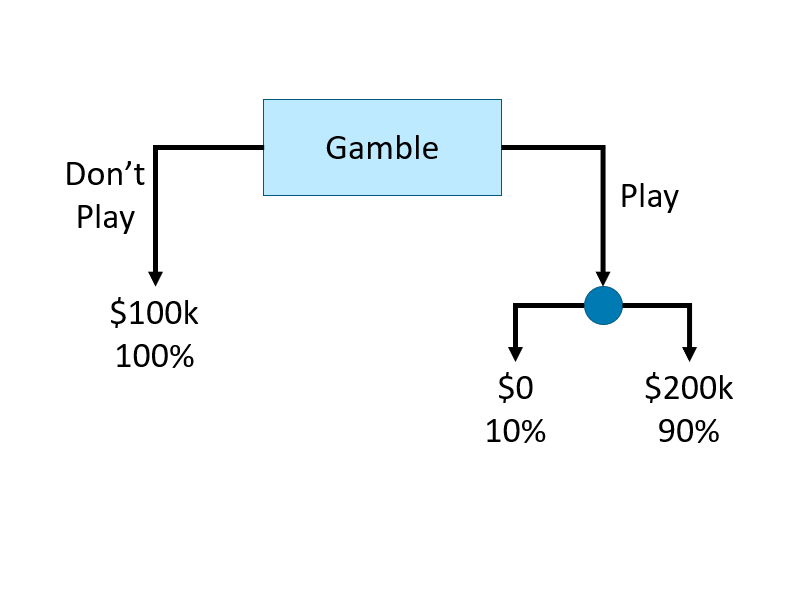
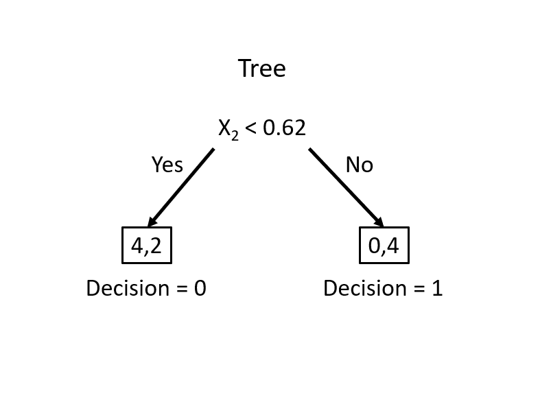
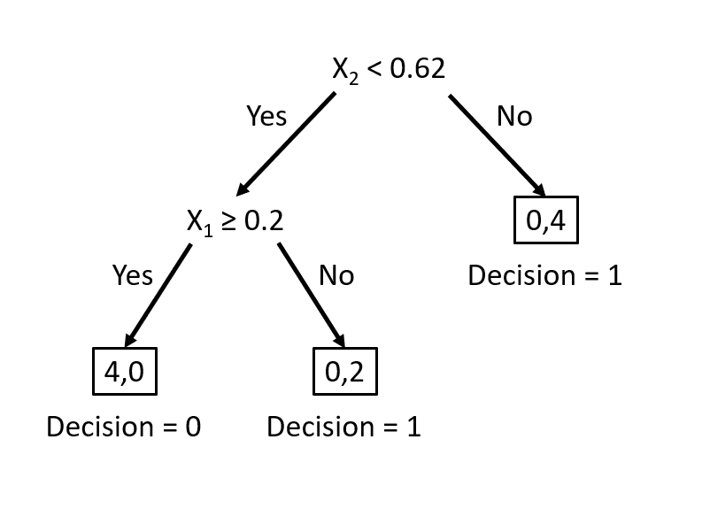

# Classification and Regression Trees (CART)

Classification and Regression Trees (CART) offer a versatile framework for addressing both categorical and continuous target variables within the same methodological approach. By systematically dividing the feature space into increasingly homogeneous subsets, CART models can predict outcomes by learning simple decision rules inferred from the data features. This approach is particularly useful for understanding the relationships between the features and the target, as well as for identifying the most important features for prediction.

For example, an economist studying poverty could use CART to predict household income based on demographic and labor market characteristics, identifying the most critical factors influencing economic mobility. Similarly, a health researcher analyzing disease risk could use CART to determine which patient characteristics (e.g., age, BMI, medical history) best predict the likelihood of developing a condition like diabetes. In social sciences, CART can help classify voting behavior of individuals based on socioeconomic and ideological variables.

Single decision trees serve as the foundation for more advanced tree-based models, including random forests and gradient boosting machines, but they are also effective as standalone models for classification and regression tasks. In this chapter, we will cover the key concepts of classification trees, including impurity measures, recursive partitioning, and variable importance. We will also implement a simple recursive partitioning algorithm to construct a decision tree from scratch and demonstrate how to train a tree model using the rpart package in R.

This discussion naturally follows the previous chapter on shrinkage estimators such as Lasso and Ridge, which are designed for variable selection and regularization. While those methods impose constraints to shrink coefficient estimates toward zero, decision trees take a different approach by iteratively splitting the data to form distinct prediction rules. Unlike linear models, tree-based methods handle complex, non-linear relationships without requiring transformations, making them particularly useful when the underlying relationship between variables and the outcome is unknown or highly interactive.
  
Decision trees form the foundation of tree-based models. A decision tree is essentially a flowchart where:

- Each **internal node** represents a decision point based on variable values.
- Each **branch** represents the possible outcomes of that decision.
- Each **leaf node** at the end of a branch represents the final predicted outcome. 

Here is an example of a simple decision tree illustrating a gambling situation:

```{r tr1, echo=FALSE, out.width = '70%', out.height='70%',fig.cap="Example of a simple decision tree"}

```  

This decision tree consists of internal nodes, branches, and leaf nodes to represent a gambling decision. The root internal node (labeled "Gamble") is the starting point, where the decision to "play" or "do not play" creates two branches. The left branch leads directly to a leaf node ("\$100k, 100%"), representing a guaranteed outcome. The right branch ("Play") leads to another internal node, where the outcome is uncertain. This second decision splits into two leaf nodes, representing a 10% chance of \$0 and a 90% chance of \$200k. The structure visually maps the decision process, showing how different choices lead to distinct final outcomes.

Let’s illustrate how a decision tree classifies observations by recursively splitting the data to maximize homogeneity and minimize misclassification with a simple classification problem.

**Intuition: Classification Trees**  

We begin with a dataset containing two variables, \( x_1 \) and \( x_2 \), used to classify observations into two categories: circle (0) and red triangle (1).  

```{r tr2cl, message = FALSE, warning=FALSE}
y <- c(1,1,1,0,0,0,1,1,0,1)
x1 <- c(0.09, 0.11, 0.17, 0.23, 0.33, 0.5, 0.54, 0.62, 0.83, 0.88)
x2 <- c(0.5, 0.82, 0.2, 0.09, 0.58, 0.5, 0.93, 0.8, 0.3, 0.83)
data <- data.frame(y = y, x1 = x1, x2 = x2)

# Set shape and color
pch_vals <- ifelse(data$y == 1, 17, 16)             # 17 = triangle, 16 = circle
col_vals <- ifelse(data$y == 1, "red", "black")

plot(data$x1, data$x2,
     col = col_vals, pch = pch_vals, lwd = 2,
     ylab = "x2", xlab = "x1")
```


Our goal is to find the best decision rule on $x_2$ to correctly classify circle (0) and triangle (1). Specifically, we want to find a cutoff point on $x_2$ such that the maximum number of observations is correctly classified.  
  
To minimize misclassification, we determine that the optimal cutoff point/split should be between 0.6 and 0.79. Thus, our rule becomes $x_2 < k$, where $k \in [0.6, 0.79]$.

```{r tr3, warning=FALSE, message=FALSE}
pch_vals <- ifelse(data$y == 1, 17, 16)
col_vals <- ifelse(data$y == 1, "red", "black")

plot(data$x1, data$x2,
     col = col_vals, pch = pch_vals, lwd = 2,
     ylab = "x2", xlab = "x1")
abline(h = 0.62, col = "blue", lty = 5, lwd = 2)
```

```{r, echo=FALSE, out.width = '70%', out.height='70%'}

```  

This simple rule results in two misclassified balls. We can improve our classification by adding a new rule in the area below the horizontal blue line:

```{r tr4, warning=FALSE, message=FALSE}
pch_vals <- ifelse(data$y == 1, 17, 16)
col_vals <- ifelse(data$y == 1, "red", "black")

plot(data$x1, data$x2,
     col = col_vals, pch = pch_vals, lwd = 2,
     ylab = "x2", xlab = "x1")
abline(h = 0.62, v = 0.2, col = c("blue", "darkgreen"), lty = 5, lwd = 2)
```
  
```{r tr5, echo=FALSE, out.width = '70%', out.height='70%'}

```      

This manual classification process follows the same logic as a decision tree algorithm. The first split at \( x_2 = 0.62 \) represents an internal node, dividing the data into two branches. The additional split on \( x_1 \) creates a further partition, leading to the final leaf nodes that assign class labels. Instead of manually choosing splits, a decision tree learning algorithm automates this process, systematically selecting the best split at each step based on measures such as impurity reduction.  

Now, let’s explore how to formalize this procedure into an algorithmic approach. We will cover the key concepts of decision trees, including impurity measures, recursive partitioning, and variable importance. We will also implement a simple recursive partitioning algorithm to construct a decision tree from scratch, then discuss formal step by step algorithm, and then demonstrate how to train a classification tree model using the rpart package in R.

## Basic Concepts 

Let's use a simple example given by [freakonometrics](https://freakonometrics.hypotheses.org/52776), which uses a dataset (from Gilbert Saporta) that reports about heart attacks and decease (our binary outcome thus classification) in an ER.

```{r cr0, echo=FALSE, out.width="70%", fig.align="center"}

```

```{r cr1, echo=TRUE}
# Data
myocarde = read.table("http://freakonometrics.free.fr/myocarde.csv",
                      head = TRUE, sep = ";")
str(myocarde)
```
Recode the binary variable `DECEASE` to 1/0 a

```{r cr2, echo=TRUE}
df <- myocarde[ ,-ncol(myocarde)]
df$y <- ifelse(myocarde$PRONO == "SURVIE", 1, 0)
```

### Gini index - Impurity measure 

Calculate the Gini index for $y$

```{r cr3, echo=TRUE}
G <- 2 * mean(df$y) * (1 - mean(df$y))
G
```

There are several impurity measures, such as Gini impurity, entropy, and classification error. The Gini impurity is used in the CART algorithm to evaluate the quality of a split. It measures the probability of misclassifying a randomly chosen element if it were randomly labeled according to the distribution of labels in the node. The Gini impurity is defined as:

\begin{equation}
\operatorname{Gini}(D)=1-\sum_{i=1}^C p_i^2
\end{equation}

where $D$ is the dataset, $C$ is the number of classes, and \( p_i \) is the class \( i \) probability, calculated as \( p_i = \frac{n_i}{N} \), where \( n_i \) is the class count and \( N \) is the total observations. The Gini impurity is minimized when the classes are perfectly mixed, and it is maximized when the classes are perfectly separated.

In a binary classification problem, where there are only two classes (let's call them class 1 and class 2), the formula simplifies to:

\begin{equation}
\operatorname{Gini}(D)=1-\left(p_1^2+p_2^2\right) = 2 p(1-p)
\end{equation}
  
where $p$ is the probability of class 1 in the dataset. The Gini impurity ranges from 0 (perfectly pure) to 0.5 (maximally impure).
  
- If all examples are from one class (say all are class 1 ), then $p_1=1$ and $p_2=0$, leading to $\operatorname{Gini}(D)=1-\left(1^2+0^2\right)=0$, indicating perfect purity. 
- If the examples are evenly split between the two classes, then $p_1=0.5$ and $p_2=0.5$ , leading to $\operatorname{Gini}(D)=1-\left(0.5^2+0.5^2\right)=0.5$, indicating maximum impurity.  

As a side note, for categorical classification with \( C \) classes, Gini impurity is \( 1 - \sum p_i^2 \), where \( p_i \) is the proportion of each class. It reaches 0 when all observations belong to one class and is highest when classes are evenly distributed, e.g., \( \frac{2}{3} \) for three equal classes.

### Finding the split

We need to find the variable that gives the highest Gini gain, which measures the improvement in purity after a split. The Gini gain is calculated as:

\begin{equation}
\text{Gini Gain} = G - (p_L G_L + p_R G_R)
\end{equation}

where \( G \) is the Gini impurity before the split, \( G_L \) and \( G_R \) are the Gini impurities of the left and right splits, \( p_L \) and \( p_R \) are the proportions of observations in the left and right splits.

Now, let's consider the variable `FRCAR` and split the data into two groups: $FRCAR \leq 90$ and $FRCAR > 90$. We can calculate the Gini index for each group.

```{r cr4, echo=TRUE}
y = df$y
x = df$FRCAR
GL <- 2 * mean(y[x <= 90]) * (1 - mean(y[x <= 90]))
GR <- 2 * mean(y[x > 90]) * (1 - mean(y[x > 90]))
GL
GR
```

The overall Gini index for the split is the weighted average of the Gini index for each group.  let's calculate the gain (reduction in impurity) after the split.

```{r cr5, echo=TRUE}
pL <- sum(x <= 90) / length(x)
pR <- sum(x > 90) / length(x)
delta <- G - (pL * GL + pR * GR)
delta
```

### Can we find a better split?

Instead of choosing a fixed threshold, we check all possible splits for the variable `FRCAR` and calculate the Gini gain,delta, for each split.

```{r cr6, echo=TRUE}
# let's have a function for different splits
GI <- function(y, x, sp){
  G <- 2 * mean(y) * (1 - mean(y))
  GL <- 2 * mean(y[x <= sp]) * (1 - mean(y[x <= sp]))
  GR <- 2 * mean(y[x > sp]) * (1 - mean(y[x > sp]))
  pL <- length(x[x <= sp]) / length(x)
  pR <- length(x[x > sp]) / length(x) 
  delta <- G - (pL * GL + pR * GR)
 return(delta)
}
```

Now, we apply this function to all unique values of `FRCAR` and calculate the Gini gain for each split, and then to find the best split:

```{r cr7, echo=TRUE}
# let's consider all possible splits
splits <- sort(unique(df$FRCAR))

# let's calculate the gain for each split
delta <- c()
for (i in 1:(length(splits) - 1)) {
  delta[i] <- GI(df$y, df$FRCAR, splits[i])
}

delta
splits[which.max(delta)]
```

```{r}
plot(splits[-length(splits)], delta, type = "l", 
     xlab = "Split", ylab = "Gain",
     main = "Gain for different splits",
     col = "green", lwd = 2)
abline(v = splits[which.max(delta)], col = "red")
text(x = 70, y = 0.015, labels = paste("Gain =", round(max(delta), 4), 
                  "\nSplit =", splits[which.max(delta)]), pos = 4, col = "red")
```

We visualize the gain for different split points.

### Function to find the important variables and gains
We repeat this process for all variables and determine the one with the highest gain:
```{r cr8, echo=TRUE}
# let's have a function to find the variable that the largest delta (gain)
best.split <- function(x, y){
  splits <- sort(unique(x))
  delta <- c()
  for (i in 1:(length(splits) - 1)) {
    delta[i] <- GI(y, x, splits[i])
  }
  return(c(max(delta), splits[which.max(delta)]))
}

# apply the function to each variable
gains <- apply(df[, -ncol(df)], 2, function(x) best.split(x, df$y))
gains

# horizontal barplot
barplot(sort(gains[1, ]), horiz = TRUE, 
        col = "lightblue", las = 1,
        main = "Gains", xlab = "Gains")
```

### The Second Split

Our first split tells us that the best feature to split on is `INSYS` and the best split value is 86. We can now split the dataset based on this feature and value.


```{r cr9, echo=TRUE}
# Identify the feature for the first best split
best_feature <- names(which.max(gains[1, ]))
best_split_value <- gains[2, which.max(gains[1, ])]

# Now, split the dataset based on the best feature and best split value
left_subset <- df[df[, best_feature] <= best_split_value, ]
right_subset <- df[df[, best_feature] > best_split_value, ]
head(left_subset)
head(right_subset)
```

Now we have two datasets, `left_subset` and `right_subset`. We can apply the `best.split` function to each subset to find the next best split.

```{r cr10, echo=TRUE}
# Y's
table(left_subset$y)
table(right_subset$y)
```

```{r cr10a, echo=TRUE}
# Apply to each subset
gains_left <- apply(left_subset[, -ncol(left_subset)], 2, 
                    function(x) best.split(x, left_subset$y))
gains_right <- apply(right_subset[, -ncol(right_subset)], 2, 
                     function(x) best.split(x, right_subset$y))
gains_left
gains_right
```
  
Are we going to split on the left or right subset? We can use the same approach to decide which subset to split next.

```{r cr11, echo=TRUE}
max(gains_left[1, ])
max(gains_right[1, ])
```

Seems like we need to split on the right subset. Let's find the best feature and split value.

```{r cr12, echo=TRUE}
# Identify the feature for the first best split
best_feature_right <- names(which.max(gains_right[1, ]))
best_split_value_right <- gains_right[2, which.max(gains_right[1, ])]
best_feature_right
best_split_value_right
```

Now, we can again split the dataset based on the best feature and best split value, but ...

```{r}
left_subset_right <- right_subset[
  right_subset[, best_feature_right] <= best_split_value_right, 
]
right_subset_right <- right_subset[
  right_subset[, best_feature_right] > best_split_value_right, 
]
head(left_subset_right)
head(right_subset_right)

table(left_subset_right$y)
table(right_subset_right$y)
```

We can continue this process until we reach a stopping criterion, such as a minimum number of samples in each node, a maximum depth, or a minimum gain.  But, up to this point, we have a good understanding of the recursive partitioning, the core idea behind decision trees.  Nevertheless, we did not train a tree model.  We will use the `rpart` package to train the tree, later.

### Variable Importance - Easy and heuristic way

We can use the Gini index to calculate the importance of each variable.

```{r cr13, echo=TRUE}
# let's calculate the importance of each variable

importance <- c()
for (i in 1:(ncol(df) - 1)) {
  importance[i] <- GI(df$y, df[, i], median(df[, i]))
}

sdimp <- importance/sum(importance)
names(sdimp) <- names(df)[1:ncol(df) - 1]
barplot(sort(sdimp), horiz = TRUE, 
        col = "lightblue", las = 1,
        main = "Variable Importance", xlab = "Importance")
```

It is important to note that while using the median is a practical and efficient heuristic, it might not always result in the most optimal split, especially for variables with unique distributions or in cases where the relationship between the variable and the target is complex. In more sophisticated decision tree algorithms (like those implemented in machine learning packages), multiple potential split points are evaluated to find the one that maximizes the gain (e.g., information gain, Gini impurity decrease) rather than relying solely on the median.
can we write this

### Recursive partitioning - The tree model

Recursive functions are a fundamental concept in programming, where a function calls itself to solve a problem by breaking it down into smaller, more manageable sub-problems. This technique is widely used in various applications, including tree structures, sorting algorithms, and solving mathematical problems.

Here is a very simple example to illustrate recursion: calculating the factorial of a number. The factorial of a number `n` (denoted as `n!`) is the product of all positive integers less than or equal to `n`. By definition, `0!` is `1`.

The factorial can be expressed recursively as:

`n! = n * (n-1)!` for `n > 0`. 
`1` if `n = 0`. 
  
Here is how you can implement this in R:

```{r}
factorial <- function(n) {
  if (n == 0) {
    return(1)
  } else {
    return(n * factorial(n - 1))
  }
}
print(factorial(5))
```

The factorial example illustrates recursion, a key concept in building decision trees. Decision trees use recursion by repeatedly splitting the data into smaller subsets until a stopping criterion is met. Just as the factorial function calls itself to compute smaller subproblems, a decision tree algorithm recursively partitions the data, refining the model step by step. Now, we apply this idea to construct a decision tree. Using the same dataset and Gini impurity measure, we will build a tree by recursively finding the best split at each node. We will also introduce a complexity parameter to control tree depth.  

```{r cr14, echo=TRUE}
X <- df[, -ncol(df)]
y <- df$y

GI <- function(y, x, sp){
  G <- 2 * mean(y) * (1 - mean(y))
  GL <- 2 * mean(y[x <= sp]) * (1 - mean(y[x <= sp]))
  GR <- 2 * mean(y[x > sp]) * (1 - mean(y[x > sp]))
  pL <- length(x[x <= sp]) / length(x)
  pR <- length(x[x > sp]) / length(x) 
  delta <- G - (pL * GL + pR * GR)
  return(delta)
}
  
best.split <- function(x, y, cp) {
  splits <- sort(unique(x))
  delta <- numeric(length(splits) - 1)
  for (i in 1:(length(splits) - 1)) {
    delta[i] <- GI(y, x, splits[i])
  }
  if (length(delta) == 0 || max(delta) < cp) {
    return(list(gain = 0, split_point = NA)) # No valid split
  }
  max_gain <- max(delta)
  split_point <- splits[which.max(delta)]
  return(list(gain = max_gain, split_point = split_point))
}

recursive_split <- function(X, y, cp, depth = 0, maxDepth = 10) {
  if (ncol(X) == 0 || length(unique(y)) <= 1 || depth >= maxDepth) {
    most_common_class <- names(sort(table(y), decreasing = TRUE))[1]
    return(list("Leaf", most_common_class))
  }
  
  gains <- sapply(1:ncol(X), function(i) best.split(X[, i], y, cp)$gain)
  if (all(is.na(gains))) {
    most_common_class <- names(sort(table(y), decreasing = TRUE))[1]
    return(list("Leaf", most_common_class))
  }
  best_feature_idx <- which.max(gains)
  best_feature <- names(X)[best_feature_idx]
  best_split_value <- best.split(X[, best_feature_idx], y, cp)$split_point
  
  print(paste("Depth:", depth, "Best Feature:", best_feature, "Gain:",
              gains[best_feature_idx]))

  if (is.na(best_split_value) || gains[best_feature_idx] < cp) {
    most_common_class <- names(sort(table(y), decreasing = TRUE))[1]
    return(list("Leaf", most_common_class))
  }
  
  left_idx <- X[, best_feature_idx] <= best_split_value
  right_idx <- X[, best_feature_idx] > best_split_value
  left_X <- X[left_idx, ]
  right_X <- X[right_idx, ]
  left_y <- y[left_idx]
  right_y <- y[right_idx]
  
left_tree <- if (sum(left_idx) > 0) 
  recursive_split(left_X, left_y, cp, depth + 1, maxDepth) 
else 
  list("Leaf", names(sort(table(left_y), decreasing = TRUE))[1])

right_tree <- if (sum(right_idx) > 0) 
  recursive_split(right_X, right_y, cp, depth + 1, maxDepth) 
else 
  list("Leaf", names(sort(table(right_y), decreasing = TRUE))[1])

return(list(
  "Node" = list("Split" = best_split_value, "Feature" = best_feature),
  "Left" = left_tree,
  "Right" = right_tree
))
}

cp <- 0.01  # Example complexity parameter
tree <- recursive_split(X, y, cp)
```

And, let's print the tree structure.

```{r cr15, echo=TRUE}
# Function to print the tree structure
print_tree <- function(node, depth=0) {
  if (is.null(node)) {
    return()
  }
  
  # Indent to represent the depth
  indent <- paste(rep("  ", depth), collapse = "")
  
  if (!is.null(node$Leaf)) {
    cat(indent, "Leaf:", node$Leaf, "\n")
  } else {
    cat(indent, "Node: If", node$Node$Feature, "<=", node$Node$Split, "\n")
    cat(indent, "Left:\n")
    print_tree(node$Left, depth + 1)
    cat(indent, "Right:\n")
    print_tree(node$Right, depth + 1)
  }
}

print_tree(tree)
```

Obviously this is not a "trained" tree! We have manually built a decision tree by recursively splitting the dataset based on the best variable at each step. However, this approach is inefficient for large datasets, as it requires manually selecting splits and handling stopping criteria. 

Decision trees rely on recursive partitioning to create splits that improve classification accuracy. However, uncontrolled tree growth can lead to overfitting, where the model captures noise rather than patterns. To address this, we use pruning, which removes unnecessary splits and simplifies the tree while maintaining predictive performance. Instead of continuing with a custom implementation, we will now use the `rpart` package, which automates tree construction efficiently. 


## Step-by-Step Tree Construction for Binary Classification 

In this section, we will outline the key steps involved in constructing a decision tree for binary classification using the Gini Index as a measure of impurity. Starting from defining the problem and calculating impurity, we will explain how to choose optimal split points, perform recursive partitioning, and prune the tree to prevent overfitting. Finally, we will discuss how to make predictions for new observations based on the majority class rule within each terminal node.

**1. Setup: Define the Problem and Data**

For binary classification, the outcome \( Y \) has two possible classes, which we can denote as Class 0 and Class 1. We have a total of \( N \) observations with predictors \( X_1, X_2, \dots, X_p \). The objective is to construct a decision tree that maximizes class purity within each leaf, minimizing misclassifications between the two classes.

**2. Define Gini Index for a Node \( t \)**

The Gini Index is used to measure the impurity of a node based on the distribution of the two classes within that node. For binary classification, the Gini Index is simplified to:

\begin{equation}
\text{Gini}(t) = 1 - (p_0^2 + p_1^2)
\end{equation}

where \( p_0 \) is the proportion of observations in Class 0 and \( p_1 \) is the proportion in Class 1 within node \( t \). A Gini Index of 0 indicates perfect purity (all observations belong to one class), while higher values indicate greater impurity. The Gini Index is preferred due to its computational efficiency and its ability to handle imbalanced class distributions.[^Impcon]

[^Impcon]:Other impurity measures include entropy, defined as \( \text{Entropy}(t) = -p_0 \log_2(p_0) - p_1 \log_2(p_1) \), which is more sensitive to class distributions, and misclassification error, defined as \( \text{Error}(t) = 1 - \max(p_0, p_1) \), which directly measures the proportion of misclassified observations.

**3. Define Gini Gain for Splitting**

To decide on the best splits, the Gini Gain is calculated, which measures the reduction in Gini Index achieved by making a split. It is defined as:

\begin{equation}
\Delta \text{Gini} = \text{Gini (parent)} - \frac{N_L}{N} \text{Gini (left)} - \frac{N_R}{N} \text{Gini (right)}
\end{equation}

In this equation, \( N_L \) and \( N_R \) represent the number of observations in the left and right child nodes, respectively, and \( N \) is the number of observations in the parent node. A split with a higher Gini Gain indicates a more effective separation between the two classes, and thus is preferred.[^ALtgain]

[^ALtgain]:Alternative gain measures include information gain based on entropy, defined as \( \Delta \text{Entropy} = \text{Entropy (parent)} - \frac{N_L}{N} \text{Entropy (left)} - \frac{N_R}{N} \text{Entropy (right)} \), and misclassification error reduction, which uses the decrease in misclassification error instead of Gini or entropy.

**4. Choose Optimal Split Point for Each Variable**

For each predictor \( X_j \), the algorithm identifies potential split points by sorting the data and evaluating midpoints between consecutive unique values. If \( X_1 \) is a continuous variable, such as income, the algorithm considers multiple split points across the range to find the one that maximizes the Gini Gain.[^Gini] For an integer variable like \( X_2 \) representing age, which ranges from 16 to 65, the algorithm tests each integer as a split point and selects the one that leads to the maximum Gini gain in the resulting nodes, ensuring the best class separation. For binary predictors like \( X_3 \), which might represent home ownership status (Yes/No), the only split point is between the two categories. In all cases, the algorithm calculates the Gini Gain for each potential split and chooses the point that maximizes this gain. 

[^Gini]:For instance, if income ranges between $5,000$ and $200,000$, the algorithm creates a series of potential split points within this range. The number of intervals is calculated based on unique values in the dataset or by using a predefined maximum number of splits to manage computational cost. Each of these split points is evaluated by calculating the Gini Gain to determine which point provides the most effective separation between classes.

Mathematically, the same Gini gain criterion is calculated at each node one by one for every variable:

\begin{equation}
\Delta \text{Gini} = \text{Gini (parent)} - \frac{N_L}{N} \text{Gini (left)} - \frac{N_R}{N} \text{Gini (right)}
\end{equation}

Then, the optimal split point \( s_j^* \) for each variable \( X_j \) is chosen as:

\begin{equation}
(X_j^*, s_j^*) = \arg\max_{(X_j, s_j)} \Delta \text{Gini}(X_j, s_j)
\end{equation}

This approach ensures that the chosen splits create the most distinct separation between Class 0 and Class 1, making the resulting nodes as pure as possible. By tailoring the split criteria based on the type of predictor—continuous, integer, or binary—the algorithm effectively captures different patterns in the data to improve classification accuracy.

**5. Recursive Partitioning: Split Left and Right Nodes**

Once the optimal split point is determined for a variable which gives the highest gini gain, the data is divided into left and right nodes based on that split. Each of these nodes is then treated as a new parent node for subsequent splits until it reacheds to stopping criteria. Let's provide a detailed explanation of the recursive partitioning process with an example:

Step 1. **Initial Split:**
   - \( X_3 \) is chosen as the first split because it gave the max gini gain.  
   - This creates a left node (e.g., \( X_3 \leq s_3 \)) and a right node (e.g., \( X_3 > s_3 \)).

Step 2. **Recursive Splitting for Left and Right Nodes:**
   - For the left node:  
     - Evaluate \( X_1 \), \( X_2 \), and other variables/features by trying all possible split points.  
     - Choose the variable and split point that gives the max gini gain within the left node.  

   - For the **right node**:  
     - Similarly, evaluate \( X_1 \), \( X_2 \), and other variables with all split points.  
     - Choose the variable and split point that maximizes gini gain for the right node.

The left and right nodes can:
     - Split on different variables (e.g., \( X_1 \) for left and \( X_2 \) for right).  
     - Use different split points for the same variable (evenif used before) if they choose the same one.  

Step 3. **Stopping Criteria:**
   - Splitting continues recursively for left and right nodes until:
     - **Minimum leaf size** is reached. Splitting stops if a node contains fewer than a specified minimum number of observations (e.g., 5 or 10). This prevents overfitting by avoiding splits that result in very small, unreliable leaves.  
     - **Max tree depth** is reached. A pre-defined maximum depth can be set (e.g., 10 levels). Once this depth is reached, no further splits are allowed. This ensures that the tree remains interpretable and avoids becoming too complex. 
     - **Insufficient Gini Gain:** If the maximum possible Gini Gain \( (\Delta \text{Gini}) \) for any potential split falls below a certain threshold (e.g., 0.01), no further splits are made. This criterion prevents the algorithm from making splits that provide negligible improvements in class purity.  

**6. Define Class Predictions for Leaf Nodes**

Once the tree is fully grown, each terminal node, also known as a leaf, represents a subset of the data with a predominant class. To make predictions for new observations, the decision tree uses the most frequent class within the leaf that the observation falls into. This strategy, known as the majority class rule, helps minimize the misclassification rate within each leaf by aligning predictions with the most common outcome among the observations assigned to that leaf.

Mathematically, the predicted class for a leaf \( t \) is determined by selecting the class that has the highest proportion of observations within that leaf. This can be expressed using the following formula:

\begin{equation}
\hat{Y}_t = \arg\max_{j \in \{0, 1\}} p_j
\end{equation}

In this formula, \( j \) represents the possible classes (0 or 1 in the case of binary classification), and \( p_j \) is the proportion of observations in class \( j \) within the leaf \( t \). The notation \( \arg\max \) is used to indicate that the predicted class \( \hat{Y}_t \) will be the one that maximizes \( p_j \), effectively choosing the most frequent class in that leaf.

To illustrate this with a simple example, imagine a leaf with five observations classified into two possible classes, 0 and 1. Suppose the class distribution in this leaf is as follows: three observations belong to class 1, and two belong to class 0. The proportions for each class would then be \( p_0 = \frac{2}{5} = 0.4 \) and \( p_1 = \frac{3}{5} = 0.6 \). According to the majority class rule, the predicted class for this leaf would be 1, as it has a higher proportion than class 0.

The rationale behind this approach is straightforward. By assigning the most frequent class within each leaf, the tree minimizes the chances of making incorrect predictions for new observations that fall into that leaf. For instance, if the tree were to predict class 0 instead of class 1 in the previous example, it would result in a higher misclassification rate since three out of five observations actually belong to class 1. Therefore, predicting the majority class not only simplifies the decision-making process but also ensures that the predictions are as accurate as possible given the information available within each leaf.

This strategy is particularly effective in classification tasks because it leverages the natural partitioning of data created by the tree. As each split is made to maximize class purity by reducing impurity (measured by criteria like Gini Index), the resulting leaves tend to have a dominant class. Thus, predicting the most frequent class aligns with the underlying goal of decision trees: to create clear and interpretable rules that separate different classes based on the available predictors.

**7. Pruning the Tree Using Cost-Complexity**

In decision tree algorithms, the initial tree that is grown is often referred to as a “fully grown” or “maximal” tree. This tree is constructed by recursively partitioning the data until no further splits can significantly reduce impurity or until certain stopping criteria, such as minimum leaf size or maximum depth, are met. While this fully grown tree might fit the training data very well, it is also prone to overfitting. Overfitting occurs when the tree captures noise and details that are specific to the training data but do not generalize well to unseen data. To address this issue, a process called pruning is applied to simplify the tree and improve its ability to generalize to new data.

Pruning involves systematically reducing the size of the fully grown tree by removing branches that have little predictive power. The decision of which branches to remove is guided by a cost-complexity criterion, which balances the trade-off between the fit of the tree to the training data and its complexity. The cost-complexity function is defined as follows:

\begin{equation}
C_{\alpha}(T) = \sum_{t \in T} N_{t} \cdot \text{Gini}(t) + \alpha \cdot |T|
\end{equation}

In this function, \( T \) represents the set of terminal nodes (or leaves), \( N_{t} \) is the number of observations in leaf \( t \), and \( |T| \) is the number of leaves in the tree. The parameter \( \alpha \) is a complexity parameter that controls the penalty for the number of leaves. When \( \alpha \) is set to zero, the penalty term disappears, and the cost-complexity function reduces to a measure of impurity alone, favoring larger trees. As \( \alpha \) increases, the penalty for having more leaves also increases, encouraging a simpler tree with fewer branches.

There are several alternative complexity functions for binary classification in decision trees, each offering a different balance between model complexity and accuracy. One option is the entropy-based cost-complexity function [^entropy], which is more sensitive to class distributions than Gini. Another is the misclassification error-based function [^misclass], which directly minimizes the error rate but is less sensitive to class proportions. For imbalanced datasets, the weighted Gini function [^wgini] helps emphasize the minority class. Similarly, a cost-sensitive complexity function [^cost] accounts for different misclassification costs. Lastly, the penalized likelihood function [^pll] balances fit and complexity based on the likelihood of the model. The mathematical expressions and brief descriptions of each function are provided in the footnotes below. These alternatives make decision trees more adaptable to various classification tasks.

[^entropy]: **Entropy Cost Function** – Measures node impurity based on information entropy; sensitive to class distribution.  
\( C_{\alpha}(T) = \sum_{t \in T} N_{t} \cdot \text{Entropy}(t) + \alpha \cdot |T| \)

[^misclass]: **Misclassification Error Function** – Minimizes the error rate directly by focusing on the most probable class.  
\( C_{\alpha}(T) = \sum_{t \in T} N_{t} \cdot (1 - \max(p_0, p_1)) + \alpha \cdot |T| \)

[^wgini]: **Weighted Gini Function** – Modifies the standard Gini impurity to emphasize minority classes using class weights.  
\( C_{\alpha}(T) = \sum_{t \in T} N_{t} \cdot (1 - w_0 p_0^2 - w_1 p_1^2) + \alpha \cdot |T| \)

[^cost]: **Cost-Sensitive Function** – Incorporates a custom cost matrix to penalize specific types of misclassification.  
\( C_{\alpha}(T) = \sum_{t \in T} N_{t} \cdot \sum_{i, j} C(i, j) \cdot p_i \cdot p_j + \alpha \cdot |T| \)

[^pll]: **Penalized Likelihood Function** – Penalizes complexity while maximizing the likelihood fit of the model.  
\( C_{\alpha}(T) = -\sum_{t \in T} \log(\text{Likelihood}(t)) + \alpha \cdot |T| \)


The pruning process involves incrementally increasing \( \alpha \) and evaluating the cost-complexity function \( C_{\alpha}(T) \) for the resulting trees. For each value of \( \alpha \), branches are removed if doing so results in a lower value of \( C_{\alpha}(T) \). This process produces a sequence of nested trees, each simpler than the previous one. The goal is to identify the optimal tree that minimizes the cost-complexity function, striking a balance between complexity and fit.

Pruning inevitably involves a trade-off. By reducing the number of branches, we simplify the tree, making it more interpretable and less likely to overfit. However, this simplification comes at the cost of losing some fit to the training data. In essence, pruning sacrifices some accuracy on the training set in exchange for better generalization to unseen data. The key is to find the right level of complexity that maximizes performance on new data, which is typically achieved using cross-validation.

To select the optimal value of \( \alpha \), cross-validation is employed first. The training data is divided into several folds, and for each fold, a tree is pruned at different levels of \( \alpha \). The misclassification rate or another performance metric is recorded for each level of \( \alpha \). The optimal \( \alpha^* \) is chosen as the one that minimizes the cross-validation error:

\begin{equation}
\alpha^* = \arg\min_{\alpha} \text{CV Error}(\alpha)
\end{equation}

The tree corresponding to \( \alpha^* \) is then selected as the final pruned tree. This tree represents a compromise between complexity and fit, offering better generalization performance while retaining interpretability. In this way, pruning not only simplifies the model but also improves its predictive accuracy on new data by preventing overfitting.

**8. Cross-Validation to Select Optimal Tree Size**

Cross-validation is used to select the optimal complexity parameter \( \alpha^* \) that minimizes the classification error on unseen data (overfitting) by pruning the tree. The training data is divided into \( K \) folds. For each fold, a tree is trained on \( K-1 \) folds and validated on the remaining fold. The cross-validation error is calculated as:

\begin{equation}
\text{CV Error}(\alpha) = \frac{1}{K} \sum_{k=1}^{K} \text{Misclassification Rate (Validation Set \( k \) for Tree with \( \alpha \))}
\end{equation}

The optimal \( \alpha^* \) is chosen as the value that minimizes the cross-validation error:

\begin{equation}
\alpha^* = \arg\min_{\alpha} \text{CV Error}(\alpha)
\end{equation}

Selecting \( \alpha^* \) based on cross-validation ensures that the tree has the right balance between complexity and predictive accuracy.

**9. Variable Importance in Decision Trees**

After constructing and pruning the tree, it is often useful to assess the importance of each predictor variable in making accurate predictions. Variable importance measures how much each predictor contributes to reducing impurity across all splits in the tree, helping to identify which variables have the most influence on the classification outcome.

The importance of a variable \( X_j \) is determined by the total reduction in Gini index resulting from splits using \( X_j \). Specifically, at each split where \( X_j \) is used, the reduction in Gini is calculated based on the difference between the Gini index of the parent node and the weighted Gini indices of the child nodes. The importance score for \( X_j \) is then obtained by summing these Gini reductions across all nodes where \( X_j \) was used for splitting.

In practice, the Gini index is calculated for each node using the observed distribution of classes within that node. For instance, if a node contains 60 observations from Class 0 and 40 from Class 1, the Gini index for that node would be computed based on these proportions. As the tree grows, each split ideally leads to child nodes with lower Gini indices, indicating greater class purity. The reductions in Gini index caused by splits using a particular variable accumulate to form the importance score for that variable.

Additionally, permutation importance can be used as an alternative method. This involves randomly shuffling the values of \( X_j \) across observations while keeping other variables unchanged, and then measuring the drop in predictive accuracy. A substantial decrease in accuracy suggests that the variable is important for making predictions.

By identifying the most influential variables, this step improves the interpretability of the tree and helps in understanding which predictors have the most significant impact on the model’s decisions.

**10. Final Prediction for New Observations**

To predict the class of a new observation, the pruned tree is traversed starting from the root node. The observation is assigned to a leaf node based on its predictor values, following the sequence of splits defined by the tree. The predicted class for the observation is the majority class within the assigned leaf. This method ensures that the prediction reflects the most common outcome among similar past observations, providing a clear and interpretable decision rule.

To illustrate this, consider a decision tree used to predict whether a customer will default on a loan based on their income, age, and home ownership status. After pruning, the data of a new applicant is input into the tree. Starting at the root, income of the applicant, treated as a continuous variable, is compared against a series of split points to determine which path to follow. Next, the age of applicant, an integer variable ranging from 16 to 65, is evaluated to decide the subsequent branch. Finally, the binary predictor of home ownership status (Yes/No) is used to direct the applicant further down the tree. Eventually, the applicant reaches a leaf node that contains previous applicants with similar characteristics. Suppose this leaf has 70% of observations in the “No Default” class and 30% in the “Default” class. According to the majority class rule, the predicted outcome for this applicant would be “No Default.” This approach ensures that the prediction reflects the most common outcome among past similar cases, making the decision both interpretable and based on historical patterns.


## Classification Decision Trees with `rpart`

The `rpart` package automates the tree-building process by determining the optimal depth, minimum observations required for splits, and minimum size for leaf nodes. There are two ways to control this:  
1. Setting control parameters in `rpart` to constrain tree growth.  
2. Growing a deep tree and pruning it using cross-validation to find the best tree size.  

Pruning simplifies a tree by removing splits that add little to predictive accuracy, preventing overfitting. Now, we train a decision tree using `rpart` and apply pruning to improve its performance. Here are the control parameters for the `rpart` package:

- `cp`: Complexity parameter. A split will only be made if the improvement in the model (i.e. increase in the overall goodness of split) is larger than `cp`.
- `minsplit`: the minimum number of observations required in a node to allow splitting.
- `minbucket`: the minimum number of observations in any terminal <leaf> node. If only one of `minbucket` or `minsplit` is specified, the code either sets `minsplit` to `minbucket*3` or `minbucket` to `minsplit/3`, as appropriate.
- `maxdepth`: Maximum tree depth. If `maxdepth` is not `NULL`, the tree is limited to `maxdepth` splits from the root.

The `rpart` function has many other parameters that control the tree-building process. You can find more details in the documentation by running `?rpart.control` in the R console.

Here are the default values for the control parameters:

`rpart.control(minsplit = 20, minbucket = round(minsplit/3), cp = 0.01,` 
              `maxcompete = 4, maxsurrogate = 5, usesurrogate = 2, xval = 10,`
              `surrogatestyle = 0, maxdepth = 30, ...)`

Let's train a decision tree using the `rpart` package and visualize the tree structure.
```{r cr16, echo=TRUE}
library(rpart)

# Train the tree

tree_model <- rpart(PRONO ~ ., data = myocarde)
print(tree_model)
printcp(tree_model)

# Plot the tree
library(rpart.plot) # You can use plot() but prp() is much better
prp(
  tree_model,
  type = 2,
  extra = 1,
  split.col = "red",
  split.border.col = "blue",
  box.col = "pink"
)
```

Why `rpart` chose `REPUL` in the second split, while our algorithm picked `PVENT`?  

### Pruning the Tree

To prevent overfitting, we first grow the tree fully by setting `cp = 0` and then prune it using cross-validation to find the optimal tree size. The `printcp` function displays the complexity parameter table, which shows the cross-validated error rate for different tree sizes. We can then prune the tree using the optimal complexity parameter.

```{r cr16a, echo=TRUE}
# Grow the tree to the maximum depth
tree_model <- rpart(PRONO ~ ., data = myocarde,
                    control = rpart.control(minsplit = 2,
                                            minbucket = 1,
                                            cp = 0
                                            )
                    )

# Let's see the tree
library(rpart.plot) # You can use plot() but prp() is much better
prp(
  tree_model,
  type = 2,
  extra = 1,
  split.col = "red",
  split.border.col = "blue",
  box.col = "pink"
)
```

Now we are going to prune it.  But now, instead of manually selecting the optimal depth, we use rpart's built-in cross-validation:

```{r cr16b, echo=TRUE}
printcp(tree_model)
min_cp = tree_model$cptable[which.min(tree_model$cptable[,"xerror"]),"CP"]
min_cp
```

Now, we prune the tree using the best `cp` value:

```{r cr16c, echo=TRUE}
pruned_tree_model <- prune(tree_model, cp = min_cp)
printcp(pruned_tree_model)
prp(
  pruned_tree_model,
  type = 2,
  extra = 1,
  split.col = "red",
  split.border.col = "blue",
  box.col = "pink"
)
```

Next, we extend this to regression trees to predict continuous outcomes.

## Regression Trees

In this section, we will outline the key steps involved in constructing a decision tree for regression using mean-squared error (MSE) as a measure of impurity. The process is similar to that of classification trees, with MSE replacing the Gini index to guide splits and pruning. We will explain how the tree is built, how splits are chosen to minimize MSE, and how pruning is performed to prevent overfitting. Additionally, we will discuss variable importance and the prediction process for new observations. In the section on the `rpart` package, we will cover the default values for these parameters and how to modify them.

**1. Setup: Define the Problem and Data**

In regression trees, the outcome \( Y \) is continuous rather than binary, with the objective being to minimize the mean-squared error within each node. We have \( N \) observations with predictors \( X_1, X_2, \dots, X_p \). The tree is constructed by iteratively splitting the data to minimize MSE, aiming to create terminal nodes that are as pure as possible in terms of outcome values.

**2. Define MSE for a Node \( t \)**

The impurity of a node in regression trees is measured using MSE, which is equivalent to the sum of squared errors divided by the number of observations in the node. For a given node \( t \), MSE is defined as:

\begin{equation}
\text{MSE}(t) = \frac{1}{N_t} \sum_{i \in t} (Y_i - \bar{Y}_t)^2
\end{equation}
where \( N_t \) is the number of observations in node \( t \) and \( \bar{Y}_t \) is the mean outcome for those observations. Lower MSE indicates greater purity in terms of outcome values, making it an effective criterion for guiding splits.

**3. Define MSE Reduction for Splitting**

To choose the best split at each node, the tree evaluates the reduction in MSE that would result from potential splits. For a parent node \( t \) split into left and right child nodes, MSE reduction is calculated as:

\begin{equation}
\Delta \text{MSE} = \text{MSE (parent)} - \frac{N_L}{N_t} \text{MSE (left child)} - \frac{N_R}{N_t} \text{MSE (right child)}
\end{equation}
where \( N_L \) and \( N_R \) are the numbers of observations in the left and right child nodes, respectively. The split that maximizes \( \Delta \text{MSE} \) is chosen, as this indicates the greatest improvement in node purity.

**4. Choose Optimal Split Point for Each Variable**

The procedure for selecting split points in regression trees is similar to that used in classification trees, but instead of Gini index, the algorithm uses mean-squared error (MSE) as the criterion for measuring impurity. For continuous variables, the algorithm tests multiple potential split points across the range of values, typically using midpoints between consecutive unique values, and evaluates each based on MSE reduction. For integer variables, each integer value is considered as a potential split point, and for binary variables, the split point is simply between the two categories. The split that results in the greatest reduction in MSE is chosen as the optimal split point. This process is repeated for all variables one by one to determine the best split at for each one.

**5. Recursive Partitioning: Split Left and Right Nodes**

In Step 4, the algorithm evaluates potential split points for each variable and chooses the one that provides the greatest MSE reduction. Once an optimal split point for the specific variable is determined, the data is divided into left and right child nodes. The algorithm then recursively repeats the splitting process for each child node (left and right separately), evaluating potential splits for all variables to maximize MSE reduction at each level of the tree. It then selects the best variable and split point for the left node, performs a similar process for the right node, and chooses the best option there as well. These "best" variables and split points can be different for the left and right nodes. This recursive partitioning continues until one of the stopping criteria is met: a minimum leaf size, maximum tree depth, or insufficient MSE reduction. These stopping criteria can be adjusted based on the desired complexity and interpretability of the tree. In the **rpart** section, we will discuss the default settings for these parameters and how they can be modified.

**6. Define Leaf Predictions for Regression**

In regression trees, the predicted outcome for each terminal node is simply the mean of the observed outcomes in that node:

\begin{equation}
\hat{Y}_t = \bar{Y}_t = \frac{1}{N_t} \sum_{i \in t} Y_i
\end{equation}

This approach minimizes the MSE within each node and ensures that predictions are representative of the observed data.

**7. Pruning the Tree Using Cost-Complexity**

To prevent overfitting, the fully grown tree is pruned based on a cost-complexity function similar to the one used in classification trees, but with MSE replacing the Gini index:

\begin{equation}
C_{\alpha}(T) = \sum_{t \in T} N_t \cdot \text{MSE}(t) + \alpha \cdot |T|
\end{equation}

Here, \( \alpha \) is a complexity parameter that penalizes larger trees. As \( \alpha \) increases, the penalty for having more leaves becomes greater, encouraging simpler trees. This method balances model fit and complexity to improve the generalization to new data.

**8. Cross-Validation to Select Optimal Tree Size**

Cross-validation is used to select the optimal value of \( \alpha \) that minimizes prediction error on unseen data. The process involves splitting the data into \( K \) folds, training the tree on \( K-1 \) folds, and validating it on the remaining fold. For each value of \( \alpha \), the cross-validation error is calculated as the average MSE across all folds:

\begin{equation}
\alpha^* = \arg\min_{\alpha} \text{CV Error}(\alpha)
\end{equation}

This ensures that the tree is neither too complex nor too simple, achieving a balance between fit and interpretability.

**9. Variable Importance in Regression Trees**

Variable importance is assessed based on the total MSE reduction attributable to each predictor across all splits. For each variable \( X_j \), the importance score is computed by summing the MSE reductions at every node where \( X_j \) was used for splitting. Higher scores indicate greater importance in predicting outcomes. Specifically, for a variable \( X_j \), the importance score is computed as:

\begin{align}
\text{Importance}(X_j) 
&= \sum_{\text{all splits on } X_j} \Delta \text{MSE} \notag \\
&= \sum_{\text{all splits on } X_j} \left[\text{MSE(parent)} 
- \frac{N_L}{N} \text{MSE(left)} 
- \frac{N_R}{N} \text{MSE(right)}\right]
\end{align}
where \( N_L \) and \( N_R \) are the number of observations in the left and right child nodes, respectively. This approach helps identify which predictors have the most significant impact on the model's predictions.

Alternatively, permutation importance can be used, which measures the drop in predictive accuracy when a variable's values are randomly shuffled. Permutation importance is calculated by randomly shuffling the values of a variable \( X_j \) across observations while keeping all other variables unchanged. The model’s predictive accuracy is then measured on a validation set. The importance score is the difference between the original accuracy and the accuracy after shuffling \(\text{Importance}(X_j) = \text{MSE(shuffled)} - \text{MSE(original)}\). A larger drop in accuracy indicates a more influential variable. Both methods help identify the most influential predictors in the model.

**10. Final Prediction for New Observations**

To predict outcomes for new observations, the pruned tree is traversed based on the values of the predictors. Each observation is assigned to a terminal node, and the predicted outcome is the mean of observed outcomes in that node. This approach ensures that predictions are interpretable and grounded in the observed data, similar to the majority class rule used in classification trees but adapted for continuous outcomes.

## Building and Interpreting Regression Trees with `rpart`: A Step-by-Step Guide

In this section, we build a regression tree using the `rpart` package in R, focusing on the `Boston` dataset from the `MASS` package. The process is divided into six steps: setting up and loading data, building the initial tree, selecting optimal complexity through cross-validation, pruning and visualizing the tree, making predictions and evaluating performance, and interpreting the results. This approach balances detail and simplicity, ensuring clarity while covering all key aspects.

**Step 1: Setup and Load Data**

To begin, we install and load the necessary packages—`MASS` for the dataset, `rpart` for building the tree, and `rpart.plot` for visualization. After loading the `Boston` dataset, which includes 506 observations and 14 variables, we examine its structure using basic summary functions. The outcome variable is `medv` (median house value), with other predictors such as `crim` (crime rate), `rm` (average rooms per dwelling), and `nox` (nitric oxides concentration). This setup helps us understand the characteristics of the data before constructing the tree.

```{r cr17, echo=TRUE}
library(MASS)
library(rpart)
library(rpart.plot)

data("Boston")
head(Boston)  
#summary(Boston)
```
**Step 2: Build the Initial Tree**

When building a regression tree, we need to decide on certain control parameters that influence the growth and complexity of the tree. These parameters determine when to stop splitting nodes, how deep the tree can grow, and how complex the final model will be. By specifying `method = "anova"` in the `rpart` function, we use mean-squared error (MSE) as the splitting criterion to build the tree. In this step, we discuss the key parameters, their default values, and why we might choose to modify them in this simulation. Choosing appropriate values for these parameters is crucial because setting them too high can lead to underfitting, where the tree is too simple to capture the patterns of the data. On the other hand, setting them too low can cause overfitting, making the tree excessively complex and less able to generalize to new data.  

**Parameters to Decide On:**  
- **`minsplit`:** Controls the minimum number of observations required to attempt a split. The default value is **20**, but we reduce it to **2**.
- **`minbucket`:** Sets the minimum number of observations that must exist in each terminal node (leaf). The default value is **7**.  
- **`maxdepth`:** Limits how deep the tree can grow. The default value is **30**.  
- **`cp` (Complexity Parameter):** Prevents the tree from growing too large by requiring a minimum reduction in MSE for additional splits. The default value is **0.01**. However, we set `cp` to **0** to disable pre-pruning entirely, allowing a fully grown tree before pruning based on cross-validation.  

We change the default values of `minsplit` and `cp` to build a fully expanded tree initially, capturing as much detail as possible, which we will later simplify through pruning based on cross-validation results.

```{r cr18, echo=TRUE}
set.seed(42)  
initial_tree <- rpart(medv ~ ., data = Boston, method = "anova", 
                      control = rpart.control(cp = 0, minsplit = 2))
# summary(initial_tree)
```

**Step 3: Perform Cross-Validation to Select Optimal `cp`**

To prevent overfitting, we perform 10-fold cross-validation using the `printcp` function, which generates a table with several important columns: `cp` (complexity parameter), `nsplit` (number of splits), `rel error` (relative error), `xerror` (cross-validated error), and `xstd` (standard deviation of the cross-validated error). This table helps us identify the optimal `cp` that minimizes cross-validation error. By selecting the `cp` with the lowest cross-validated error, we ensure the final tree is not only accurate but also generalizes well to new data. Keep in mind lower `cp` values lead to larger trees and higher `cp` leads to simpler trees.

```{r cr19, echo=TRUE}
#printcp(initial_tree)
best_cp <- initial_tree$cptable[which.min(initial_tree$cptable[, "xerror"]), "CP"]
cat("Optimal cp:", best_cp, "\n")
```

**Step 4: Prune and Visualize the Tree**

After determining the optimal `cp`, we prune the tree to balance complexity and interpretability. The `prune` function removes branches that provide minimal reduction in MSE, using the selected `cp` value to simplify the tree without significantly affecting accuracy. We visualize the pruned tree with `rpart.plot`, which clearly displays split conditions and terminal nodes, making it easier to interpret the influence of different predictors on the median house value (`medv`).  

Using `type = 2` ensures that labels for splits are placed inside the nodes, while `fallen.leaves = TRUE` arranges terminal nodes at the same level for better readability. This setup helps trace decision paths more clearly, enhancing the interpretability of the tree while maintaining predictive power.  

```{r cr20, echo=TRUE}
pruned_tree <- prune(initial_tree, cp = best_cp)
rpart.plot(pruned_tree, type = 2, fallen.leaves = TRUE, cex = 0.8, 
           main = "Pruned Regression Tree for Boston Data")
```

The pruned regression tree for the Boston data predicts the median house value (`medv`) based on factors like the average number of rooms (`rm`), percentage of lower status population (`lstat`), per capita crime rate (`crim`), and nitric oxide concentration (`nox`). Internal nodes represent decision points with split conditions, directing observations left if the condition is met ("Yes") and right if not ("No"). Each node shows the predicted `medv` at the top and the percentage of the dataset it represents below. The terminal nodes at the bottom display the average predicted `medv` for each subgroup of houses, with the percentages indicating how much of the overall data falls into that category. By focusing on a few key splits, the pruned tree maintains interpretability while effectively predicting house prices.

For example, following the path to the leftmost terminal node, we start at the root with the condition `rm < 6.9`. Observations satisfying this condition move left, leading to a predicted median house value of \$20,000, covering 85% of the data. The next split is `lstat >= 14`, where houses meeting this condition move left again, reducing the predicted `medv` to \$15,000 for 35% of the data. Further splitting on `crim >= 7` leads to the leftmost terminal node with an average `medv` of $12,000, representing 15% of the data. This path suggests that fewer rooms, a higher percentage of lower-status population, and a high crime rate are associated with lower house prices. The pruned tree’s structure, with simplified but meaningful splits, helps in interpreting how different factors influence housing values while avoiding overfitting.

**Step 5: Make Predictions and Evaluate Performance**

After pruning, we use the `predict` function to generate predictions for `medv` based on the pruned tree. Each prediction represents the mean `medv` of the terminal node in which an observation falls, providing a clear and interpretable estimate of house prices. For instance, consider a house with 4 rooms (`rm = 4`), 15% lower status population (`lstat = 15`), and a crime rate of 8 (`crim = 8`). Following the pruned tree, this house meets the conditions `rm < 6.9`, `lstat \ge 14`, and `crim \ge 7`, leading it to the leftmost terminal node. The predicted median house value for this path is $12,000, reflecting the average price for similar houses in the data.

In contrast, suppose we have a house with 7 rooms (`rm = 7`), a crime rate below 7.4 (`crim = 5`), and a nitric oxide concentration below 0.68 (`nox = 0.5`). Following the pruned tree, this house takes the path `rm \ge 6.9` → `rm < 7.4` → `crim < 7.4` → `nox < 0.68`, ending at a terminal node with a predicted median house value of $46,000, the highest in the tree. This path suggests that larger houses in cleaner, safer neighborhoods command the highest prices, highlighting how the pruned tree captures meaningful patterns in the data.

To assess the tree’s performance, we calculate the mean squared error (MSE) by comparing actual and predicted `medv` values. A lower MSE indicates better predictive accuracy, providing a straightforward measure of how well the tree fits the data. This step ensures that the pruned tree not only interprets well but also predicts accurately.

```{r cr21, echo=TRUE}
predictions <- predict(pruned_tree, newdata = Boston)
mse <- mean((Boston$medv - predictions)^2)
cat("Mean Squared Error:", mse, "\n")
```

**Step 6: Interpret Results**

To understand which predictors most influence the model, we examine variable importance using `pruned_tree$variable.importance`. This function ranks predictors based on their contribution to reducing MSE, highlighting the most impactful factors for predicting `medv`. Additionally, the `pruned_tree$frame` function provides details about each node, such as the number of observations, mean `medv` per node, and the variables used for splitting. For a more in-depth examination, including split conditions and node statistics, the `summary` function offers a comprehensive view of the structure of the tree. This step helps connect the model’s splits to real-world insights, enhancing the interpretability and practical relevance of the results.

```{r cr22, echo=TRUE}
importance <- pruned_tree$variable.importance
print(importance)
# Create a bar plot for variable importance
barplot(sort(importance, decreasing = TRUE), horiz = TRUE, col = "lightblue",
        main = "Variable Importance for Pruned Regression Tree",
        xlab = "Importance Score")
print(pruned_tree$frame)
summary(pruned_tree)
```

Here is the variable importance plot for the pruned regression tree based on the `Boston` dataset. The horizontal bars represent the importance scores of each predictor, indicating their contribution to reducing the mean-squared error (MSE) during tree construction. 

From the plot, it is evident that the number of rooms (`rm`) and the percentage of lower status population (`lstat`) are the most influential variables for predicting the median house value (`medv`). Variables like crime rate (`crim`), nitric oxide concentration (`nox`), and distance to employment centers (`dis`) also play significant roles but to a lesser extent. The age of buildings (`age`) appears to have the least impact among the displayed predictors. This analysis highlights which factors most affect housing prices, providing valuable insights for further interpretation. By the way, the `rpart` package does not directly provide permutation importance scores. However, you can use the `vip` package, which is designed for computing permutation-based variable importance.

In summary, building and interpreting regression trees with `rpart` involves setting up the data, constructing the initial tree, pruning it based on cross-validation, visualizing the pruned tree, making predictions, evaluating performance, and interpreting the results. By following these steps, we can create a robust and interpretable regression model that captures the relationships between predictors and outcomes, providing valuable insights for decision-making and analysis.


## Additional Considerations and Extensions for Regression Trees

In this section, we discussed common issues that may arise in real-world data when building regression trees and their solutions. These include handling missing data with surrogate splits, addressing variability through weighted observations, and using alternative splitting criteria. We also covered techniques like post-pruning, evaluating variable importance, and stabilizing models (which will be explored in the next chapter).

**Handling Missing Data in Regression Trees**  

Handling missing data is an essential consideration when building regression trees, as real-world datasets often contain incomplete information. By default, the `rpart` package addresses this issue using surrogate splits. Surrogates are alternative splits that mimic the behavior of the primary split when the data for the primary splitting variable is missing. For a split based on \( X_j \) with missing values, `rpart` finds a surrogate \( X_k \) that maximizes agreement with \( X_j \). The agreement is calculated using the following expression:

\begin{equation}
\text{Agreement}(X_k, X_j) = \frac{\text{Number of matches}}{\text{Total cases with } X_j \text{ missing}}
\end{equation}

In practice, we can specify the use of surrogates with the following command:
```r
initial_tree <- rpart(medv ~ ., data = Boston, method = "anova",
control = rpart.control(usesurrogate = 2, surrogatestyle = 1))
```
Here, `usesurrogate = 2` allows up to two surrogates per split, and `surrogatestyle = 1` prioritizes surrogates that best mimic the primary split.

**Weighted Regression Trees**  

In some cases, certain observations might be more influential than others, necessitating a **weighted regression tree** approach. The **weighted MSE** is defined as:

\begin{equation}
\text{Weighted MSE}(t) = \frac{\sum_{i \in t} w_i (Y_i - \bar{Y}_t)^2}{\sum_{i \in t} w_i}
\end{equation}

where \( w_i \) is the weight for observation \( i \) and \( \bar{Y}_t \) is the weighted mean outcome in node \( t \). By adjusting weights, we can emphasize observations based on their importance or reliability:

```r
weights <- rep(1, nrow(Boston))
initial_tree <- rpart(medv ~ ., data = Boston, method = "anova", weights = weights)
```

**Alternative Splitting Criteria**  

While MSE is the default splitting criterion, it can be sensitive to outliers. An alternative is the mean absolute error (MAE):

\begin{equation}
\text{MAE} = \frac{1}{N_t} \sum_{i \in t} |Y_i - \bar{Y}_t|
\end{equation}

Though `rpart` does not directly support MAE, the `quantregForest` package offers quantile-based splitting, which is more robust to outliers:

```r
install.packages("quantregForest")
library(quantregForest)
model <- quantregForest(x = Boston[, -14], y = Boston$medv)
```

**Post-Pruning Analysis: Complexity Parameter Plot**  

Understanding the effect of the complexity parameter (`cp`) on tree size and performance is also crucial. The `plotcp` function helps visualize the cross-validation error against different `cp` values:

```r
plotcp(initial_tree)
```

This plot aids in identifying a point where increasing `cp` simplifies the tree without significantly increasing error.

**Importance of Interactions in Trees**  

CART trees naturally capture interactions between variables, but these interactions are not explicitly reported. Examining the sequence of splits can reveal such interactions. For instance, if splits involve combinations of variables like `rm` and `nox`, it suggests an interaction effect:

```r
print(pruned_tree)
```

**Handling Continuous vs. Categorical Variables**  

Proper handling of categorical variables is essential for meaningful splits. Converting binary variables to factors ensures they are treated as categorical:

```r
Boston$chas <- as.factor(Boston$chas)
```

Properly specifying variable types allows the tree to produce more interpretable splits.

**Interpreting Predictions in Terminal Nodes**  

Each terminal node in a regression tree represents a subgroup of houses with similar characteristics, and the predicted value is the average median house value (`medv`) for that subgroup. For example, if a terminal node has `medv = 30`, it implies an average predicted value of $30,000 for houses in that group. This information is accessible through:

```r
pruned_tree$frame
```

**Model Stability and Bootstrap Aggregation (Bagging)**  

CART trees can be unstable—small changes in the data might lead to different trees. To address this, bootstrap aggregating (bagging) and random forest can improve stability by averaging predictions across multiple trees built on bootstrapped samples, which we will cover next chapter.

**Additional Information**

There is a concept known as tree growing, where a tree is fully expanded by recursively splitting the data into smaller subsets. However, this approach is rarely used in practice because it often leads to overly complex models that overfit the data. Instead, trees are typically pruned or regularized to improve generalization.  

In this chapter, we covered classification trees, including impurity measures, recursive partitioning, and variable importance. We implemented a decision tree from scratch and trained a model using `rpart`. Finally, we introduced regression trees and demonstrated how to train one using the `rpart` package.  

In Stata, regression trees can be implemented using the `crtrees` package, which supports both classification and regression tasks based on the CART methodology. Another option is `treeplot`, which integrates with Python’s `scikit-learn` to visualize decision and regression trees within Stata.  

In Python, the most widely used package for regression trees is `scikit-learn`, which includes `DecisionTreeRegressor` for constructing and tuning tree-based models. Another option is `linear-tree`, which extends decision trees by incorporating linear models at the leaf nodes, allowing for a hybrid approach between decision trees and linear regression.  

Another refinement to prevent overfitting is the honest tree, where one subset of the data determines the splits, and another estimates the outcomes at the leaf nodes. This prevents overfitting by ensuring that the same data is not used both to decide the structure of the tree and to make predictions. This method, commonly used in causal inference (e.g., generalized random forests and causal trees), ensures unbiased treatment effect estimation and will be covered in the Heterogeneous Treatment Effects chapter.  

Now, we move on to ensemble learning, starting with random forests.  
