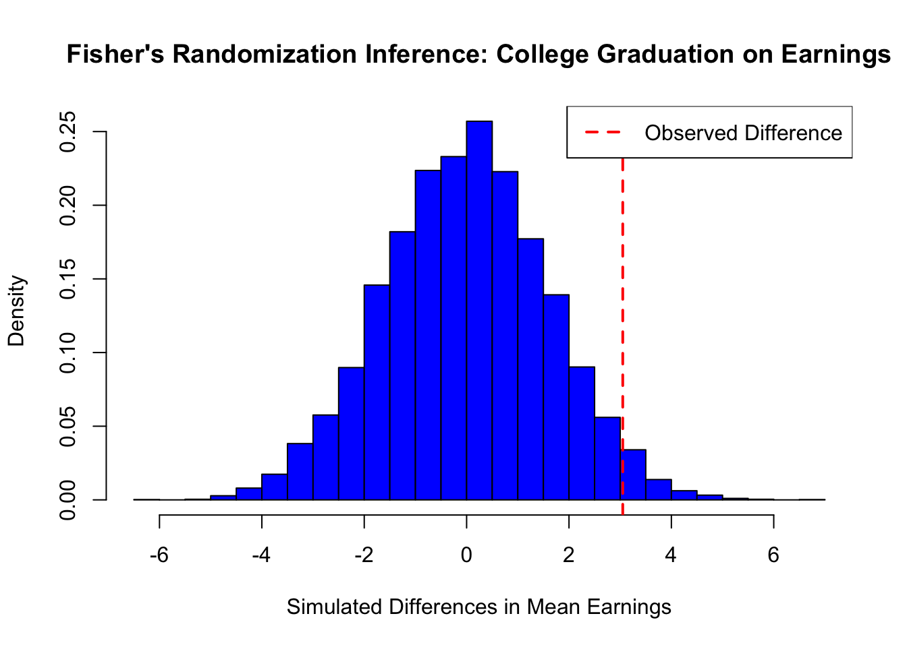

# Randomized Controlled Trials

Randomization is fundamental in causal inference, ensuring that treatment and control groups are comparable. By assigning units to treatment states (\(D\)) independently of their characteristics, randomization eliminates systematic differences between groups, allowing observed outcome differences to be attributed solely to the treatment. In randomized controlled trials (RCTs), the assignment mechanism is fully known and controlled by investigators, satisfying the random assignment assumption. 

Randomization, if implemented perfectly, balances observed and unobserved covariates , and potential outcomes (\((Y(1), Y(0))\)), guaranteeing unconfoundedness (Rubin, 1978) without conditioning on covariates. This assignment mechanism ensure that differences between groups are not due to preexisting characteristics. By balancing covariates and potential outcomes, RCTs are considered the gold standard in causal inference, enabling researchers to attribute outcome differences directly to the treatment. 

Although RCTs and A/B tests share foundational principles and are often used interchangeably, they differ in scope and application. A/B tests, widely used in business and digital settings, compare versions of an intervention—such as webpage designs, emails, or marketing campaigns—to optimize outcomes like click-through or conversion rates. In contrast, RCTs are used in fields like medicine, public health, and economics to evaluate policies, treatments, or interventions, often addressing broader, long-term effects.

Both rely on randomization to eliminate systematic differences between groups,i.e. selection bias, and estimate causal effects. A/B tests typically label groups as "variant A" (control) and "variant B" (new version), while RCTs use "treatment" and "control." While A/B tests focus on short-term business decisions, RCTs aim to generate generalizable scientific evidence. Despite these differences, A/B tests are a practical application of RCT principles, offering valuable insights for real-world optimization.

Although randomization is crucial, particularly in medical studies, it can be complex—especially when calculating confidence intervals and statistical power for studies with small samples. Additionally, there are many types of randomization, each suited to different study designs. Here, we focus on fundamental concepts relevant to causal inference and those that form the basis for understanding the other RCM methods. Despite their strengths, RCTs are not without limitations. They can be resource-intensive, ethically complex, or logistically challenging to conduct, but their ability to provide robust causal evidence makes them indispensable in many fields of study. Next, we explore the key assumptions underlying RCTs.

## Key Assumptions

The core assumptions for valid causal inference in RCTs include random assignment, SUTVA, and perfect compliance. 

Random Assignment is central to the validity of an RCT and ensures that treatment status (\(D\)) is statistically independent of the potential outcomes (\(Y_i(1)\) and \(Y_i(0)\)). Formally, under the assumption of exogeneity, \((Y_i(1), Y_i(0)) \perp D_i\). This guarantees that the distribution of both observed and unobserved characteristics is balanced between the treatment (\(D=1\)) and control (\(D=0\)) groups. By breaking the link between treatment assignment and characteristics that could influence the outcome, random assignment eliminates selection bias, enabling causal interpretation of the observed differences in outcomes.

Complementing this, the Stable Unit Treatment Value Assumption (SUTVA) ensures two critical conditions: no interference between units, meaning one individual’s treatment status does not influence another’s outcome, and consistency of treatment, requiring uniform application of the treatment and accurate correspondence between observed outcomes and potential outcomes under the assigned treatment status.

Perfect compliance is another key assumption, where all units assigned to treatment receive it, and no units in the control group access the treatment. This ensures that the observed treatment status matches the assigned treatment, preserving the validity of causal estimates. Additionally, RCTs assume no attrition, requiring that participants remain in the study and provide complete data. Systematic dropout can bias results, particularly if dropout rates are related to the treatment or outcomes. Proper implementation of randomization is equally important; deviations, such as participant selection based on convenience or unblinded treatment assignment, can undermine validity of the study. Finally, sufficient sample size and statistical power are necessary to ensure that the randomization process effectively balances covariates and that the study can detect meaningful treatment effects.

Under these assumptions, RCTs are widely considered the gold standard in causal inference. They eliminate selection bias by construction, ensuring that the observed differences in outcomes between treated and control groups are attributable solely to the treatment. As a result, RCTs are routinely employed in economics, social sciences, and health sciences to evaluate the efficacy of interventions such as medical treatments, public health programs, educational policies, job training initiatives, and social welfare strategies, among others.

## Randomization Inference

In randomized causal inference, two primary approaches emerge: Fisher’s Randomization Inference and Neyman’s Sampling Inference. Fisher (1935)’s method tests the sharp null hypothesis by computing p-values from the randomization distribution, making it ideal for experimental designs and small-sample biomedical studies where exact inference is essential. In contrast, Neyman (1923)’s framework, which introduced potential outcomes, focuses on estimating the average causal effect under a completely randomized experiment. This approach emphasizes estimation through an unbiased point estimator and conservative confidence intervals based on its sampling distribution, and is widely used in economics, social sciences, and large-scale policy evaluations. Given that Neyman’s framework aligns closely with the Rubin Causal Model and regression-based methods—the predominant techniques in empirical research—we focus on it here, while Fisher’s method, along with its simulations, is discussed later in the last section of this chapter. Because of Neyman’s foundational contributions, the Rubin Causal Model is sometimes also called the Neyman-Rubin Model.

Consider the example of studying the causal effect of a college degree on earnings. Without random assignment, individuals who pursue higher education may differ systematically in motivation, family support, or access to resources, leading to potential bias in direct income comparisons between graduates and non-graduates. Complete random assignment, achieved through methods like lottery-based assignment or random number generators, ensures that these confounding factors are distributed equally across groups. Perfect randomization eliminates selection bias, making observed differences in income attributable solely to the causal effect of obtaining a college degree. Next, we will explore Neyman’s inference, first verbally and then formally.

Neyman’s repeated sampling approach provides a systematic framework for estimating the Average Treatment Effect (ATE) in randomized experiments. It seeks to answer two fundamental questions: What would the average outcome be if all units were exposed to the treatment? How would this compare to the average outcome if all units were instead exposed to the control? These questions reflect the central focus of Neyman’s causal inference approach—understanding the difference in potential outcomes caused by the treatment.

To address these questions, Neyman proposed a classic frequentist approach. The first step involves identifying an unbiased estimator of the ATE. An unbiased estimator ensures that its expected value, averaged over all possible randomizations of treatment assignment, equals the true treatment effect. The next step is to calculate the sampling variance of this estimator and derive an unbiased estimate of that variance. Using this information, confidence intervals can be constructed. These intervals, consistent with Neyman’s framework, have the property that over repeated randomizations, the true treatment effect is contained within the interval at least as frequently as the stated confidence level. For example, a 95% confidence interval would include the true value at least 95% of the time. In randomized experiments, the ATE equialent to ATT and ATU as treatment assignment ensures comparability across groups. Neyman’s method thus provides a statistical basis for estimating causal effects, ensuring both unbiasedness and valid inference under randomization.

Formally, under a Completely Randomized Experiment (CRE) with \(N\) units, where \(N_{T}\) receive treatment (\(D=1\)) and \(N_{C}\) receive control (\(D=0\)), the potential outcomes are \(Y_i(1)\) and \(Y_i(0)\) for unit \(i\), representing income under treatment and control, respectively. The Average Treatment Effect (ATE) is defined as the difference in potential outcomes:

\begin{equation}
\delta^{ATE} = \mathbb{E}[Y(1)] - \mathbb{E}[Y(0)]
\end{equation}

Under randomization, the observed average income in the treated group (\( \bar{Y}(1) = \sum_{i=1}^N Y_i/N\)) estimates \(\mathbb{E}[Y(1)]\), and the observed average income in the control group (\( \bar{Y}(0) = \sum_{i=1}^N Y_i/N\)) estimates \(\mathbb{E}[Y(0)]\). Therefore, the ATE can be identified as:

\begin{equation}
\hat{\delta}^{ATE} = \bar{Y}(1) - \bar{Y}(0)
\end{equation}

However, due to the fundamental problem of causal inference, we cannot observe \(Y_i(1)\) and \(Y_i(0)\) simultaneously for any individual, making direct calculation of \(\delta^{ATE}\) impossible. Neyman’s (1923) theorem provides a framework for causal inference under a CRE. The ATE can be estimated using the following sample means for the treatment and control groups:

\begin{equation}
\hat{\bar{Y}}(1) = \frac{1}{N_{T}} \sum_{i=1}^N D_i Y_i, \quad \hat{\bar{Y}}(0) = \frac{1}{N_{C}} \sum_{i=1}^N (1-D_i) Y_i
\end{equation}

and taking their difference, we obtain unbiased estimation of ATE:

\begin{equation}
\hat{\delta}_{unadjusted}^{ATE}=\hat{\bar{Y}}(1)-\hat{\bar{Y}}(0)=\frac{1}{N_{T}} \sum_{i=1}^N D_i Y_i - \frac{1}{N_{C}} \sum_{i=1}^N (1-D_i) Y_i
\end{equation}

This unadjusted estimator relies solely on observed outcomes (\(Y\)), while adjustments incorporating covariates will be discussed in the next section.

The sample variances for the treated and control groups[^SampVar1] are given by:

\begin{equation}
\hat{S}^2(1) = \frac{1}{N_{T} - 1} \sum_{i=1}^N D_i \left(Y_i - \hat{\bar{Y}}(1)\right)^2, \quad 
\hat{S}^2(0) = \frac{1}{N_{C} - 1} \sum_{i=1}^N (1-D_i) \left(Y_i - \hat{\bar{Y}}(0)\right)^2
\end{equation}

To account for the unobservable variance of treatment effects (\(S^2(\delta)\)), Neyman proposed a conservative variance estimator[^Neyman] for \(\hat{\delta}^{ATE}\):

\begin{equation}
\hat{\text{Var}}_{Neyman}(\hat{\delta}^{ATE}) = \frac{\hat{S}^2(1)}{N_{T}} + \frac{\hat{S}^2(0)}{N_{C}}
\end{equation}

This approach ensures unbiased estimation of \(\delta^{ATE}\) and its variance and valid inference using conservative confidence intervals, even when \(S^2(\delta)\) is unobservable.

[^SampVar1]: The covariance between treatment and control outcomes, \[S(1,0) = \frac{1}{N-1} \sum_{i=1}^N (Y_i(1) - \bar{Y}(1))(Y_i(0) - \bar{Y}(0))\], and the variance of treatment effects, \[S^2(\delta) = \frac{1}{N-1} \sum_{i=1}^N (\delta_i - \bar{\delta})^2\], are not identified since \(Y_i(1)\) and \(Y_i(0)\) are never jointly observed.

[^Neyman]:Neyman’s theorem states that the true variance of the ATE estimator is:
\[
\text{Var}(\hat{\delta}^{ATE}) = \frac{S^2(1)}{N_{T}} + \frac{S^2(0)}{N_{C}} - \frac{S^2(\delta)}{N}.
\]
Since \(S^2(\delta)\) is unobservable, the conservative variance estimator overestimates the true variance:
\[
\mathbb{E}[\hat{\text{Var}}(\hat{\delta}^{ATE})] - \text{Var}(\hat{\delta}^{ATE}) = \frac{S^2(\delta)}{N} \geq 0
\]
with equality holding only if \(\delta_i\) is constant across all units.

Returning to the college degree example, imagine randomly assigning individuals to either pursue higher education (\(D=1\)) or not (\(D=0\)), irrespective of their background characteristics. In this setup, \(\hat{\bar{Y}}(1)\) represents the average income for those assigned to treatment, approximating the average income the entire sample, \(\bar{Y}(1)\), would achieve if everyone attended college. Similarly, \(\hat{\bar{Y}}(0)\) represents the average income for those assigned to control, approximating the average income, \(\bar{Y}(1)\), of the entire sample if no one attended college. Randomization ensures that any differences in outcomes between the treated and control groups can be attributed solely to the causal effect of a college degree. This framework provides unbiased estimation of \(\delta^{ATE}\) and valid inference using conservative confidence intervals, ensuring robustness even under the absence of observed covariances. 

The sampling distribution of \(\hat{\delta}^{ATE}\) can be approximated by a Normal distribution under large sample sizes and regularity conditions. Neyman’s variance estimator ensures that the sample variances are consistent with population variances, which justifies a conservative large-sample confidence interval for \(\delta^{ATE}\):

\begin{equation}
\hat{\delta}_{unadjusted}^{ATE} \pm z_{1-\alpha/2} \sqrt{\hat{\text{Var}}_{Neyman}(\hat{\delta}^{ATE})}= \hat{\delta}_{unadjusted}^{ATE} \pm z_{1-\alpha/2} \cdot \text{SE}_{Neyman}(\hat{\delta}^{ATE})
\end{equation}

where \(z_{1-\alpha/2}\) is the \(1-\alpha/2\) upper quantile of the standard Normal random variable. 

For example, if \(1-\alpha = 0.95\) (a 95% confidence level), then \(\alpha = 0.05\) and \(\alpha/2 = 0.025\). The critical value \(z_{1-\alpha/2} = z_{0.975}\) is approximately 1.96. Thus, the 95% confidence interval for \(\delta^{ATE}\) is \(
\hat{\delta}_{unadjusted}^{ATE} \pm 1.96 \cdot \text{SE}_{Neyman}(\hat{\delta}^{ATE}) \). This confidence interval covers \(\delta^{ATE}\) with a probability of at least \(1-\alpha = 0.95\) when the sample size is large enough. By duality, it implies a test for the null hypothesis \( H_0: \delta^{ATE} = 0 \), which is known as the weak null hypothesis.

Let's assume we conducted a randomized experiment where one-quarter of the population was assigned to attend college while the rest did not. After college, we observed their earnings and aimed to estimate the ATE using the equations above. The simplest way to estimate ATE is by computing the difference in mean earnings between the treated and control groups as this is complete randomization.


``` r
set.seed(42)  # For reproducibility
N <- 20000
NT <- 5000  # Number in treatment (college graduates)
NC <- N - NT  # Number in control (non-graduates)
# Generate earnings separately for treated and control groups
earnings_non_graduates <- rnorm(NC, mean = 50, sd = 10)  
earnings_graduates <- rnorm(NT, mean = 53, sd = 10)  # Mean increased by 3
# Merge into a single dataset
data <- data.frame(
  ID = 1:N,
  Treatment = c(rep(1, NT), rep(0, NC)),  
  Earnings = c(earnings_graduates, earnings_non_graduates)  
)
# Neyman's inference: Point estimator and standard error
Y <- data$Earnings  # Outcome variable
D <- data$Treatment  # Treatment indicator
# Point estimator for ATE
deltahat <- mean(Y[D == 1]) - mean(Y[D == 0])  
deltahat
```

```
## [1] 3.209321
```

``` r
# Variance and standard error using Neyman's method
vhat_Neyman <- var(Y[D == 1]) / NT + var(Y[D == 0]) / NC
sqrt(vhat_Neyman)  # Standard error
```

```
## [1] 0.1651089
```

``` r
# OLS estimation, coefficient and standard error
olsfit <- lm(Y ~ D, data = data)
summary(olsfit)$coef[2,1:2]
```

```
##   Estimate Std. Error 
##  3.2093210  0.1644279
```

``` r
# Eicker-Huber-White robust SE using lm_robust (HC2) to match Neyman SE
library(estimatr)
ols_robust_hc2 <- lm_robust(Y ~ D, data = data, se_type = "HC2")
coef(summary(ols_robust_hc2))[2, "Std. Error"]
```

```
## [1] 0.1651089
```

Another approach we will cover below is regression, where we estimate ATE using OLS. The estimated coefficient on treatment from OLS should match the ATE from our earlier equation, but the standard errors differ. Ordinary least squares assumes homoskedasticity, which can lead to incorrect standard errors in the presence of heteroskedasticity. To address this, we use heteroskedasticity-robust standard errors, specifically the Eicker-Huber-White (EHW) estimator, which corrects the standard errors to align with Neyman’s inference. Now, we move to the next section, where we explain OLS in RCTs in detail, discuss why we need to use robust standard errors, and then introduce regression models that include additional covariates (\(X\)) to improve efficiency.

## Linear Regression in RCTs

Linear regression is widely used in RCTs to estimate treatment effects because it flexibly incorporates covariates and adjusts for residual imbalances. The connection between the potential outcomes framework and linear regression is critical for understanding how treatment effects under randomization can be estimated using the OLS estimator and its inference. As explained in detail in Section 2, in the potential outcomes framework, the observed outcome of each unit is defined as \(Y_i = D_i \cdot Y_i(1) + (1-D_i) \cdot Y_i(0)\); that is, if \(D_i=1\), then \(Y_i=Y_i(1)\), and if \(D_i=0\), then \(Y_i=Y_i(0)\). This can also be written as \(Y_i = Y_i(0) + (Y_i(1)-Y_i(0))\cdot D_i\), where \(Y_i(0)\) is the baseline outcome for the untreated state, and \(Y_i(1)-Y_i(0)\) is the treatment effect for unit \(i\), applied only to the treated. Under random assignment, although both potential outcomes cannot be observed for any unit, the expected treatment effect (ATE) can still be estimated.

In the previous section, we discussed Neyman’s causal inference, where the ATE is estimated as the difference in average outcomes between treated and control groups, \(\bar{Y}(1) - \bar{Y}(0)\), which is equivalent to the OLS estimator \(\beta_1\) in a more flexible regression framework. Below, we explain how OLS can be used to estimate treatment effects in RCTs, considering both homogeneous and heterogeneous effects, as well as binary and continuous treatments. Even after including covariates and their interactions, \(\beta_1\) still captures the ATE. For inference, robust standard errors should be used, as demonstrated in the simulation above. We now continue the discussion with binary and continuous treatments, excluding covariates.

When treatment effects are homogeneous, meaning \(Y_i(1)-Y_i(0)=\beta_1\) for all units, the model simplifies to \(Y_i = Y_i(0) + \beta_1\cdot D_i\). This aligns with the regression equation \(Y_i=\beta_0+\beta_1 D_i+\varepsilon_i\), where \(\beta_0=\mathbb{E}[Y_i(0)]\) and \(\varepsilon_i = Y_i(0) - \mathbb{E}[Y_i(0)]\) captures deviations from this baseline. Here, \(\beta_1=\beta^{\text{OLS}}_{\text{Unadjasted}}\) is an unbiased estimator of the constant treatment effect and equals the ATE.

For heterogeneous treatment effects, where \(Y_i(1)-Y_i(0)=\beta_{1i}\) varies across units, the OLS estimator still captures the average treatment effect by averaging individual effects: \(\beta^{OLS}_1=\beta^{\text{OLS}}_{\text{Unadjasted}}=\mathbb{E}[\beta_{1i}]=\delta^{ATE}\), as long as treatment assignment is independent of the potential outcomes.[^HetTre] Even when \(D_i\) is ordered or continuous, the OLS framework adapts to estimate the treatment effect, with the coefficient representing a convexly weighted average of the treatment effect gradient, with further details provided in the footnote.[^HetEx] This derivation shows that the regression model effectively estimates causal effects, accommodating both uniform and variable treatment responses.

[^HetTre]: If treatment effects heterogeneous(vary) across units, the OLS estimate of the treatment effect can be expressed as:
\[
\beta^{\text{OLS}}_{\text{Unadjasted}} = \frac{\mathbb{E}[(D_i - \mu)Y_i]}{\text{Var}[D_i]} = \frac{\text{Cov}[D_i, \varepsilon_i]}{\text{Var}[D_i]} + \frac{\mathbb{E}[D_i(D_i - \mu)\beta_{1i}]}{\text{Var}[D_i]} = \mathbb{E}[\beta_{1i}] \equiv \delta^{ATE}
\]
where \(\mu = \mathbb{E}[D_i]\): the average treatment assignment, \(\beta_{1i}\): the individual treatment effect, \(\beta_{\text{OLS}} = \mathbb{E}[\beta_{1i}]\) is ATE under random assignment and independence assumptions. This derivation demonstrates that, even with heterogeneous treatment effects, the OLS estimator remains unbiased for the ATE as long as \((\varepsilon_i, \beta_{1i}) \perp D_i\).

[^HetEx]: In cases where treatment \(D\) is ordered or continuous (e.g., different dosages), the treatment assignment remains independent of the potential outcomes (\(D \perp \{Y(d)\}_{d \in \mathcal{D}}\)). This ensures that the expected outcome given treatment \(D = d\) equals the potential outcome \(Y(d)\), \(\mathbb{E}[Y \mid D = d] = \mathbb{E}[Y(d)]\). A saturated regression of \(Y\) on dummy variables for all values of \(D\) (or a nonparametric regression for continuous \(D\)) traces the average structural function \(\mathbb{E}[Y(d)]\). Alternatively, a simple regression of \(Y\) on \(D\) identifies a convexly weighted average of \(\partial \mathbb{E}[Y(d)] / \partial d\) or its discrete version. The OLS coefficient \(\beta_{\text{OLS}}\) can be expressed as:
\[
\beta_{\text{OLS}} = \int_{-\infty}^{\infty} \omega(\tilde{d}) \frac{\partial \mathbb{E}[Y(d)]}{\partial d} d\tilde{d}, \quad \text{or} \quad \beta_{\text{OLS}} = \sum_{k=1}^{K} \omega_k \frac{\mathbb{E}[Y(d_k)] - \mathbb{E}[Y(d_{k-1})]}{d_k - d_{k-1}}
\]
where the weights \(\omega(\tilde{d}) = \frac{\text{Cov}[1\{D \geq \tilde{d}\}, D]}{\text{Var}[D]}\) for continuous \(D\) or \(\omega_k = \frac{(d_k - d_{k-1}) \cdot \text{Cov}[1\{D \geq d_k\}, D]}{\text{Var}[D]}\) for discrete \(D\). This approach allows RCTs with continuous or ordered treatments to identify the average structural function or treatment effect gradient.

Below, we present the (unadjusted) linear regression for randomized controlled trials (RCTs) using a more commonly used notation in recent books and lectures. This notation simplifies the presentation and is frequently applied to extend the model by including covariates for adjustment in RCTs. While this approach may appear cleaner and more intuitive, it can create conceptual confusion for some readers, particularly when distinguishing between (pre-treatment) covariate adjustment in RCTs and conditioning on covariates (including confounding variables) in observational studies. In RCTs, covariates are used to improve precision (regression adjustment), whereas in observational studies, the goal is to approximate randomization to estimate causal effects (i.e obtaining ATEs with estimated Conditional ATEs). We will revisit these differences and explain observational studies in detail in the next chapter. Here, we present the same regression framework for clarity and alignment with standard notation.

The linear regression model for RCTs with binary treatment assignment is expressed as:

\begin{equation}
Y_i=\alpha + \beta D_i +\epsilon_i \iff \quad E[Y_i] = \alpha + \beta D_i
\end{equation}

where \( D_i \) is a binary treatment indicator, is interpreted as follows:
- For the control group (\( D_i = 0 \)): \( E[Y_i \mid D_i = 0] = \alpha \),
- For the treatment group (\( D_i = 1 \)): \( E[Y_i \mid D_i = 1] = \alpha + \beta \)

Under randomization, \( E[Y_i(1)] \) and \( E[Y_i(0)] \) are unbiasedly estimated by the observed means of the treatment and control groups. The Average Treatment Effect (ATE) can then be expressed as:

\begin{equation}
E[Y_i(1)] - E[Y_i(0)] = E[Y_i \mid D_i = 1] - E[Y_i \mid D_i = 0] = (\alpha + \beta) - \alpha = \beta
\end{equation}

This demonstrates that the regression coefficient \( \beta \) provides a direct and unbiased estimate of the ATE in randomized experiments. The robust standard error of this regression is also an estimate of the standard deviation of the ATE.

**Robust Standard Errors in RCTs**
In the regression model with binary randomization, the standard OLS variance estimator assumes homoskedasticity. The variance of \(\hat{\beta}_1\) is[^bin]:  

\begin{equation}
\hat{\text{Var}}^{\text{OLS}}_{\text{Unadjasted}}(\hat{\beta}_1) = \frac{\hat{\sigma}^2}{\sum_{i=1}^{N}(D_i-\bar{D})^2} = \frac{\hat{\sigma}^2 N}{N_T N_C}
\end{equation}

[^bin]:For binary treatment, \(\sum_{i=1}^{N}(D_i-\bar{D})^2 = N_T N_C / N\), which leads to the standard OLS variance formula. This assumes a common residual variance, \(\hat{\sigma}^2\), across all units. Robust SEs, however, allow for different residual variances in the treated and control groups, making them consistent with Neyman’s variance estimator.

However, in RCTs, outcome variances typically differ between treatment and control groups. Since the OLS estimator assumes homoskedasticity, it underestimates the standard errors of the ATE when variances differ across groups. To correct for this, Eicker-Huber-White robust standard errors replace the assumption of constant variance with an estimate that weights each squared residual based on its deviation from \(\bar{D}\): 

\begin{equation}
\hat{\text{Var}}^{\text{robust}}(\hat{\beta}_1) = \left( \sum_{i=1}^{N}(D_i-\bar{D})^2 \right)^{-1} \sum_{i=1}^{N}(D_i-\bar{D})^2\hat{\varepsilon}_i^2
\end{equation}

For a binary treatment, this simplifies to Neyman’s variance formula, aligning with the conservative variance estimator for the ATE under randomization we discussed earlier. 

\begin{equation}
\hat{\text{Var}}_{\text{robust}}^{OLS}(\hat{\beta}_1) = \frac{S^2(1)}{N_T} + \frac{S^2(0)}{N_C} = \hat{\text{Var}}_{\text{Neyman}}(\hat{\delta}^{ATE})
\end{equation}

Thus, robust standard errors should be used in RCTs to correctly estimate uncertainty when outcome variances differ across groups. We demonstrated this in the simulation above, where you can verify the variances and standard errors, confirming that the robust standard errors align with Neyman’s variance estimator while the homoskedastic OLS standard errors underestimate variability when group variances differ.

## Regression Adjustment in Randomized Experiments
Until now in this section, we have established that under a Completely Randomized Experiment (CRE) with \(N\) units, the ATE is defined as \(\delta^{ATE} = \mathbb{E}[Y(1)] - \mathbb{E}[Y(0)]\). Since we cannot observe both potential outcomes for any unit, ATE is estimated using observed sample means:  

\begin{equation}
\hat{\delta}_{unadjasted}^{ATE} = \frac{1}{N_T} \sum_{i=1}^{N} D_i Y_i - \frac{1}{N_C} \sum_{i=1}^{N} (1 - D_i) Y_i
\end{equation}

By Neyman’s (1923) framework, this provides an unbiased estimate of ATE under randomization. 

We showed that ATE can be estimated either by directly computing the difference between the average of outcome in treatment and control groups or by using unadjusted regression (\(Y\) on \(D\)) with robust standard errors—both yielding identical estimates and inference. However, this approach is based on unadjusted potential outcomes, and adjustments may be required for greater precision. In randomized experiments, adjusting for pre-experimental covariates improves efficiency, while in observational studies (discussed in the next chapter), adjustments also address confounding factors.

Covariate adjustment can occur at the design stage (e.g., stratified, paired randomization, or rerandomization) or at the analysis stage. In these chapters, we focus on analysis-stage adjustments—such as matching, propensity scores, weighting, and regression—that replace simple averages of potential outcomes with adjusted potential outcomes that account for pre-treatment and confounding covariates. For example, one can obtain adjusted potential outcomes by matching (using only matched pairs), by applying propensity score methods, by weighting observations, or by including covariates in a regression model. We will discuss stratification, matching, weighting, and propensity score methods (for observational studies) in the next chapter, and now continue with a detailed discussion of regression adjustment, which is widely used in practice in RCTs.

Specifically, while randomization is expected to balance covariates on average, small samples or design issues can lead to imbalances that reduce statistical power and threaten internal validity (credible treatment effect for our sample). Two main strategies can be used to construct the test statistics to test null hypothesis or to estimate ATE with confidence intervals, allowing covariate adjustments to improve precision and decrease variance (thus, the uncertainty). 

### Residual strategy in Randomized Experiments
The residual strategy constructs the test statistic based on residuals obtained from a fitted regression model. Specifically, the outcome variable \(Y_i\) is regressed on covariates \(X_i\) to produce residuals \(\hat{\varepsilon}_i\), which represent the portion of the outcome not explained by the covariates. These residuals are treated as pseudo-outcomes to test the sharp null hypothesis and calculate test statistics. All explained in detail, and demonstrated with simulation in the Fisher's inference section.  

### Regression strategy in Randomized Experiments

Fisher (1925) introduced ANCOVA to improve estimation efficiency by regressing \( Y_i \) on \( (1, D_i, X_i) \) and using the coefficient of \( D_i \) as the estimator for the ATE. Freedman (2008) reanalyzed this approach under Neyman’s (1923) potential outcomes framework and found that this estimator is biased, unlike the simple difference in means, which is unbiased. Lin (2013) responded by showing that the bias of Fisher's ANCOVA (regression adjustment without interaction terms) is negligible in large samples and that including \( D_i, X_i, \) and \( D_i \times X_i \) in the regression improves asymptotic efficiency.[^Freed] Using an ANCOVA model with interactions and centered covariates (\( X_i - \bar{X} \)), combined with Eicker-Huber-White (EHW) robust standard errors, is recommended. The coefficient of \( D_i \) provides an unbiased estimate of the ATE, and the EHW standard error gives a valid estimate of its variability. 

[^Freed]: Freedman (2008) also noted that the asymptotic variance of \( \hat{\tau}_F \) may exceed that of the simple difference in means when \( n_1 \neq n_0 \) and that the OLS standard error is inconsistent with the true standard error of \( \hat{\tau}_F \) under CRE. Lin (2013) showed that the EHW standard error is a valid, conservative estimator for the true standard error of \( \hat{\tau}_F \) under CRE.

Now, let’s discuss regression adjustment using the potential outcomes framework in detail. By presenting these approaches—obtaining potential outcomes from separate regressions, using a single regression with interactions, or applying a simpler regression without interactions—wwe aim to provide a comprehensive understanding of covariate adjustment in RCTs, even though all estimate the same ATE. While separate estimation is less commonly covered in RCT analysis, regression-based approach and notation are more standard. However, we introduce separate estimation to build intuition and establish notation within the RCT framework, which will later extend to more general methods addressing selection on observables and unobservables. Moreover, the separate regression approach forms a foundational intuition, familiarizing readers with concepts that underpin a substantial number of doubly robust and heterogeneous causal inference methods.

In separate regression approach, the potential outcomes for the treatment (\(D_i = 1\)) and control (\(D_i = 0\)) groups be represented as follows:

\begin{equation}
Y_i = \gamma_1 + \beta_1^\top X_i + \varepsilon_i \quad \text{for } D_i = 1
\end{equation}

\begin{equation}
Y_i = \gamma_0 + \beta_0^\top X_i + \varepsilon_i \quad \text{for } D_i = 0
\end{equation}

Here, \(\gamma_1\) and \(\gamma_0\) are the intercepts representing the adjusted mean outcomes for the treatment and control groups, respectively. When \(\beta_1 = \beta_0 = 0\) (i.e., no covariate adjustment), these \(Y_i\) values correspond to the potential outcomes used in the unadjusted estimator , \(\hat{\delta}_{unadjusted}^{ATE} = \hat{\bar{Y}}(1) - \hat{\bar{Y}}(0)\), in RCTs.

In the regression-adjusted estimator, we replace the unadjusted potential outcomes with fitted means for the covariate-adjusted potential outcomes. First, to obtain adjusted potential outcomes, we regress \(Y_i\) separately for the treatment (\(D_i = 1\)) and control (\(D_i = 0\)) groups:

\begin{equation}
\min_{\gamma_1, \beta_1} \sum_{i=1}^{n_1} \left(Y_i - \gamma_1 - \beta_1^\top X_i \right)^2, \quad
\min_{\gamma_0, \beta_0} \sum_{i=1}^{n_0} \left(Y_i - \gamma_0 - \beta_0^\top X_i \right)^2
\end{equation}

From these regressions, we obtain \(\hat{\gamma}_1, \hat{\beta}_1\) for the treatment group and \(\hat{\gamma}_0, \hat{\beta}_0\) for the control group. Then, we obtain the fitted means for the treatment and control groups, which are:

\begin{equation}
\hat{Y}(1) = \hat{\gamma}_1 + \hat{\beta}_1^\top \bar{X}(1), \quad
\hat{Y}(0) = \hat{\gamma}_0 + \hat{\beta}_0^\top \bar{X}(0)
\end{equation}

where \(\bar{X}(1)\) and \(\bar{X}(0)\) are the sample means of \(X_i\) for the treated and control groups, respectively.

The adjusted ATE is then:

\begin{equation}
\hat{\delta}_{sep.adjusted}^{ATE} = \hat{Y}(1) - \hat{Y}(0) = \left(\hat{\gamma}_1 + \hat{\beta}_1^\top \bar{X}(1)\right) - \left(\hat{\gamma}_0 + \hat{\beta}_0^\top \bar{X}(0)\right)
\end{equation}

If covariates are centered (\(\bar{X}(1) = \bar{X}(0) = 0\)), the adjusted ATE from separate regressions simplifies to:

\begin{equation}
\hat{\delta}_{sep.adjusted}^{ATE} = \hat{\gamma}_1 - \hat{\gamma}_0
\end{equation}

In this setup, \(\hat{\gamma}_1\) and \(\hat{\gamma}_0\) represent the adjusted mean outcomes for the treatment and control groups, respectively. The difference \(\hat{\gamma}_1 - \hat{\gamma}_0\) provides an unbiased estimate of the ATE (\(\delta^{ATE}\)) when covariates are centered. Eicker-Huber-White (EHW) robust standard errors are recommended for estimating the standard error of \(\hat{\delta}^{ATE}\), as they account for heteroskedasticity introduced by covariate adjustment.

We want to emphasize again before implementing regression adjustment, covariates must be centered by subtracting their group-specific means. Centering ensures that \(\hat{\delta}^{ATE}\) is captured entirely by the difference in intercepts (\(\hat{\gamma}_1 - \hat{\gamma}_0\)), simplifying interpretation. Without centering, the ATE would depend on group-specific covariate means, complicating analysis and inference.

### Single Regression with Covariate Adjustment  
Alternative approach involves a single unified regression model that incorporates interactions between treatment and covariates. This unified model offers a streamlined way to estimate the ATE and, importantly, captures heterogeneity in treatment effects.

The single regression model, often referred to as the ANCOVA model with interactions, is expressed as:

\begin{equation}
Y_i = \beta_0 + \beta_D D_i + \beta_X^\top X_i + \beta_{DX}^\top (D_i \cdot X_i) + \varepsilon_i
\end{equation}

In this model, \(\beta_D\) represents the average treatment effect (ATE) when covariates \(X_i\) are centered (\(\mathbb{E}[X_i] = 0\)), while \(\beta_{DX}\) captures treatment effect heterogeneity, allowing the effect of the treatment to vary depending on the values of \(X_i\). This approach eliminates the need for separate regressions for the treatment and control groups, combining them into a single estimation framework. To understand how the ATE is derived in this model, consider the expected outcomes for the treated group (\(D_i = 1\)) and the control group (\(D_i = 0\)). 

For the treated group, the expected outcome is: \(\mathbb{E}[Y_i \mid D_i = 1] = \beta_0 + \beta_D + \beta_X^\top X_i + \beta_{DX}^\top X_i\)

For the control group, the expected outcome is: \(\mathbb{E}[Y_i \mid D_i = 0] = \beta_0 + \beta_X^\top X_i\)

The conditional treatment effect, which reflects how the treatment effect varies with \(X_i\), is the difference between these two expected outcomes:

\begin{align}
\delta(X_i) &= \mathbb{E}[Y_i \mid D_i = 1] - \mathbb{E}[Y_i \mid D_i = 0] \notag \\
&= (\beta_0 + \beta_D + \beta_X^\top X_i + \beta_{DX}^\top X_i) - (\beta_0 + \beta_X^\top X_i) = \beta_D + \beta_{DX}^\top X_i
\end{align}

To obtain the average treatment effect (ATE), we take the expectation of \(\delta(X_i)\) over \(X_i\):

\begin{equation}
\hat{\delta}_{adj.interact}^{ATE} = \mathbb{E}[\delta(X_i)] = \beta_D + \beta_{DX}^\top \mathbb{E}[X_i]= \beta_D
\end{equation}

As covariates are centered (\(\mathbb{E}[X_i] = 0\)), the interaction term drops out. This shows that centering the covariates ensures that \(\beta_D\) directly estimates the ATE, while \(\beta_{DX}\) captures any heterogeneity in treatment effects.

Alternatively, if treatment effect heterogeneity across covariates is not a concern, one could use an ANCOVA model without interactions. This simpler model assumes a constant treatment effect across all values of \(X_i\) and is expressed as:

\begin{equation}
Y_i = \beta_0 + \beta_D D_i + \beta_X^\top X_i + \varepsilon_i
\end{equation}

In this case, the expected outcomes for the treated and control groups are:

\begin{equation}
\mathbb{E}[Y_i \mid D_i = 1] = \beta_0 + \beta_D + \beta_X^\top X_i, \quad \mathbb{E}[Y_i \mid D_i = 0] = \beta_0 + \beta_X^\top X_i
\end{equation}

The treatment effect estimate is obtained by differencing these expected outcomes:

\begin{equation}
\hat{\delta}_{adjusted}^{ATE} = \mathbb{E}[Y_i \mid D_i = 1] - \mathbb{E}[Y_i \mid D_i = 0] = \beta_D
\end{equation}

While this model also provides an unbiased estimate of the ATE, it does not account for treatment effect heterogeneity, making it less suitable when variation in treatment effects across covariates is expected. Consequently, the ANCOVA model with interactions is generally preferred in randomized experiments, as it accounts for treatment effect heterogeneity and improves asymptotic efficiency (as discussed at the beginning of this section) when covariates are centered and robust standard errors (i.e. sandwich or EHW estimator) are used (sec.5, Lin (2013). This approach ensures that the coefficient of \(D_i\) provides an unbiased estimate of the ATE while capturing variations in treatment effects across subgroups.

\begin{align}
\hat{\delta}_{\text{sep.adjusted}}^{ATE} 
&= \hat{\gamma}_1 - \hat{\gamma}_0 = \hat{\delta}_{\text{int.adjusted}}^{ATE} \notag \\
&= \mathbb{E}[Y_i \mid D_i = 1] - \mathbb{E}[Y_i \mid D_i = 0] \notag \\
&= (\beta_0 + \beta_D) - \beta_0 = \beta_D 
= \hat{\delta}_{\text{adjusted}}^{ATE}
\end{align}

All approaches yield the same ATE because they ultimately estimate the same difference in expected outcomes between the treatment and control groups. In the separate regression approach, this difference is captured by \(\hat{\gamma}_1 - \hat{\gamma}_0\), which represents the adjusted mean outcome difference after controlling for covariates. In the single regression approach, \(\beta_D\) directly measures the treatment effect when covariates are centered. Since all methods derive the treatment effect by comparing adjusted means, they are equal. The key reason they align is that including covariates in a regression does not alter the fundamental structure of how the treatment effect is estimated—it only adjusts for potential imbalances in covariates. When centering is applied, the contribution of the interaction term to the ATE disappears, and confirming their equivalence.

### Simulation: Covariate Adjustment in RCTs
This simulation compares various methods for estimating the Average Treatment Effect (ATE) in a randomized controlled trial, where college graduation is the treatment and earnings is the outcome. Family income is included as a covariate because it influences both participation in randomization and other related factors, making it important for adjustment. We employ four approaches: (1) OLS without covariates, replicating robust OLS results of previous simulation; (2) OLS with covariates that assumes a common (homogeneous) treatment effect; (3) OLS with an interaction term -recommended single regression method- to allow for heterogeneous treatment effects; and (4) separate regressions for the treatment and control groups. Given that family income affects treatment assignment, the model assuming a common effect is less plausible, even though covariates should be balanced in true randomization, as imbalances can occur in finite samples. Notably, the ATE estimates from the heterogeneous model and the separate regressions are identical as expected, confirming the consistency between these methods. We use EHW (sandwich; robust in Stata) standard errors for reliable inference under heteroskedasticity and recommend bootstrapping to calculate standard errors for the separate regressions approach, especially in observational studies.


``` r
# Set seed for reproducibility
set.seed(42)
# Define sample sizes
N <- 20000
NT <- 5000  # Number in treatment (college graduates)
NC <- N - NT  # Number in control (non-graduates)
# Generate earnings for treated and control groups
  # Higher mean for graduates
earnings_non_graduates <- rnorm(NC, mean = 50, sd = 10)
earnings_graduates <- rnorm(NT, mean = 53, sd = 10)
# Generate family income (X) for both groups
family_income_non_graduates <- rnorm(NC, mean = 70, sd = 20)  # Lower mean
family_income_graduates <- rnorm(NT, mean = 95, sd = 20)  # Higher mean
# Merge into a single dataset
data <- data.frame(
  ID = 1:N,
  Treatment = c(rep(1, NT), rep(0, NC)),
  X = c(family_income_graduates, family_income_non_graduates),  
  Earnings = c(earnings_graduates, earnings_non_graduates)
)

# Neyman's inference: Point estimator and standard error
Y <- data$Earnings  # Outcome variable
D <- data$Treatment  # Treatment indicator
X <- data$X  # Covariate
# Load necessary library
library(estimatr)

# (1) OLS estimation without covariates (robust standard error)
ols_robust_hc2 <- lm_robust(Y ~ D, data = data, se_type = "HC2")
ate_ols <- coef(ols_robust_hc2)[2]
se_ols <- coef(summary(ols_robust_hc2))[2, "Std. Error"]

# Center X
data$X_centered <- data$X - mean(data$X)

# (2) OLS with covariates (no interaction)
ols_covrobust_hc2 <- lm_robust(Y ~ D + X_centered, 
                               data = data, se_type = "HC2")
ate_cov <- coef(ols_covrobust_hc2)[2]
se_cov <- coef(summary(ols_covrobust_hc2))[2, "Std. Error"]

# (3) OLS with interactions
ols_introbust_hc2 <- lm_robust(Y ~ D + X_centered + D * X_centered, 
                               data = data, se_type = "HC2")
ate_int <- coef(ols_introbust_hc2)[2]
se_int <- coef(summary(ols_introbust_hc2))[2, "Std. Error"]

# (4) Separate regressions for ATE estimation
ols_treated <- lm(Y ~ X_centered, data = data, subset = (D == 1))
ols_control <- lm(Y ~ X_centered, data = data, subset = (D == 0))
gamma_1 <- coef(ols_treated)[1]
gamma_0 <- coef(ols_control)[1]
ate_sep <- gamma_1 - gamma_0  # ATE from separate regressions

# Display results
results <- data.frame(
  Method = c("OLS Unadjusted", "OLS w/ Covariates (No Interaction)", 
             "OLS w/ Interactions", "Separate Regressions"),
  ATE_Estimate = c(ate_ols, ate_cov, ate_int, ate_sep),
  # Separate regressions do not directly give SE
  EHW_Standard_Error = c(se_ols, se_cov, se_int, NA)  
)
print(results)
```

```
##                               Method ATE_Estimate EHW_Standard_Error
## 1                     OLS Unadjusted     3.209321          0.1651089
## 2 OLS w/ Covariates (No Interaction)     3.188720          0.1872812
## 3                OLS w/ Interactions     3.175287          0.2143932
## 4               Separate Regressions     3.175287                 NA
```

In practice, covariate adjustment in practice rarely changes the conclusion of the unadjusted estimator, therefore usually only reported in secondary analysis. However, it is essential to adjust for covariates to improve precision and efficiency, particularly in small samples or when covariates are imbalanced.

**Missing Data**

Regression adjustment improves precision and efficiency in randomized experiments but has limitations. It can lead to selective model specification in pursuit of significant results, raising validity concerns. Unlike linear regression, models like Logit and Probit lack justification from randomization (Freedman 2008b). For binary or count outcomes, linear models may not accurately capture causal effects, and some argue that regression adjustment undermines the integrity of randomization. One of the most common issues is missing data, which can arise in both covariates and outcomes. In this section, we discuss strategies for handling missing data in RCTs briefly.

When covariates have missing values in RCTs, a key question is how to adjust for them. Zhao and Ding (2022) show that as long as mean imputation is used and missingness indicators are included as predictors, the specific imputation method does not affect efficiency. This ensures that the adjusted estimator remains asymptotically more efficient than the unadjusted one. For a single partially observed covariate \(X\), let \(R_i = 1\) if \(X_i\) is observed and \(R_i = 0\) if missing. The OLS model for covariate adjustment is:  

\begin{equation}
Y_i \sim D_i + X_i R_i + R_i + D_i (X_i R_i + R_i)
\end{equation}

Since \(X_i R_i\) equals \(X_i\) when observed and zero when missing, imputation choice does not affect the final estimate, holding regardless of the missing data mechanism.  

In practice, missingness often occurs in both covariates and outcomes. While missing covariates can be adjusted without concern for imputation choice, missing outcomes pose a greater challenge, as imputation quality affects conclusions. Under the missing at random assumption, missingness depends only on observed covariates and treatment status, not the missing outcome itself. We estimate the probability of observation (propensity score) and apply inverse probability weights (\(1/e_i\)) in weighted least squares (WLS) regression to adjust for outcome missingness. IPW methods, which correct for selection bias, will be discussed in the next chapter in the context of selection on observables.

## Fisher’s Randomization Inference

**Fisher’s Randomization Inference** is a framework for testing the sharp null hypothesis that a treatment has no effect on any individual, i.e.,  

\begin{equation}
H_0: Y_i(1) = Y_i(0) \quad \forall i
\end{equation}

Unlike traditional statistical inference, which relies on population assumptions, Fisher's approach is based solely on the assignment mechanism of treatment. The outcomes are assumed to be fixed, and the only randomness comes from the treatment assignment. This principle, first recognized by R.A. Fisher (1925, 1935), establishes randomization as the foundation for credible causal inference. Fisher was particularly interested in testing sharp null hypotheses, where the treatment has no effect on any unit. The key idea is to compare the observed test statistic (e.g., the difference in means) to its distribution under all possible random assignments of treatment.   

Fisher’s Exact Test follows three key steps. First, researchers specify the null hypothesis, which assumes that the treatment has no effect on any individual. Second, they choose a test statistic that quantifies the treatment effect. Finally, they measure extremeness by computing the p-value under the randomization distribution, which represents the likelihood of observing a test statistic as extreme as the one obtained, assuming the null hypothesis is true.  

The test statistic is a function of the data used to assess the consistency of the null hypothesis with the observed outcomes. The most common test statistic in Fisher’s inference is the difference in means, given by:

\begin{equation}
\hat{\delta} = \frac{1}{N_T} \sum_{i: D_i=1} Y_i - \frac{1}{N_C} \sum_{i: D_i=0} Y_i
\end{equation}

where \( N_T \) and \( N_C \) are the number of treated and control units, respectively. Under the sharp null \( Y_i(1) = Y_i(0) \), we can reassign treatment labels and recompute \( \hat{\delta} \) across all possible random assignments. (in R the following function also calculates this test `t.test  var . equal = TRUE`) 

Other valid test statistics include the Studentized statistic (`t.test  var . equal = FALSE`), Wilcoxon rank-sum statistic (`wilcox.test`), and Kolmogorov–Smirnov statistic (`ks.test`). In the case of binary outcomes, Fisher’s exact test simplifies to a contingency table comparison (`fisher.test`).

**p-value Calculation annd simulation**  

After stating the sharp null hypothesis and defining the most common test statistic (the difference in means), we can generate the randomization distribution and calculate the p-value Under the sharp null, we randomly permute \(D_i\) (the treatment assignment) while keeping the observed outcomes fixed, then recalculate \( \hat{\delta} \) for each permutation. This process is repeated many times (e.g., 10,000 times). The collection of all possible test statistics under randomization forms the randomization distribution, which represents the values that the test statistic could take under the null hypothesis. The p-value is then computed as:

\begin{equation}
p = \frac{\#(\hat{\delta}^{\text{sim}} \geq \hat{\delta}^{\text{obs}})}{\text{Total Simulations}}
\end{equation}

where \( \hat{\delta}^{\text{sim}} \) represents test statistics from simulated random assignments.  

Beyond simple hypothesis testing, Fisher’s framework allows constructing Fisher Intervals, which define a range of plausible values for the causal effect. These intervals include all possible values of the treatment effect corresponding to test statistics whose p-values fall within a predefined range.  

Fisher’s Randomization Inference provides an exact test for treatment effects, making no distributional assumptions, and is particularly useful in small-sample experiments where traditional asymptotic methods may be unreliable. Since it relies solely on the randomization process, it avoids the biases and model dependence of parametric approaches. By constructing a randomization distribution, it allows researchers to rigorously test sharp null hypotheses and compute precise p-values without relying on large-sample approximations. However, this method can be computationally intensive for large datasets due to the combinatorial complexity of reassigning treatment labels across many possible permutations. Despite this, Fisher’s inference remains a powerful tool in experimental settings, offering a robust alternative to parametric tests and providing credible, assumption-free causal conclusions.


``` r
# Set seed for reproducibility
set.seed(42)
# Define sample sizes
N <- 200
NT <- 50 # Number in treatment (college graduates)
NC <- N - NT  # Number in control (non-graduates)
# Generate earnings for treated and control groups
earnings_non_graduates <- rnorm(NC, mean = 50, sd = 10)
earnings_graduates <- rnorm(NT, mean = 53, sd = 10)  # Mean increased by 3
# Merge into a single dataset
data <- data.frame(
  ID = 1:N,
  Treatment = c(rep(1, NT), rep(0, NC)),
  Earnings = c(earnings_graduates, earnings_non_graduates)
)
# Compute observed difference in means
obs_diff <- mean(data$Earnings[data$Treatment == 1]) - 
  mean(data$Earnings[data$Treatment == 0])

# Permutation test: shuffle treatment labels and compute differences
num_simulations <- 10000
simulated_diffs <- numeric(num_simulations)

for (i in 1:num_simulations) {
  shuffled_treatment <- sample(data$Treatment)  # Shuffle treatment labels
  simulated_diffs[i] <- mean(data$Earnings[shuffled_treatment == 1]) - 
    mean(data$Earnings[shuffled_treatment == 0])
}

# Compute p-value
p_value <- mean(abs(simulated_diffs) >= abs(obs_diff))

# Display results
cat("Observed Difference in Means:", obs_diff, "\n")
```

```
## Observed Difference in Means: 3.050242
```

``` r
cat("P-value:", p_value, "\n")
```

```
## P-value: 0.0584
```

``` r
# Plot histogram of simulated differences
hist(simulated_diffs, breaks = 30, col = "blue", 
     border = "black", probability = TRUE,
     main = "Fisher's Randomization Inference: College Graduation on Earnings",
     xlab = "Simulated Differences in Mean Earnings", ylab = "Density")
abline(v = obs_diff, col = "red", lwd = 2, lty = 2)
legend("topright", legend = c("Observed Difference"), 
       col = "red", lwd = 2, lty = 2)
```




``` r
# Set seed for reproducibility
set.seed(42)
# Define sample sizes
N <- 200
NT <- 50 # Number in treatment (college graduates)
NC <- N - NT  # Number in control (non-graduates)
# Generate earnings for treated and control groups
earnings_non_graduates <- rnorm(NC, mean = 50, sd = 10)
earnings_graduates <- rnorm(NT, mean = 53, sd = 10)  # Mean increased by 3
# Merge into a single dataset
data <- data.frame(
  ID = 1:N,
  Treatment = c(rep(1, NT), rep(0, NC)),
  Earnings = c(earnings_graduates, earnings_non_graduates)
)
# Compute observed difference in means
obs_diff <- mean(data$Earnings[data$Treatment == 1]) - 
  mean(data$Earnings[data$Treatment == 0])

# Permutation test: shuffle treatment labels and compute differences
num_simulations <- 10000
simulated_diffs <- numeric(num_simulations)

for (i in 1:num_simulations) {
  shuffled_treatment <- sample(data$Treatment)  # Shuffle treatment labels
  simulated_diffs[i] <- mean(data$Earnings[shuffled_treatment == 1]) - 
    mean(data$Earnings[shuffled_treatment == 0])
}

# Compute p-value
p_value <- mean(abs(simulated_diffs) >= abs(obs_diff))

# Display results
cat("Observed Difference in Means:", obs_diff, "\n")
cat("P-value:", p_value, "\n")

# Plot histogram of simulated differences
hist(simulated_diffs, breaks = 30, col = "gray", 
     border = "black", probability = TRUE,
     main = "Fisher's Randomization Inference: College Graduation on Earnings",
     xlab = "Simulated Differences in Mean Earnings", ylab = "Density")
abline(v = obs_diff, col = "black", lwd = 2, lty = 2)
legend("topright", legend = c("Observed Difference"), 
       col = "black", lwd = 2, lty = 2)
```
This simple simulation demonstrates Fisher's Randomization Inference applied to the effect of college graduation on earnings. Under the sharp null hypothesis (i.e., college graduation has no effect on earnings), we randomly assigned individuals to treatment (college graduates) and control (non-graduates) groups while keeping their earnings fixed.

We then computed the observed difference in mean earnings between the two groups and generated a randomization distribution by repeatedly shuffling treatment labels and recalculating the difference. The p-value represents the proportion of simulated differences that are as extreme as or more extreme than the observed difference. In this case, the computed p-value = 0.0584, indicating strong evidence against the null hypothesis.

The histogram of simulated differences shows the distribution under the null, with the observed difference marked in red. If the observed difference lies far in the tail of this distribution, we reject the null hypothesis, suggesting that college graduation significantly impacts earnings.  The next section will discuss the challenges of RCTs, including ethical dilemmas, practical limitations.


## Challenges in Randomized Controlled Trials
Ensuring the validity of RCTs depends on proper implementation, as deviations from experimental protocols can bias causal estimates. Differential dropout rates, contamination between groups, and other disruptions can distort treatment effects. For example, if attrition is higher in the treatment group, estimated effects may be misleading. Cluster randomization, which assigns groups rather than individuals (e.g., schools instead of students), simplifies logistics but introduces challenges like intracluster correlation and heterogeneous treatment effects, reducing statistical power and requiring advanced methods like mixed-effects models.  

Beyond statistical challenges, RCTs face ethical, financial, and generalizability constraints. Ethical concerns arise when withholding beneficial treatments is unjustifiable, while high costs and strict inclusion criteria limit their applicability to broader populations. Additional complications include attrition, noncompliance, and spillovers. Missing data from attrition can bias results, while noncompliance and spillovers violate core assumptions, necessitating approaches like intention-to-treat analyses, instrumental variables, or spatial models.  

Machine learning improves RCTs by optimizing design and addressing imperfections. Adaptive randomization improves efficiency, and ML techniques help predict attrition, estimate heterogeneous effects, and model spillovers, making RCTs more robust in complex settings. While this book will not cover rerandomization or multi-arm experiments, it will discuss stratification, clustering, propensity scores, and inverse probability weighting (IPW) in the context of selection on observables, as these methods are widely used in observational studies and increasingly incorporated into RCT analysis. When randomization is infeasible, quasi-experimental designs provide alternatives. The next section explores selection on observables, which balances treatment and control groups using measured covariates, while the following chapter covers selection on unobservables with methods like instrumental variables and difference-in-differences, extending causal inference beyond RCTs.


