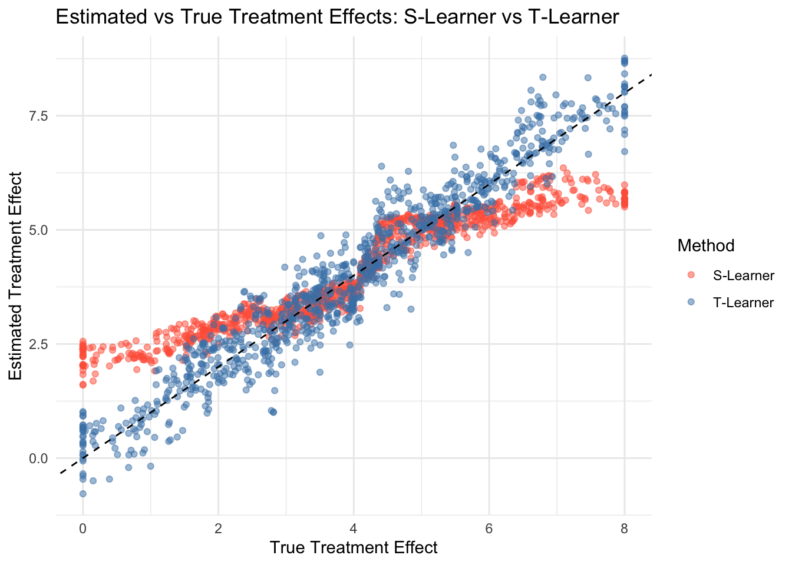
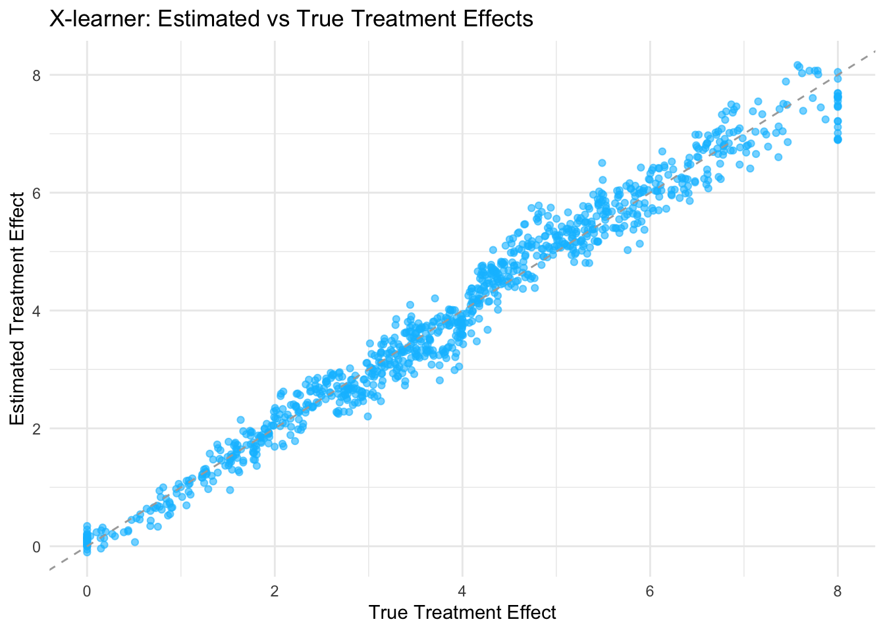

# Meta Learners for Treatment Effects

In the Rubin causal framework, estimating treatment effects—particularly heterogeneous treatment effects—has traditionally relied on a range of econometric methods, including regression adjustment, propensity score methods, matching, inverse probability weighting, and instrumental variables. These approaches emphasize valid statistical inference, allowing researchers to establish confidence intervals, conduct hypothesis tests, and make policy-relevant conclusions with appropriate uncertainty quantification. However, in recent years, machine learning methods have introduced new ways to estimate treatment effects, focusing not just on inference but also on improving predictive performance. One prominent class of these methods is known as meta-learners.

Meta-learners provide a systematic way to estimate Conditional Average Treatment Effects (CATEs) by leveraging machine learning models as base learners. The name "meta-learner" arises from their structure: rather than using a single estimator, these methods decompose the problem into subcomponents—often estimating separate functions for different treatment groups and then combining these estimates to recover the treatment effect. This modular framework allows for greater flexibility, making meta-learners particularly useful in settings with high-dimensional covariates or complex treatment effect heterogeneity. In broad terms, S-learners use a single model for simplicity, T-learners employ two models to better capture heterogeneity, X-learners improve efficiency by balancing bias and variance, R-learners focus on residualized outcomes to control for confounding, and double learners improve robustness by orthogonalizing nuisance components. Additionally, meta-learners can incorporate deep learning architectures or ensembles of multiple models to further improve predictive accuracy, leveraging neural networks, boosting, or stacking techniques.

At first glance, meta-learners may appear similar to the traditional econometric methods used in the Rubin framework. Both approaches rely on estimating potential outcomes under different treatment assignments, and both can be used to estimate individualized treatment effects. However, their core objectives differ. Traditional methods in the Rubin framework prioritize inference—ensuring unbiased estimation, consistency, and well-defined uncertainty quantification. Meta-learners, in contrast, are primarily designed for prediction. The goal is to minimize mean squared error when estimating CATEs rather than focusing on statistical properties such as asymptotic normality or valid confidence intervals. Unlike traditional econometric models, meta-learners do not prioritize interpretability; instead, they are optimized for predictive performance. While some meta-learning methods can be adapted to provide inference, their primary strength lies in their ability to flexibly adapt to complex data structures, leveraging machine learning to estimate treatment effect heterogeneity more efficiently than standard parametric methods. Recent work, such as the R-Learner, has demonstrated that under certain conditions, meta-learners can achieve valid asymptotic properties, bridging the gap between machine learning and econometric inference.

Despite their focus on prediction rather than inference, meta-learners are an important topic for applied economists and social scientists. Even if the primary objective remains causal inference, understanding these methods can offer practical benefits. First, meta-learners can serve as powerful tools for exploratory analysis, helping identify subpopulations where treatment effects may be particularly strong or weak. Second, in policy applications where targeting treatments efficiently is as important as establishing statistical significance, predictive models that rank individuals by treatment effect can be highly valuable. Finally, when combined with techniques that enable valid inference, such as double machine learning or conformal prediction, meta-learners can strike a balance between flexible modeling and statistical rigor.

Given their increasing adoption in applied research, this chapter focuses on meta-learners from the perspective of economists and social scientists. We build on the concepts covered in previous chapters, where we explored traditional methods for treatment effect estimation in the Rubin framework. Here, we introduce meta-learners as a complementary set of tools, discussing their strengths, limitations, and practical implementation. While these methods differ from standard approaches in their emphasis on prediction, they offer a new perspective on treatment effect heterogeneity that can improve empirical analysis. Understanding meta-learners allows researchers to leverage machine learning tools while maintaining a focus on causal questions, ensuring that the insights gained from these methods can be meaningfully integrated into applied research.

## Meta Learners and CATE

Meta learners are algorithms that harness machine learning to estimate CATE, the expected difference in outcomes between treated and control groups for individuals defined by specific covariates. This approach is particularly appealing as it accommodates complex data relationships without stringent parametric assumptions, aligning well with the practical challenges faced by applied researchers and practitioners dealing with real-world datasets. The flexibility of meta learners allows for capturing heterogeneous treatment effects, essential for personalized policy interventions.

In the Rubin Causal Model, potential outcomes for an individual \( i \) given treatment \( T_i \) are defined as:

\begin{equation}
Y_i(1), Y_i(0)
\end{equation}

The individual treatment effect (ITE) is:

\begin{equation}
\tau_i = Y_i(1) - Y_i(0)
\end{equation}

Since we only observe one of these potential outcomes, CATE estimation requires modeling assumptions and statistical methods as we discussed in previous chapters, and (undercertain conditions) CATE is estimated as:

\begin{equation} 
\hat\tau(X) = \mathbb{E}[Y_i(1)| X_i = x] - \mathbb{E}[Y_i(0) | X_i = x] = \mathbb{E}[Y_i(1) - Y_i(0) | X_i = x] 
\end{equation}

Traditional methods such as regression adjustment, matching, inverse probability weighting, and propensity score attempt to recover these effects under identification assumptions (e.g., unconfoundedness or unbiasness). Meta-learners, instead of relying on fixed functional forms, learn patterns from data using flexible models such as random forests, neural networks, and boosting.

## S-Learner (Single Model Approach)

The S-learner, or Single learner, operates by training a single machine learning model to predict outcomes based on both the treatment indicator and covariates. The model is trained on the entire dataset using

\begin{equation}
Y_i = f(X_i, W_i) + \varepsilon_i
\end{equation}

where \(X_i\) represents covariates and \(W_i \in \{0,1\}\) is the treatment indicator. The S-learner treats the treatment variable \(W_i\) as if it were just another covariate in \(X_i\). The estimated CATE for a given set of covariates \(x\) is derived as the difference in predictions when \(W_i\) is set to 1 (treated) versus 0 (control):

\begin{equation}
\hat{\tau}(x) = \hat{f}(x,1) - \hat{f}(x,0)
\end{equation}

where \(\hat{f}(x, w)\) is the predicted outcome from the model. By including the treatment as a feature, the model captures its effect alongside other covariates. This simplicity makes the S-learner computationally efficient, requiring only one model to be trained—a benefit for quick analyses. However, it tends to bias the treatment effect toward zero, especially when the treatment effect is weak relative to other covariates or when regularization is used. This occurs because the model might not sufficiently distinguish between treatment and control groups, potentially underestimating the true effect. For applied researchers, the S-learner is best suited when the relationship among treatment, covariates, and outcomes is relatively simple and when computational efficiency is prioritized.

## T-Learner (Separate Models for Treatment and Control)

The T-learner, or Two learner, employs two separate machine learning models: one for the treatment group and one for the control group. Each model predicts the outcome based on the covariates for its respective group. Observations in the control group (\(W_i = 0\)) are used to estimate the response under control, and observations in the treatment group (\(W_i = 1\)) are used to estimate the response under treatment. The T-learner fits separate models:

\begin{equation}
Y_i(1) = f_1(X_i) + \varepsilon_i, \quad Y_i(0) = f_0(X_i) + \varepsilon_i
\end{equation}

The CATE is then estimated as the difference between these predictions:

\begin{equation}
\hat{\tau}(x) = \hat{f}_1(x) - \hat{f}_0(x)
\end{equation}

where \(\hat{f}_1(x)\) is the predicted outcome from the model trained on the treatment group (\(W_i = 1\)) and \(\hat{f}_0(x)\) is from the model trained on the control group (\(W_i = 0\)). This approach allows for different outcome structures between treated and control units, avoiding the bias toward zero that can affect the S-learner. It is particularly effective when the outcome models for the two groups are distinct and capture group-specific patterns. However, the T-learner requires sufficient data in both groups to train separate models effectively; if one group has fewer observations, this may lead to overfitting or underfitting. Thus, the T-learner is ideal when there are clear differences in outcome models between groups and when sample sizes are balanced.

### Simulation of S-Learner and T-Learner

Let's illustrate the S-Learner and T-Learner for estimating conditional average treatment effects. First, we generate a dataset with two covariates (\(X_1, X_2\)), assign treatment probabilistically based on a logistic function, and define a heterogeneous treatment effect that increases with \(X_1\). The outcome for treated and control units is computed separately, adding random noise. 


``` r
# Load required libraries
library(randomForest)
library(ggplot2)

# Set seed for reproducibility and define the sample size
set.seed(42)
n <- 1000

# Simulate covariates
X1 <- pmax(pmin(rnorm(n, mean = 2, sd = 1), 4), 0)
X2 <- pmax(pmin(rnorm(n, mean = 4, sd = 0.5), 6), 0)
df <- data.frame(X1, X2)

# Simulate treatment assignment based on a logistic model of X1 and X2
p <- plogis(0.5 * X1 - 0.25 * X2)  # true probability of treatment
df$W <- rbinom(n, 1, p)

# Define the true treatment effect as a function of X1 (heterogeneous effect)
tau <- 2 * X1  # treatment effect increases with X1

# Define potential outcomes for control and treated units
mu0 <- 1 + X1 + X2        # baseline outcome for control
mu1 <- mu0 + tau          # outcome for treated includes the treatment effect

# Generate observed outcomes (add noise to simulate randomness)
df$Y <- ifelse(df$W == 1, mu1, mu0) + rnorm(n)
```

In the S-Learner, a single model (random forest) is trained using both covariates and the treatment indicator. CATE is estimated by predicting outcomes under treatment (\(W=1\)) and control (\(W=0\)) and taking the difference. This approach is computationally efficient but may suffer from bias when treatment effects are small.

In the T-Learner, separate models are trained for treated and control units (random forest for treated, linear regression for controls). Each model predicts outcomes, and CATE is obtained by computing the difference between the predictions. This method is more flexible but requires sufficient data in both groups to avoid overfitting.


``` r
# S-Learner Simulation
# Train a single model on the entire dataset including the treatment indicator W.
s_learner_model <- randomForest(Y ~ X1 + X2 + W, data = df)

# Predict potential outcomes for each unit under treatment (W = 1) and control.
df$Yhat_1 <- predict(s_learner_model, newdata = transform(df, W = 1))
df$Yhat_0 <- predict(s_learner_model, newdata = transform(df, W = 0))

# Estimate the CATE as the difference between predicted outcomes
df$s_learner_tau_hat <- df$Yhat_1 - df$Yhat_0

# T-Learner Simulation
# Subset the data into treated and control groups
treated_data <- subset(df, W == 1)
control_data <- subset(df, W == 0)

# Train separate models for the treated and control groups using X1 and X2
t_model <- randomForest(Y ~ X1 + X2, data = treated_data)
c_model <- lm(Y ~ X1 + X2, data = control_data)


# Predict outcomes for all observations using both models
df$Yhat_treated <- predict(t_model, newdata = df)
df$Yhat_control <- predict(c_model, newdata = df)

# Estimate the CATE as the difference in predictions from the two models
df$t_learner_tau_hat <- df$Yhat_treated - df$Yhat_control

# For comparison, Print average treatment effect estimates for each method
df$tau_true <- tau
cat("Average True Treatment Effect:", mean(df$tau_true), "\n")
```

```
## Average True Treatment Effect: 3.949584
```

``` r
cat("Average S-Learner Tau Hat:", mean(df$s_learner_tau_hat), "\n")
```

```
## Average S-Learner Tau Hat: 4.031725
```

``` r
cat("Average T-Learner Tau Hat:", mean(df$t_learner_tau_hat), "\n")
```

```
## Average T-Learner Tau Hat: 4.004821
```

``` r
# Visualization for S-Learner and T-Learner with white background
ggplot(df, aes(x = tau_true)) +
  geom_point(aes(y = s_learner_tau_hat, color = "S-Learner"), alpha = 0.5) +
  geom_point(aes(y = t_learner_tau_hat, color = "T-Learner"), alpha = 0.5) +
  geom_abline(slope = 1, intercept = 0, linetype = "dashed") +
  labs(title = "Estimated vs True Treatment Effects: S-Learner vs T-Learner",
       x = "True Treatment Effect",
       y = "Estimated Treatment Effect",
       color = "Method") +
  scale_color_manual(values = c("S-Learner" = "tomato", "T-Learner" = "steelblue")) +
  theme_minimal()  
```



Finally, we compare the average estimated treatment effects and visualize the estimated vs. true CATE to assess accuracy.

## X-Learner (Cross-Fitting)

The X-learner, a more advanced meta learner, seeks to balance the bias and variance trade-off by combining elements of both S and T learners. It begins by estimating the propensity score, the probability of receiving treatment given the covariates, which helps in weighting the observations. Then, it estimates outcome models for both treatment and control groups, similar to the T-learner, but uses these estimates to create a combined estimator for the CATE that minimizes certain loss functions.

The exact formula of CATE estimate for the X-learner is multilevel, involving both the outcome models and the propensity score, but the intuition is to leverage the separate modeling of the T-learner while adjusting with the single model approach of S-learner, weighted by the propensity score. This method is designed to perform well across various scenarios, offering robustness in estimation. However, its complexity makes it more challenging to implement and understand, requiring careful tuning of the machine learning models.

We start by estimating the outcome functions for the treated and control groups. Let

\begin{equation}
\hat{m}_1(x) = E[Y \mid X=x, W=1] \quad \text{and} \quad \hat{m}_0(x) = E[Y \mid X=x, W=0]
\end{equation}

which are the models for the treated and control outcomes, respectively.

For each treated unit (where \(W=1\)), we impute its treatment effect (pseudo-effects from Künzel et al. (2019)) as

\begin{equation}
\hat{D}^1 = Y - \hat{m}_0(x)
\end{equation}

and for each control unit (where \(W=0\)), the imputed effect is

\begin{equation}
\hat{D}^0 = \hat{m}_1(x) - Y
\end{equation}

These imputed differences serve as preliminary estimates of the individual treatment effects. Next, we fit two regression models: one on the treated units to estimate a function \(\hat{\tau}_1(x)\) that predicts \(\hat{D}^1\) based on \(x\), and another on the control units to estimate \(\hat{\tau}_0(x)\) predicting \(\hat{D}^0\).

Finally, using the estimated propensity score

\begin{equation}
e(x) = P(W=1 \mid X=x)
\end{equation}

we combine the two estimates to obtain the final CATE for a new observation with covariates \(x\) as

\begin{equation}
\hat{\tau}(x) = e(x)\,\hat{\tau}_0(x) + \bigl(1 - e(x)\bigr)\,\hat{\tau}_1(x)
\end{equation}

This step-by-step process—estimating outcome models, computing imputed treatment effects, fitting separate regression models, and finally combining them—forms the basis of the X-learner approach for estimating CATE.

For practitioners, the X-learner is particularly useful when dealing with complex data where a balanced approach to bias and variance is needed, and when a good estimate of the propensity score is available, such as in marketing studies aiming to optimize campaign targeting with heterogeneous customer responses.

### Simulation of X-Learner

Let's illustrate the X-learner approach in R with clear explanations at each step. First, run R-snippet from S and T-learner simulation above to generate simulated data again. Next, we estimate a propensity score (the probability of treatment) using logistic regression on the covariates. This propensity score helps adjust for selection bias when estimating treatment effects.

In step one of the X-learner, we build two outcome models. For treated units, we fit a random forest model predicting Y from X1 and X2 using only the treated subset, and for control units, we fit a linear model on the controls. Using these models, we impute the counterfactual outcomes: for treated observations we predict the outcome they would have had if they had not been treated, and for control observations we predict the outcome if they had been treated. The imputed treatment effects are calculated as the difference between the observed outcome and the predicted counterfactual.

Next, we fit two models on these imputed treatment effects as a function of the covariates. Here we use a linear regression model for the imputed effects from the treated group and a random forest model for those from the control group. Finally, we predict the treatment effect for every observation by combining the two estimates using the propensity score as a weight. The plot at the end helps visualize how closely the estimated treatment effects match the true ones.

Below is the complete R code implementing this simulation:


``` r
# Run the data R-snippet from S and T-learner before running this code
# Estimate the propensity score using logistic regression
ps_model <- glm(W ~ X1 + X2, family = binomial, data = df)
df$ps <- predict(ps_model, type = "response")

# ---------------------- Step 1: Outcome Models ----------------------
# For treated units, we fit a random forest model to predict Y using X1 and X2.
treated_data <- subset(df, W == 1)
rf_treated <- randomForest(Y ~ X1 + X2, data = treated_data)

# For control units, we use a linear regression model to predict Y.
control_data <- subset(df, W == 0)
lm_control <- lm(Y ~ X1 + X2, data = control_data)

# ------------------ Step 2: Impute Counterfactual Outcomes -----
# For treated units: imputed treatment effect is the observed outcome minus 
# the predicted control outcome.
df$D1 <- NA  # imputed effect for treated units
df$D1[df$W == 1] <- df$Y[df$W == 1] - predict(lm_control,
                        newdata = df[df$W == 1,])

# For control units: imputed treatment effect is the predicted 
# treated outcome minus the observed outcome.
df$D0 <- NA  # imputed effect for control units
df$D0[df$W == 0] <- predict(rf_treated,
          newdata = df[df$W == 0,]) - df$Y[df$W == 0]

# ----------- Step 3: Fit Models on Imputed Treatment Effects ----
# For the treated group imputed effects, we fit a linear reg. model.
model_tau1 <- lm(D1 ~ X1 + X2, data = df[df$W == 1,])

# For the control group imputed effects, we fit a random forest model.
rf_tau0 <- randomForest(D0 ~ X1 + X2, data = df[df$W == 0,])

# ---------------- Step 4: Combine Estimates for Final CATE ----------------
# Predict the imputed treatment effect for every obs. from both models.
df$tau1_hat <- predict(model_tau1, newdata = df)  # from treated group
df$tau0_hat <- predict(rf_tau0, newdata = df)       # from control group

# Combine the two estimates using the propensity score as weights.
# This gives the final CATE estimate for each observation.
df$tau_hat <- df$ps * df$tau0_hat + (1 - df$ps) * df$tau1_hat

# For comparison, store the true treatment effect.
df$tau_true <- tau
cat("Average tau_hat:", mean(df$tau_hat), "\n")
```

```
## Average tau_hat: 3.952427
```

``` r
# --------------------------- Visualization ---------------------------
# Plot the estimated treatment effects versus the true treatment effects.
ggplot(df, aes(x = tau_true, y = tau_hat)) +
  geom_point(alpha = 0.6, color = "deepskyblue") +  # soft blue points
  geom_abline(slope = 1, intercept = 0, linetype = "dashed", color = "darkgray") +
  labs(
    title = "X-learner: Estimated vs True Treatment Effects",
    x = "True Treatment Effect",
    y = "Estimated Treatment Effect"
  ) +
  theme_minimal()
```



## R-Learner (Residualized Estimation)

The R-Learner is a two-step approach for estimating heterogeneous treatment effects (CATE) while controlling for confounding (Nie & Wager, 2021). Key idea of R-learner is residualize everything first, then regress the residuals on each other. To estimate the R-Learner using cross-fitting, we introduce sample splitting, ensuring that the residualization step and the final estimation step are performed on separate data folds. This helps reduce overfitting and improves generalization. The cross-fitted R-Learner follows these steps:

**Split the Data into \(K\) Folds:** Divide the dataset into \(K\) non-overlapping folds. Common choices include \(K=2\) (double machine learning) or \(K=5\).
  
**Cross-Fitted Residualization:**
   - For each fold \( k \), train the propensity score model \( \hat{e}^{(-k)}(X) \) and the outcome model \( \hat{m}^{(-k)}(X) \) using all other folds except \( k \).
   - Compute the residualized outcome and treatment for observations in fold \( k \):
   
\begin{equation}
\tilde{Y}^{(k)} = Y - \hat{m}^{(-k)}(X), \quad \tilde{W}^{(k)} = W - \hat{e}^{(-k)}(X)
\end{equation}

**Estimate Treatment Effects:**
   - Using the residualized data from all folds, estimate the CATE function:
   
\begin{equation}
\hat{\tau}(X) = \arg\min_\tau \sum_i (\tilde{Y}_i - \tau(X) \tilde{W}_i)^2 + \lambda R(\tau)
\end{equation}
     
   - This regression step can be performed using any flexible machine learning model (e.g., penalized regression, boosting, or neural networks).

**Repeat for Each Fold & Aggregate:** Aggregate the CATE estimates across folds to obtain the final cross-fitted estimate of \( \hat{\tau}(X) \).

By cross-fitting, we ensure that the residualization step does not use the same data as the final estimation, reducing overfitting and improving robustness in finite samples. We can rewrite the estimation equation in a familiar form that we used to estimate unit-level CATEs from the causal forest chapter. If \(\hat{m}^{-i}(X_i)\) and \(\hat{e}^{-i}(X_i)\) represent cross-fitted estimates—meaning they are trained on all observations except \(i\) (i.e., leave-one-out or general cross-fitting)—then the equation holds: 

\begin{equation}
Y_i - \hat{m}^{-i}(X_i) = (W_i - \hat{e}^{-i}(X_i)) \tau(X_i) + \epsilon_i
\end{equation}

This formulation follows the R-Learner’s residualization step, ensuring that the estimation of \(\tau(X_i)\) is based on residuals computed out-of-sample, thereby reducing bias. By transforming the problem into a standard regression of residualized outcomes on residualized treatment, it allows for the use of flexible machine learning methods to estimate \(\tau(X_i)\). The choice of method depends on the complexity of treatment effect heterogeneity. Simple cases may be handled with linear regression, while more complex relationships require nonparametric methods such as random forests, gradient boosting, or neural networks.

The R-Learner and Double Machine Learning (DML) may look very similar. Both approaches rely on cross-fitting and residualization to mitigate confounding. However, they differ in their primary objectives. DML is designed for estimating sample ATE or parametric CATE in high-dimensional settings while ensuring Neyman-orthogonality, which improves inference validity by reducing bias from regularized machine learning estimators. In contrast, the R-Learner is more flexible and explicitly tailored for nonparametric CATE estimation. While DML often employs penalized regression techniques like LASSO or Ridge, R-Learner can accommodate a broader range of machine learning estimators to model heterogeneous treatment effects more effectively. Thus, although the two methods share similarities, the R-Learner provides a more general framework for capturing treatment effect heterogeneity, while DML prioritizes high-dimensional inference with robustness to regularization bias.

## DR-Learner (Doubly Robust Learner) 

Doubly Robust (DR) Learners are a class of meta-learners that extend the Augmented Inverse Probability Weighting (AIPW) framework to improve estimation of treatment effects. They combine outcome modeling and propensity score weighting in a way that ensures consistency even if one of the models is misspecified. This doubly robust property makes DR-learners particularly attractive in observational studies, where modeling assumptions are often uncertain. Even though there are various DR-Learners, we focus on the one most widely used in machine learning models for estimating CATEs in R and Python (e.g., `grf`, `econml`, `causalML`), as Kennedy (2022) establishes that it achieves the semiparametric efficiency bound for CATE estimation under standard conditions, meaning it is statistically optimal in minimizing variance while remaining robust to model misspecification. 

**Definition and Estimation**
Given an observational dataset \(\{(X_i, W_i, Y_i)\}_{i=1}^{N}\), where \( W_i \in \{0,1\} \) is the treatment indicator, \( Y_i \) is the observed outcome, \( X_i \) is the vector of covariates, the Doubly Robust Learner (DR-Learner) estimates the CATE, \( \tau(X) = E[Y(1) - Y(0) | X] \), in three steps:

**Step 1: Estimating Outcome Models**

Estimate the conditional outcome regression functions separately for treated and control groups:

\begin{equation}
\hat{m}_1(X) = E[Y | X, W = 1], \quad \hat{m}_0(X) = E[Y | X, W = 0]
\end{equation}

These can be estimated using any flexible machine learning method such as random forests, neural networks, or gradient boosting.

**Estimating the Propensity Score**

Estimate the propensity score, \( e(X) = P(W = 1 | X) \), using a classification model:

\begin{equation}
\hat{e}(X) = P(W = 1 | X)
\end{equation}

This is typically done using logistic regression or machine learning models such as gradient boosting or random forests.

**Step 2: Constructing the DR-Adjusted Residuals**

Compute pseudo-outcomes, which correct for selection bias:

\begin{equation}
Y_i^{DR} = \frac{W - \hat{e}(X)}{\hat{e}(X)(1 - \hat{e}(X))} \left( Y - \hat{f}_W(X) \right) + \hat{f}_1(X) - \hat{f}_0(X)
\end{equation}

These pseudo-outcomes adjust the observed data using both outcome models and propensity scores to remove confounding effects.

**Step 3: Final Estimation of \( \tau(X) \)**

CATE estimation can be done using any machine learning regression model (e.g., random forests, boosting, neural networks). Train a machine learning model \( \hat{\tau}(X) \) to predict the pseudo-outcomes:

\begin{equation}
\hat{\tau}(X) = \arg\min_{\tau} \sum_{i=1}^{N} \left( Y_i^{DR} - \tau(X_i) \right)^2
\end{equation}

This is a classic doubly robust, AIPW, estimation where both the regression-based outcome model \( \hat{m}(X) \) and inverse probability weighting (IPW) are used to correct for potential confounding factors. We do not present a simulation here, as it is already covered in the Doubly Robust, AIPW chapter.
\(Y_i^{DR}\) is the mathematically identical AIPW equation, which we covered in doubly robust chapter, just expressed in different notation but equivalent forms. The DR-Learner formulation rewrites doubly robust pseudo-outcome using a single term, \( (W - e(X)) / (e(X)(1 - e(X))) \), which captures the deviation of treatment assignment from the predicted probability. The AIPW formulation explicitly separates the treatment and control contributions using indicator functions \( W \) and \( 1 - W \).

\begin{equation}
Y_i^{DR} = Y_i^{AIPW} = \frac{W_i (Y_i - \hat{m}_1(X_i))}{\hat{e}(X_i)} - \frac{(1 - W_i) (Y_i - \hat{m}_0(X_i))}{1 - \hat{e}(X_i)} + \hat{m}_1(X_i) - \hat{m}_0(X_i)
\end{equation}

**Step 4: Cross-Fitting (Optional but highly recommended)**

To further improve robustness and reduce overfitting, cross-fitting is applied. Cross-fitting improves the reliability of treatment effect estimation by addressing overfitting and bias. By ensuring that nuisance models for propensity scores and outcome regressions are trained on a separate data subset, it prevents overfitting and improves generalization. This separation also reduces bias that arises when the same sample is used for both training and estimation. Additionally, cross-fitting stabilizes estimates, particularly when using flexible machine learning models prone to overfitting. As a result, it is widely applied in Double Machine Learning (DML) and Doubly Robust Learners (DR-Learners) to improve robustness in causal inference. This involves repeating Steps 1 and 2, but swapping the roles of the training and test samples.

**Partition the Data:**  

   - Split the dataset into two independent subsamples: \( D_1^n \) and \( D_2^n \).
   - Estimate the propensity score \( \hat{e}(X) \) and outcome models \( \hat{m}_0(X), \hat{m}_1(X) \) using \( D_1^n \).
   - Compute pseudo-outcomes using the test sample \( D_2^n \).

**Swap the Samples:**  

   - Now, use \( D_2^n \) for training and \( D_1^n \) for testing.
   - Re-estimate the propensity score \( \hat{e}(X) \) and outcome models \( \hat{m}_0(X), \hat{m}_1(X) \) on \( D_2^n \).
   - Compute pseudo-outcomes for observations in \( D_1^n \).

**Final Estimation:**  

   - Take the average of the two resulting estimates as the final treatment effect estimate:
   
   \begin{equation}
   \hat{\tau}(X) = \frac{1}{2} \left( \hat{\tau}^{(1)}(X) + \hat{\tau}^{(2)}(X) \right)
   \end{equation}
   
where \( \hat{\tau}^{(1)}(X) \) and \( \hat{\tau}^{(2)}(X) \) are the treatment effect estimates from the two folds.

**Generalization to \( K \)-Fold Cross-Fitting:**  

   - Instead of using two folds, the process can be extended to \( K \)-fold cross-fitting.
   - The dataset is split into \( K \) folds, and the above process is repeated across all folds.
   - The final estimate is obtained by averaging over all folds.

The R-Learner estimates treatment effects by first residualizing outcomes and treatment, making it effective when outcome-treatment relationships are smooth. However, if either the outcome model or the propensity score model is misspecified, those errors propagate into the final treatment effect estimate, potentially leading to bias. In contrast, the DR-Learner applies Augmented Inverse Probability Weighting (AIPW), ensuring robustness if either model is correctly specified. This makes DR-Learner more reliable in cases where there is uncertainty about the correct functional form of the outcome or treatment assignment models. 

When choosing between these methods, the decision depends on the structure of the data and the reliability of the underlying models. The R-Learner is preferable when one is confident that the outcome and treatment relationships can be well captured through residual regression, making it a useful choice for relatively smooth and stable data. On the other hand, the DR-Learner is the better option when robustness is a priority, particularly in situations where confounding must be addressed even when one of the nuisance models is misspecified.

## CATE vs. ITE

Estimating the impact of an intervention at the individual level is a key challenge in causal inference. While the Individual Treatment Effect (ITE) is the true difference in potential outcomes for a specific individual, it is fundamentally unobservable because we never see both treated and untreated outcomes for the same person. Instead, researchers estimate the CATE, which represents the expected treatment effect for individuals with the same observed characteristics.  

Meta-learners are designed to estimate CATE by leveraging machine learning models. When covariates fully explain treatment effect heterogeneity, CATE can serve as a close approximation for ITE. However, if unobserved factors influence treatment effects, CATE remains an average effect over a group rather than an individual-level estimate. This distinction is critical in applications like personalized medicine or policy targeting, where decision-making relies on precise individual predictions. While meta-learners provide powerful tools for estimating heterogeneous effects, their reliability in approximating ITE depends on the richness of available covariates and the assumption of no unobserved confounders.  

Alaa, Ahmad, and van der Laan (2023) introduce Conformal Meta-Learners, an extension of traditional meta-learning frameworks that integrates conformal prediction to provide valid uncertainty quantification for ITE estimation. Unlike standard meta-learners, which primarily focus on point estimates of CATE, this approach ensures that the predicted treatment effects come with reliable confidence intervals, maintaining finite-sample validity regardless of the underlying machine learning model. By leveraging conformal inference, the method adapts to distributional complexities and provides robust uncertainty estimates, making it especially useful in high-stakes decision-making scenarios like personalized medicine, policy interventions, and targeted marketing.  

The framework builds upon existing meta-learners (e.g., T-, S-, X-, and R-Learners) but incorporates a calibration step using a holdout dataset to generate prediction intervals that maintain a pre-specified confidence level. This makes the approach model-agnostic while improving robustness against heteroskedasticity and distributional shifts. The paper demonstrates that conformal meta-learners can significantly improve the reliability of treatment effect estimates, particularly in settings where standard meta-learners may struggle with uncertainty quantification. Researchers and practitioners looking for causal inference methods with formal guarantees on prediction reliability may find this framework particularly useful. Their GitHub repository is (https://github.com/AlaaLab/conformal-metalearners)).

For a comprehensive overview of meta-learners, Kunzel et al.(2019) provide a detailed review covering the S-, T-, and X-learners, along with their applications in translating supervised learning methods into CATE estimators. Their discussion offers a clear and accessible introduction to these techniques, making it a useful resource for researchers interested in applying machine learning to causal inference. Additionally, Salditt et al. (2024) offer a tutorial introduction to heterogeneous treatment effect estimation with meta-learners, including detailed explanations and simulations with code, which can help practitioners implement these methods in empirical research.  

For readers interested in more advanced methods, Nie & Wager (2021) introduce the R-Learner, a powerful approach that optimizes residualized learning for CATE estimation. This method is particularly effective in high-dimensional settings where balancing covariates is crucial. Additionally, Kennedy (2022) discusses improvements in Doubly Robust (DR) Learning, a method designed to improve causal effect estimation by combining outcome modeling and propensity score weighting. His work explores optimal approaches for reducing bias and variance in heterogeneous treatment effect estimation. 

  


