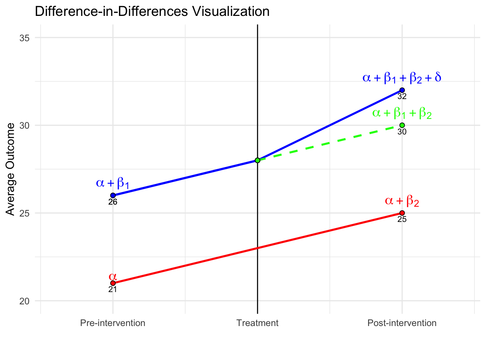

# Difference in Differences and DML-DiD

This chapter returns to one of the most common strategies for addressing selection on unobservables: Difference-in-Differences (DiD). After introducing instrumental variables in Chapter 22 and developing a range of tools for estimating heterogeneous treatment effects—including causal forests and meta-learners in Chapters 23 to 25—we now revisit settings where unobserved factors may bias treatment assignment, but where panel data and policy variation over time provide opportunities for credible causal identification. The chapter begins with fixed effect models, classical DiD and Two-Way Fixed Effects (TWFE) models, extends to event study designs and cohort-specific treatment effects, and highlights the limitations of traditional DiD estimators under treatment heterogeneity or staggered adoption. 

We then introduce the Double Machine Learning for DiD (DML-DiD) estimator, which combines Neyman-orthogonal scores with machine learning to address high-dimensional confounding while preserving valid inference. The chapter includes an extended discussion on how to implement DML-DiD in practice, followed by a detailed simulation. We also cover how to extend DML-DiD to more realistic settings involving multiple time periods and staggered treatment adoption, as well as a discussion on handling time-varying continuous treatments within this framework. Throughout the chapter, we highlight recent advances, including papers, software packages, and resources released within the last few months, ensuring readers are equipped with both the foundational intuition and up-to-date tools needed to navigate and apply recent DiD methods. In the next chapter, we continue exploring solutions to selection on unobservables through synthetic control and regression discontinuity designs.

## Panel Data, Fixed Effects, and Causal Inference

Until now, we have focused on models based on cross-sectional data, where observations come from different units at a single point in time. However, many empirical questions involve data that track the same units over multiple periods. This introduces panel data (also called longitudinal data), which consists of repeated observations on the same units—such as individuals, firms, or regions—over time. Unlike purely cross-sectional data, panel data allows us to account for time-invariant characteristics that could otherwise introduce bias in traditional regression models. By following the same entities over time, we can control for unobserved heterogeneity that does not change over time, improving the reliability of our estimates.  

Panel data is widely used in labor economics, health economics, and firm-level studies where individual or firm-specific factors remain constant over time. For example, estimating the impact of job training on wages using cross-sectional data may suffer from omitted variable bias due to unobserved ability differences. Panel data allows us to control for such factors by tracking individuals over time, improving causal inference.  

Panel data methods provide a powerful framework for addressing unobserved confounders that do not vary over time. Unlike standard cross-sectional approaches that rely on selection on observables, panel techniques allow us to control for unobserved heterogeneity by leveraging within-unit variation. The key idea is that while some confounders may remain unmeasured, as long as they are constant for each unit over time, they can be removed through appropriate transformations. A key assumption in panel models is strict exogeneity, requiring that \( E(\varepsilon_{it} | X_{i1}, ..., X_{iT}, \alpha_i) = 0 \). However, in many cases—such as policy interventions or endogenous regressors—this assumption is violated, leading to biased estimates.  

In Chapter 2, we examined how to estimate the effect of \( X \) on \( Y \) within a regression framework. The coefficient \( \beta_1 \) captures this effect, but in a simple cross-sectional setting, it primarily reflects association rather than causation. To obtain an unbiased estimate of \( \beta_1 \), we assume a randomly drawn sample and model the relationship as:  

\begin{equation}
y_i = \beta_0 + \beta_1 x_{i1} + \ldots + \beta_k x_{ik} + \epsilon_i,
\end{equation}

where the error term \( \epsilon_i \) satisfies \(E(\epsilon_i) = 0 \quad \text{and} \quad \operatorname{Cov}(x_{ij}, \epsilon_i) = 0 \quad \text{for all } j\). These conditions ensure unbiased and consistent coefficient estimates. However, as discussed, we cannot include all covariates related to \( Y \) due to various limitations, including unobservability, which introduces bias in the coefficient estimates. If we have panel data, incorporating fixed effects allows us to control for all time-invariant unit-specific factors, improving the reliability of our estimates.  

A typical panel data regression model extends the standard cross-sectional framework to incorporate both unit-specific and time-specific effects:  

\begin{equation}
y_{it} = \alpha_i + \beta X_{it} + \gamma_t + \varepsilon_{it},
\end{equation}

where \( y_{it} \) is the outcome for unit \( i \) at time \( t \), \( X_{it} \) represents explanatory variables, \( \alpha_i \) captures unit-specific effects (fixed or random), \( \gamma_t \) accounts for time-fixed effects, controlling for common shocks (e.g., macroeconomic trends), \( \varepsilon_{it} \) is the error term.  

Several approaches exist for estimating the effect of \( X \) on \( Y \) in panel data settings-such as Random Effects[^extramod] and Dynamic Panel Models[^extramod2]-each with different assumptions and trade-offs. We will not cover these here.

[^extramod]: Random Effects (RE) Models: The random effects (RE) model assumes that unit-specific effects \( \alpha_i \) are uncorrelated with explanatory variables \(\left( E(\alpha_i | X_{it}) = 0 \right)\). If true, RE estimation is more efficient than fixed effects, as it retains between-unit variation. However, if \(\operatorname{Cov}(\alpha_i, X_{it}) \neq 0\), RE estimates are biased, making fixed effects preferable when unobserved heterogeneity is a concern.

[^extramod2]:Dynamic Panel Models: When past values of the dependent variable influence future outcomes, dynamic panel models introduce lagged dependent variables:  
\[
y_{it} = \rho y_{i,t-1} + \beta X_{it} + \alpha_i + \gamma_t + \varepsilon_{it}
\]
OLS or fixed effects estimation in this case leads to bias when \( T \) is small, as \( y_{i,t-1} \) is correlated with the error term. Methods like Generalized Method of Moments (GMM) address this bias but add complexity and require strong assumptions. In panel settings, especially with long \( T \), serial correlation in errors (\( E(\varepsilon_{it}, \varepsilon_{i,t-1}) \neq 0 \)) is common, requiring robust standard errors or techniques like generalized least squares (GLS) for correction. These topics are covered in standard econometrics texts, while this section focuses on estimating causal/treatment effects.

One of the most common methods is the fixed effects (FE) model, which accounts for unobserved heterogeneity by allowing each unit to have its own intercept (\( \alpha_i \)). This approach eliminates time-invariant confounders by focusing on within-unit variation over time. The basic transformation in a fixed effects model removes \( \alpha_i \) by demeaning or differencing:

\begin{equation}
(y_{it} - \bar{y}_i) = \beta (X_{it} - \bar{X}_i) + (\varepsilon_{it} - \bar{\varepsilon}_i)
\end{equation}

where \( \bar{y}_i \) and \( \bar{X}_i \) are the averages of \( y_{it} \) and \( X_{it} \) over time for each unit \( i \). By subtracting these averages, any time-invariant factors (including unobserved confounders) are removed. This method is particularly useful when selection into treatment is correlated with individual characteristics that do not change over time. Fixed effects estimation provides unbiased estimates of \( \beta \) under the assumption that omitted variables are time-invariant. However, it does not address time-varying unobserved confounders, which can still bias estimates. Additionally, because it removes between-unit variation, it is less efficient than alternative models when within-unit variation is small.  

While panel methods help control for time-invariant unobserved confounders, they still rely on the assumption that within-unit variation in \( X_{it} \) is exogenous. That is, we assume:  

\begin{equation}
E(\varepsilon_{it} | X_{it}, \alpha_i) = 0
\end{equation}

However, this assumption is often unrealistic, especially when policy changes, treatment assignments, or external shocks are not randomly assigned. Standard panel models do not directly account for unobserved, time-varying confounders, requiring more sophisticated approaches to causal inference.  
In earlier discussions on causal inference, we introduced the Rubin causal model, which emphasizes the importance of a well-defined treatment and control group for identifying causal effects. Using panel data techniques, we can improve causal estimation by controlling for individual-specific and time-specific confounders (both observable and unobservable), leading to more credible estimates of treatment effects.  

In Chapter 18, we discussed how controlling for observed covariates (\(X\)) allows us to estimate the Average Treatment Effect (ATE) under the assumption of selection on observables. A basic linear regression model with treatment serves as the baseline approach:  

\begin{equation}
Y_i = \alpha + \delta D_i + X_i^\top \beta + \varepsilon_i
\end{equation}

where \( \delta \) represents the difference between treated and untreated units after adjusting for \( X_i \). If treatment effects are homogeneous, \( \delta \) captures a constant ATE. However, in many cases, treatment effects may vary across individuals based on observable characteristics, leading to the CATE: 

\begin{equation}
CATE(X) = E[Y(1) - Y(0) | X]
\end{equation}

This formulation accounts for treatment effect heterogeneity, recognizing that policy impacts or interventions may differ across units.  

Incorporating panel data further refines this estimation by allowing us to control for time-invariant confounders. The baseline treatment model can be extended to a panel data setting as follows: 

\begin{equation}
Y_{it} = \alpha_i + \delta D_{it} + X_{it}^\top \beta + \gamma_t + \varepsilon_{it}
\end{equation}

where \( \alpha_i \) captures unit-specific effects, and \( \gamma_t \) accounts for time-fixed effects. This specification improves estimation by using within-unit variation in treatment while controlling for common time shocks.  

While panel models mitigate bias from time-invariant unobserved heterogeneity, they still require strong assumptions. In particular, strict exogeneity of \( X_{it} \) is crucial: 

\begin{equation}
E(\varepsilon_{it} | X_{i1}, ..., X_{iT}, \alpha_i) = 0
\end{equation}

Violations of this assumption—such as policy endogeneity or time-varying unobserved confounders—can still lead to biased estimates.  

A natural experiment arises when external events or policy changes create variation in exposure to an intervention that mimics random assignment. We discussed several examples in Chapter 22. In such cases, treatment is not assigned by the researcher but occurs due to circumstances outside their control (i.e. exogenous shock), often allowing for meaningful comparisons between treated and control groups. By using techniques such as difference-in-differences (DiD) and two-way fixed effects (TWFE). These methods leverage variation in treatment timing to account for confounding factors, improving causal inference beyond standard panel models.  

## Difference-in-Differences (DiD)

Difference-in-Differences (DiD) is a widely used tool in empirical research to estimate the causal effect of a treatment or intervention when randomized experiments are not feasible. The core idea is simple: compare how outcomes change over time in a treated group versus a control group. The key identifying assumption is known as the parallel trends assumption—that, in the absence of treatment, the treated and control groups would have experienced the same average change in outcomes over time. This assumption allows us to attribute any additional change in the treated group, beyond what is observed in the control group, to the effect of the treatment.

To build intuition, we begin with the simplest 2×2 setup involving a binary treatment. This setting includes two groups—treated and untreated—and two time periods—before and after treatment. One group is exposed to the treatment in the second period, while the other remains untreated throughout. We observe the same outcome variable across both groups and time periods. The goal is to estimate the causal effect of the treatment by comparing changes in outcomes over time between the two groups.

This setup is often summarized in a 2×2 table, where we examine average outcomes across groups and time:
\begin{table}[h]
    \centering
    \renewcommand{\arraystretch}{1.5}
    \caption{Group Mean Outcomes by Treatment and Time}
    \label{tab:group_means}
    \vspace{0.5cm}
    \begin{tabular}{|c|c|c|}
        \hline
        & Pre-Treatment ($T=0$) & Post-Treatment ($T=1$) \\
        \hline
        \textbf{Treated ($D=1$)} & $E[Y_i(0) \mid D=1]$ & $E[Y_i(1) \mid D=1]$ \\
        \hline
        \textbf{Untreated ($D=0$)} & $E[Y_i(0) \mid D=0]$ & $E[Y_i(1) \mid D=0]$ \\
        \hline
    \end{tabular}
\end{table}


Table: (\#tab:unnamed-chunk-1)Group Mean Outcomes by Treatment and Time

|<span style='font-weight:normal;'>Group</span> |<span style='font-weight:normal;'>Pre-Treatment ($T=0$)</span> |<span style='font-weight:normal;'>Post-Treatment ($T=1$)</span> |
|:----------------------------------------------|:--------------------------------------------------------------|:---------------------------------------------------------------|
|Treated ($D=1$)                                |$E[Y_i(0) \mid D=1]$                                           |$E[Y_i(1) \mid D=1]$                                            |
|Untreated ($D=0$)                              |$E[Y_i(0) \mid D=0]$                                           |$E[Y_i(1) \mid D=0]$                                            |
 Suppose we want to evaluate whether a job training program improves wages. We measure average wages for two groups—those who enroll in the program (treated) and those who don’t (control)—before and after the program starts.

Imagine the treated group’s average wage rises from \$2600 to \$3200, while the control group’s average wage increases from $2100 to $2500 over the same time. Both groups see wage growth, which could be due to factors like inflation or general economic trends. However, the treated group’s increase is larger. The DiD method isolates the portion of this extra growth that can be attributed to the program. Specifically, we subtract the control group’s wage change ($400) from the treated group’s wage change ($600), yielding a DiD estimate of $200. This $200 reflects the program’s estimated effect on wages, assuming that, without treatment, both groups would have experienced similar wage trends.

This logic can be expressed formally with the DiD formula:

\begin{equation}
\delta^{ATT} = (E[Y_{post} | D=1] - E[Y_{pre} | D=1]) - (E[Y_{post} | D=0] - E[Y_{pre} | D=0])
\end{equation}

where \( D = 1 \) indicates treatment and \( D = 0 \) indicates control, and "pre" and "post" refer to before and after treatment. The first term measures the actual change in the treated group, while the second captures the expected change without treatment (approximated using the control group’s change). In the sections that follow, we will show how to estimate this using regression, extend the model to include covariates and continuous treatments, and finally consider the two-way fixed effects (TWFE) framework where treatment timing or intensity may vary. At each stage, we will highlight the assumptions required and potential limitations.

DiD can also be estimated using a simple regression model. The regression includes a group indicator (\( D_i \)), a time indicator (\( T_t \)), and an interaction term (\( D_i \times T_t \)), which captures the treatment effect. The model is:

\begin{equation}
Y_{it} = \alpha + \beta_1 D_i + \beta_2 T_t + \delta (D_i \times T_t) + \varepsilon_{it}
\end{equation}

Here, \( \delta \) is the coefficient on the interaction term and represents the DiD estimate. It tells us how much more the treated group’s outcome changed relative to the control group’s change. Using the wage example, this regression would recover the same $200 effect if estimated properly.

\begin{table}[h]
    \centering
    \renewcommand{\arraystretch}{1.3}
    \caption{Expected Outcomes from DiD Regression Model}
    \label{tab:regression_2x2}
    \scriptsize
    \vspace{0.2cm}
\begin{tabular}{p{0.20\textwidth} p{0.23\textwidth} p{0.25\textwidth} p{0.25\textwidth}}
        \toprule
        & \textbf{Pre-Treatment ($T{=}0$)} & \textbf{Post-Treatment ($T{=}1$)} & \textbf{Difference (Post - Pre)} \\
        \midrule
        \textbf{Treated ($D{=}1$)} & $\alpha + \beta_1$ & $\alpha + \beta_1 + \beta_2 + \delta$ & $\beta_2 + \delta$ \\
        \textbf{Untreated ($D{=}0$)} & $\alpha$ & $\alpha + \beta_2$ & $\beta_2$ \\
        \textbf{Difference (T - U)}  & $\beta_1$ & $\beta_1 + \delta$ & \textbf{DiD = $\delta$} \\
        \bottomrule
    \end{tabular}
\end{table}


Table: (\#tab:unnamed-chunk-2)Expected Outcomes from DiD Regression Model

|<span style='font-weight:normal;'> </span>               |<span style='font-weight:normal;'>Pre-Treatment<br>($T{=}0$)</span> |<span style='font-weight:normal;'>Post-Treatment<br>($T{=}1$)</span> |<span style='font-weight:normal;'>Difference<br>(Post - Pre)</span> |
|:--------------------------------------------------------|:-------------------------------------------------------------------|:--------------------------------------------------------------------|:-------------------------------------------------------------------|
|Treated (<span style='font-size:small;'>$D=1$</span>)    |$\alpha + \beta_1$                                                  |$\alpha + \beta_1 + \beta_2 + \delta$                                |$\beta_2 + \delta$                                                  |
|Untreated (<span style='font-size:small;'>$D=0$</span>)  |$\alpha$                                                            |$\alpha + \beta_2$                                                   |$\beta_2$                                                           |
|Difference (<span style='font-size:small;'>T - U</span>) |$\beta_1$                                                           |$\beta_1 + \delta$                                                   |**DiD = $\delta$**                                                  |

The table presents the expected outcomes implied by the regression model for both treated and untreated groups, before and after treatment. For the untreated group, the average outcome increases from \(\alpha\) in the pre-treatment period to \(\alpha + \beta_2\) in the post-treatment period, capturing the baseline time trend. For the treated group, the outcome rises from \(\alpha + \beta_1\) to \(\alpha + \beta_1 + \beta_2 + \delta\), reflecting both the time trend and the treatment effect. The change over time for the control group is \(\beta_2\), while for the treated group it is \(\beta_2 + \delta\). The DiD estimate \(\delta\) isolates the additional change in the treated group relative to the control, which is attributed to the treatment. 

Similarly, we can interpret the DiD estimate by comparing the treated and control groups at each point in time—essentially a cross-sectional comparison. Prior to treatment, the treated group has an expected outcome of $\alpha + \beta_1$, while the control group’s is $\alpha$, yielding a difference of $\beta_1$. This term captures any existing differences between the groups, which may reflect both observable and unobservable characteristics unrelated to the treatment. In randomized experiments, careful design aims to minimize this baseline gap by ensuring that the groups are as similar as possible before the intervention.

Following treatment, the expected outcome for the treated group becomes $\alpha + \beta_1 + \beta_2 + \delta$, while for the control group it is $\alpha + \beta_2$, producing a difference of $\beta_1 + \delta$. Taking the difference between these two cross-sectional gaps—$(\beta_1 + \delta) - \beta_1$—removes the pre-existing difference and isolates the causal impact of the treatment, $\delta$. This group-by-time comparison provides an alternative but equivalent way to understand the DiD estimate obtained from the regression.

The figure below illustrates the Difference-in-Differences framework and the key elements of the identification strategy. The solid red and blue lines show the observed trends for the control and treated groups, respectively. Prior to the intervention, both groups follow similar trajectories, consistent with the parallel trends assumption. The vertical black line marks the onset of treatment. After this point, the treated group’s outcome increases more sharply than the control group’s, suggesting a treatment effect. The dashed green line depicts the counterfactual—what the treated group’s outcome would have been in the absence of treatment, assuming they had continued along the same path as the control group. The vertical distance between the treated group’s observed outcome and this counterfactual captures the DiD estimate.





  

One key feature illustrated in the figure is the constant difference in outcome before treatment. This is depicted by the parallel movement of the treated and control groups before the intervention, reinforcing the parallel trends assumption required for DiD to yield unbiased estimates. The difference between the treated and counterfactual post-treatment values represents the estimated treatment effect (\(\delta\)).

Additionally, the inclusion of a pre-treatment period extending further back in time (if data for multiple pre-treatment periods is available) provides further reassurance that the parallel trends assumption holds. Extending the visual representation in the pre-treatment period highlights the stable gap between the treated and control groups, reinforcing the idea that any deviation after treatment is likely due to the intervention rather than pre-existing differences.

 As discussed, from the cross-sectional perspective, the treated group starts at \(\beta_1\) above the control group; after treatment, the gap grows to \(\beta_1 + \delta\), again implying that \(\delta\) captures the treatment effect. Now, suppose we only observed post-treatment data. In that case, we could compare outcomes between treated and untreated individuals and use methods like regression adjustment or matching under the selection-on-observables framework. These methods rely on the assumption that, after conditioning on observed covariates, the treated and control groups are comparable. Any difference in outcomes could then be attributed to the treatment. However, if there are unobserved differences between groups that also affect outcomes, the estimated treatment effect would be biased.

This is where the strength of the DiD approach becomes clear. Because it uses both pre- and post-treatment data, DiD accounts not only for observed covariates (which can be included in the regression, as discussed below) but also for any time-invariant unobserved differences between the groups. These may include observable or unobservable factors and characteristics that do not change over time, all of which are differenced out by this method. As long as the parallel trends assumption holds, DiD effectively eliminates this potential bias. That’s a major advantage of the method—it protects against omitted variable bias due to unobserved, time-invariant group differences and common shocks affecting all groups equally over time, which purely cross-sectional methods cannot address.


### Controlling for Additional Covariates in DiD  

The basic Difference-in-Differences (DiD) model estimates the causal effect of a treatment by comparing the changes in outcomes between treated and control groups over time. A fundamental assumption of this approach is the parallel trends assumption, which states that in the absence of treatment, the outcome variable would have followed the same trajectory in both groups. While this assumption enables identification, the precision of the estimated treatment effect can be improved by controlling for additional covariates that influence the outcome variable.  

A more general DiD specification that includes time-varying covariates is given by:  

\begin{equation}
Y_{it} = \alpha + \beta_1 D_i + \beta_2 T_t + \delta (D_i \times T_t) + \beta X_{it} + \varepsilon_{it},
\end{equation}

where \( X_{it} \) is a vector of time-varying covariates that may affect \( Y_{it} \), such as demographic characteristics, economic conditions, or firm-specific factors. \( \beta \) represents the coefficients associated with these covariates, capturing their independent influence on the outcome. \( \delta \) is the DiD estimate, which measures the treatment effect after controlling for covariates.  

Including \( X_{it} \) in the model serves several purposes. First, it reduces residual variance, thereby improving the efficiency of the estimate for \( \gamma \). Second, it helps account for potential confounding if observable factors differ systematically between treated and control groups. However, it is important to note that adding covariates does not alter the identification strategy—the parallel trends assumption must still hold after conditioning on \( X_{it} \). If unobserved factors simultaneously influence both the treatment decision and the outcome, the estimate may still suffer from omitted variable bias.  

**Assessing the Parallel Trends Assumption**  

Since the credibility of DiD depends on the parallel trends assumption, researchers should conduct robustness checks to validate this assumption. Several diagnostic tools can help assess whether the assumption is reasonable:  

- **Pre-trends analysis:** This involves testing whether the treated and control groups exhibit similar trends in the outcome variable before treatment. If the groups show systematic differences in trends before the intervention, the estimated treatment effect may be biased.  

- **Placebo tests:** A falsification test where treatment is artificially assigned at an earlier period when no intervention actually occurred. If a significant treatment effect is detected, it suggests that unobserved factors may be driving the results rather than the actual treatment. 

- **Sensitivity analyses:** Researchers can test the robustness of their findings by modifying the control group, adjusting covariates, or varying the sample period to see if the estimated effect remains consistent.  

If the parallel trends assumption appears violated, alternative approaches such as synthetic control methods—which construct a weighted combination of control units to better match the pre-treatment trajectory of the treated group—or interactive fixed effects models, which allow for heterogeneous trends across units, may be more appropriate.  

### Two-Way Fixed Effects (TWFE) with Covariates

The Two-Way Fixed Effects (TWFE) model is a standard extension of the basic Difference-in-Differences (DiD) framework, particularly well-suited for panel data where units are observed over multiple time periods. It generalizes the simple two-group, two-period DiD design to settings with many units and multiple time periods, enabling researchers to estimate causal effects while controlling for both unit-specific and time-specific sources of unobserved heterogeneity.

The basic TWFE specification, when including time-varying covariates, takes the following form:

\begin{equation}
Y_{it} = \alpha_i + \gamma_t + \gamma^{TWFE} (D_i \times T_t) + \beta X_{it} + \varepsilon_{it}
\end{equation}

where \( Y_{it} \) is the outcome for unit \( i \) at time \( t \), \( \alpha_i \) represents unit fixed effects, accounting for time-invariant unobserved heterogeneity across units (e.g., baseline productivity, geographic characteristics), \( \gamma_t \) captures time fixed effects, which absorb shocks common to all units at time \( t \) (e.g., macroeconomic trends, national policies), \( D_i \times T_t \) is the interaction term indicating whether unit \( i \) is treated in period \( t \), \( \gamma^{TWFE} \) is the coefficient of interest and represents the estimated treatment effect, \( X_{it} \) is a vector of time-varying covariates, and \( \beta \) denotes the associated coefficients, \( \varepsilon_{it} \) is the idiosyncratic error term.

This model is attractive for several reasons. First, by controlling for both \(\alpha_i\) and \(\gamma_t\), it eliminates confounding from any unobserved factors that are constant within a unit over time or that affect all units equally in a given period. This is particularly important in observational settings where unobserved heterogeneity is a primary threat to identification. For example, regional differences in institutional quality or persistent individual characteristics like ability can be absorbed by \(\alpha_i\), while national-level events or policies influencing all units are captured by \(\gamma_t\).

Second, the inclusion of \( X_{it} \) allows the researcher to control for observed time-varying covariates that may affect the outcome. These might include income, education, employment status, household size, or any other variable that varies over time and could confound the relationship between treatment and outcome. Including these covariates can improve estimation precision and may also make the parallel trends assumption more plausible by adjusting for compositional changes over time.

It is worth emphasizing, however, that controlling for \( X_{it} \) does not change the identifying assumptions of the model. The validity of the TWFE estimate still depends on the assumption that, conditional on fixed effects and \( X_{it} \), the treated and untreated units would have followed parallel trends in the absence of treatment. If this conditional parallel trends assumption is violated, the TWFE estimate may be biased even if relevant covariates are included.

One useful feature of the TWFE framework is that it absorbs all time-invariant covariates, whether observed or unobserved. That means researchers do not need to include static characteristics such as gender or ethnicity directly in the model, as their effects are captured by the unit fixed effects. However, the model only leverages within-unit variation over time, and any variable that does not change across time for a given unit will not contribute to identification.

Despite these advantages, the TWFE estimator has important limitations. In particular, the model implicitly assumes that the treatment effect is constant across all treated units and time periods. In many empirical settings, this assumption is unlikely to hold. For example, the impact of a training program might differ between early and late adopters, or the effect of a tax policy might change as the economy evolves. When treatment effects are heterogeneous across units or over time, and especially when treatment is adopted at different times by different units (i.e., staggered adoption), the TWFE estimator can produce biased and misleading results.

This issue arises because, under staggered timing, TWFE estimators use already-treated units as controls for later-treated units. If the treatment effect varies by treatment timing or duration, this comparison is problematic. In some cases, it can even reverse the sign of the estimated effect or generate estimates that reflect a non-convex, weighted average of various treatment effects that lacks a clear interpretation.

Due to these concerns, researchers increasingly turn to alternative methods when treatment timing varies or treatment effects are expected to differ across cohorts. These alternatives—such as group-time average treatment effect estimators or event study designs—allow for more flexible modeling of treatment dynamics and avoid the contamination issues associated with staggered adoption.

In summary, the TWFE model with covariates is a powerful and widely used method for estimating causal effects using panel data. It effectively controls for time-invariant unit characteristics and period-specific shocks, and it improves precision through the inclusion of time-varying covariates. However, its validity rests on strong assumptions—particularly, that treatment effects are homogeneous and that treated and control groups would have followed parallel trends. When these assumptions are not met, especially in the presence of staggered treatment timing, alternative strategies should be considered to ensure credible and interpretable results.

The treatment effect \( \gamma^{TWFE} \) is identified from within-unit variation over time. This means the model compares changes in outcomes within the same unit before and after treatment and contrasts that change with the corresponding change in units that did not receive treatment. Any covariates that do not vary over time for a given unit (e.g., race, gender, baseline location) are absorbed by the fixed effects and do not need to be included explicitly in the model.

### Event Study Designs

Event study designs are a natural and powerful extension of the Difference-in-Differences (DiD) framework, especially well-suited to settings where treatment is not assigned at a single point in time or where treatment effects are expected to evolve. While traditional DiD models estimate a single average treatment effect, this approach is often too restrictive in real-world applications where treatments occur in staggered fashion (i.e., different units are treated at different times), or where the effects of the intervention vary over time or across units.

Event study designs address these limitations by allowing the estimation of dynamic treatment effects—that is, the causal effects of treatment at different time periods before and after the treatment event. Instead of summarizing treatment impact with one number, event study methods trace out how the outcome variable responds over time relative to the moment of treatment. This is especially useful in applications like evaluating labor market reforms, education policies, health interventions, or any gradual policy rollout, where understanding timing and dynamics of effects is essential.

The standard event study regression model is specified as:

\begin{equation}
Y_{it} = \alpha_i + \gamma_t + \sum_{k \neq -1} \beta_k D_{it}^k + \varepsilon_{it}
\end{equation}

where \( Y_{it} \) is the outcome of interest for unit \( i \) at time \( t \), \( \alpha_i \) are unit (individual, firm, region) fixed effects that control for time-invariant differences across units, \( \gamma_t \) are time fixed effects that absorb aggregate shocks or trends common to all units in each period, \( D_{it}^k \) is a dummy variable equal to 1 if unit \( i \) is \( k \) periods away from treatment at time \( t \) (e.g., 2 years before or 1 year after), \( \beta_k \) captures the effect of being \( k \) periods relative to treatment (the event time), the reference period, often \( k = -1 \), is omitted so all estimated \( \beta_k \) coefficients are interpreted relative to it, \( \varepsilon_{it} \) is an idiosyncratic error term.

This structure provides a sequence of estimated treatment effects over time, allowing for a dynamic view of causal impact. For example, one can estimate the effect one year before treatment (\( \beta_{-1} \)), at the time of treatment (\( \beta_0 \)), and at various lags after treatment (\( \beta_1, \beta_2, \dots \)).

**Why Event Study Designs Matter**

Event studies offer several advantages over conventional DiD models:

1. **They uncover dynamics**: Rather than assuming an immediate or constant treatment effect, event studies reveal when the treatment effect materializes, how it builds over time, and whether it fades out or persists.
   
2. **They test the parallel trends assumption**: A key assumption in DiD is that treated and control groups would have followed similar trends in the absence of treatment. Event study estimates before treatment (i.e., leads) help assess this. If the pre-treatment coefficients \( \beta_k \) for \( k < 0 \) are flat and close to zero, it supports the idea of parallel pre-trends. If they are statistically or economically significant, it raises concerns about potential bias.

3. **They reveal anticipation or spillover effects**: If outcomes change before treatment is implemented, this could indicate anticipation of the policy (e.g., individuals adjusting behavior in advance) or leakage/spillovers from treated to untreated units. Both challenge the internal validity of standard DiD models and can be visualized and tested using event study estimates.

4. **They are interpretable and visual**: Event study coefficients are typically plotted with confidence intervals against event time, making it easy to communicate patterns over time. Such plots are widely used in applied research to present treatment dynamics and validate identification assumptions.

**Practical Considerations**

To estimate an event study model, researchers must define treatment timing at the unit level (i.e., when each treated unit receives the intervention). Untreated units are included as control observations across all time periods, and treated units contribute to estimation based on their event time. When using balanced panels, every unit contributes information for the same number of leads and lags relative to treatment. In unbalanced or staggered panels, care is needed to ensure appropriate interpretation and avoid composition bias—where the sample of units contributing to each event time changes over time.

One practical challenge is the limited support for certain event time dummies, particularly at long leads or lags, where few units remain in the sample. In such cases, estimates for those periods may be imprecise. Researchers sometimes bin far-out event times (e.g., grouping all \( k < -4 \) into a single lead) to address this.

Another important issue is normalization: typically, one event time (often \( k = -1 \)) is omitted from the regression and serves as the reference period. The interpretation of all estimated coefficients is therefore relative to this omitted baseline, and results can be sensitive to this choice if pre-trends are present.

**Event Studies in the Presence of Staggered Treatment Timing**

In recent years, growing attention has been paid to how event study models interact with staggered adoption—where units are treated in different periods. When treatment effects are heterogeneous (i.e., vary across units or over time), standard two-way fixed effects (TWFE) event studies can produce biased or misleading estimates. This is because units treated earlier may inadvertently act as controls for units treated later, contaminating the counterfactual.

Several recent contributions address this problem. Alternative estimators such as those proposed by Callaway and Sant’Anna (2021), Sun and Abraham (2021), and de Chaisemartin and D’Haultfœuille (2020) adjust for the fact that units treated at different times contribute unequally to identification. These estimators often involve:

* Computing group-time average treatment effects, estimating the effect separately for each cohort and time period,
* Aggregating effects across cohorts only when appropriate, with attention to weighting and dynamic structure,
* Providing event-study-style plots that are robust to heterogeneity and contamination.

A more recent development by de Chaisemartin and D’Haultfœuille (2024) further extends this framework to accommodate non-binary, non-absorbing, and dynamic treatment settings. In many empirical applications, treatment intensity varies across units and over time—consider tax rates, pollution exposure, or credit availability—where the treatment is not a simple “on/off” switch. Moreover, treatment may be non-absorbing, meaning that once treated, units are not necessarily always treated thereafter; they can exit treatment or move to different treatment levels. This violates the assumptions underpinning many common event-study estimators.

Their proposed estimator, $\text{DID}_{g,\ell}$, captures the effect of being exposed to a higher (or lower) treatment level for $\ell$ periods, relative to a group’s baseline treatment level. It is constructed by comparing changes in outcomes for "switcher" groups to those of comparable groups that have not yet changed treatment and share the same initial treatment level. Crucially, this estimator maintains the core logic of classical difference-in-differences: it computes differences in outcomes over time, between treated and untreated groups, and then takes differences of those differences. At its core, $\text{DID}_{g,\ell}$ is a linear estimator. Although it is designed to handle far more complex settings—including time-varying, continuous, and lagged treatments—it still relies on linear combinations of group-time average outcomes, just like the standard DID.

In addition to this baseline estimator, the authors propose normalized estimators that scale treatment effects by the magnitude of the treatment change, making them interpretable as dose-response slopes. They also define a cost-benefit parameter that aggregates the total impact of treatment changes over time, allowing policy analysts to evaluate whether observed treatment trajectories led to welfare gains relative to a counterfactual of no change.

These estimators are implemented in the Stata command `did_multiplegt_dyn` and the companion R package `didMultiplegt`, both of which are user-friendly and designed for applied researchers. Full documentation, including detailed examples, simulation programs, and replication materials, is available at the authors’ GitHub page: [https://github.com/chaisemartinPackages/did\_multiplegt\_dyn](https://github.com/chaisemartinPackages/did_multiplegt_dyn). The site provides guidance on how to structure data, apply the estimators, interpret output, and generate event-study plots robust to treatment heterogeneity and lagged dynamics. Whether using Stata or R, users can follow well-documented code templates to implement actual-versus-status-quo estimators, normalized treatment effects, or dynamic policy evaluation parameters. In the last section of this chapter, we will also revisit time-varying continuous treatments and introduce estimators that implement the DML method, allowing for the incorporation of various machine learning techniques. 

**Best Practices**

To apply event study methods effectively, researchers should:

- Clearly define the treatment event and ensure that timing is measured consistently across units,

- Choose an appropriate window of event time for estimation and decide whether to bin tails,

- Always include unit and time fixed effects, unless compelling theoretical reasons suggest otherwise,

- Examine pre-treatment coefficients carefully for signs of violation of the parallel trends assumption,

- Report robustness checks using alternative specifications (e.g., excluding certain leads or using alternative control groups),

- Consider newer methods if treatment is staggered or heterogeneous, to ensure valid causal interpretation.

In summary, event study designs represent a flexible, informative, and transparent approach to estimating treatment effects over time. They improve the standard DiD framework by allowing for rich temporal dynamics, testing identification assumptions, and improving credibility in the presence of complex policy rollouts. When used carefully, they serve as an essential tool for applied researchers seeking to understand not just whether an intervention worked—but when, how, and for whom it had its effects.

### Heterogeneous Treatment Effects in DiD

A core assumption in traditional Difference-in-Differences (DiD) models—especially those estimated via Two-Way Fixed Effects (TWFE)—is that the treatment effect is homogeneous, meaning it is constant across units and time. However, this assumption rarely holds in practice. In many empirical settings, the impact of a policy or intervention varies depending on when a unit is treated, how long it has been exposed, and who the unit is. These differences are especially pronounced in settings with staggered treatment adoption, where units receive treatment at different points in time rather than all at once.

When treatment effects are heterogeneous, TWFE DiD models can become problematic. Although these models are appealing for their simplicity and ability to control for unit and time fixed effects, they implicitly construct comparisons not just between treated and untreated units but also between earlier- and later-treated units. In such cases, units that have already been treated can serve as controls for units that are just about to be treated. If the treatment effect is not constant over time or across units, this practice generates invalid counterfactuals and can lead to biased or misleading estimates.

The bias stems from the way the TWFE estimator weights the comparisons. In settings with staggered treatment and varying treatment effects, the TWFE estimator often produces a weighted average of many different treatment effects, including some with negative weights. This means that the estimated coefficient is not simply an average of all individual treatment effects, but rather a mixture of effects that are aggregated in potentially nontransparent and nonrepresentative ways. As a result, the TWFE coefficient may not reflect the actual treatment effect for any identifiable group, and in some cases, it may even have the wrong sign.

These concerns have led to a broader rethinking of how to estimate treatment effects when timing and heterogeneity matter. Rather than relying on a single, pooled treatment effect, recent approaches emphasize the need to allow treatment effects to vary flexibly over time and across groups. This involves estimating what are often called group-time average treatment effects, where effects are computed separately for each cohort of treated units (i.e., those treated in the same time period) and each post-treatment period. Such disaggregated estimates are then aggregated across cohorts using transparent and policy-relevant weighting schemes.

Importantly, the identification of these group-time effects requires appropriate control groups—typically, units that have not yet been treated by that time or those that are never treated. By focusing only on valid comparisons (e.g., treated versus not-yet-treated or never-treated), these methods avoid the contamination issues that plague TWFE estimators in staggered settings.

Another useful approach involves dynamic DiD designs, where treatment effects are modeled as a function of "event time"—the number of periods relative to when a unit received treatment. This allows researchers to estimate how treatment effects evolve over time (e.g., short-run vs. long-run impacts) and whether effects accumulate or dissipate. These designs also allow for checking the parallel trends assumption by examining pre-treatment dynamics.

In applied work, accounting for heterogeneity is not just a technical refinement—it can meaningfully change the interpretation of results. If, for example, early adopters of a policy benefit more (or less) than late adopters, or if the treatment effect grows over time, averaging across these differences can obscure key policy insights. For policymakers, understanding when and for whom an intervention is effective is often as important as knowing whether it works on average.

In sum, when treatment timing varies and heterogeneous effects are likely, relying on traditional TWFE DiD estimators may be insufficient and even misleading. Instead, researchers should adopt frameworks that allow for cohort-specific, time-varying, and event-time-dependent treatment effects. 

### Where to Go Next: Tools, Resources, and Recent Advances

The treatment of heterogeneous effects in DiD settings is one of the most active areas of causal inference research today. While this chapter has provided the conceptual foundation and highlighted key challenges, our goal is not to offer a full econometric treatment. Instead, the purpose here is to build foundational intuition and introduce the types of challenges that arise when treatment effects vary across units or evolve over time, especially in settings with staggered adoption. Rather than detailing every methodological advance, our aim is to provide a clear framework for recognizing these issues and to point you to the most practical, readable, and up-to-date resources for further exploration. If you are interested in applying more robust DiD methods—particularly those that integrate modern causal inference and machine learning techniques—several resources stand out:

- For a broader theoretical and practical overview, the recent survey by Dmitry Arkhangelsky and Guido Imbens (*Causal Models for Longitudinal and Panel Data: A Survey*, 2024) is an excellent reference. It discusses a wide range of models, including DiD extensions, factor models, synthetic control methods, and interactive fixed effects, with a strong emphasis on empirical implementation and practical guidance for applied researchers.  
  The published version appears in *The Econometrics Journal*: [https://doi.org/10.1093/ectj/utae014](https://doi.org/10.1093/ectj/utae014)

- A valuable application and review of these newer methods can be found in the large-scale reanalysis study by Chiu, Lan, Liu, and Xu (2025) titled *Causal Panel Analysis under Parallel Trends: Lessons from A Large Reanalysis Study*. This paper replicates 49 published articles that used TWFE estimators, reanalyzing them with multiple modern, heterogeneity-robust approaches. Their results underscore how sensitive conclusions can be to modeling assumptions—and how necessary it is to test for violations of parallel trends and to account for heterogeneous effects.  
  You can access the paper here: [https://doi.org/10.48550/arXiv.2309.15983](https://doi.org/10.48550/arXiv.2309.15983)

- Finally, for a hands-on, design-oriented perspective, the Practitioner’s Guide by Baker, Callaway, Cunningham, Goodman-Bacon, and Sant’Anna (*Difference-in-Differences Designs: A Practitioner’s Guide*, 2025) provides a well-organized roadmap through the current DiD landscape. The paper offers practical discussion of design choices, covariate adjustment, multiple periods, and weighting strategies across different DiD estimators—including advice on navigating real-world complications. The working paper is available here: [https://arxiv.org/pdf/2503.13323](https://arxiv.org/pdf/2503.13323) and wonderful web page is here [https://psantanna.com/did-resources/](DiD Resources)
 
- A comprehensive and highly accessible resource for applied researchers is the fortcoming book by Clément de Chaisemartin and Xavier D’Haultfœuille titled *Credible Answers to Hard Questions: Differences-in-Differences for Natural Experiments* (2025). This work introduces modern DiD estimators suited for complex natural experiments where randomized trials are infeasible. The book provides intuitive explanations, detailed practical guidance, and implementation-ready insights for navigating heterogeneity, dynamic treatment effects, and violations of standard assumptions. It is particularly useful for researchers aiming to obtain credible causal estimates in messy, real-world settings. The most recent version is available at authors webpage or SSRN: [https://ssrn.com/abstract=4487202](https://ssrn.com/abstract=4487202).
 
- For readers seeking an up-to-date and practical overview of the most recent developments in Difference-in-Differences methods across R, Stata, and Julia, a highly recommended resource is Asjad Naqvi’s website: [https://asjadnaqvi.github.io/DiD/](https://asjadnaqvi.github.io/DiD/). This site offers a curated and hands-on guide to modern DiD packages, including detailed explanations, code examples, and comparisons across platforms. It covers tools such as `did`, `did2s`, `bacondecomp`, and others, and provides working implementations, tutorials, and links to the underlying methods. For researchers looking to move beyond traditional TWFE and explore robust, modern DiD estimators, this site’s Resources section is especially valuable—it compiles recent papers, lecture notes, workshops, and videos that provide both conceptual background and practical guidance on current best practices in causal panel analysis. 

- The `fect` R package developed by Yiqing Xu and colleagues provides a user-friendly implementation of factor-based models and interactive fixed effects for causal panel data analysis. This package is particularly useful when treatment timing is staggered and unobserved time-varying confounders may be present. You can explore the package and documentation here: [https://yiqingxu.org/packages/fect/](https://yiqingxu.org/packages/fect/).

The goal of this book is to provide a machine-learning-oriented approach to causal inference in panel settings, with an emphasis on flexible methods that go beyond the standard TWFE model. We do not attempt to fully cover the expanding list of heterogeneity-robust DiD estimators; rather, our goal in this chapter is to build foundational intuition and to introduce the types of challenges that arise when treatment effects vary or when treatment is staggered. Readers seeking to apply the most recent heterogeneity-robust DiD estimators today should view this chapter as a conceptual bridge and use the references above as their starting point for practical implementation.

## Double Machine Learning for DiD Estimation

This section introduces a recent, machine-learning-based approach to estimating causal effects in panel settings with treatment variation across time and units. We focus on the Double Machine Learning for Difference-in-Differences (DML-DiD) estimator, which blends the robustness of Neyman-orthogonal score functions with the flexibility of machine learning to handle high-dimensional covariates. We begin with the foundational ideas from semiparametric DiD estimators like Abadie (2005), then show how these ideas break down when naively combined with machine learning. We build intuition for Chang’s (2020) DMLDiD estimator, which resolves these issues using orthogonal scores and cross-fitting. A full simulation demonstrates how to implement the estimator step by step, including model selection and trimming. We then extend the framework to multiple time periods and staggered treatment designs, following Callaway and Sant’Anna (2021), and show how to apply DML-DiD in practice to estimate dynamic group-time treatment effects. This section prepares readers to apply DML in realistic policy settings—where treatment is introduced gradually and treatment effects may vary over time and across units—while maintaining valid inference even with complex, high-dimensional data.

This section focuses on the estimator proposed in *Double/Debiased Machine Learning for Difference-in-Differences Models* by Chang (2020), which introduces the DMLDiD estimator. This estimator allows researchers to use machine learning (ML) methods in high-dimensional settings while still obtaining valid causal inferences using the difference-in-differences (DiD) approach.

The paper addresses a common challenge in causal inference: how to incorporate high-dimensional covariates and ML methods into DiD models without sacrificing the validity of the estimates. Traditional and semiparametric DiD estimators work well under low-dimensional settings and with classical nonparametric methods (like kernels), but they can break down when ML methods are used to estimate first-stage nuisance parameters (like propensity scores). This is due to potential overfitting and slow convergence rates.

A previous study is Abadie (2005), which proposes a semiparametric DiD estimator for the average treatment effect on the treated (ATT). The identification of ATT relies on conditional parallel trends and overlap assumptions. Under these assumptions, Abadie shows that ATT can be identified using the following expression:

\begin{equation}
\theta_0 = \mathbb{E} \left[ \left( Y_i(1) - Y_i(0) \right) \cdot \frac{D_i - P(D_i = 1 \mid X_i)}{P(D_i = 1) (1 - P(D_i = 1 \mid X_i))} \right]
\end{equation}

In practice, the semiparametric estimator is implemented by estimating the propensity score \( \hat{g}(X_i) = \hat{P}(D_i = 1 \mid X_i) \) and then computing the sample analog:

\begin{equation}
\hat{\theta} = \frac{1}{N} \sum_{i=1}^N (Y_i(1) - Y_i(0)) \cdot \frac{D_i - \hat{g}(X_i)}{\hat{p} (1 - \hat{g}(X_i))}
\end{equation}

where \( \hat{p} \) is the estimator of treated share. As we estimate ATT, inverse probability weighting is applied only to the control group, so treated units are not weighted by the propensity score.Samples with covariates similar to the treated group receive larger weights because they contribute more credible counterfactual information.

Samples in the control group that have a distribution of covariates closer to that of the treated units are given higher weights because they provide more relevant counterfactual information. This estimator performs well when \( \hat{g}(X) \) is estimated using classical nonparametric methods like kernels or series in low-dimensional settings but is sensitive to misspecification or overfitting when ML is used to estimate the propensity score.

Chang builds on Abadie’s (2005) semiparametric DiD estimator by designing a new estimator that is Neyman orthogonal, meaning it is robust to small errors in first-stage ML estimates.[^scorefnc]

[^scorefnc]:The orthogonal score function for the repeated outcomes case, shown as Equation (3.1) in Chang (2020), is:
\begin{align*}
\psi_1(W, \theta_0, p_0, \eta_{10}) 
&= \frac{Y(1) - Y(0)}{P(D = 1)} \cdot \frac{D - P(D = 1 \mid X)}{1 - P(D = 1 \mid X)} - \theta_0 \notag \\
&\quad - \frac{D - P(D = 1 \mid X)}{P(D = 1)(1 - P(D = 1 \mid X))} \cdot \mathbb{E}[Y(1) - Y(0) \mid X, D = 0]
\end{align*}
This score function is constructed to be Neyman orthogonal, meaning its first-order derivative with respect to the nuisance components is zero. That is, small estimation errors in the first-stage nuisance parameters—specifically the propensity score \( g_0(X) = P(D = 1 \mid X) \) and the outcome regression function \( \ell_{10}(X) = \mathbb{E}[Y(1) - Y(0) \mid X, D = 0] \)—do not affect the leading term of the estimator’s distribution. This orthogonality enables valid inference even when these nuisance functions are estimated using flexible, high-dimensional ML methods.

To estimate ATT, Chang combines this orthogonal score (see footnote) with the cross-fitting algorithm from Chernozhukov et al. (2018). The dataset is partitioned into \( K \) folds, and for each fold \( I_k \), the nuisance functions—the propensity score \( \hat{g}_k(X) \) and the outcome model \( \hat{\ell}_{1k}(X) \)—are estimated using only the data from the complementary sample \( I_k^c \). The key insight is that these functions are estimated separately from the fold in which the final treatment effect is computed, which guards against overfitting and improves robustness. The intermediate fold-specific estimator is

\begin{equation}
\tilde{\theta}_k = \frac{1}{n} \sum_{i \in I_k} \frac{D_i - \hat{g}_k(X_i)}{\hat{p}_k (1 - \hat{g}_k(X_i))} \cdot \left( (Y_i(1) - Y_i(0)) - \hat{\ell}_{1k}(X_i) \right)
\end{equation}

where \( \hat{p}_k = \frac{1}{n} \sum_{i \in I_k^c} D_i \). The final DMLDiD estimator aggregates across folds: \( \hat{\theta} = \frac{1}{K} \sum_{k=1}^K \tilde{\theta}_k \).

The component \( \hat{\ell}_{1k}(X_i) \) estimates the counterfactual pre-post outcome difference for unit \( i \) had they not been treated. It is learned using only the control group data and models the expected evolution of outcomes conditional on \( X \), i.e., \( \mathbb{E}[Y(1) - Y(0) \mid X, D = 0] \). The DMLDiD estimator thus subtracts this predicted counterfactual change from the observed change in treated units. This isolates the treatment effect while controlling for differential trends due to observed characteristics.

As in Abadie (2005), the untreated units are reweighted by the inverse of the estimated propensity score to ensure comparability with the treated group. Both the propensity score \( \hat{g}_k(X) \) and the treatment share \( \hat{p}_k \) are estimated via cross-fitting, further preventing overfitting. Samples that closely resemble the treated group based on covariates receive larger weights, reinforcing their role as credible counterfactuals in the estimation.

A Monte Carlo simulation shows that while plugging ML into Abadie’s estimator creates bias, the proposed DMLDiD corrects for this and remains centered at the true treatment effect. Chang applies DMLDiD to Sequeira’s (2016) dataset on tariff reductions and bribe payments between South Africa and Mozambique. While Sequeira's traditional DiD model estimated a significant drop in corruption from tariff cuts, Chang finds an even stronger effect using DMLDiD. However, DMLDiD provides more robust estimates with smaller standard errors, suggesting that the original estimates may have understated the average treatment effect due to functional form misspecification and omitted heterogeneity.

### Step-by-Step Implementation

Estimate the Average Treatment Effect on the Treated (ATT) in a Difference-in-Differences setup using panel data. This approach combines flexible ML methods to estimate nuisance functions—propensity scores and outcome regressions—while preserving valid inference through Neyman-orthogonal scores.

**Step 0: Inputs**

Start with panel data:
- \( Y_{i0} \): Pre-treatment outcome  
- \( Y_{i1} \): Post-treatment outcome  
- \( D_i \in \{0, 1\} \): Treatment indicator (treated only in post-period)  
- \( X_i \): Covariate vector (possibly high-dimensional)

**Step 1: Compute Outcome Differences**

For each unit:

\[
\Delta Y_i = Y_{i1} - Y_{i0}
\]

**Step 2: Cross-Fitting Setup**

Split the data into \( K \) folds (e.g., \( K = 5 \)).  
Each observation is assigned to one fold for test prediction; models are trained on the remaining \( K - 1 \) folds.

**Step 3: Estimate Nuisance Functions with ML (Fold-by-Fold)**

For each fold \( k \in \{1, \dots, K\} \):
- Use fold \( k \) as the test set.
- Use remaining folds as the training set.

**3.1 Estimate Treatment Share**
Compute the average treatment probability in the training data:

\[
\hat{p} = \mathbb{E}[D] = \frac{1}{n_{\text{train}}} \sum_{i \in \text{train}} D_i
\]

This value is used to normalize the orthogonal score. Compute and store it separately for each fold.

**3.2 Estimate Propensity Score**

\[
\hat{g}(X) = \mathbb{P}(D = 1 \mid X)
\]

Estimate this using a classification model fit on the training data:

```r
fit <- cv.glmnet(X_train, D_train, family = "binomial")
g_hat <- predict(fit, newx = X_test, type = "response")
```

**Alternative ML methods:**
- Logistic regression (`glm`)
- Random forests (`randomForest`)
- Gradient boosting (`xgboost`)
- Neural nets (`keras`)

**3.3 Estimate Outcome Model for Controls**

\[
\hat{\ell}(X) = \mathbb{E}[\Delta Y \mid D = 0, X]
\]

Train this model using **only untreated units** in the training data. Predict on all test observations:

```r
lasso_model <- cv.glmnet(X_train[D_train == 0, ], 
                                               DeltaY_train[D_train == 0])
ell_hat <- predict(lasso_model, newx = X_test)
```

**Alternative ML methods:** Ridge, Lasso, forests, boosting, etc.

**Step 4: Model Evaluation and Trimming (Optional)**

**Before trimming**, evaluate model performance:

```r
rmse_d <- sqrt(mean((D - g_hat)^2))
rmse_y <- sqrt(mean((DeltaY[D == 0] - ell_hat[D == 0])^2))
```

Trimming is optional but helps avoid instability when \( \hat{g}(X) \) is close to 0 or 1:

```r
trim_idx <- g_hat > 0.05 & g_hat < 0.95
g_hat    <- g_hat[trim_idx]
DeltaY   <- DeltaY[trim_idx]
ell_hat  <- ell_hat[trim_idx]
D        <- D[trim_idx]
```

**Step 5: Compute Neyman-Orthogonal Score (Chang, 2020)**

Using the estimated nuisance functions and \( \hat{p} \) from each fold, compute the orthogonal score for each observation \( i \):

\[
\psi_i = \frac{D_i - \hat{g}(X_i)}{\hat{p} (1 - \hat{g}(X_i))} \cdot \left( \Delta Y_i - \hat{\ell}(X_i) \right)
\]

This score is orthogonal to first-stage estimation error, which ensures robustness even when ML is used.

```r
p_hat <- mean(D_train)  # estimated on training data
psi <- ((D - g_hat) / (p_hat * (1 - g_hat))) * (DeltaY - ell_hat)
att_meanpsi <- mean(psi)
```

**Step 6: Estimate ATT**

Normalize by the reweighted treatment indicator:

\[
\text{Normalization factor} = \frac{1}{n} \sum_{i=1}^n \frac{D_i}{\hat{p}}
\]

In most cases—where \( \hat{p} \) is constant across units—this factor is ≈1 and can be skipped. But it ensures correct scaling with cross-fitting.

\[
\hat{\theta}_{\text{DMLDiD}} =
\begin{cases}
\frac{1}{n} \sum_{i=1}^n \psi_i & \text{(no normalization)} \\
\frac{\text{mean}(\psi_i)}{\text{Normalization factor}} & \text{(with normalization)}
\end{cases}
\]

```r
att_normfactor <- mean(D / p_hat)
att <- att_meanpsi / att_normfactor
```

**Step 7: Estimate Standard Error (Plug-in Estimator)**

The standard error is calculated from the variance of \( \psi_i \):

\[
\text{SE}(\hat{\theta}) = \sqrt{ \frac{1}{n} \sum_{i=1}^n \psi_i^2 }
\]

This follows from Neyman orthogonality, which ensures \( \mathbb{E}[\psi_i] = \theta \) and \( \text{Var}(\hat{\theta}) = \frac{1}{n} \mathbb{E}[\psi_i^2] \).

```r
phihat <- ((D - g_hat) / (p_hat * (1 - g_hat))) * (DeltaY - ell_hat) / att_normfactor
se <- sqrt(mean(phihat^2) / length(phihat))  # Plug-in standard error
```

### Double-Machine Learning DiD Simulation

Let’s now demonstrate a simulation that follows the step-by-step procedure outlined in the previous section. While we have already discussed the intuition and mechanics of each component in detail, this simulation puts them into practice using synthetic panel data. The code reflects the core logic of the DMLDiD estimator: it uses cross-fitting to estimate nuisance functions, compares multiple candidate models based on out-of-fold RMSE, applies trimming to avoid extreme weights, and computes a Neyman-orthogonal score to obtain a bias-robust ATT estimate. The procedure evaluates multiple candidate models for both the propensity score (e.g., Logit, Random Forest) and the outcome model for controls (e.g., Lasso, XGBoost).

There is currently no ready-to-use R package that implements this full DMLDiD pipeline with candidate model selection, trimming, and normalization. This simulation is designed to be modular and transparent so that readers can understand each part of the process and adapt or improve it for their own applications. For example, you can easily extend the code to include more candidate ML methods, adjust cross-fitting settings, or apply it to real-world panel datasets. The code also improves upon and corrects the original version by Chang (2020) by implementing a normalized version of the estimator and introducing a more flexible structure for candidate model comparison and selection. The code can serve as both a learning tool and a template for empirical implementation.


``` r
# --- Load necessary libraries ---
library(randomForest); library(xgboost); library(caret); library(glmnet)

# --- Step 0: Simulate and Prepare Data ---
set.seed(123)
n <- 1000
data <- data.frame(X1 = rnorm(n), X2 = rnorm(n), X3 = rnorm(n))
data$D <- rbinom(n, 1, 1/(1 + exp(-0.5*data$X1 + 0.3*data$X2 - 0.1*data$X3)))
data$Y0 <- 2 + 0.5*data$X1 + 0.3*data$X2 + rnorm(n)
data$Y1 <- data$Y0 + 1 + 2*data$D + rnorm(n)
# --- Step 1: Compute Outcome Differences as DeltaY ---
data$DeltaY <- data$Y1 - data$Y0
# --- Step 2: Cross-Fitting Setup ---
K <- 5  # Number of folds
folds <- createFolds(data$D, k = K, list = TRUE, returnTrain = FALSE)
# Vectors to store candidate predictions and observed outcomes across all folds
g_hat_logit_all <- g_hat_rf_all <- ell_hat_lasso_all <- ell_hat_xgb_all <- rep(NA, n)
D_obs <- DeltaY_obs <- p_hat_all <- rep(NA, n)

# --- Loop over Folds ---
for(k in 1:K) {
  test_idx <- folds[[k]]
  train_idx <- setdiff(1:n, test_idx)
  
  train_data <- data[train_idx, ]
  test_data  <- data[test_idx, ]
  
  # --- 3.1 Estimate Treatment Share p_hat---
  p_hat_all[test_idx] <-mean(train_data$D)  
  
  # --- 3.2 Estimate Propensity Score ---
  #Trained on training data, predict on test data
  #Gives the estimated probability g_hat(X_i) for each test unit using 
  # Candidate 1: Logit model using glm
  logit_model <- glm(D ~ X1 + X2 + X3, family = binomial(link = "logit"),
                     data = train_data)
  g_hat_logit_all[test_idx] <- predict(logit_model, newdata = test_data, 
                                       type = "response")
  
  # Candidate 2: Random Forest model
  rf_model <- randomForest(as.factor(D) ~ X1 + X2 + X3, data = train_data)
  g_hat_rf_all[test_idx] <- predict(rf_model, newdata = test_data, 
                                    type = "prob")[,2]
  
#Store out-of-fold predictions and observed D_i for later comparison and scoring
  D_obs[test_idx] <- test_data$D
  
  # --- 3.3 Estimate Outcome Model l_hat(X) for Controls ---
  # Candidate model trained on training data using only control units (D == 0)
  control_train <- train_data[train_data$D == 0, ]
  
  # Candidate 1: Lasso model using cv.glmnet
  X_train_ctrl <- as.matrix(control_train[, c("X1", "X2", "X3")])
  y_train_ctrl <- control_train$DeltaY
  lasso_model <- cv.glmnet(X_train_ctrl, y_train_ctrl)
  #Prediction is made for all test units, regardless of their treatment status.
  ell_hat_lasso_all[test_idx] <- predict(lasso_model, 
        newx = as.matrix(test_data[, c("X1", "X2", "X3")]), s = "lambda.min")
  
  # Candidate 2: XGBoost model
  X_train_ctrl_xgb <- as.matrix(control_train[, c("X1", "X2", "X3")])
  params <- list(objective = "reg:squarederror", max_depth = 3, 
                 eta = 0.1, subsample = 0.8)
  xgb_model <- xgboost(data = X_train_ctrl_xgb, label = y_train_ctrl,
                     params = params, nrounds = 50, verbose = 0)
  ell_hat_xgb_all[test_idx] <- predict(xgb_model, 
                    newdata = as.matrix(test_data[, c("X1", "X2", "X3")]))
  #Store predictions of l_hat and observed \deltaY_i for use in orthogonal score
  DeltaY_obs[test_idx] <- test_data$DeltaY
}

# --- Overall Candidate Selection and Trimming (after the loop) ---
#Calculate RMSE for each candidate using the full test-set predictions
#Select the candidate with the lowest RMSE 
# Propensity Score Selection
rmse_prop <- c(
  sqrt(mean((D_obs - g_hat_logit_all)^2, na.rm = TRUE)),  # Model 1
  sqrt(mean((D_obs - g_hat_rf_all)^2, na.rm = TRUE))      # Model 2
)
best_prop_idx <- which.min(rmse_prop)
g_hat_final <- list(g_hat_logit_all, g_hat_rf_all)[[best_prop_idx]]
cat("Best (lowest rmse) propensity score is model:", best_prop_idx, "\n")  
```

```
## Best (lowest rmse) propensity score is model: 1
```

``` r
# Outcome Model Selection
control_idx <- which(D_obs == 0)
rmse_outcome <- c(
  sqrt(mean((DeltaY_obs[control_idx] - ell_hat_lasso_all[control_idx])^2,
            na.rm = TRUE)),  # Model 1
  sqrt(mean((DeltaY_obs[control_idx] - ell_hat_xgb_all[control_idx])^2,
            na.rm = TRUE))     # Model 2
)
best_outcome_idx <- which.min(rmse_outcome)
ell_hat_final <- list(ell_hat_lasso_all, ell_hat_xgb_all)[[best_outcome_idx]]
# 1=Lasso, 2=XGBoost
cat("Best (lowest rmse) outcome is model:", best_outcome_idx, "\n") 
```

```
## Best (lowest rmse) outcome is model: 1
```

``` r
# Trimming: Remove extreme propensity scores (applied on the overall predictions)
trim_idx_final <- (g_hat_final > 0.05 & g_hat_final < 0.95)
g_hat_final <- g_hat_final[trim_idx_final]
p_hat_final <- p_hat_all[trim_idx_final]  # corresponding p_hat values
D_obs_final <- D_obs[trim_idx_final]
DeltaY_final <- DeltaY_obs[trim_idx_final]
ell_hat_final <- ell_hat_final[trim_idx_final]

# --- Step 5: Compute Neyman-Orthogonal Score ---
# All components used are predictions from earlier steps
# on test data to compute the orthogonal score
psi_final <- ((D_obs_final - g_hat_final) / (p_hat_final * 
          (1 - g_hat_final))) * (DeltaY_final - ell_hat_final)

# --- Step 6: Estimate ATT with Normalization ---
# Normalize by the average of D_obs_final / p_hat_final
att_normfactor <- mean(D_obs_final / p_hat_final, na.rm = TRUE)

# Final ATT is the normalized mean of the scores
ATT_est <- mean(psi_final, na.rm = TRUE) / att_normfactor

# --- Step 7: Estimate Standard Error (Plug-in Estimator) ---
SE_ATT <- sqrt(var(psi_final, na.rm = TRUE) / sum(!is.na(psi_final))) / att_normfactor

# --- Output the Results ---
cat("Estimated ATT (DMLDiD):", round(ATT_est, 3), "\n")
```

```
## Estimated ATT (DMLDiD): 1.966
```

``` r
cat("Standard Error:", round(SE_ATT, 3), "\n")
```

```
## Standard Error: 0.091
```

### Extension of DML-DiD to multiple time periods

The Double Machine Learning Difference-in-Differences (DML-DiD) estimator, originally developed for two-period treatment-control settings, can be naturally extended to staggered treatment adoption and multiple time periods, following the framework proposed by Callaway and Sant’Anna (2021, *REStat*). Their method estimates group-time average treatment effects, ATT(g,t), where *g* is the period when a unit is first treated and *t* is any post-treatment period. For each (g,t) pair, treated units are compared to those not yet treated by time *t*. This structure supports flexible estimation of treatment effects that vary across groups and over time.

They estimate ATT(g,t) using doubly robust (DR) estimators that combine inverse probability weighting and outcome regression.[^doubly] This approach is consistent if either model is correctly specified and corrects for both covariate imbalance and potential model misspecification. As we covered doubly robust estimation in earlier chapters, readers should find it straightforward to apply the same principles in the DiD setting for estimating ATT(g,t).

[^doubly]: The doubly robust estimator for ATT(g,t) is  
\[
\widehat{\text{ATT}}^{\text{DR}}(g, t) = \frac{1}{n_g} \sum_{i: G_g = 1} \left( Y_{it} - \widehat{\mu}_0(X_i, t) \right) - \sum_{i: C = 1} \frac{\widehat{p}_g(X_i)}{1 - \widehat{p}_g(X_i)} \left( Y_{it} - \widehat{\mu}_0(X_i, t) \right),
\]  
where \(Y_{it}\) is the observed outcome, \(\widehat{\mu}_0(X_i, t)\) is the predicted outcome for untreated units based on covariates \(X_i\), and \(\widehat{p}_g(X_i)\) is the estimated propensity score for being in group \(g\) (treated at time \(g\)) versus the control group. The first term estimates the outcome for treated units relative to their counterfactuals, while the second term adjusts for differences using reweighted outcomes among controls.

The group-time effects can be aggregated using weights reflecting the relative size of each group-time cell:

\begin{equation}
\text{ATT}^{\text{overall}} = \sum_{(g,t)} w_{g,t} \cdot \text{ATT}(g,t), \quad w_{g,t} = \frac{N_{g,t}}{\sum_{g',t'} N_{g',t'}}
\end{equation}

The choice of weights depends on the type of overall treatment effect desired: weights can reflect group size ("simple"), time since treatment ("dynamic"), cohort-specific shares ("group"), or the distribution of observations across calendar time ("calendar"). Each weighting scheme targets a different policy-relevant estimand. Their R package `did` and Stata implementation provide built-in functions to estimate and aggregate these effects. The method and code are well-documented at [https://bcallaway11.github.io/did/index.html](https://bcallaway11.github.io/did/index.html), which offers detailed examples and practical guidance.

The same logic can be applied to extend DML-DiD to staggered settings. For each group *g* (first treated in period *g*), define the control group as those not yet treated by *t*. Then estimate ATT(g,t) using the DML procedure—leveraging machine learning for flexible nuisance estimation—and aggregate these using weights as in Callaway and Sant’Anna.

This extension also naturally accommodates heterogeneous treatment effects. By allowing treatment effects to vary with covariates—either by adding interaction terms in the outcome model or using machine learning models (e.g., random forests or gradient boosting) that capture non-linearities—researchers can estimate subgroup-specific effects or model how impacts vary across the covariate distribution. This makes the DML-DiD framework particularly well-suited for complex, high-dimensional, and staggered treatment settings where standard DiD methods fall short.

**Applying DML-DiD in Staggered Policy Settings**

Suppose a new education policy is introduced across school districts over a ten-year period. Each district adopts the policy in a different year—or not at all. We observe annual panel data on student outcomes (e.g., test scores), treatment timing, and baseline covariates (e.g., income, teacher-student ratios, demographics).

This setting is ideal for a staggered adoption Difference-in-Differences design. We can use the Double Machine Learning DiD (DML-DiD) framework to estimate the group-time average treatment effects, ATT(g,t), while flexibly adjusting for covariates.

To apply the method in practice, you can follow these steps (or modify based on the policy structure):

1. **Organize the data**: Ensure that for each district, you have a balanced panel over 10 years with outcomes \( Y_{it} \), treatment indicators \( D_{it} \), and baseline covariates \( X_i \).

2. **Identify first treatment years**: For each treated unit, define the year they first receive treatment as \( g \). For untreated units, label them as “never treated.”

3. **Loop over event years**: For each year \( t = g, g+1, \dots, 10 \), estimate ATT(g, t).  
   - Treated group: Units first treated in year \( g \), observed at time \( t \).  
   - Control group: Units not yet treated by year \( t \) (or never treated).

4. **Use year 1 (pre-treatment) as the baseline** for identifying conditional trends. Estimate treatment effects in years 2 to 10. For dynamic effects, define event time as \( t - g \) and estimate ATT for each event year (e.g., year 0, 1, 2,... after treatment).

5. **Estimate nuisance functions** using cross-fitting:
   - Propensity score: \( m(X) = \mathbb{E}[D = 1 \mid X] \)
   - Outcome model for controls: \( g(0, X) = \mathbb{E}[\Delta Y \mid D = 0, X] \), where \( \Delta Y = Y_t - Y_1 \)
   - Use flexible ML methods (e.g., random forests, gradient boosting) to estimate these components.

6. **Apply the DML estimator** for each (g,t) pair using the normalized Neyman-orthogonal score.

7. **Repeat steps 3–6 for each treated cohort** (e.g., those treated in year 2, year 3, ..., year 9) and each post-treatment period. In this way, you compute ATT(g,t) for all groups and time periods.

8. **Aggregate** the ATT(g,t) estimates using appropriate weights:

   \[
   \text{ATT}^{\text{overall}} = \sum_{(g,t)} w_{g,t} \cdot \text{ATT}(g,t)
   \]

   Weights can reflect group size ("simple"), time since treatment ("dynamic"), cohort shares ("group"), or calendar time ("calendar").

9. **Conduct placebo checks**: Use a pre-treatment year (e.g., year 1) as the reference and test for a false treatment effect in an earlier period (e.g., year 0), or use a placebo group that should not be affected by the treatment (e.g., a non–school-age population). These checks help assess the plausibility of the conditional parallel trends assumption, as is standard in Difference-in-Differences analyses.

10. **Visualize results**: Plot the estimated ATT(g,t) over time to assess the treatment effect dynamics. This can help identify whether effects are immediate, gradual, or delayed.


## Time-varying Continuous Treatments

In many empirical settings, treatment is continuous—examples include pollution exposure, tax rates, or infrastructure intensity—requiring generalizations of the standard difference-in-differences (DiD) framework. Despite its widespread use in empirical research, the theoretical foundation for continuous DiD
remains relatively underdeveloped, particularly in comparison to the extensive body of literature on
DiD with binary or discrete treatments. Recently, a few recent studies have begun to address this gap. We will discuss the most related ones in this section. 

Callaway, Goodman-Bacon, and Sant’Anna (2024) show that two-way fixed effects (TWFE) models like  

\begin{equation}
Y_{it} = \alpha_i + \lambda_t + \beta^{TWFE} (D_i \cdot Post_t) + \varepsilon_{it}
\end{equation} 

can yield invalid or uninterpretable estimates when treatment effects vary by dose, due to irregular weighting and non-monotonic aggregation. To address this, they propose a sieve-based nonparametric estimator using B-spline basis functions to approximate \( d \mapsto \mathbb{E}[\Delta Y \mid D = d] \), then subtracting \( \mathbb{E}[\Delta Y \mid D = 0] \) to estimate dose-specific treatment effects:

\begin{equation}
\widehat{ATT}(d) = \widehat{\mathbb{E}}[\Delta Y \mid D = d] - \widehat{\mathbb{E}}[\Delta Y \mid D = 0].
\end{equation}

This method achieves minimax-optimal convergence rates and supports uniform inference. Their simulations confirm the estimator performs well across a range of treatment heterogeneity and sample sizes, with minimal bias and good coverage when the spline dimension is chosen via their proposed algorithm (drawing on the method of Chen, Christensen, and Kankanala, 2023).

In their empirical analysis, Callaway, et.al.(2024) reanalyze data from Acemoglu and Finkelstein (2007) on the effects of Medicare hospital spending using their continuous DiD framework. They show that standard two-way fixed effects estimates substantially differ from their nonparametric dose-specific treatment effects, highlighting that the TWFE model understates both the magnitude and heterogeneity of the true policy impact. Their approach reveals a more flexible and interpretable dose-response relationship between Medicare spending intensity and outcomes.

However, covariates are not incorporated into their main estimator. While their supplementary appendix discusses a conditional version of strong parallel trends (SE.3) that could identify conditional ATTs, no estimation procedure is proposed. This gap—between theoretical identification and practical implementation—points naturally to recent work using DML, which allows for robust covariate adjustment even in high-dimensional settings and offers an avenue for extending continuous treatment DiD to richer, more flexible empirical environments.

Zhang (2025) extends the difference-in-differences framework to accommodate continuous treatments by incorporating covariates nonparametrically into both identification and estimation, adapting ideas from Abadie (2005). The ATT is identified through a two-step process: first, estimating nuisance parameters such as the conditional density of treatment; second, substituting these into a weighted average to estimate the causal parameter. While machine learning offers flexibility in estimating these nuisance components, it can introduce substantial bias, especially in high-dimensional settings. To address this, Zhang adopts the double/debiased machine learning (DML) framework of Chernozhukov et al. (2018), using orthogonalization and cross-fitting to reduce overfitting and bias. As an application, the paper re-examines Acemoglu and Finkelstein’s (2008) study of the 1983 Medicare PPS reform, where the share of Medicare inpatients serves as a continuous treatment variable. Zhang finds heterogeneous effects of the reform across hospitals, in contrast to the original linear estimates, and compares these findings to those in Callaway et al. (2024). Further details and replication resources are available on the author’s webpage: [https://lucaszz-econ.github.io/notes/Continuous_DiD.html](https://lucaszz-econ.github.io/notes/Continuous_DiD.html).

To estimate the average treatment effect on the treated (ATT, or ATET as denoted in the follow-up paper) in settings with time-varying continuous treatments, we follow the methodology developed by Haddad, Huber, and Zhang (2024). In their working paper, “Difference-in-Differences with Time-varying Continuous Treatments using Double/Debiased Machine Learning”, the authors build on Zhang (2025)’s two-period continuous DiD model and extend it in several important directions. Specifically, they allow (i) comparisons between two non-zero treatment doses, (ii) more than two time periods with varying treatment doses across time (as in staggered adoption settings), and (iii) a flexible treatment assignment mechanism where the treatment dose depends on both time and covariates. These extensions support settings where treatment intensity may vary across both units and time.

The framework applies to both panel data and repeated cross-section data. For implementation, the authors’ `causalweight` package handles these estimators directly. If users are primarily interested in applying the method, functions like `didcontDMLpanel` and `didcontDML` offer convenient, general-purpose tools requiring only a minimal set of user inputs. While the paper presents several conditional and average ATET estimators, and introduces multiple notation-heavy expressions, the core logic remains consistent: use kernel weights and machine learning-based nuisance parameter estimation to compare treated and reweighted control units.

The conditional ATET of treatment dose \( d > 0 \) in period \( t > 0 \), given covariates \( X \), is identified as:

\begin{align}
\mathbb{E}[Y_t(d) - Y_0(0) \mid D = d, X] 
&= \mathbb{E}[Y_t \mid D = d, X] - \mathbb{E}[Y_0 \mid D = d, X] \notag \\
&\quad - \left\{ \mathbb{E}[Y_t \mid D = 0, X] - \mathbb{E}[Y_0 \mid D = 0, X] \right\}
\end{align}


Averaging over the distribution of \( X \) among the treated in period \( t \) yields the ATET for that period. Importantly, the proposed estimator allows for dynamic treatment effects, meaning past treatment doses \( D_{t-1} \) can influence current outcomes. Still, the approach identifies the marginal effect of a change in treatment at time \( t \), net of historical exposure.

The estimator is based on observed outcome differences \( \Delta Y = Y_t - Y_c \), comparing units across treatment intensities using kernel weights centered around specified treatment values. Let \( w_i^1 \) and \( w_i^0 \) denote the normalized kernel weights for unit \( i \) around the treated and control levels. Estimation proceeds by predicting the potential outcome under control \(\hat{\mu}_0(X_i) = \mathbb{E}[Y_i(D = 0) \mid X_i]\). That is similar to \(\hat{\ell}(X_i)\) in the previous section. In addition, generalized propensity scores (GPS)—defined as conditional treatment densities—are estimated instead of binary propensity scores. For each treatment level \( d \), \( \rho(d, X_i) \) captures the likelihood of unit \( i \) receiving dose \( d \) given covariates \( X_i \). Separate models are used to estimate \( \hat{p}_1(X_i) \) and \( \hat{p}_0(X_i) \) for the treated and control levels, respectively.[^trecont]

[^trecont]: When treatment \( D \) is continuous (e.g., hours of training, dosage, subsidy amount), we replace probabilities with conditional densities. The generalized propensity score is: \(\rho (d, X) = f_{D \mid X}(d \mid X) \). That is, the conditional density of receiving treatment level \( d \) given covariates \( X \). In continuous treatment settings, units at different treatment levels may systematically differ in covariates. GPS helps reweight comparisons, mimicking randomized assignment and enabling causal estimation—much like binary propensity scores do in standard settings.

All nuisance functions—outcome predictions and GPS—are estimated using \( k \)-fold cross-fitting to reduce overfitting. Letting \( \Delta y_i = Y_{it} - Y_{i,t-1} \), the kernel weights \( \alpha_i = w_i^1 \) for treated units and reweighted control weights \(\beta_i = w_i^0 \cdot \frac{\hat{p}_1(X_i)}{\hat{p}_0(X_i)}\) yield the following normalized ATT estimator:

\begin{equation}
\hat{\tau}_{ATT} = \frac{1}{\sum \alpha_i} \sum \alpha_i \left( \Delta y_i - \hat{\mu}_0(X_i) \right) - \frac{1}{\sum \beta_i} \sum \beta_i \left( \Delta y_i - \hat{\mu}_0(X_i) \right)
\end{equation}

This expression gives the difference in residualized outcomes between kernel weighted treated units and a kernel and GPS-reweighted control group.[^normtau2]

[^normtau]: The exact panel data estimator appears and used in step 4 in DML algorithm in Haddad et al. (2024), and is written as:
\begin{align*}
\hat{\Delta}^{h}_{d_t, d_t', t} = \sum_{i=1}^{n} \Bigg[ 
& \underbrace{
\frac{\omega(D_{i,t}; d_t, h) \cdot [Y_{i,t} - Y_{i,t-1} - \hat{m}_{d_t'}(t, t{-}1, \mathbf{D}_{i,t-1}, X_i)]}
{\sum_{i=1}^{n} \omega(D_{i,t}; d_t, h)}
}_{\text{Treated part}} \\
& - 
\underbrace{
\frac{
\omega(D_{i,t}; d_t', h) \cdot \hat{\rho}_{d_t}(\mathbf{D}_{i,t-1}, X_i) \cdot [Y_{i,t} - Y_{i,t-1} - \hat{m}_{d_t'}(t, t{-}1, \mathbf{D}_{i,t-1}, X_i)] / \hat{\rho}_{d_t'}(\mathbf{D}_{i,t-1}, X_i)}
{\sum_{i=1}^{n} \omega(D_{i,t}; d_t', h) \cdot \hat{\rho}_{d_t}(\mathbf{D}_{i,t-1}, X_i) / \hat{\rho}_{d_t'}(\mathbf{D}_{i,t-1}, X_i)}
}_{\text{Reweighted control part}} 
\Bigg]
\end{align*}
where \(\omega(D_{i,t}; d, h)\) are kernel weights; \(\hat{m}_{d_t'}\) is the predicted outcome under control; \(\hat{\rho}_{d_t}, \hat{\rho}_{d_t'}\) are generalized propensity scores (GPS), i.e., conditional treatment densities.

[^normtau2]: The exact panel data estimator appears and used in step 4 in DML algorithm in Haddad et al. (2024), and is written as:
\begin{align*}
\hat{\Delta}^{h}_{d_t, d_t', t} = \sum_{i=1}^{n} \Bigg[ 
& \underbrace{
\frac{\omega(D_{i,t}; d_t, h) \cdot [Y_{i,t} - Y_{i,t-1} - \hat{m}_{d_t'}(t, t{-}1, \mathbf{D}_{i,t-1}, X_i)]}
{\sum_{i=1}^{n} \omega(D_{i,t}; d_t, h)}
}_{\text{Treated part}} 
& - 
\end{align*}
\begin{align*}
\underbrace{
\frac{
\omega(D_{i,t}; d_t', h) \cdot \hat{\rho}_{d_t}(\mathbf{D}_{i,t-1}, X_i) \cdot [Y_{i,t} - Y_{i,t-1} - \hat{m}_{d_t'}(t, t{-}1, \mathbf{D}_{i,t-1}, X_i)] / \hat{\rho}_{d_t'}(\mathbf{D}_{i,t-1}, X_i)}
{\sum_{i=1}^{n} \omega(D_{i,t}; d_t', h) \cdot \hat{\rho}_{d_t}(\mathbf{D}_{i,t-1}, X_i) / \hat{\rho}_{d_t'}(\mathbf{D}_{i,t-1}, X_i)}
}_{\text{Reweighted control part}} 
\Bigg]
\end{align*}
where \(\omega(D_{i,t}; d, h)\) are kernel weights; \(\hat{m}_{d_t'}\) is the predicted outcome under control; \(\hat{\rho}_{d_t}, \hat{\rho}_{d_t'}\) are generalized propensity scores (GPS), i.e., conditional treatment densities.

The `causalweight` package provides a user-friendly interface for implementing these methods in R. Package link:[10.32614/CRAN.package.causalweight](https://doi.org/10.32614/CRAN.package.causalweight)

Internally, the function computes kernel weights, estimates nuisance parameters using [SuperLearner] (https://cran.r-project.org/web/packages/SuperLearner/index.html), performs cross-fitting, and calculates the ATET using the DML framework. Optional trimming and clustered standard errors are supported. Altogether, this method offers a robust and flexible framework for causal inference with continuous, time-varying treatments in observational panel and cross-section data.

Below is an example using panel data:

```r
# Install the package from GitHub (if not already installed)
# devtools::install_github("fhernanb/causalweight")

library(causalweight)

# Load your panel dataset
# Assume df is a data.frame with columns:
# y0, y1: outcome at t0 and t1
# d: treatment in period t1 (continuous)
# x1, x2, ...: covariates

# Construct outcome difference; no missing values.
df$ydiff <- df$y1 - df$y0

# Estimate ATET using didcontDMLpanel
results <- didcontDMLpanel(
  ydiff     = df$ydiff,
  d         = df$d,
  t         = rep(1, nrow(df)),     # time variable (set to 1 for all in 2-period panel)
  dtreat    = 1,                    # treatment level
  dcontrol  = 0,                    # control level
  controls  = df[, c("x1", "x2")],  # covariates
  MLmethod  = "lasso",              # or "randomforest", etc.
  k         = 3                     # number of cross-fitting folds
)

# View the results
cat("ATET estimate:", round(results$ATET, 3), 
    "\nStandard Error:", round(results$se, 3), 
    "\nP-value:", round(results$pval, 4))
```
For repeated cross-sections, use `didcontDML()` and provide outcome and time variables separately, along with other parameters. The function handles cross-fitting, kernel weighting, and GPS estimation internally—offering an easy interface to apply the advanced estimators described in the paper.

For Python users, the same estimator can be implemented using the `DoubleML` package, which supports Difference-in-Differences models as part of its flexible API. The implementation is described in detail at [https://docs.doubleml.org/stable/guide/models.html#difference-in-differences-models-did](https://docs.doubleml.org/stable/guide/models.html#difference-in-differences-models-did). It allows users to specify outcome, treatment, and time variables, and seamlessly integrates cross-fitting and orthogonal score computation for valid inference using machine learning–based nuisance estimation.

Before we end this section, we want to introduce another estimator that can be used in this ongoing stream of methodological developments. There is another recent paper by Hettinger et al. (2025) that introduces a multiply robust estimator for causal effect curves in difference-in-differences (DiD) designs with continuous exposures. They define an analogous estimand called the Average Dose Effect on the Treated (ADT), given by:

\begin{equation}
\Psi(\delta) = \mathbb{E}[Y^{(1,\delta)}_1 - Y^{(0,\emptyset)}_1 \mid A = 1]
\end{equation} 

This expression represents the average causal effect on the treated group if all treated units had received exposure level \(\delta\) (same as ATT in this section). In Hettinger et al. (2025), \(A\) indicates treatment status (1 = treated, 0 = control), while \(D\) represents a continuous exposure or dosage level received by treated units. The goal is to estimate how treatment effects vary with \(D\), extending standard ATT to a dose-response setting.

The authors propose an estimator that is multiply robust—consistent if at least one model from each of two pairs (treatment/exposure models and outcome models) is correctly specified. They build the estimator using a decomposition of the efficient influence function (EIF) of a related stochastic estimand and then recover \(\Psi(\delta)\) through a regression step. Specifically, they define nuisance functions such as:
- \(\pi_A(X) = P(A = 1 \mid X)\)
- \(\pi_D(\delta \mid X, A=1)\) = density of dose given covariates among the treated,
- \(\mu_{1,\Delta}(D, X) = \mathbb{E}[Y_1 - Y_0 \mid A = 1, D, X]\)
- \(\mu_{0,\Delta}(X) = \mathbb{E}[Y_1 - Y_0 \mid A = 0, X]\)

Then they construct two key components:
- a dose-specific effect estimator using inverse probability weighting and outcome regression among the treated group,
- a counterfactual trend estimator using both treated and control groups.

The estimated causal effect curve is obtained by regressing a pseudo-outcome on dose level using a flexible nonparametric smoother (local linear regression). This structure is similar to doubly robust estimators you may already know (Abadie, 2005; Sant’Anna and Zhao, 2020) and connects naturally to the Double Machine Learning DiD (DML-DiD) framework.  They also provide standard errors and confidence intervals using two approaches: a sandwich variance estimator and a nonparametric weighted bootstrap. Both methods are applicable to their multiply robust estimator and enable valid inference for the estimated effect curves. 

Although the paper is notation-heavy, the intuition aligns with familiar concepts from semiparametric efficiency theory and DiD with confounder adjustment. Importantly, the authors provide a full implementation, including code and examples, at: [https://github.com/garyhettinger/DiD-continuous](https://github.com/garyhettinger/DiD-continuous). We do not go into further detail here to avoid lengthening this section, but we flag this work given its relevance, flexibility, and recency—it was published just two weeks before finalizing this chapter.

In this section, we introduced the DMLDiD estimator, demonstrated its implementation with a simulation, and showed how it can be extended to staggered treatment settings using group-time ATT estimation. With these tools in place, we now turn to Synthetic Control methods as another strategy for causal identification.


