# Synthetic DiD and Regression Discontinuity

This chapter continues our focus on causal inference under selection on unobservables and serves as the final chapter in this sequence. In the previous chapter, we examined Difference-in-Differences (DiD) and its extensions—including Double Machine Learning for DiD—as strategies for identifying treatment effects when unobserved confounding may bias estimates. Building on that foundation, we now expand the causal inference toolkit to include methods that construct more flexible and data-driven counterfactuals. 

We begin with a class of techniques that estimate counterfactual outcomes by explicitly combining information from untreated units in observational panel data settings. These methods—starting with the original Synthetic Control Method (SCM) and extending to Generalized SCM (GSCM), Augmented SCM (ASCM), and Synthetic Difference-in-Differences (SDiD)—offer alternatives to traditional approaches like DiD when standard assumptions (e.g., parallel trends) may not hold. At their core, these approaches aim to improve causal inference by flexibly weighting control units and/or time periods to approximate the untreated outcome trajectory for treated units. They have become increasingly popular for evaluating policies, shocks, and interventions in cases where randomized experiments are infeasible and only a limited number of treated units are available. This section introduces each method in turn, highlighting their assumptions, estimation strategies, and practical applications.

The chapter concludes with Regression Discontinuity Designs (RDD), a powerful quasi-experimental method that exploits sharp or fuzzy thresholds in treatment assignment. RDD provides credible causal estimates near the cutoff point under minimal assumptions, making it one of the most widely used non-experimental designs. We review both sharp and fuzzy RDD frameworks, discuss practical estimation issues like bandwidth selection and functional form, and provide simulation-based examples to reinforce key ideas. We also highlight recent extensions that integrate machine learning tools for covariate adjustment and variance reduction. By the end of this chapter, readers will have a comprehensive understanding of advanced, design-based methods that address selection on unobservables using both structural and flexible, data-adaptive techniques. Throughout the chapter, we revisit tools and concepts from earlier parts of the book—including machine learning estimators, panel data structure, and local estimation—to show how they integrate into these advanced designs for causal inference.

## The Synthetic Control Method

In empirical economics and related fields, identifying credible causal effects of interventions often faces a major challenge: the absence of a valid counterfactual. While randomized experiments are ideal for causal inference, they are rarely feasible in large-scale policy contexts. The Synthetic Control Method (SCM), introduced by Abadie and Gardeazabal (2003) and extended by Abadie, Diamond, and Hainmueller (2010, 2015), offers a transparent, data-driven approach for such situations. SCM constructs a synthetic control unit—a weighted average of untreated units—that approximates the trajectory the treated unit would have followed in the absence of intervention.

SCM is particularly suited to comparative case studies where a single unit, such as a country or region, is uniquely exposed to a treatment, and no individual control unit alone serves as a good counterfactual. Instead of selecting a comparator arbitrarily, SCM determines weights on multiple control units so that the synthetic control matches the treated unit's pre-intervention characteristics, including lagged outcomes and relevant covariates. A good pre-treatment fit implies that any post-treatment divergence between the treated unit and its synthetic control can be interpreted as the causal effect.

Unlike difference-in-differences methods, SCM does not rely on a parallel trends assumption. It constructs the counterfactual directly, minimizing pre-treatment discrepancies. Because SCM typically focuses on a single treated unit, traditional inference methods are not applicable. Instead, SCM uses placebo tests: the method is applied to each control unit as if it were treated, generating a distribution of placebo effects. If the observed treatment effect is unusually large relative to this distribution, it supports a causal interpretation.

SCM results are commonly shown through plots comparing the treated and synthetic control paths over time, or by displaying the gap between them. These visuals, especially when pre-treatment fit is tight and post-treatment divergence is clear, provide intuitive and persuasive evidence. The post-/pre-treatment MSPE ratio is often used to assess the strength of the estimated effect.

What distinguishes SCM is that it constructs rather than assumes a counterfactual. The synthetic control is explicitly designed to match the treated unit before the intervention using a convex combination of control units. This makes SCM especially useful when there is only one treated unit and no randomized assignment.

**Estimation Procedure (Simplified):** The Synthetic Control Method is applied in panel data settings where we observe a treated unit and several untreated units over time. Suppose we have a balanced panel with \(J+1\) units and \(T\) periods. Unit 1 is exposed to a treatment beginning at time \(T_0 + 1\), while the remaining \(J\) units are potential controls. Let \(Y_{it}^N\) denote the potential outcome for unit \(i\) at time \(t\) without treatment, and \(Y_{it}^I\) the potential outcome under treatment. For \(t \leq T_0\), we observe \(Y_{it} = Y_{it}^N\) for all units, and for \(t > T_0\), \(Y_{1t} = Y_{1t}^I\). The treatment effect is defined as:

\begin{equation}
\alpha_{1t} = Y_{1t}^I - Y_{1t}^N, \quad t > T_0
\end{equation}

Our goal is to estimate \( Y\_{1t}^N \)—the counterfactual outcome the treated unit would have experienced without treatment—so we can recover the treatment effect \( \alpha\_{1t} \). SCM approximates this counterfactual by constructing a weighted average of the outcomes of the \( J \) control units:

\begin{equation}
\hat{Y}_{1t}^N = \sum_{j=2}^{J+1} w_j Y_{jt}, \quad t = 1, \ldots, T
\end{equation}

The weights \(w_j\) are non-negative and sum to one, making the synthetic control a convex combination of controls. This ensures interpretability and avoids extrapolation.[^opweig] The estimated treatment effect is then:

\begin{equation}
\hat{\alpha}_{1t} = Y_{1t} - \hat{Y}_{1t}^N
\end{equation}

For SCM to be credible, several conditions must be met. First, the treated unit’s characteristics must lie within the convex hull of the controls—otherwise, it cannot be closely approximated. Second, the method assumes no anticipation, so treatment does not influence outcomes before it begins. Third, there should be no interference, meaning the treatment affects only the treated unit.

[^opweig]:To determine the optimal weights \( w\_j \), SCM relies on matching the treated unit to a weighted average of the control units based on observed characteristics and lagged outcomes. To determine the optimal weights, let \(\mathbf{X}_1\) be a \(k \times 1\) vector of pre-treatment predictors for the treated unit, and \(\mathbf{X}_0\) a \(k \times J\) matrix of the same variables for the control units. The weights \(\mathbf{W}\) are chosen to minimize the weighted distance:
\[\| \mathbf{X}_1 - \mathbf{X}_0 \mathbf{W} \|_V = \sqrt{(\mathbf{X}_1 - \mathbf{X}_0 \mathbf{W})' V (\mathbf{X}_1 - \mathbf{X}_0 \mathbf{W})}\]
where \(V\) is a positive semi-definite matrix that sets the relative importance of the predictors. Typically, \(V\) is selected to minimize the mean squared prediction error (MSPE) in the pre-treatment period. The optimization problem becomes:
\[\min_{\mathbf{W}} \| \mathbf{X}_1 - \mathbf{X}_0 \mathbf{W} \|_V \quad \text{subject to } w_j \geq 0, \sum w_j = 1\]

**Practical Implementation**

One of the most widely cited and instructive applications of the Synthetic Control Method is the study by Abadie and Gardeazabal (2003), which examined the economic impact of terrorism in the Basque Country. The `Synth` R package, developed to operationalize this method, includes this very dataset as a built-in example, allowing users to replicate and explore the methodology in detail. This makes the Basque Country case a compelling entry point for learning SCM.

The core idea is to estimate the causal impact of terrorism by comparing the actual trajectory of per capita GDP in the Basque Country with that of a synthetic control—constructed from a weighted combination of other Spanish regions that were unaffected by terrorism. By aligning the synthetic control with the Basque Country's pre-treatment trajectory using education, investment, and demographic indicators, the method allows for a meaningful comparison after terrorism began to escalate around 1970.


``` r
library(Synth)
data(basque) # Load the data
# Set time parameters
pre_period <- 1960:1969
post_period <- 1970:1997
# Prepare input
dataprep.out <- dataprep(
  foo = basque,
  predictors = c("school.illit", "school.prim", "school.med", 
                 "school.high", "invest", "popdens"),
  predictors.op = "mean",
  time.predictors.prior = pre_period,
  special.predictors = list(
    list("gdpcap", 1960:1969, "mean"),
    list("popdens", 1969, "mean")
  ),
  dependent = "gdpcap",
  unit.variable = "regionno",
  time.variable = "year",
  treatment.identifier = 17,
  controls.identifier = setdiff(unique(basque$regionno), 17),
  time.optimize.ssr = pre_period,
  time.plot = 1955:1997
)
synth.out <- synth(dataprep.out)
```


``` r
# Plot treated vs synthetic
path.plot(synth.res = synth.out, dataprep.res = dataprep.out,
          Main = "Basque Country: Treated vs Synthetic GDP per Capita",
          Ylab = "GDP per Capita", Xlab = "Year")
```

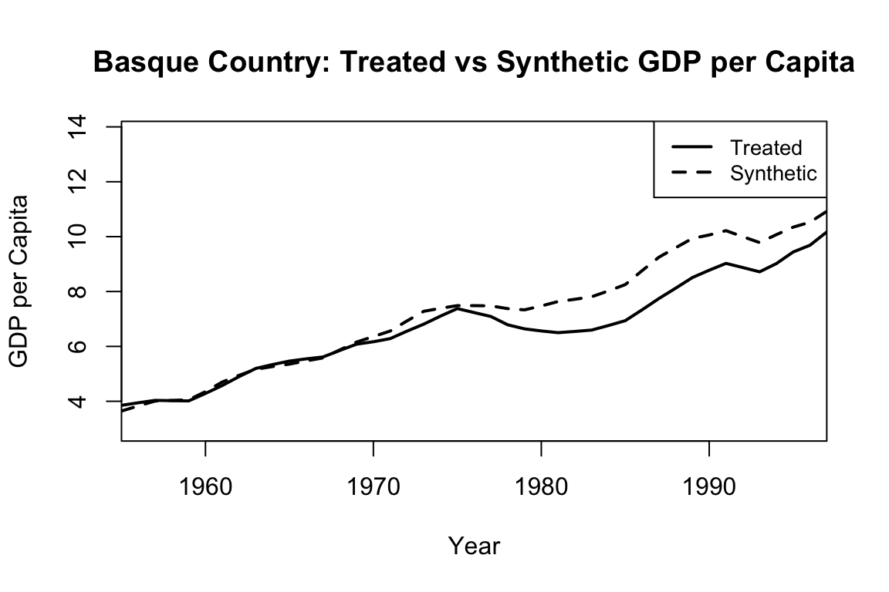

``` r
# Show the treatment effect (gap)
gaps.plot(synth.res = synth.out, dataprep.res = dataprep.out,
          Main = "Gap (Basque - Synthetic)", Ylab = "GDP Difference")
```

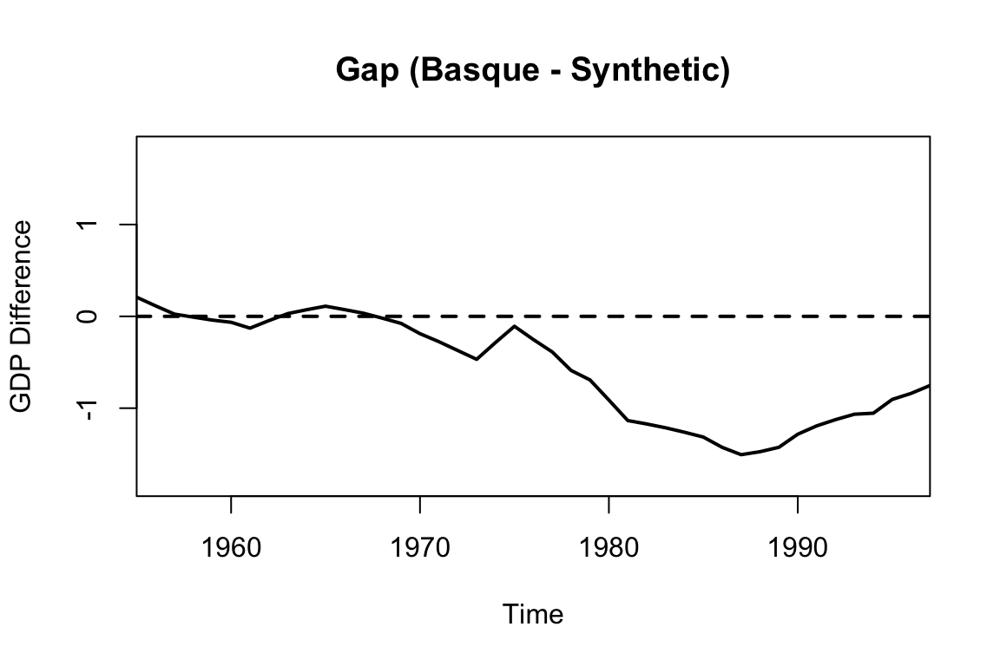

The figures above are generated using the default `Synth` package plotting functions. To create more visually appealing, customizable, and colorful versions, we can extract the data and use base R graphics as shown below:


``` r
# Extract outcomes
Y1 <- dataprep.out$Y1plot  # Treated unit
Y0 <- dataprep.out$Y0plot %*% synth.out$solution.w  # Synthetic control
years <- dataprep.out$tag$time.plot

# Plot
plot(years, Y1, type = "l", col = "darkblue", lwd = 2,
     ylab = "GDP per Capita", xlab = "Year",
     main = "Basque Country: Treated vs Synthetic GDP per Capita", ylim = range(c(Y1, Y0)))
lines(years, Y0, col = "orange", lwd = 2, lty = 2)
legend("topleft", legend = c("Treated", "Synthetic Control"),
       col = c("darkblue", "orange"), lwd = 2, lty = c(1, 2), bty = "n")
```

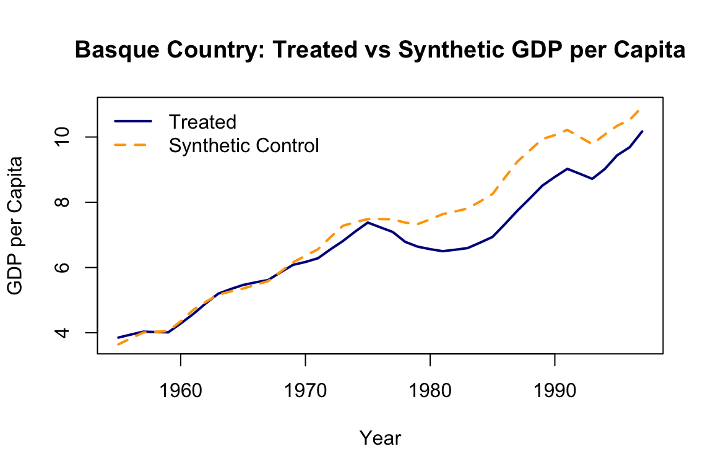

``` r
gap <- Y1 - Y0
plot(years, gap, type = "l", col = "firebrick", lwd = 2,
     ylab = "GDP Difference", xlab = "Year",
     main = "Gap (Basque - Synthetic)")
abline(h = 0, col = "forestgreen", lty = 3)
```

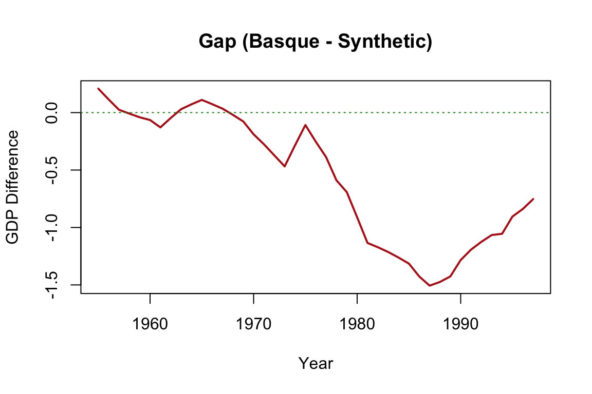


The output typically includes two central plots. The first shows the paths of actual and synthetic GDP per capita over time, which ideally align closely before the intervention. The second plot displays the gap between the two series (i.e., the estimated treatment effect), revealing a substantial decline in the Basque Country’s GDP relative to its synthetic counterpart after terrorism intensified. The tight pre-treatment match provides visual credibility, while the post-treatment divergence illustrates the estimated causal impact.

This example serves as an effective demonstration of how SCM constructs a counterfactual, assesses treatment effects, and visualizes the results. It also illustrates the core strengths of the method: its transparency, its minimal reliance on functional form assumptions, and its ability to handle one-time, region-specific interventions.

For readers interested in implementing SCM or further exploring its capabilities, the sources in the footnote provide comprehensive guidance and reproducible code.[^scmSource] While this chapter continues with more recent developments in this method, the materials listed in the footnote form a clear and practical foundation for learning the method and applying it to new contexts.

[^scmSource]: Carlos Mendez’s R Tutorial on Synthetic Control: https://carlos-mendez.quarto.pub/r-synthetic-control-tutorial/. CRAN page for the Synth Package: https://cran.r-project.org/web/packages/Synth/index.html. Abadie, Diamond and Hainmueller (2011). These resources offer detailed documentation and examples using the default dataset provided in the package. They cover data preparation, model estimation, visualization, and interpretation.

The Synthetic Control Method has been applied in a range of studies evaluating the effects of policy changes, shocks, and interventions when only a single treated unit is available. Abadie and Gardeazabal (2003) used SCM to quantify the economic impact of terrorism in the Basque Country, finding a significant reduction in per capita GDP relative to a synthetic Spain without terrorism. In a policy context, Abadie, Diamond, and Hainmueller (2010) analyzed the effect of California's tobacco control program, showing that smoking declined substantially compared to the synthetic control. Cavallo et al. (2013) examined the macroeconomic consequences of natural disasters, showing that major events like earthquakes can have large and persistent negative impacts. Bohn et al. (2014) applied SCM to study the impact of immigration enforcement, concluding that stricter enforcement policies did not reduce violent crime. In the health sector, Kreif et al. (2016) evaluated English health system reforms and found evidence of improved performance in treated areas relative to synthetic comparisons. Building on the foundations of SCM, researchers have developed extensions such as the Generalized Synthetic Control Method (GSCM) to better accommodate settings with multiple treated units, unobserved heterogeneity, and time-varying confounders.


### Generalized Synthetic Control Method (GSCM)

Building on the foundations of SCM, the Generalized Synthetic Control Method (GSCM) extends the approach to settings involving multiple treated units, unobserved heterogeneity, and time-varying confounders. Developed by Xu (2017) and implemented in the `gsynth` R package, GSCM accommodates more complex treatment structures than the original SCM framework. For readers interested in deeper exploration of the method and its implementation, we refer to the original papers and documentation.[^gscmSour]

[^gscmSour]:See Xu (2017) and Xu \& Liu (2022). These sources offer a comprehensive and clear overview of GSCM, including theoretical foundations, estimation details, and further applications. Note that the `gsynth` package has recently been retired and integrated into the `fect` package. The updated implementation and full documentation are available at https://yiqingxu.org/packages/fect/04-gsynth.html.

Unlike classical SCM, which constructs a weighted average of control units to match the treated unit in the pre-treatment period, GSCM employs a matrix completion framework with interactive fixed effects. Potential outcomes are modeled as a combination of latent factors along with unit- and time-specific effects, allowing the method to flexibly account for unobserved heterogeneity and time-varying trends. The estimation algorithm iteratively recovers these latent components and estimates treatment effects by comparing observed outcomes with model-predicted counterfactuals. GSCM supports multiple treated units, staggered treatment adoption, dynamic effects, and provides tools for cross-validation to determine the number of factors. It also includes options for computing standard errors and conducting inference.


``` r
#from https://yiqingxu.org/packages/gsynth/articles/tutorial.html
library(gsynth)
data(gsynth)
out <- gsynth(Y ~ D + X1 + X2, data = simdata,
              index = c("id", "time"),
              force = "two-way",
              CV = TRUE, r = c(0, 5),
              se = TRUE, inference = "parametric",
              nboots = 1000, parallel = FALSE)

print(out)
out$est.att
out$est.avg
out$est.beta
```


``` r
# Plot average treatment effect
plot(out, raw = TRUE, theme.bw = TRUE)
```

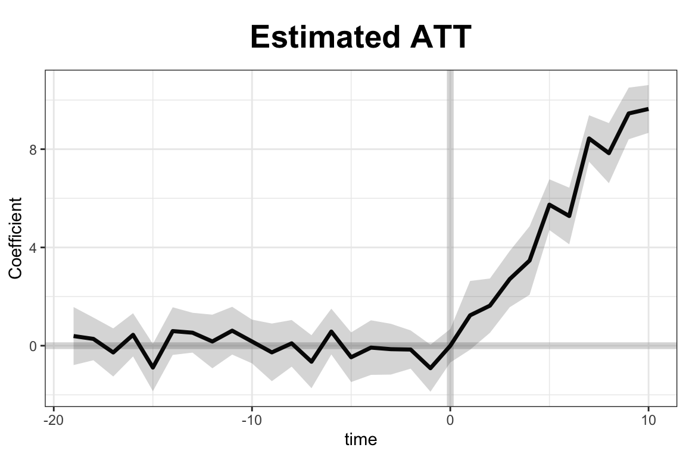

``` r
#can adjust xlim and ylim, and supply the plot title and titles for the two axes.
plot(out, type = "gap", ylim = c(-3,12), xlab = "Period", 
     main = "Estimated ATT - customized plot")
```

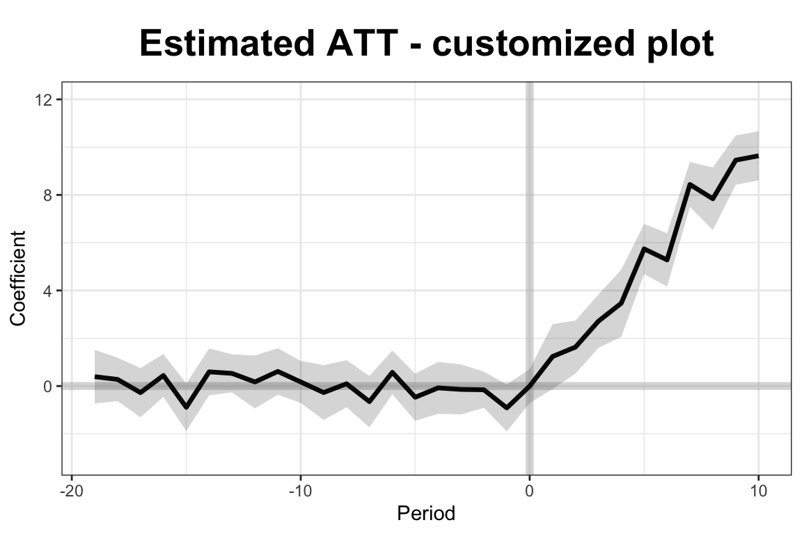

``` r
plot(out, type = "counterfactual", raw = "all")
```

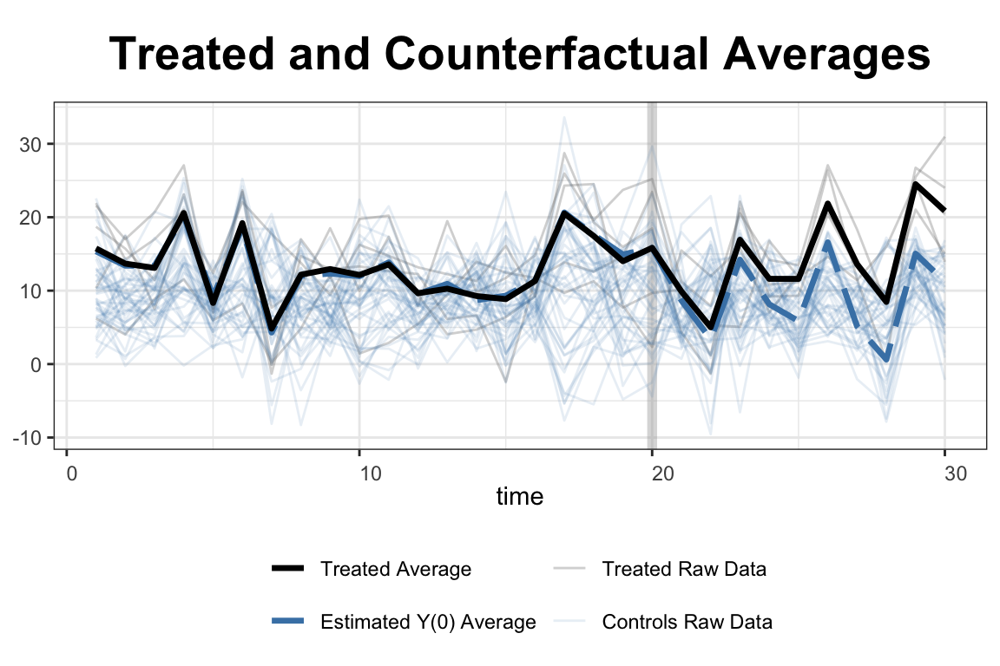

In this simulation, the `simdata` dataset includes 50 units observed over 30 periods, with five units treated from period 21 onward. Covariates `X1` and `X2`, along with a treatment indicator `D`, help explain the outcome variable `Y`. The model uses a two-way fixed effects specification and cross-validation to select the number of latent factors. Once estimated, the results are visualized using built-in plotting tools. The first plot displays the estimated average treatment effects over time, while the second shows the gap between observed and predicted outcomes for the treated units. These visualizations allow researchers to assess both the dynamics and the significance of the treatment effect.

GSCM is particularly powerful when the number of treated units is large or treatment timing varies across units. Its ability to model unobserved heterogeneity and account for complex temporal dynamics makes it a natural and robust extension of SCM for modern panel data applications.

A natural progression from GSCM is the Augmented Synthetic Control Method (ASCM), which combines the original SCM approach with outcome modeling to improve pre-treatment fit and reduce extrapolation bias.


### Augmented Synthetic Control Method (ASCM)

The Augmented Synthetic Control Method (ASCM) builds on the original SCM framework by incorporating outcome modeling to improve pre-treatment fit and reduce potential extrapolation bias. Introduced by Ben-Michael, Feller, and Rothstein (2021), ASCM combines SCM with a parametric or semi-parametric model—often ridge regression—to estimate counterfactual outcomes more robustly, particularly when the treated unit lies outside the convex hull of the control units. This addresses a key limitation of SCM: its inability to match the treated unit well when no convex combination of controls approximates its pre-treatment behavior.

Let \( Y_{it} \) be the observed outcome for unit \( i \) at time \( t \), and suppose unit 1 is treated beginning at time \( T_0 + 1 \). The goal is to estimate the counterfactual outcome \( Y_{1t}^N \) for \( t > T_0 \). As in SCM, ASCM constructs a weighted combination of control units:

\begin{equation}
\hat{Y}_{1t}^{N} = \sum_{j=2}^{J+1} w_j^{\text{ascm}} Y_{jt} 
\end{equation}

where \( w_j^{\text{ascm}} = w_j^{\text{scm}} + w_j^{\text{adj}} \). Here, \( w_j^{\text{scm}} \) are the SCM weights that minimize the pre-treatment discrepancy between the treated unit and the synthetic control, and \( w_j^{\text{adj}} \) are adjustment terms obtained by fitting a penalized regression model to the residuals.[^ascm] Unlike SCM, which imposes \( w_j \geq 0 \) and \( \sum w_j = 1 \), ASCM relaxes these constraints, allowing for negative weights and weights greater than one. This flexibility enables better prediction accuracy, though it comes with a trade-off in terms of interpretability. The final estimate of the treatment effect is:

\begin{equation}
\hat{\alpha}_{1t} = Y_{1t} - \hat{Y}_{1t}^{N}, \quad t > T_0 
\end{equation}

ASCM supports inference through placebo-based standard errors and confidence intervals. By modeling pre-treatment residuals and incorporating them into post-treatment counterfactual prediction, ASCM yields more accurate and robust effect estimates, especially when SCM fails to achieve a close pre-treatment match.

[^ascm]:Formally, the ASCM estimator can be understood as solving the following optimization problem:
\[ 
\min_{\beta, \mathbf{w}} \sum_{t=1}^{T_0} \left(Y_{1t} - \mathbf{X}_{t}'\beta - \sum_{j=2}^{J+1} w_j Y_{jt} \right)^2 + \lambda \| \beta \|_2^2 
\]
where \( \mathbf{X}_{t} \) is a vector of time-varying covariates or latent components, \( \beta \) is a vector of regression coefficients, and \( \lambda \) is a ridge penalty that controls the extent of regularization. The ridge penalty shrinks the coefficients to avoid overfitting and manages the degree of extrapolation beyond the convex hull.

The method is implemented in the `augsynth` R package (see footnote [^ascmext]), which allows users to fit models with ridge augmentation, visualize results, and conduct sensitivity analysis. ASCM thus represents a powerful generalization of SCM, retaining its transparency while gaining flexibility through model-based augmentation. It is especially useful in applications where pre-treatment imbalance remains even after SCM weighting.

[^ascmext]:See Ben-Michael, E., Feller, A., \& Rothstein, J. (2021). “The Augmented Synthetic Control Method.” *Journal of the American Statistical Association*, 116(536), 1789–1803. The method is available through the `augsynth` R package: https://github.com/ebenmichael/augsynth.

ASCM can be implemented in two key modes: `singlesynth` and `multisynth`. The `singlesynth` approach applies when there is a single treated unit, and the counterfactual is constructed using a weighted combination of control units with ridge-augmented adjustments. In contrast, `multisynth` extends ASCM to settings with staggered treated units.  The `augsynth` package supports both approaches, allowing users to flexibly choose based on the number and structure of treated units in their application.

To illustrate the use of the Augmented Synthetic Control Method (ASCM), we consider the effects of the 2012 personal income tax cuts in Kansas, using the built-in `kansas` dataset from the `augsynth` package. The outcome of interest is log GSP per capita (`lngdpcapita`) across U.S. states, observed quarterly from 1990 to 2016. Kansas enacted substantial tax cuts in the second quarter of 2012, and we aim to estimate the causal impact of this policy on its economic performance.

We first estimate a standard synthetic control model (not shown), which uses only pre-treatment outcomes to construct a counterfactual. We then apply ASCM by augmenting the synthetic control with a ridge regression model:


``` r
## Install devtools if noy already installed
##install.packages("devtools", repos='http://cran.us.r-project.org')
##library(devtools)
## Install augsynth from github
##devtools::install_github("ebenmichael/augsynth", dependencies = TRUE)
library(augsynth)
data(kansas)

#syn <- augsynth(lngdpcapita ~ treated, fips, year_qtr, kansas,
#                progfunc = "None", scm = TRUE)
# plot(syn)
asyn <- augsynth(lngdpcapita ~ treated, fips, year_qtr, kansas,
                 progfunc = "Ridge", scm = TRUE)
```

```
## One outcome and one treatment time found. Running single_augsynth.
```

``` r
plot(asyn)
```

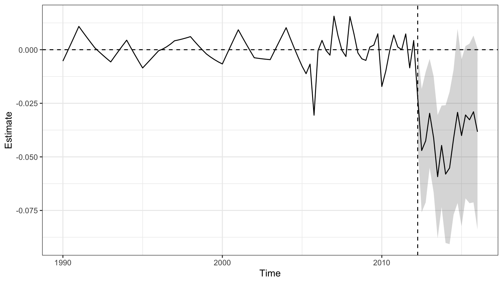

ASCM improves pre-treatment fit by adjusting residual differences between Kansas and its synthetic control, allowing for limited extrapolation beyond the convex hull of controls, regulated by a ridge penalty term. In this example, it results in clearer post-treatment effects and narrower confidence intervals, underscoring the method’s advantages when traditional SCM fit is imperfect.

For staggered treatment adoption across units—where different units receive the intervention at different times—the `multisynth` function in the `augsynth` package can be used. One illustrative application comes from Paglayan (2018), who examined the effects of states implementing mandatory collective bargaining agreements for public sector unions. The implementation and replication materials are available on the package’s GitHub page, linked in the earlier footnote.

A further recent development enhances SCM by incorporating multiple outcomes to improve estimation precision and robustness. In Ben-Michael, Feller, and Sun (2025), the authors propose a framework that jointly models several related outcomes to strengthen causal inference. The method is demonstrated through simulation and a re-analysis of the Flint water crisis’s impact on student achievement. See footnote[^rep] for replication materials.

[^rep]:Replication materials are available via Harvard Dataverse: Sun, Liyang; Ben-Michael, Eli; Feller, Avi, 2025. “Replication data for: Using Multiple Outcomes to Improve the Synthetic Control Method.” [https://doi.org/10.7910/DVN/KBVB9F](https://doi.org/10.7910/DVN/KBVB9F). V1


## Synthetic Difference-in-Differences (SDiD)

As discussed earlier in this chapter, Difference-in-Differences (DiD) and Synthetic Control (SC) are widely used methods for estimating treatment effects, each with its own strengths and limitations. DiD relies on the assumption of parallel trends and applies equal weight to all units and time periods, while SC constructs a synthetic version of the treated unit using optimally chosen weights but ignores fixed effects and time variation in contributions. The SDiD estimator brings these two approaches together within a single framework. To overcome these challenges, **Synthetic Difference-in-Differences (SDiD)**—proposed by Arkhangelsky et al. (2021)—combines the strengths of both approaches in a unified framework. SDiD improves robustness, enhances pre-treatment fit, and reduces extrapolation bias.

SDiD achieves this by applying weights across both units and time periods. Unit weights are learned from the pre-treatment period, similar to SC, while time weights—similar in spirit to DiD—are learned across both pre- and post-treatment periods. This structure allows SDiD to adapt flexibly to heterogeneous settings, achieving improved estimation performance in practice.

**Estimation Procedure (Simplified)**: Assume a balanced panel with \( N \) units and \( T \) time periods, with the treatment beginning at period \( T_0 + 1 \). For simplicity, assume one treated unit. Let the observed outcome be modeled as:

\end{equation}
Y_{it} = \mu + \alpha_i + \beta_t + W_{it} \tau + \varepsilon_{it}
\end{equation}

where\( \mu \): overall mean, \( \alpha_i \): unit-specific fixed effects, \( \beta_t \): time-specific fixed effects, \( W_{it} \): binary treatment indicator, \( \tau \): treatment effect, \( \varepsilon_{it} \): idiosyncratic error

The SDiD estimator seeks parameters \( \hat{\tau}, \hat{\mu}, \hat{\alpha}, \hat{\beta} \) by minimizing a doubly-weighted least squares criterion:

\begin{align}
(\hat{\tau}^{\text{sdid}}, \hat{\mu}, \hat{\alpha}, \hat{\beta}) = \arg \min_{\tau, \mu, \alpha, \beta} 
\sum_{i=1}^{N} \sum_{t=1}^{T} \left( Y_{it} - \mu - \alpha_i - \beta_t - W_{it} \tau \right)^2 
\cdot \hat{\omega}_i^{\text{sdid}} \cdot \hat{\lambda}_t^{\text{sdid}}
\end{align}

where \( \hat{\omega}_i^{\text{sdid}} \) and \( \hat{\lambda}_t^{\text{sdid}} \) are estimated weights over units and time periods respectively.[^algo1] 

[^algo1]:Please see Algorithm 1 and 2, and Equations 4–6 in Arkhangelsky et al. (2021) for the formal estimation procedures. The weights are derived by solving the following optimization problems:
\textbf{Unit Weights}:
\[
(\hat{\omega}_0,\hat{\omega}^{\text{sdid}}) = \arg \min_{\omega \in \mathbb{R}_+, \omega \in \Omega} \sum_{t=1}^{T_{\text{pre}}}  \left( \omega_0 + \sum_{i=1}^{N_{\text{co}}} \omega_i Y_{it} - \frac{1}{N_{\text{tr}}} \sum_{i=N_{\text{co}}+1}^{N} Y_{it} \right)^2 + \zeta T_{\text{pre}} \|\omega\|^2_2
\]
\textbf{Time Weights}:
\[
(\hat{\lambda}_0,\hat{\lambda}^{\text{sdid}}) = \arg \min_{\lambda \in \mathbb{R}, \lambda \in \Lambda} \sum_{i=1}^{N_{\text{co}}} \left( \lambda_0 + \sum_{t=1}^{T_{\text{pre}}} \lambda_t Y_{it} - \frac{1}{T_{post}} \sum_{t=T_{\text{pre}}+1}^{T} Y_{it} \right)^2
\]
Here, \( \zeta \) is a ridge regularization parameter that prevents overfitting.

The structure of the SDiD estimator makes clear how it generalizes both DiD and SC. If we remove both sets of weights—setting all unit and time weights equal—the SDiD objective reduces to a standard two-way fixed effects regression, which corresponds exactly to the traditional DiD estimator. This highlights that DiD assumes all units and time periods contribute equally, without differential weighting. On the other hand, if we omit unit fixed effects and time weights from the SDiD formulation—retaining only unit weights estimated to match pre-treatment outcomes—we recover the Synthetic Control (SC) estimator. In this sense, DiD and SC are both nested within the SDiD framework, which enhances flexibility by allowing weighted contributions from both units and time periods while adjusting for unit and time-specific heterogeneity.

To illustrate the method, consider estimating the effect of California Proposition 99, a tobacco tax law passed in 1988, on cigarette consumption. The `synthdid` R package provides a built-in dataset and implementation tools:


``` r
devtools::install_github("synth-inference/synthdid")
library(synthdid)

# Estimate the effect of California Proposition 99 on cigarette consumption
data('california_prop99')
setup = panel.matrices(california_prop99)
tau.hat = synthdid_estimate(setup$Y, setup$N0, setup$T0)
se = sqrt(vcov(tau.hat, method='placebo'))
sprintf('point estimate: %1.2f', tau.hat)
```

```
## [1] "point estimate: -15.60"
```

``` r
sprintf('95%% CI (%1.2f, %1.2f)', tau.hat - 1.96 * se, tau.hat + 1.96 * se)
```

```
## [1] "95% CI (-33.23, 2.03)"
```

``` r
plot(tau.hat)
```

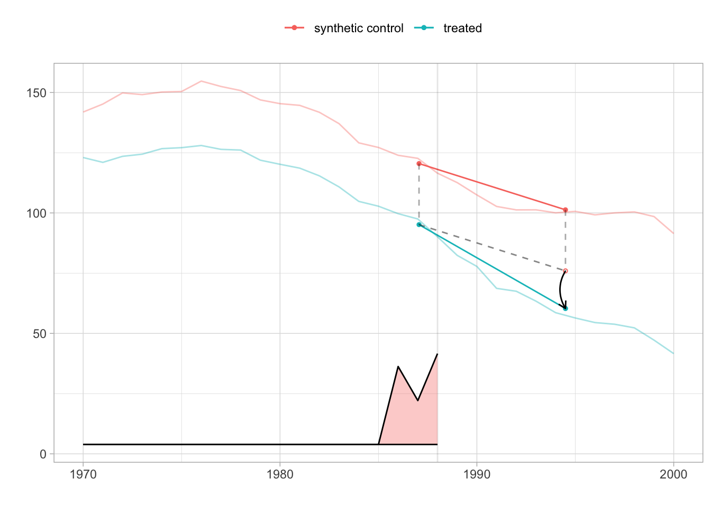

``` r
tau.sc   = sc_estimate(setup$Y, setup$N0, setup$T0)
tau.did  = did_estimate(setup$Y, setup$N0, setup$T0)
estimates = list(tau.did, tau.sc, tau.hat)
names(estimates) = c('Diff-in-Diff', 'Synthetic Control', 'Synthetic Diff-in-Diff')
print(unlist(estimates))
```

```
##           Diff-in-Diff      Synthetic Control Synthetic Diff-in-Diff 
##              -27.34911              -19.61966              -15.60383
```

This comparison highlights how SDiD often yields estimates (the black arrow in the figure is estimated ATT) that are more conservative than DiD (when parallel trends fail) and more stable than SC (when matching is imperfect).
The SDiD plot reveals a noticeable divergence post-1988, reflecting the estimated treatment effect of the law on smoking rates. The comparison shows that SDiD typically yields estimates that are more conservative than DiD (which may overstate effects under non-parallel trends) and more stable than SC (which may be sensitive to pre-treatment imbalance).

The method is readily accessible through the `synthdid` R package, which is supported by comprehensive theoretical documentation and clear implementation examples. A valuable companion to the R tools is the official documentation site [https://synth-inference.github.io/synthdid/](https://synth-inference.github.io/synthdid/), which includes tutorials and replication materials.

For users working in Stata, Clarke et al. (2024) provide a clear and accessible exposition of the SDiD methodology. Their paper covers both single and staggered treatment adoption settings and introduces the `sdid` command for implementation in Stata. Even for researchers who do not use Stata, the paper is highly recommended for its lucid explanation of the method, its assumptions, inference strategies, and for the well-developed examples it provides.

In addition, Ciccia (2024) proposes an event-study extension to the SDiD framework. This work shows how SDiD estimators can be decomposed into dynamic treatment effects in both simple and staggered designs. These estimators can be implemented using the `sdid_event` package in Stata.

For Python users, there are also open-source implementations of SDiD under development and available at [https://github.com/MasaAsami/pysynthdid](https://github.com/MasaAsami/pysynthdid) and [https://github.com/d2cml-ai/synthdid.py](https://github.com/d2cml-ai/synthdid.py).

Taken together, the methods discussed in this section—SCM and its extensions—provide powerful tools for constructing credible counterfactuals and estimating treatment effects in observational data. These approaches are especially well-suited to situations involving a limited number of treated units and no clear natural control. However, when treatment assignment varies over time or across units in more structured ways, such as around a known threshold or cutoff, alternative strategies like Regression Discontinuity Design (RDD) may offer a better fit. We turn next to RDD to examine its conceptual foundation, estimation strategy, and empirical use.


## Regression Discontinuity Designs (RDD)

Regression Discontinuity Design (RDD) is a powerful quasi-experimental framework that exploits a sharp rule: treatment is assigned based on whether a continuous running variable crosses a known cutoff. This rule creates a discontinuity with no overlap—units just above the threshold receive treatment, and those just below do not. RDD is widely used for estimating causal effects in settings where randomization is infeasible but treatment follows a strict threshold policy. When properly implemented, RDD yields internally valid causal estimates for units near the cutoff, often providing insights comparable to those from randomized controlled trials (RCTs).

The canonical setup involves a policy or program assigned based on whether an individual’s score on a running variable crosses a threshold—for example, students with test scores above 75 receiving a scholarship. Those just above and just below the cutoff are likely similar in observable and unobservable characteristics. Therefore, any systematic difference in outcomes such as college attendance or earnings can be attributed to the treatment.

<div class="figure" style="text-align: center">
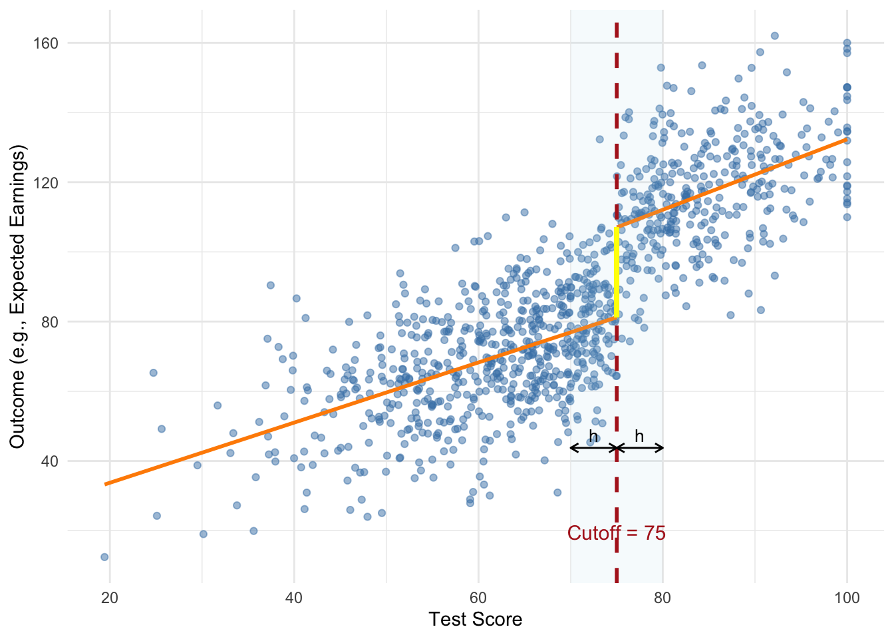
<p class="caption">(\#fig:synd2)Simulated Sharp RDD with Scholarship Cutoff</p>
</div>

The figure illustrates a sharp regression discontinuity design using a simulated example where students receive a scholarship if their test score exceeds 75. The vertical dashed line marks the cutoff, while the shaded region shows the estimation bandwidth \(h\) on either side. The two regression lines are fit separately to the left and right of the threshold, and the bold vertical line represents the estimated treatment effect—the jump in expected outcome at the cutoff. The design assumes individuals near the threshold are otherwise similar, justifying the causal interpretation of the observed discontinuity.

The key idea is that if individuals near the cutoff are otherwise comparable, then any observed difference in outcomes can be attributed to the treatment. At the threshold, the probability of treatment changes abruptly. For identification to be valid, the assignment rule does not need to be random—it only needs to be precisely defined, transparent, and immune to manipulation. This local comparison relies on minimal assumptions but critically depends on individuals being unable to sort around the cutoff. If units can sort around the threshold, internal validity is compromised. McCrary’s (2008) density test is commonly used to detect such manipulation. While density tests can help detect sorting, they cannot rule out precise manipulation based on unobserved factors. Ultimately, the assumption functions as an exclusion restriction and must be supported by institutional knowledge.

When "no manipulation/sorting with precision" assumption holds, the assignment is effectively random in a neighborhood around the cutoff, identifying a Local Average Treatment Effect (LATE) that may not generalize beyond that range. This does not require \(X\) to be independent of \(Y\), but only that around the cutoff, the value of \(X\) is as good as random for identification purposes. This identification strategy hinges on the assumption that, in the absence of treatment, potential outcomes would evolve smoothly with the running variable across the threshold.

RDD comes in two forms: sharp and fuzzy. In a sharp RDD, treatment is deterministically assigned—everyone above the cutoff is treated, and no one below is. Estimation involves comparing the conditional expectation of the outcome just above and just below the threshold. In contrast, a fuzzy RDD arises when the probability of treatment jumps at the cutoff, but treatment is not strictly assigned. This occurs when, for example, a policy is loosely enforced or individuals can opt out. In such cases, the cutoff indicator serves as an instrument for actual treatment, and the design resembles an instrumental variables (IV) setup. The treatment effect is estimated as the ratio of the discontinuity in the outcome to the discontinuity in treatment probability, identifying a LATE for compliers. To summarize, sharp RDD assumes treatment is deterministically assigned at the cutoff, while fuzzy RDD involves a discontinuous jump in treatment probability, requiring instrumental variable methods to recover causal effects.

Under the Rubin Causal Model, each unit \(i\) has two potential outcomes: \(Y_i(1)\) if treated and \(Y_i(0)\) if untreated. Treatment \(D_i\) is assigned based on whether the running variable \(X_i\) exceeds a known cutoff \(c\):

\begin{equation}
D_i = \begin{cases} 
1, & \text{if } X_i \ge c, \\
0, & \text{if } X_i < c.
\end{cases}
\end{equation}

Here, \(D_i\) is a deterministic and discontinuous function of \(X_i\)—no matter how close to \(c\), treatment jumps from 0 to 1 at the cutoff. The treatment effect at the threshold is:

\begin{align}
\tau_{\text{LATE}} &= \mathbb{E}[Y_i(1) \mid X_i = c] - \mathbb{E}[Y_i(0) \mid X_i = c] \notag \\
&= \mathbb{E}[Y_i \mid X_i = c, D_i = 1] - \mathbb{E}[Y_i \mid X_i = c, D_i = 0]
\end{align}


Assuming the conditional expectations of the potential outcomes are continuous in \(X\) around the cutoff \(c\), we can estimate the treatment effect at the threshold by comparing the observed outcomes just to the right and just to the left of \(c\).[^sharpRDD] Because treatment jumps discontinuously at \(c\), the average outcome should also jump if the treatment has an effect. This jump reflects the causal effect at the cutoff and is estimated as:

\begin{equation}
\hat{\tau} = \lim_{x \downarrow c} \mathbb{E}[Y \mid X = x] - \lim_{x \uparrow c} \mathbb{E}[Y \mid X = x]
\end{equation}

Here, the first term represents the expected outcome for units just above the cutoff (treated), and the second term for units just below the cutoff (untreated). The difference between these two conditional expectations isolates the causal effect of the treatment, assuming no other factor changes discontinuously at \(c\). This nonparametric approach does not require specifying a functional form but relies on local comparisons near the threshold.

[^sharpRDD]:Note that in sharp RDD, there is complete lack of overlap: \( P(D_i = 1 | X_i < c) = 0 \) and \( P(D_i = 1 | X_i \ge c) = 1 \), so traditional identification via common support does not apply.

In a fuzzy RDD, treatment is not perfectly determined by the cutoff but the probability of receiving treatment increases discontinuously at \(X = c\). This setup still allows identification of a local average treatment effect (LATE) at the threshold, but it requires adjusting for the fact that not all individuals above the cutoff are treated, and some below may also receive treatment.

Formally, the treatment assignment probability satisfies:

\begin{equation}
P(D_i = 1 \mid X_i) = 
\begin{cases} 
p_0, & X_i < c, \\
p_1, & X_i \ge c,
\end{cases} \quad \text{with } p_1 > p_0
\end{equation}

The intuition is that the cutoff introduces a jump in the likelihood of treatment. If potential outcomes are continuous in \(X\) at \(c\), then the treatment effect can be recovered by scaling the observed discontinuity in the outcome by the discontinuity in treatment probability. This is analogous to an instrumental variables (IV) approach, where the cutoff indicator serves as an instrument for actual treatment receipt.[^IVWald]

[^IVWald]:The treatment effect at the cutoff is estimated as:
\[
\tau = \frac{
\lim_{x \downarrow c} \mathbb{E}[Y \mid X = x] - \lim_{x \uparrow c} \mathbb{E}[Y \mid X = x]
}{
\lim_{x \downarrow c} \mathbb{E}[D \mid X = x] - \lim_{x \uparrow c} \mathbb{E}[D \mid X = x]
}
\]
This Wald-type estimator isolates the causal effect for compliers—those whose treatment status is influenced by crossing the threshold. A corresponding parametric specification using Local Two-Stage Least Squares (2SLS) is:
First stage (treatment model):
\[
D_i = \pi_0 + \pi_1 \mathbf{1}(X_i \ge c) + g(X_i - c) + \nu_i
\]
Second stage (outcome model):
\[
Y_i = \alpha + \tau \hat{D}_i + f(X_i - c) + \varepsilon_i
\]
Here, \(\mathbf{1}(X_i \ge c)\) is the instrument, \(g(\cdot)\) and \(f(\cdot)\) are smooth functions of the running variable, and \(\hat{D}_i\) is the fitted value from the first stage. The second-stage coefficient \(\tau\) gives the LATE at the cutoff for compliers.

**Estimation and Practical Implementation**

Implementing regression discontinuity designs requires a series of coordinated estimation and validation decisions, including the choice of estimation method (parametric or nonparametric), functional form, bandwidth selection, specification of the local neighborhood around the cutoff, and diagnostic checks such as visual inspections, balance tests, and falsification exercises to assess validity and robustness. Researchers face several implementation choices—such as whether to use parametric or nonparametric methods, how to select bandwidths, and which functional forms or kernels to use—each involving trade-offs between bias and variance.

For estimation, researchers often use a parametric regression model where the outcome varies smoothly with the running variable, except for a discontinuity at the cutoff. A commonly used sharp RDD specification is:

\begin{equation}
Y_i = \alpha + \tau D_i + f(X_i - c) + \varepsilon_i
\end{equation}

Here, \(Y_i\) is the observed outcome, \(D_i\) is the treatment indicator defined by whether \(X_i \ge c\), and \(f(X_i - c)\) is a smooth function of the running variable. The coefficient \(\tau\) captures the size of the jump in the outcome at the threshold—interpreted as the treatment effect for units right at the cutoff. Including the smooth function helps control for any underlying trend in the running variable, isolating the discontinuity due to treatment.

Local polynomial regression is the workhorse method for RDD estimation. It approximates the regression function separately on either side of the cutoff using polynomials, allowing both the slope and intercept to differ at the threshold. A common starting point is a local linear specification—a degree-1 polynomial—estimated using the running variable centered at the cutoff. That is, defining \(\tilde{X}_i = X_i - c\), the model becomes: 

\begin{equation}
Y_i = \alpha + \tau D_i + \beta \tilde{X}_i + \gamma (D_i \cdot \tilde{X}_i) + \varepsilon_i
\end{equation}

Here, \(\tilde{X}_i\) is negative to the left of the cutoff, zero at the cutoff, and positive to the right. The treatment indicator \(D_i\) equals 1 if \(X_i \ge c\). This setup fits separate lines on either side of the threshold, which may differ in both intercept (capturing the treatment effect) and slope.

Because there is no overlap in treatment assignment, treatment effects are estimated by extrapolating from either side of the cutoff. If the functional form is mis-specified, this extrapolation can introduce bias—highlighting the importance of flexible, data-driven methods focused on observations near the threshold. Although higher-order polynomials offer more flexibility, they can overfit and behave erratically near the cutoff. As a result, researchers are generally advised to use local linear or quadratic models only, as recommended by Gelman and Imbens (2019). Standard errors are typically heteroskedasticity-robust due to outcome variability near the cutoff. Recent work also discourages clustering standard errors by the running variable in this context (Calonico et al. 2017).[^SharpRDD]

[^SharpRDD]:Control variables are usually omitted in sharp RDD because the design itself—if valid—ensures treated and control groups are comparable near the cutoff. Including controls can improve precision but may imply concern about residual imbalance. Their inclusion is more relevant in fuzzy designs, where treatment is not strictly assigned by the cutoff. See Calonico et al. (2019) for methods incorporating covariates.

A crucial design decision is bandwidth selection, which directly affects the bias-variance trade-off. A smaller bandwidth focuses on observations closest to the cutoff, increasing comparability and reducing bias but inflating variance due to a smaller sample size. A larger bandwidth provides more data and lowers variance but risks bias by including less comparable observations. Several data-driven algorithms address this trade-off. The Imbens-Kalyanaraman (IK) method offers a rule-of-thumb optimized for mean squared error, while the Calonico-Cattaneo-Titiunik (CCT) method introduces bias correction for robustness. These selectors help target a window around the cutoff where the functional form is most stable, minimizing extrapolation risk. In practice, researchers often assess sensitivity by plotting the estimated treatment effect \(\hat{\tau}\) across different bandwidths to visualize how estimates change with window size.

Another way of approximating \(f(X_i - c) = f (\tilde{X}_i)\) is to use a nonparametric kernel. Kernel-based methods estimate local averages by assigning weights that decline with distance from the cutoff, focusing inference on the neighborhood where treatment status changes. The triangular kernel is especially popular—not only because it emphasizes nearby observations, but also because it minimizes mean squared error in boundary estimation settings like RDD.[^TriKernel] These methods are flexible and avoid imposing global functional form assumptions, but still require bandwidth selection and involve the same bias-variance trade-off considerations as local polynomial regressions.

[^TriKernel]The triangular kernel assigns weights linearly decreasing with distance from the cutoff:  
\[
K(u) = (1 - |u|) \cdot \mathbf{1}(|u| \leq 1)
\]  
where \(u = \frac{X_i - c}{h}\), \(c\) is the cutoff, and \(h\) is the bandwidth. 

Functional form decisions, particularly the choice of polynomial order, also influence RDD estimates. Higher-order polynomials offer more flexibility but risk overfitting and can produce erratic behavior near the threshold, especially when sensitive to outliers. In contrast, local linear or local quadratic models are generally preferred for balancing fit and interpretability. Researchers often inspect fitted curves and residuals to assess model adequacy and determine whether additional flexibility is needed.

Careful graphical analysis is a central component of RDD diagnostics. The typical plot shows the outcome variable on the vertical axis and the running variable on the horizontal, with fitted curves on each side of the cutoff. Beyond offering intuitive evidence, these plots also help guide bandwidth and functional form choices by revealing curvature or irregularities in the running variable-outcome relationship. A clear jump in the outcome at the threshold provides intuitive evidence of a treatment effect. However, these plots can be sensitive to binning choices and bandwidth, so visual interpretations must be approached with caution.

Validating the RD design requires ruling out manipulation around the threshold. If individuals can precisely sort around the cutoff, the identifying assumption fails. The McCrary (2008) test detects any discontinuity in the density of the running variable, implemented in R via `DCdensity()`. Researchers also assess whether predetermined covariates remain smooth across the cutoff. If a covariate shows a discontinuous jump at the threshold, it may signal the presence of a confounder rather than a treatment effect—raising concerns that the observed outcome discontinuity could be driven by imbalance rather than the intervention itself. Balance checks can include visual and regression-based assessments of other baseline characteristics around the cutoff[^Cutoff]. Placebo tests are also useful—researchers examine whether estimated treatment effects arise at other values of the running variable where no policy change occurred. Finding significant jumps away from the actual cutoff would cast doubt on the design’s validity.

[^Cutoff]:For example, researchers may examine visual plots of \(E[W_i | \tilde{X}_i, D_i]\), where \(W_i\) represents a predetermined covariate and \(\tilde{X}_i = X_i - c\), as well as local regressions of the form:  
\[
E[W_i | \tilde{X}_i, D_i] = \alpha + \beta_0 \tilde{X}_i + \beta_1 (\tilde{X}_i \cdot D_i) + \tau_W D_i.
\]  
A statistically significant \(\tau_W\) would indicate a discontinuity in covariates at the threshold, suggesting possible imbalance.

### RDD Simulation

In this simulation we generate data which we used the earlier RDD example: a scholarship awarded to students whose test scores exceed a cutoff of 75. As shown in the earlier figure, the design creates a sharp discontinuity in treatment assignment, allowing causal inference based on local comparisons near the threshold.

While the initial plot is constructed manually using `ggplot2`, in this simulation we use the `rdrobust` package to formally implement and estimate the RDD. The command `rdplot(y, x, c = 0)` automatically generates a data-driven RD plot using local linear regression, where \( x \) is the running variable centered at the cutoff and \( y \) is the simulated outcome. This function bin-scatters the data and overlays separate polynomial fits on each side of the cutoff, providing a quick and informative way to visualize the discontinuity and inspect model adequacy.

We estimate the treatment effect using `rdrobust()`. It applies local polynomial regression with robust bias correction and inference procedures developed by Calonico, Cattaneo, and Titiunik (2014). The call to `rdrobust(y, x, c = 0, p = 1, kernel = "triangular", h = ...)` estimates the treatment effect at the cutoff using a local linear regression (p = 1) with a triangular kernel, which weights observations closer to the cutoff more heavily. The bandwidth \( h \) is selected using the CCT optimal bandwidth selector via the `rdbwselect()` function with the `bwselect = "mserd"` option. The output includes both the conventional (uncorrected) and robust bias-corrected estimates of the treatment effect, along with corresponding standard errors. The local quadratic version `p = 2` is estimated in the same way, offering a check on the sensitivity of results to polynomial order. As discussed earlier, local linear models are generally preferred over higher-order polynomials due to their favorable bias-variance trade-off and stability near the cutoff. 


``` r
library(rdrobust)

# Simulate test scores between 0 and 100
set.seed(42)  # For reproducibility
score <- rnorm(1000, mean = 70, sd = 15)
score <- pmin(pmax(score, 0), 100)  # Restrict scores between 0 and 100

# Scholarship assigned if score > 75
cutoff <- 75
treated <- ifelse(score > cutoff, 1, 0)
y <- 20 + 30 * treated + 0.8 * score + rnorm(1000, 0, 15)  # Potential outcome
x <- score - cutoff  # Center the running variable at the cutoff

# Bandwidth selection using CCT method
bw_cct <- rdbwselect(y, x, kernel = "triangular", bwselect = "mserd")
print(bw_cct)
```

```
## Call: rdbwselect
## 
## Number of Obs.                 1000
## BW type                       mserd
## Kernel                   Triangular
## VCE method                       NN
## 
## Number of Obs.                  647          353
## Order est. (p)                    1            1
## Order bias  (q)                   2            2
## Unique Obs.                     647          333
```

``` r
# Visual RD plot (uses local linear by default)
rdplot(y, x, c = 0, kernel = "triangular", p = 1)
```

<div class="figure">
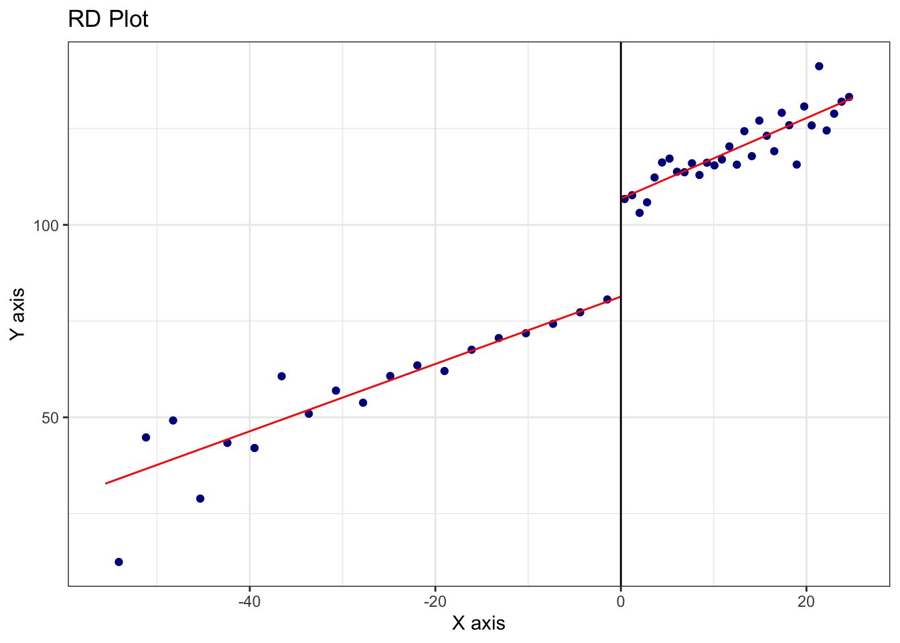
<p class="caption">(\#fig:synd3)RD Plot with Triangular Kernel and CCT Bandwidth (Local Linear Fit)</p>
</div>

``` r
# Local linear regression (p = 1) with triangular kernel
out <- rdrobust(y, x, c = 0, p = 1, kernel = "triangular", h = bw_cct$bws[1,1])
out$Estimate
```

```
##        tau.us   tau.bc    se.us    se.rb
## [1,] 20.82346 24.46106 3.442885 4.352538
```

``` r
# Local quadratic regression (p = 2) with triangular kernel
out2 <- rdrobust(y, x, c = 0, p = 2, kernel = "triangular", h = bw_cct$bws[1,1])
out2$Estimate
```

```
##        tau.us   tau.bc    se.us   se.rb
## [1,] 24.46106 29.94459 4.352538 5.20353
```

The second figure, produced using `rdplotdensity()` from the `rddensity` package, serves a different but crucial purpose. It implements the McCrary (2008) density test, which assesses the possibility that units have manipulated their position relative to the cutoff (e.g., by artificially boosting scores to qualify for the scholarship). The underlying assumption of RDD is that the running variable cannot be precisely manipulated; otherwise, the groups just above and below the threshold would not be comparable. `rddensity()` estimates the density of the running variable on either side of the cutoff and tests for a discontinuous jump. A significant result would suggest sorting or manipulation, which would undermine the causal interpretation of the estimated treatment effect. In our simulated data, which was generated without manipulation, the test is expected to yield a non-significant p-value, consistent with the design assumption.

<div class="figure">
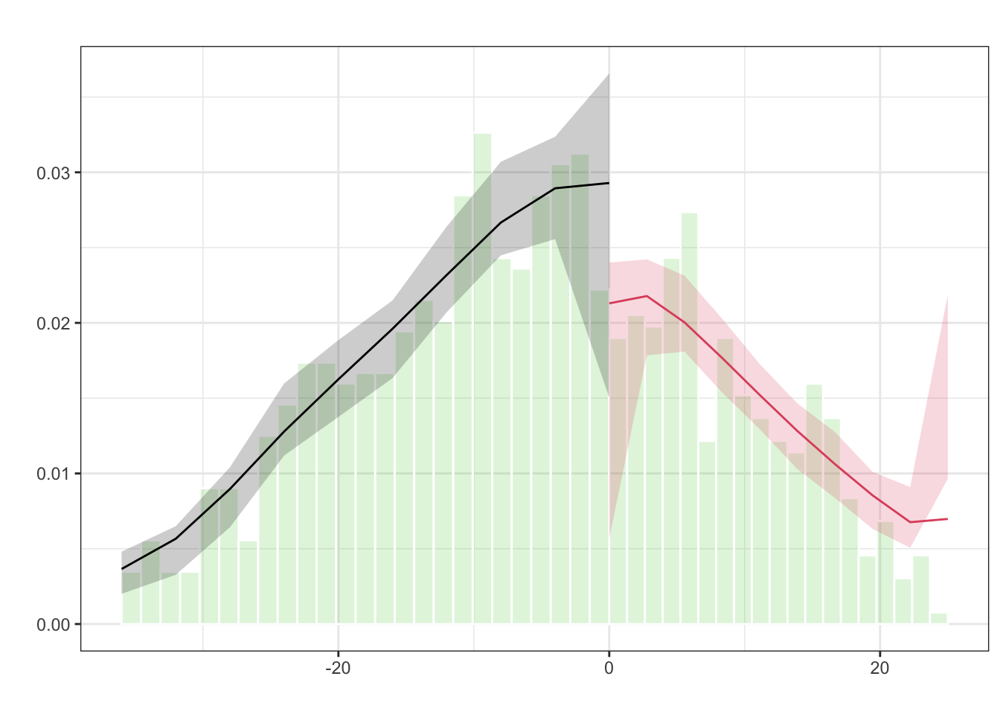
<p class="caption">(\#fig:synd4)Estimated Density of the Running Variable around the Cutoff (McCrary Test)</p>
</div>
<!-- Note to self: Run invisible(rdplotdensity(density_test, X = x)) manually if needed -->

Together, these commands (`rdplot`, `rdrobust`, `rdbwselect`, and `rddensity`) form a robust pipeline for implementing, estimating, and validating an RDD. Researchers can modify key elements of this simulation to suit their empirical application: for instance, changing the cutoff value, using different kernels (e.g., uniform or Epanechnikov), trying alternative bandwidth selection methods (like IK), or experimenting with other polynomial orders. For more complex settings involving covariates or fuzzy designs (where treatment probability jumps but assignment is not deterministic), `rdrobust` also supports extensions such as instrumental variables estimation.

### Credibility and Extensions in RDD Applications

While RDD designs offer high internal validity, they identify effects only for units near the cutoff. In sharp RDD, this corresponds to the average treatment effect at the threshold; in fuzzy RDD, it reflects the local average treatment effect (LATE) for compliers—those whose treatment status is influenced by crossing the cutoff. These are not estimates of the treatment effect for everyone in the sample, but only for units close to the threshold—the “local” in LATE. This is a trade-off: while we gain credible identification, we give up broader generalizability. In many cases, however, this local group is of direct policy interest—for example, students just on the margin of qualifying for a scholarship or patients just eligible for an intervention. RDD also requires large samples near the cutoff to obtain precise estimates and depends on a well-defined assignment rule. Thin density near the threshold can limit power and precision, making RDD less suitable when few observations fall within the effective estimation window. Despite these limitations, RDD remains one of the most credible nonexperimental methods for causal inference, especially in evaluating policy interventions.

This section a very brief explanation of Regression Discontinuity Designs (RDD). There are also extensions of Regression Discontinuity Designs that go beyond the standard single-threshold, continuous running variable setup. These include RD designs with discrete running variables, multiple cutoffs and multiple scores (`rdmulti`), geographic or spatial RD (`SpatialRDD`)[^spatial], and methods addressing issues like covariate adjustment, clustered data, and inference under weak identification. Calonico et al. (2025) introduced estimation and inference procedures, along with the `rdhte` package, for analyzing heterogeneous treatment effects in RDD designs. Hsu, Y., \& Shen, S. (2024) extend RD model to a dynamic framework, where observations are eligible for repeated RD events (see replication package from the reference doi link). These topics introduce additional complexity and are not covered in this brief summary. For implementation, the most comprehensive and up-to-date resource is [rdpackages.github.io](https://rdpackages.github.io/), which hosts the main packages used in practice, along with replication files, illustration code, and software in R, Stata, and Python. One of the best recent overviews is Cattaneo, Idrobo, and Titiunik (2024). Additional related volumes and resources are also available on the same site.

[^spatial]: For more details, see the package vignette at [https://cran.r-project.org/web/packages/SpatialRDD/vignettes/spatialrdd_vignette.html](https://cran.r-project.org/web/packages/SpatialRDD/vignettes/spatialrdd_vignette.html).

Machine learning methods are increasingly used in RD designs to improve precision when adjusting for high-dimensional covariates. Kreiss and Rothe (2024) propose a two-step estimator: first selecting relevant covariates using a localized Lasso, then including them in a local linear RD model. This approach retains valid inference under approximate sparsity and uses standard bandwidth and variance tools.

Noack, Olma, and Rothe (2024) propose a method for covariate adjustment in RDD by subtracting a function of covariates from the outcome variable. This function is estimated using machine learning techniques such as Lasso, random forests, or neural networks. Their approach can handle high-dimensional covariates and aims to reduce the variance of treatment effect estimates. Simulation studies demonstrate that this method often yields shorter confidence intervals compared to traditional RD estimators, particularly when covariates are informative. The method is implemented in the`DoubleML` package in python.

To conclude, the regression discontinuity design provides a robust framework for causal inference under relatively mild assumptions. Its power lies in its simplicity and transparency: when a threshold-based rule determines treatment, and individuals cannot manipulate their position relative to the cutoff, RD can uncover the causal effect with minimal structural assumptions. The challenge, as always, is in the details: careful choice of bandwidth, correct functional form, attention to manipulation, and thoughtful interpretation of results are all essential to making RD work in practice.


