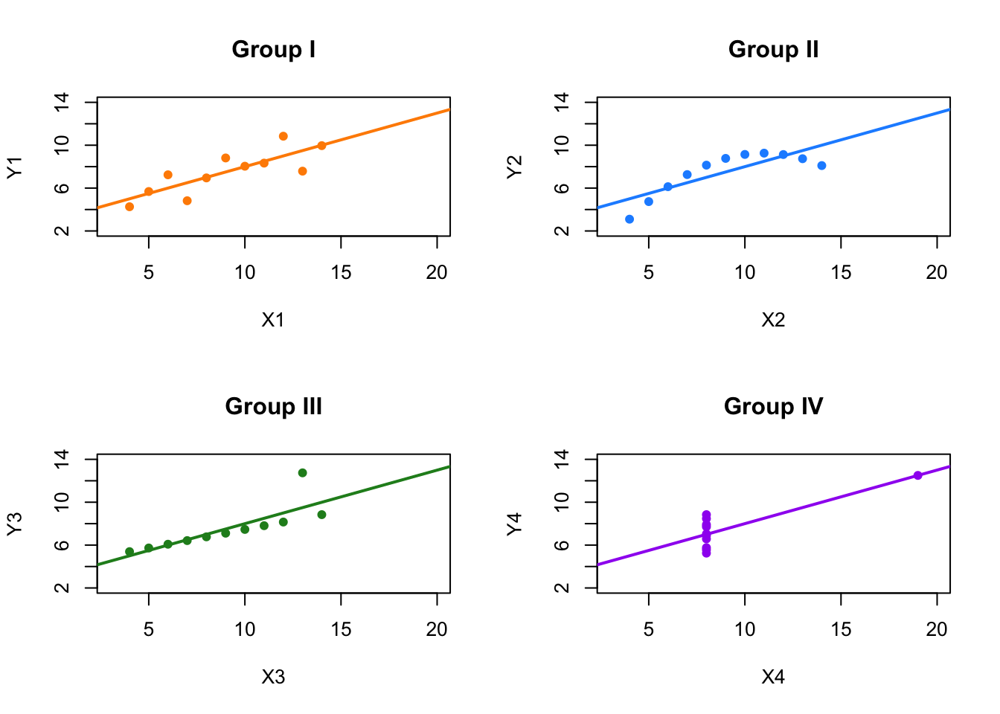
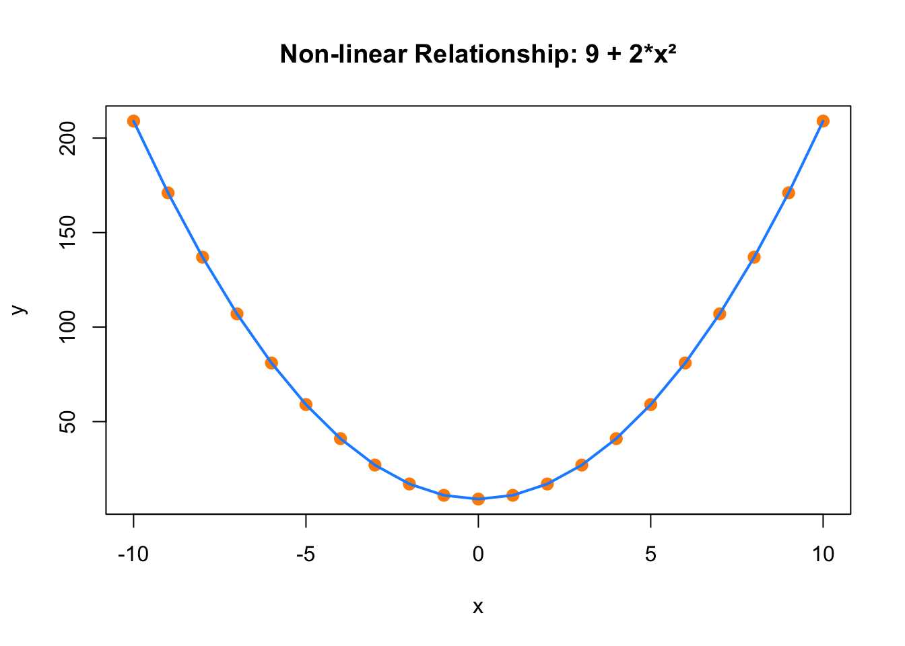

```{r setup, include=FALSE}
knitr::opts_chunk$set(echo = TRUE, message = FALSE, warning = FALSE)
```


## From Data to Causality: Alex's Allergy Story

- Alex collects data on meals and symptoms
- Uses **visualizations** to explore relationships
- Forms hypotheses about garlic as the cause

\note{
Use this relatable example to introduce students to observational data, correlation, and the transition to causality.
}

---

## Visual Tools Alex Used

- **Histogram** of reaction intensity
- **Bar Chart**: reactions by food type
- **Time Series**: reactions over time

*(Insert example figures here from saved outputs)*

\note{
Encourage students to describe what each plot shows and how it supports hypothesis generation.
}

---

## Quantifying Correlation

- Alex notices garlic has high correlation with intense reactions
- Some spurious patterns: weekends linked with reactions due to dining out

```{r corr-example, eval=FALSE}
cor(data$garlic, data$reaction_intensity)
```

\note{
Introduce idea of correlation coefficients and explain what “spurious correlation” means in practical terms.
}

---

## Controlling for Confounders with Regression

Alex estimates:

```{r ols-example, eval=FALSE}
model <- lm(reaction_intensity ~ garlic + weight + temperature + outside, data = data)
summary(model)
```

- Holds constant other variables
- Finds garlic still strongly predicts symptoms

\note{
Explain that OLS helps isolate garlic’s effect while controlling for weight, temperature, etc.
}

---

## Experimental Design to Identify Causality

- Alex and friends eat same meals (some with garlic)
- Only Alex shows symptoms
- Confirms garlic as causal trigger

\note{
Use this slide to introduce randomization, control groups, and the strength of experimental evidence.
}

---

## Spurious Correlation: Mia's Story

- Mia gets sick on garlic days too
- Turns out: it's the **candle** causing her reactions
- Not garlic → **confounding by context**

\note{
Great moment to discuss omitted variable bias and the risk of misattributing causes in observational data.
}

---

## From Correlation to Causation

- Step 1: Observe patterns in data
- Step 2: Control for confounders
- Step 3: Test causality experimentally
- Step 4: Rule out alternative explanations

\note{
Wrap up Alex & Mia's journey as a metaphor for applied causal inference.
}

---

## Qualitative vs. Quantitative Research

- **Qualitative**: interviews, focus groups, documents
- **Quantitative**: surveys, statistical models, structured data

\note{
Discuss inductive vs. deductive logic. Emphasize that both methods are valuable but serve different purposes.
}

---

## Data and Visualization

- Visualization helps generate hypotheses
- Patterns can be misleading if not contextualized

\note{
Remind students that before modeling, it's critical to “look at your data.”
}

---

## Anscombe’s Quartet: Why Visualization Matters

{width=80%}

- Same mean, variance, correlation, and regression line  
- Different visual patterns → Different data stories

\note{
A powerful example showing why summary stats alone aren’t enough.
}

---

## Nonlinear Relationships

{width=70%}

- Correlation may be high, but linear regression fails
- Nonlinearity is a common reason for poor model fit

\note{
Discuss functional form misspecification. Ask what would happen if we fit a straight line here.
}

---

## Correlation and Regression

- Correlation measures association, not direction of effect
- Regression allows prediction and controlling for other variables

\note{
Use this to transition toward regression and causal thinking.
}

---

## The Effect of \(X\) on \(Y\)

We want to model:

\[
Y = \beta_0 + \beta_1 X + \varepsilon
\]

- \(Y\): outcome  
- \(X\): predictor  
- \(\varepsilon\): unobserved error

\note{
Introduce the linear model. Emphasize goal: estimate \(\beta_1\) accurately.
}

---

## Estimating \(\beta_0\) and \(\beta_1\)

```{r ols-manual, eval=FALSE}
b1 <- cov(x, y) / var(x)
b0 <- mean(y) - b1 * mean(x)
```

- Use covariance and variance
- Intercept is derived after slope

\note{
You can walk through the math behind OLS slope and intercept. Useful to link theory with intuition.
}

---

## From Estimation to Prediction

- Estimation: infer relationship in the population
- Prediction: forecast \(Y\) for new \(X\)

\[
\hat{Y}_{\text{new}} = \hat{\beta}_0 + \hat{\beta}_1 X_{\text{new}}
\]

\note{
Highlight that prediction doesn’t require causal assumptions, only patterns that hold.
}

---

## Causal Effect

- Association $\neq$ Causation
- Need to rule out confounders, reverse causality, selection bias

Example approaches:
- Randomized controlled trials
- Instrumental variables
- Matching, Regression, DiD

\note{
Use this as a launching point for later chapters. The rest of the book elaborates these tools.
}
