# Neural Networks & Deep Learning

Artificial neural networks (ANNs) are a type of machine learning model that are inspired by the structure and function of the human brain. They consist of interconnected units called artificial neurons or nodes, which are organized into layers. The concept of artificial neural networks dates back to the 1940s, when Warren McCulloch and Walter Pitts (1943) proposed a model of the neuron as a simple threshold logic unit. In the 1950s and 1960s, researchers began developing more complex models of neurons and exploring the use of neural networks for tasks such as pattern recognition and machine translation. However, these early efforts were largely unsuccessful due to the limited computational power of the time.

It wasn't until the 1980s and 1990s that significant progress was made in the development of artificial neural networks, thanks to advances in computer technology and the availability of larger and more diverse datasets. In [1986](https://www.iro.umontreal.ca/~vincentp/ift3395/lectures/backprop_old.pdf), Geoffrey Hinton and his team developed the backpropagation algorithm, which revolutionized the field by allowing neural networks to be trained more efficiently and accurately.  Since then, artificial neural networks have been applied to a wide range of tasks, including image and speech recognition, natural language processing, and even playing games like chess and Go. They have also been used in a variety of fields, including finance, healthcare, and transportation.  Today, artificial neural networks are an important tool in the field of machine learning, and continue to be an active area of research and development.

There have been many influential works accomplished in the field of artificial neural networks (ANNs) over the years. Here are a few examples of some of the most important and influential works in the history of ANNs:
  
- [Perceptrons](https://psycnet.apa.org/record/1959-09865-001) by Frank Rosenblatt (1958): This paper introduced the concept of the perceptron, which is a type of ANN that can be trained to recognize patterns in data. The perceptron became a foundational concept in the field of machine learning and was a key catalyst for the development of more advanced ANNs. 
- [Backpropagation](https://www.iro.umontreal.ca/~vincentp/ift3395/lectures/backprop_old.pdf) by Rumelhart, Hinton, and Williams (1986): This paper introduced the backpropagation algorithm, which is a method for training ANNs that allows them to learn and adapt over time. The backpropagation algorithm is still widely used today and has been a key factor in the success of ANNs in many applications. 
- [LeNet-5](http://yann.lecun.com/exdb/publis/pdf/lecun-01a.pdf) by Yann LeCun et al. (1998): This paper described the development of LeNet-5, an ANN designed for recognizing handwritten digits. LeNet-5 was one of the first successful applications of ANNs in the field of image recognition and set the stage for many subsequent advances in this area. 
- [Deep Learning](https://pubmed.ncbi.nlm.nih.gov/26017442/) by Yann LeCun, Yoshua Bengio, and Geoffrey Hinton (2015): This paper provided a comprehensive review of the field of deep learning, which is a type of ANN that uses many layers of interconnected neurons to process data. It has had a major impact on the development of deep learning and has helped to drive many of the recent advances in the field. 

## Neural Network - the idea
Both Support Vector Machines and Neural Networks employ some kind of data transformation that moves them into a higher dimensional space. What the kernel function does for the SVM, the hidden layers do for neural networks.  

Let's start with a predictive model with a single input (covariate).  The simplest model could be a linear model: 

\begin{equation}
y \approx \alpha+\beta x
\end{equation}

where $\alpha$ is the intercept and $\beta$ is the slope.  The model is linear in the parameters, $\alpha$ and $\beta$.  The model is linear in the covariate $x$ as well.  The model can be written as a weighted sum of fixed components: $\alpha+\beta x$.  This is a linear model with fixed components.

Since this model could be a quite restrictive, we can have a more flexible one by a polynomial regression:

\begin{equation}
y \approx \alpha+\beta_1 x+\beta_2 x^2+\beta_3 x^3+\ldots = \alpha+\sum_{m=1}^M \beta_m x^m
\end{equation}

The polynomial regression is based on fixed components, or bases: $x, x^2, x^3, \ldots, x^M.$  The artificial neural net replaces these fixed components with adjustable ones or bases: $f\left(\alpha_1+\delta_1 x\right)$, $f\left(\alpha_2+\delta_2 x\right)$, $\ldots, f\left(\alpha_M+\delta_M x\right).$  We can see the first simple ANN as nonlinear functions of linear combinations:

\begin{equation}
\begin{aligned}
y \approx\; & \alpha + \beta_1 f\left(\alpha_1 + \delta_1 x\right) + \beta_2 f\left(\alpha_2 + \delta_2 x\right) + \beta_3 f\left(\alpha_3 + \delta_3 x\right) + \ldots \\
=\, & \alpha + \sum_{m=1}^M \beta_m f\left(\alpha_m + \delta_m x\right)
\end{aligned}
\end{equation}

where $\alpha$ is the intercept, $\beta_m$ are the weights, and $f(.)$ is a nonlinear function.  The model is linear in the parameters, $\alpha$, $\beta_m$, and $\delta_m$.  The model is nonlinear in the covariate $x$.  The model can be written as a weighted sum of flexible components: $\alpha+\sum_{m=1}^M \beta_m f\left(\alpha_m+\delta_m x\right)$.

where $f(.)$ is an **activation** function – a fixed nonlinear function. Common examples of activation functions are

- The **logistic** (or sigmoid) function: $f(x)=\frac{1}{1+e^{-x}}$; 
- The **hyperbolic tangent** function: $f(x)=\tanh (x)=\frac{e^x-e^{-x}}{e^x+e^{-x}}$; 
- The Rectified Linear Unit (**ReLU**): $f(x)=\max (0, x)$;  

The full list of activation functions can be found at [Wikipedia](https://en.wikipedia.org/wiki/Activation_function).

Let us consider a realistic (simulated) sample:


``` r
n <- 200
set.seed(1)
x <- sort(runif(n))
y <- sin(12*(x + 0.2))/(x + 0.2) + rnorm(n)/2
df <- data.frame(y, x)
plot(x, y, main="Simulated data",  col= "grey")
```

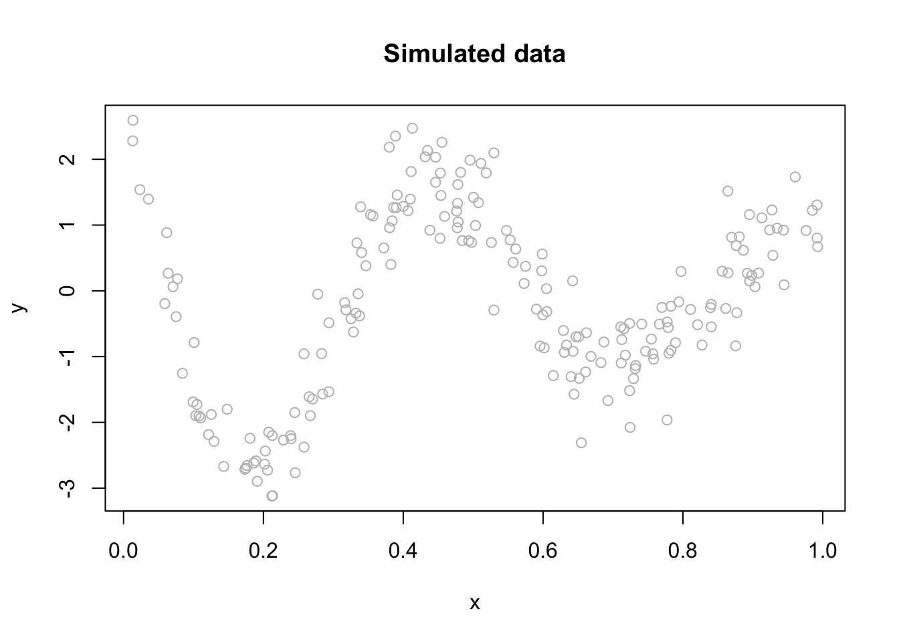

We can fit a polynomial regression with $M = 3$:  


``` r
ols <- lm(y ~ x + I(x^2) + I(x^3))
plot(x, y, main="Polynomial: M = 3",  col= "grey")
lines(x, predict(ols), col="blue", lwd = 3)
```

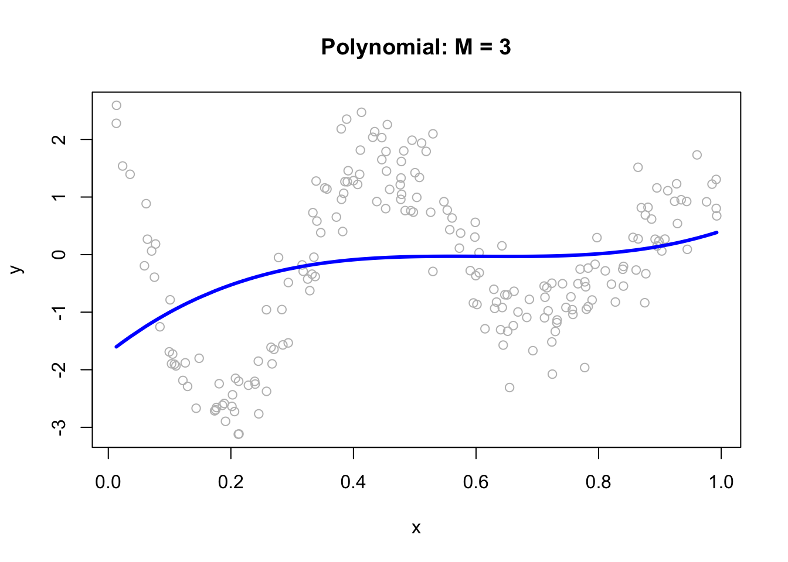
 

``` r
ols <- lm(y ~ x + I(x^2) + I(x^3))
plot(x, y, main="Polynomial: M = 3",  col= "grey")
lines(x, predict(ols), col="black", lwd = 3)
```

Now, we can think of the line as weighted sum of fixed components: $\alpha_1+\beta_1 x+\beta_2 x^2+\beta_3 x^3$.  
  

``` r
# Parts
first <- ols$coefficients[2]*x
second <- ols$coefficients[3]*x^2
third <- ols$coefficients[4]*x^3
yhat <- ols$coefficients[1] + first + second + third 

# Plots
par(mfrow=c(1,4), oma = c(0,0,2,0))
plot(x, first, ylab = "y", col = "pink", main = "x")
plot(x, second, ylab = "y", col = "orange", main = expression(x^2))
plot(x, third, ylab = "y", col = "green", main = expression(x^3))
plot(x, y, ylab="y", col = "grey",
     main = expression(y == alpha + beta[1]*x + beta[2]*x^2 + beta[3]*x^3))
lines(x, yhat, col = "red", lwd = 3)
mtext("Fixed Components",
      outer=TRUE, cex = 1.5, col="olivedrab")
```

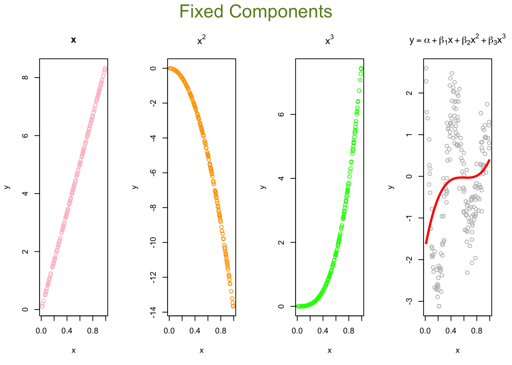
  

``` r
# Parts
first <- ols$coefficients[2]*x
second <- ols$coefficients[3]*x^2
third <- ols$coefficients[4]*x^3
yhat <- ols$coefficients[1] + first + second + third 

# Plots
par(mfrow=c(1,4), oma = c(0,0,2,0))
plot(x, first, ylab = "y", col = "gray60", main = "x")
plot(x, second, ylab = "y", col = "gray40", main = expression(x^2))
plot(x, third, ylab = "y", col = "gray20", main = expression(x^3))
plot(x, y, ylab="y", col = "grey",
     main = expression(y == alpha + beta[1]*x + beta[2]*x^2 + beta[3]*x^3))
lines(x, yhat, col = "gray10", lwd = 3)
mtext("Fixed Components",
      outer=TRUE, cex = 1.5, col="black")
```
  
The artificial neural net replaces the fixed components in the polynomial regression with adjustable ones, $f\left(\alpha_1+\delta_1 x\right)$, $f\left(\alpha_2+\delta_2 x\right)$, $\ldots, f\left(\alpha_M+\delta_M x\right)$ that are more flexible.  They are adjustable with tunable internal parameters. They can express several shapes, not just one (fixed) shape. Hence, adjustable components enable to capture complex models with fewer components (smaller M).  

Let's replace those fixed components $x, x^2, x^3$ in our polynomial regression with $f\left(\alpha_1+\delta_1 x\right)$, $f\left(\alpha_2+\delta_2 x\right)$, $f\left(\alpha_3+\delta_3 x\right).$  
  
The following code demonstrates the ability of a simple artificial neural network (ANN) with arbitrary parameters to capture the underlying signal relative to a third-degree polynomial regression model. It defines an ANN function with sigmoid activation functions for three nodes (M = 3), arbitrary parameters `a`, `b`, `beta`, and an intercept (`int`).  For each node, the code calculates the weighted input (`z`) using `a` and `b`, and then applies the sigmoid activation function to obtain the output (`sig`). The output is then multiplied by the corresponding beta value. The final output (`yhat`) is calculated as the sum of the intercept and the weighted outputs from all three nodes.
  

``` r
a = c(1.5, 9, 3)
b = c(-20,-14,-8)
beta = c(15, 25,-40)
int = 3

ann <- function(a, b, beta, int) {
  #1st sigmoid
  a1 = a[1]
  b1 = b[1]
  z1 = a1 + b1 * x
  sig1 = 1 / (1 + exp(-z1))
  
  f1 <- sig1
  
  #2nd sigmoid
  a2 = a[2]
  b2 = b[2]
  z2 = a2 + b2 * x
  sig2 = 1 / (1 + exp(-z2))
  
  f2 <- sig2
  
  #3rd sigmoid
  a3 = a[3]
  b3 = b[3]
  z3 = a3 + b3 * x
  sig3 = 1 / (1 + exp(-z3))
  
  f3 <- sig3
  
  yhat = int + beta[1] * f1 + beta[2] * f2 + beta[3] * f3
  return(yhat)
}

yhat <- ann(a, b, beta, int)

plot(x, y, main = "ANN: M = 3", ylim = c(-5, 15))
lines(x, yhat, col = "red", lwd = 3)
```

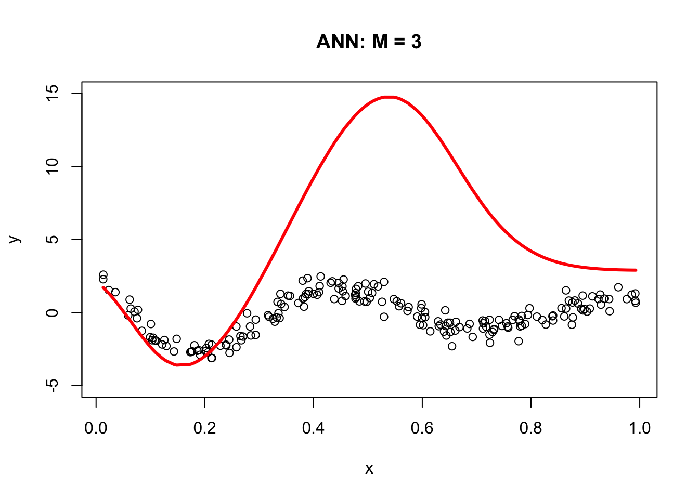

The resulting plot demonstrates the ANN's ability to fit the data compared to the third-degree polynomial regression model. The next section, Backpropagation, will show us how to get the correct parameters for our simple ANN.  For now, let's obstain them with `neuralnet`.  
  

``` r
library(neuralnet)

set.seed(2)
# fit a single-hidden-layer net with 3 units
nn <- neuralnet(y ~ x, data = df, hidden = 3, threshold = 0.05)

# explicitly call neuralnet::compute()
pred <- neuralnet::compute(nn, data.frame(x = df$x))
yhat <- pred$net.result

# scatter the raw data…
plot(df$x, df$y,
     main = "Neural Networks: M = 3",
     xlab = "x", ylab = "y",
     pch = 16)

# …and overlay the fitted curve
ord <- order(df$x)
lines(df$x[ord], yhat[ord], col = "red", lwd = 3)
```

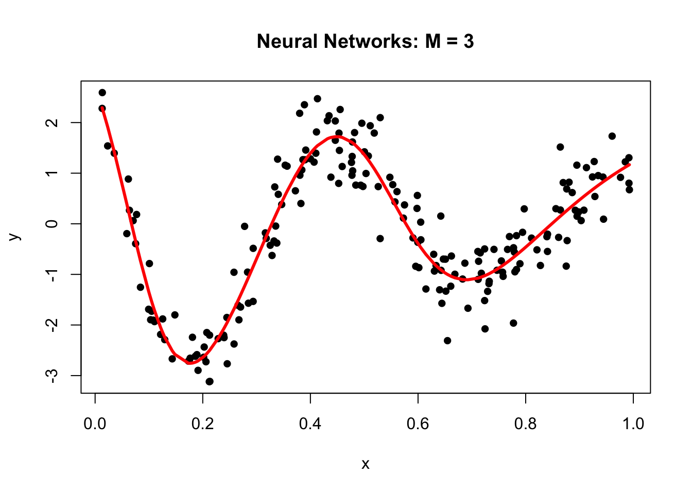

Why did neural networks perform better than polynomial regression in the previous example? Again, adjustable components enable to capture complex models. Let's delve little deeper.  Here is the weight structure of 
  
\begin{equation}
y \approx \alpha+\sum_{m=1}^3 \beta_m f\left(\alpha_m+\delta_m x\right)\\
= \alpha+\beta_1 f\left(\alpha_1+\delta_1 x\right)+\beta_2 f\left(\alpha_2+\delta_2 x\right)+\beta_3 f\left(\alpha_3+\delta_3 x\right)
\end{equation}
  

``` r
nn$weights
```

```
## [[1]]
## [[1]][[1]]
##           [,1]      [,2]      [,3]
## [1,]   1.26253   6.59977  2.504890
## [2,] -18.95937 -12.24665 -5.700564
## 
## [[1]][[2]]
##            [,1]
## [1,]   2.407654
## [2,]  13.032092
## [3,]  19.923742
## [4,] -32.173264
```

``` r
plot(nn, rep = "best")
```

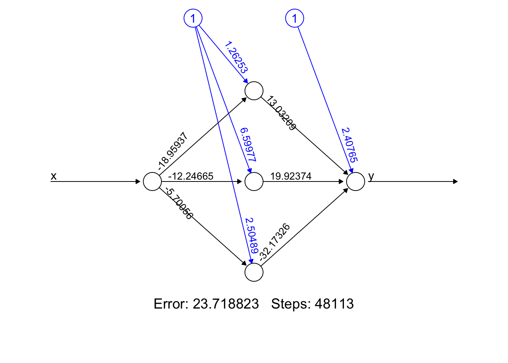

- Error: It represents the final error of the best-performing neural network after the training process has concluded. It's a snapshot of how well (or not) your model has learned the underlying pattern in our data. 
- Steps: The 48113' is the number of steps (iterations) the algorithm took to reach its current state, under the constraints we provided (like learning rate, threshold, etc.). It's a testament to how hard your network worked to get to its final form.  
  
We used sigmoid (logistic) activation functions
  

\begin{align*}
\text{Node 1:} \quad f_1(x) &= \frac{1}{1 + e^{-(1.26253 - 18.95937x)}} \\
\text{Node 2:} \quad f_2(x) &= \frac{1}{1 + e^{-(6.599773 - 12.24665x)}} \\
\text{Node 3:} \quad f_3(x) &= \frac{1}{1 + e^{-(2.504890 - 5.700564x)}}
\end{align*}

We can calculate the value of each activation function by using our data, $x$:
    

``` r
X <- cbind(1, x)

# to 1st Node
n1 <- nn$weights[[1]][[1]][,1]
f1 <- nn$act.fct(X%*%n1)

# to 2nd Node
n2 <- nn$weights[[1]][[1]][,2]
f2 <- nn$act.fct(X%*%n2)

# to 3rd Node
n3 <- nn$weights[[1]][[1]][,3]
f3 <- nn$act.fct(X%*%n3)

par(mfrow=c(1,3), oma = c(0,0,2,0))
plot(x, f1, col = "pink", main = expression(f(alpha[1] + beta[1]*x)))
plot(x, f2, col = "orange", main = expression(f(alpha[2] + beta[2]*x)))
plot(x, f3, col = "green", main = expression(f(alpha[3] + beta[3]*x)))
mtext("Flexible Components",
      outer=TRUE, cex = 1.5, col="olivedrab")
```

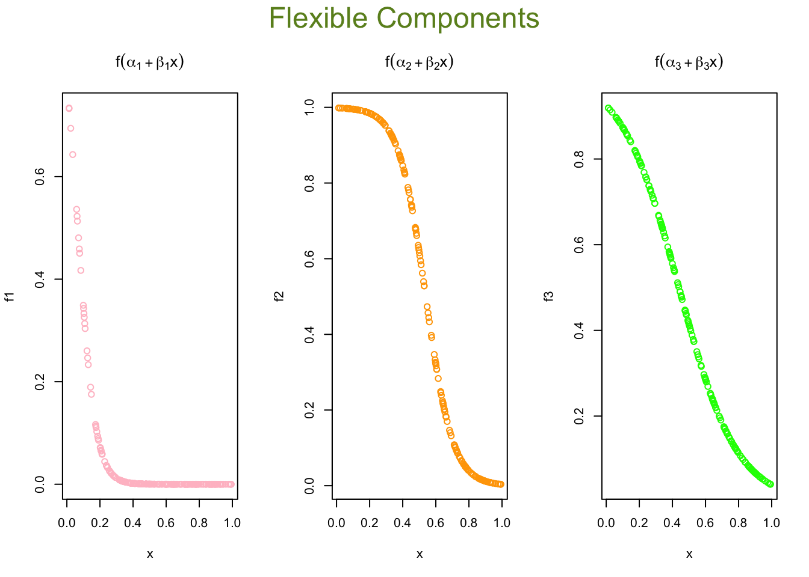


``` r
X <- cbind(1, x)

# to 1st Node
n1 <- nn$weights[[1]][[1]][,1]
f1 <- nn$act.fct(X%*%n1)

# to 2nd Node
n2 <- nn$weights[[1]][[1]][,2]
f2 <- nn$act.fct(X%*%n2)

# to 3rd Node
n3 <- nn$weights[[1]][[1]][,3]
f3 <- nn$act.fct(X%*%n3)

par(mfrow=c(1,3), oma = c(0,0,2,0))
plot(x, f1, col = "gray20", main = expression(f(alpha[1] + beta[1]*x)))
plot(x, f2, col = "gray40", main = expression(f(alpha[2] + beta[2]*x)))
plot(x, f3, col = "gray60", main = expression(f(alpha[3] + beta[3]*x)))
mtext("Flexible Components",
      outer=TRUE, cex = 1.5, col="black")
```
Now we will go from these nodes to the "sink":
  
\begin{align*}
&\frac{1}{1 + e^{-(1.26253 - 18.95937x)}} \times 13.032092 \\
&\frac{1}{1 + e^{-(6.599773 - 12.24665x)}} \times 19.923742 \\
&\frac{1}{1 + e^{-(2.504890 - 5.700564x)}} \times (-32.173264)
\end{align*}


And the final output (including the bias term) as:


\begin{align*}
\text{Output}(x) =\; & 2.407654 \\
&+ \frac{1}{1 + e^{-(1.26253 - 18.95937x)}} \times 13.032092 \\
&+ \frac{1}{1 + e^{-(6.599773 - 12.24665x)}} \times 19.923742 \\
&+ \frac{1}{1 + e^{-(2.504890 - 5.700564x)}} \times (-32.173264)
\end{align*}

Here are the results:  
  

``` r
# From Nodes to sink (Y)
f12 <- f1*nn$weights[[1]][[2]][2]
f22 <- f2*nn$weights[[1]][[2]][3]
f23 <- f3*nn$weights[[1]][[2]][4]

## Results
yhat <- nn$weights[[1]][[2]][1] + f12 + f22 + f23
plot(x, y, main="ANN: M = 3")
lines(x, yhat, col="red", lwd = 3)
```

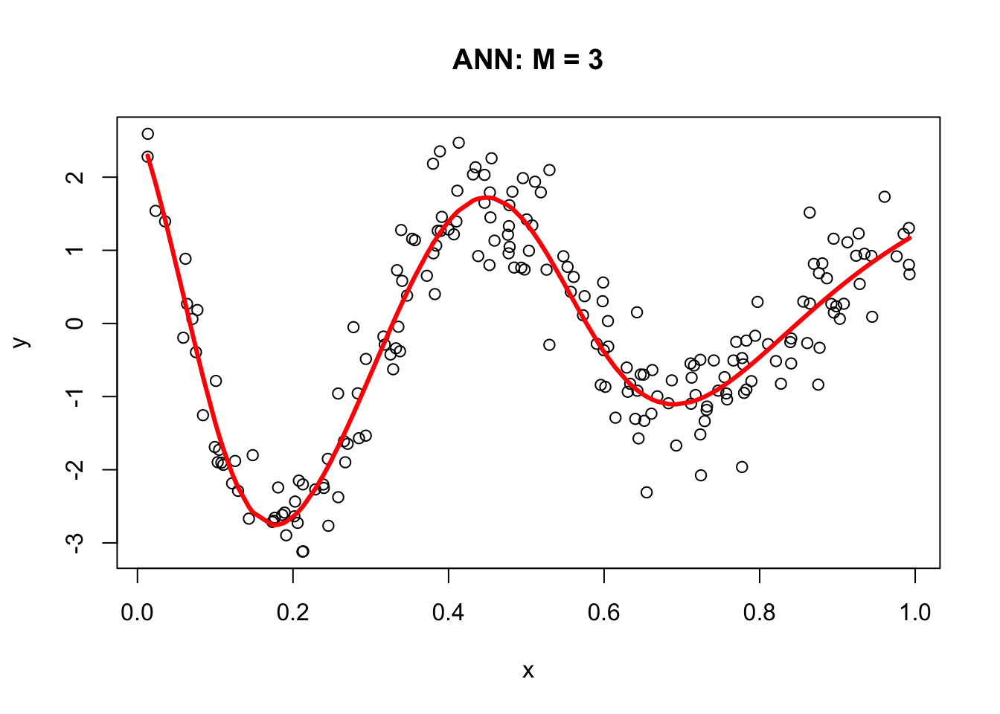

## Backpropagation

In 1986, [Rumelhart et al.](https://www.iro.umontreal.ca/~vincentp/ift3395/lectures/backprop_old.pdf) found a way to train neural networks with the backpropagation algorithm. Today, we would call it a Gradient Descent using reverse-mode autodiff.  Backpropagation is an algorithm used to train neural networks by adjusting the weights and biases of the network to minimize the cost function.  Suppose we have a simple neural network as follows:

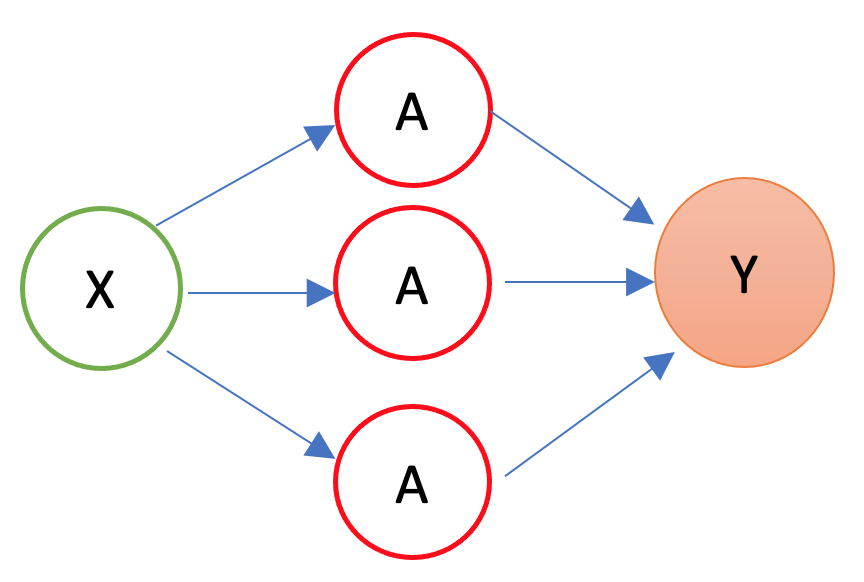

The first layer is the source layer (with $X$). The second layer is called as hidden layer with three "neurons" each of which has an activation function ($A$).  The last layer is the "sink" or output layer. First, let's define a loss function, MSPE:  

\begin{equation}
\text{MSPE}=\frac{1}{n} \sum_{i=1}^n\left(y_i-\hat{y}\right)^2
\end{equation}

And we want to solve: 
  
\begin{equation}
\omega^{\star}=\operatorname{argmin}\left\{\frac{1}{n} \sum_{i=1}^n\left(y_i-\hat{y}\right)^2\right\}
\end{equation}

where $\omega$ is the vector of weights and biases in the network.  The goal of the backpropagation algorithm is to find the optimal weights and biases that minimize the error between the predicted output $\hat{y}$ and the actual output $y$.
  
To compute the gradient of the error with respect to a weight $w$ or a bias $b$, we use the chain rule:  

\begin{equation}
\frac{\partial \text{MSPE}}{\partial w} =\frac{\partial \text{MSPE}}{\partial \hat{y}}\frac{\partial \hat{y}}{\partial z}\frac{\partial z}{\partial w}
\end{equation}

where $z$ is the weighted sum of inputs to the neuron, and $\hat{y}$ is the output of the neuron.  The first term, $\frac{\partial \text{MSPE}}{\partial \hat{y}}$, is the derivative of the error with respect to the output of the neuron.  The second term, $\frac{\partial \hat{y}}{\partial z}$, is the derivative of the output with respect to the weighted sum of inputs.  The third term, $\frac{\partial z}{\partial w}$, is the derivative of the weighted sum of inputs with respect to the weight or bias.

Remember, 

\begin{equation}
\hat{y} = f(x)=\frac{1}{1+e^{-z}}=\frac{1}{1+e^{-(\alpha+wx)}}
\end{equation}

where $f(.)$ is the activation function, $x$ is the input to the neuron, and $\alpha$ is the bias.  The output of the neuron is a function of the weighted sum of inputs, $z$, which is given by \( z = \alpha + wx\)
  
By repeating this process for each weight and bias in the network, we can calculate the error gradient and use it to adjust the weights and biases in order to minimize the error of the neural network.  This can be done by using gradient descent (See Chapter 32), which is an iterative method for optimizing a differentiable objective function, typically by minimizing it.  
  
However, with a multilayer ANN, we use stochastic gradient descent (SGD), which is a faster method iteratively minimizing the loss function by taking small steps in the opposite direction of the gradient of the function at the current position. The gradient is calculated using a randomly selected subset of the data, rather than the entire data set, which is why it is called "stochastic."  One of the main advantages of SGD is that it can be implemented very efficiently and can handle large data sets very well.  

We will use a very simple hand-coded gradient descent algorithm here (instead of `keras`) to solve our ANN problem as an example:


<!-- lines(x, yhat, col="red", lwd = 3) -->


``` r
n <- 200
set.seed(1)
x <- sort(runif(n))
Y <- sin(12*(x + 0.2))/(x + 0.2) + rnorm(n)/2
df <- data.frame(Y, x)
plot(x, Y, main="Simulated data",  col= "grey")

# starting points
set.seed(234)
alpha = runif(1); beta1 = runif(1); beta2 = runif(1); beta3 = runif(1)
a1 = runif(1); a2 = runif(1); a3 = runif(1)
b1 = runif(1); b2 = runif(1); b3 = runif(1)

# initial prediction
z1 = a1 + b1*x; z2 = a2 + b2*x; z3 = a3 + b3*x
sig1 = 1/(1 + exp(-z1)); sig2 = 1/(1 + exp(-z2)); sig3 = 1/(1 + exp(-z3))
yhat <- alpha + beta1 * sig1 + beta2 * sig2 + beta3 * sig3
MSE <- sum((Y - yhat) ^ 2) / n
prev_MSE <- MSE
iterations = 0

while (TRUE) {
  # gradients
  alpha_new <- alpha - (0.01 / n) * sum((Y - yhat) * (-1))
  beta1_new <- beta1 - (0.01 / n) * sum((Y - yhat) * sig1 * (-1))
  beta2_new <- beta2 - (0.01 / n) * sum((Y - yhat) * sig2 * (-1))
  beta3_new <- beta3 - (0.01 / n) * sum((Y - yhat) * sig3 * (-1))
  a1_new <- a1 - (0.01 / n) * sum((Y - yhat) * (-beta1 * exp(-z1) / ((1 + exp(-z1))^2)))
  a2_new <- a2 - (0.01 / n) * sum((Y - yhat) * (-beta2 * exp(-z2) / ((1 + exp(-z2))^2)))
  a3_new <- a3 - (0.01 / n) * sum((Y - yhat) * (-beta3 * exp(-z3) / ((1 + exp(-z3))^2)))
  b1_new <- b1 - (0.01 / n) * sum((Y - yhat) * (-beta1 * x * exp(-z1) / ((1 + exp(-z1))^2)))
  b2_new <- b2 - (0.01 / n) * sum((Y - yhat) * (-beta2 * x * exp(-z2) / ((1 + exp(-z2))^2)))
  b3_new <- b3 - (0.01 / n) * sum((Y - yhat) * (-beta3 * x * exp(-z3) / ((1 + exp(-z3))^2)))

  # update
  alpha <- alpha_new; beta1 <- beta1_new; beta2 <- beta2_new; beta3 <- beta3_new
  a1 <- a1_new; a2 <- a2_new; a3 <- a3_new
  b1 <- b1_new; b2 <- b2_new; b3 <- b3_new

  # new prediction
  z1 = a1 + b1*x; z2 = a2 + b2*x; z3 = a3 + b3*x
  sig1 = 1 / (1 + exp(-z1)); sig2 = 1 / (1 + exp(-z2)); sig3 = 1 / (1 + exp(-z3))
  yhat <- alpha + beta1 * sig1 + beta2 * sig2 + beta3 * sig3
  MSE_new <- sum((Y - yhat)^2) / n

  # convergence check
  if (abs(prev_MSE - MSE_new) < 1e-6) break
  prev_MSE <- MSE_new
  iterations <- iterations + 1
  if (iterations > 50000) {
    warning("Did not converge in 50,000 iterations.")
    break
  }
}

# plot final fit
plot(x, Y, main="Simulated data", col="grey")
lines(x, yhat, col="red", lwd = 3)
```

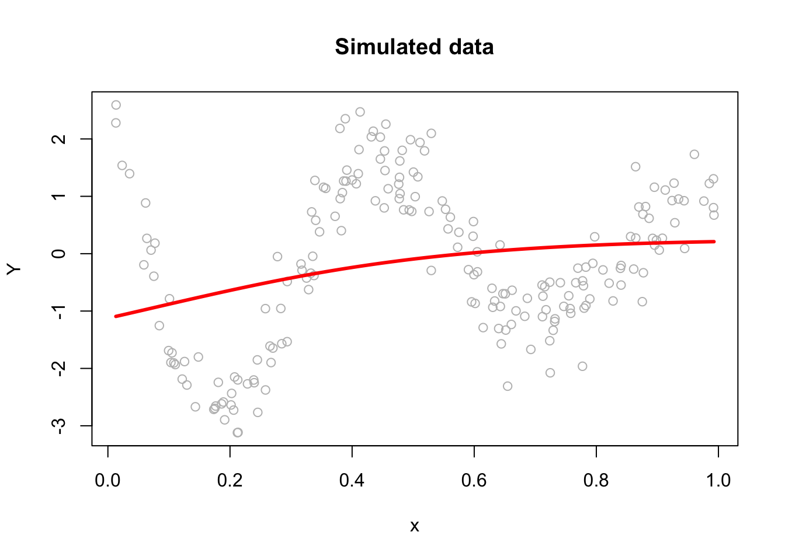


This plain gradient algorithm is very simple identifying only ten parameters.  In a regular network, the number of parameters is usually very large and it gets even larger in deep neural networks. Therefore, finding the most efficient (fast) backpropagation method is an active research area in the field of artificial intelligence.  One of the recent developments in this area is Tensors and Tensorflow that we will talk in Section VII. More details on gradient descent algorithms are provided in Chapter 32 Algorithmic Optimization. 

## Neural Network - More inputs

With a set of covariates $X=\left(1, x_1, x_2, \ldots, x_k\right)$, we have  

\begin{align*}
y \approx\; & \alpha + \sum_{m=1}^M \beta_m f\left(\alpha_m + \mathbf{X} \delta_m\right) \\
=\; & \alpha + \beta_1 f\left(\alpha_1 + \delta_{11} x_{1i} + \delta_{12} x_{2i} + \dots + \delta_{1k} x_{ki}\right) \\
& + \beta_2 f\left(\alpha_2 + \delta_{21} x_{1i} + \delta_{22} x_{2i} + \dots + \delta_{2k} x_{ki}\right) \\
& \quad \vdots \\
& + \beta_M f\left(\alpha_M + \delta_{M1} x_{1i} + \delta_{M2} x_{2i} + \dots + \delta_{Mk} x_{ki}\right)
\end{align*}

where $f(.)$ is a nonlinear function (e.g., sigmoid, tanh, etc.).  The $\delta_{mk}$ are the weights of the $k$-th input to the $m$-th neuron.  The $\beta_m$ are the weights of the $m$-th neuron to the output.  The $\alpha_m$ are the biases of the $m$-th neuron.  The $\alpha$ is the bias of the output.

By adding nonlinear functions of linear combinations with $M>1$, we have seen that we can capture nonlinearity.  With multiple features, we can now capture interaction effects and, hence, obtain a more flexible model.  This can be seen in blue and orange arrows in the following picture:  

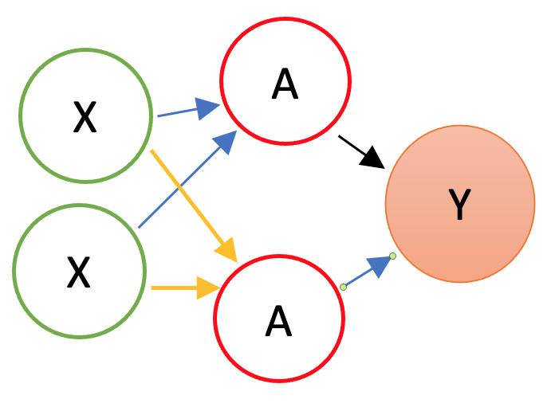

Let's have an application using a Mincer equation and the data (SPS 1985 - cross-section data originating from the May 1985 Current Population Survey by the US Census Bureau) from the `AER` package.  

Before we start, there are few important pre-processing steps to complete.  First, ANN are inefficient when the data are not scaled.  The reason is backpropagation.  Since ANN use gradient descent, the different scales in features will cause different step sizes. Scaling the data before feeding it to the model enables the steps in gradient descent updated at the same rate for all the features. Second, indicator predictors should be included in the input matrix by dummy-coding. Finally, the formula for the model needs to be constructed to initialize the algorithm.  Let's see all of these pre-processing steps below:  


``` r
library(AER)
data("CPS1985")

df <- CPS1985

# Scaling and Dummy coding
df[,sapply(df, is.numeric)] <- scale((df[, sapply(df, is.numeric)]))
ddf <- model.matrix(~.-1, data= df, contrasts.arg =
                       lapply(df[,sapply(df, is.factor)],
                              contrasts, contrasts = FALSE))

ddf <- as.data.frame(ddf)

# formula to pass on ANN and lm()  
w.ind <- which(colnames(ddf)=="wage")
frmnn <- as.formula(paste("wage~", 
                  paste(colnames(ddf[-w.ind]), collapse='+')))
frmln <- as.formula(paste("wage~", "I(experience^2)", "+",
                  paste(colnames(ddf[-w.ind]), collapse = "+")))

# Bootstrapping loops instead of CV
mse.test <- matrix(0, 10, 5)
for(i in 1:10){ 
  
  set.seed(i+1)
  trainid <- unique(sample(nrow(ddf), nrow(ddf), replace = TRUE))
  train <- ddf[trainid,]
  test <- ddf[-trainid,]
  
 # Models 
  fit.lm <- lm(frmln, data = train)
  fit.nn <- neuralnet(frmnn, data = train, hidden = 1,threshold=0.05,
                      linear.output = FALSE)
  fit.nn2 <- neuralnet(frmnn, data = train, hidden = 2,threshold=0.05)
  fit.nn3 <- neuralnet(frmnn, data = train, hidden = 3,threshold=0.05)
  fit.nn4 <- neuralnet(frmnn, data = train, hidden = 3,threshold=0.05,
                       act.fct = "tanh", linear.output = FALSE)
 
  # Prediction errors
  mse.test[i,1] <- mean((test$wage - predict(fit.lm, test))^2)
  mse.test[i,2] <- mean((test$wage - predict(fit.nn, test))^2)
  mse.test[i,3] <- mean((test$wage - predict(fit.nn2, test))^2)
  mse.test[i,4] <- mean((test$wage - predict(fit.nn3, test))^2)
  mse.test[i,5] <- mean((test$wage - predict(fit.nn4, test))^2)
}

colMeans(mse.test)
```

```
## [1] 0.7296417 0.8919442 0.9038211 1.0403616 0.8926576
```

This experiment alone shows that a **linear** Mincer equation (with `I(expreince^2)`) is a much better predictor than ANN.  As the complexity of ANN rises with more neurons, the likelihood that ANN overfits goes up, which is the case in our experiment.  In general, linear regression may be a good choice for simple, low-dimensional datasets with a strong linear relationship between the variables, while ANNs may be better suited for more complex, high-dimensional datasets with nonlinear relationships between variables.  

Overfitting can be a concern when using ANNs for prediction tasks. Overfitting occurs when a model is overly complex and has too many parameters relative to the size of the training data, which results in fitting the noise in the training data rather than the underlying pattern. As a result, the model may perform well on the training data but poorly on new, unseen data.  One way to mitigate overfitting in ANNs is to use techniques such as regularization, which imposes constraints on the model to prevent it from becoming too complex. Another approach is to use techniques such as early stopping, which involves interrupting the training process when the model starts to overfit the training data.  

## Deep Learning

Simply, a Deep Neural Network (DNN), or Deep Learning, is an artificial neural network that has two or more hidden layers. Even greater flexibility is achieved via composition of activation functions:  

\begin{equation}
y \approx \alpha+\sum_{m=1}^M \beta_m f\left(\alpha_m^{(1)}+\underbrace{\sum_{p=1}^P f\left(\alpha_p^{(2)}+\textbf{X} \delta_p^{(2)}\right)}_{\text {it replaces } \textbf{X}} \delta_m^{(1)}\right)
\end{equation}

Here, \(\mathbf{X}\) is the input vector, and \(f(\cdot)\) is a nonlinear activation function such as the sigmoid or hyperbolic tangent. The inner sum represents the output of the second hidden layer, where \(\alpha_p^{(2)}\) are the biases and \(\delta_p^{(2)}\) are the weights applied to the inputs. These outputs then become the effective inputs to the first hidden layer, which applies another transformation using its own weights \(\delta_m^{(1)}\) and biases \(\alpha_m^{(1)}\). Each transformed value is then scaled by an output-layer weight \(\beta_m\), and the sum of these values is added to the output-layer bias \(\alpha\) to produce the final prediction \(y\). The indices \(P\) and \(M\) refer to the number of neurons in the second and first hidden layers, respectively. This nesting of nonlinear transformations is what gives deep networks their expressive power.

Before having an application, we should note the number of available packages that offer ANN implementations in R and with Python. For example, CRAN hosts more than 80 packages related to neural network modeling. Above, we just saw one example with `neuralnet`.  The work by [Mahdi et al, 2021](https://www.inmodelia.com/exemples/2021-0103-RJournal-SM-AV-CD-PK-JN.pdf) surveys and ranks these packages for their accuracy, reliability, and ease-of-use.  
  

``` r
mse.test <- c()
for(i in 1:10){ 
  
  set.seed(i+1)
  trainid <- unique(sample(nrow(ddf), nrow(ddf), replace = TRUE))
  train <- ddf[trainid,]
  test <- ddf[-trainid,]
  
  # Models
  fit.nn22 <- neuralnet(frmnn, data = train, hidden = c(3,3), 
                        threshold = 0.05)
  mse.test[i] <- mean((test$wage - predict(fit.nn22, test))^2)
 }

mean(mse.test)
```

```
## [1] 1.211114
```

The overfitting gets worse with an increased complexity!  Here is the plot for our DNN:  
<!--

``` r
plot(fit.nn22, rep = "best")
```
-->


``` r
plot(fit.nn22)
```
A better plot could be obtained by using the `NeuralNetTools` package:  


``` r
library(NeuralNetTools)
plotnet(fit.nn22)
```

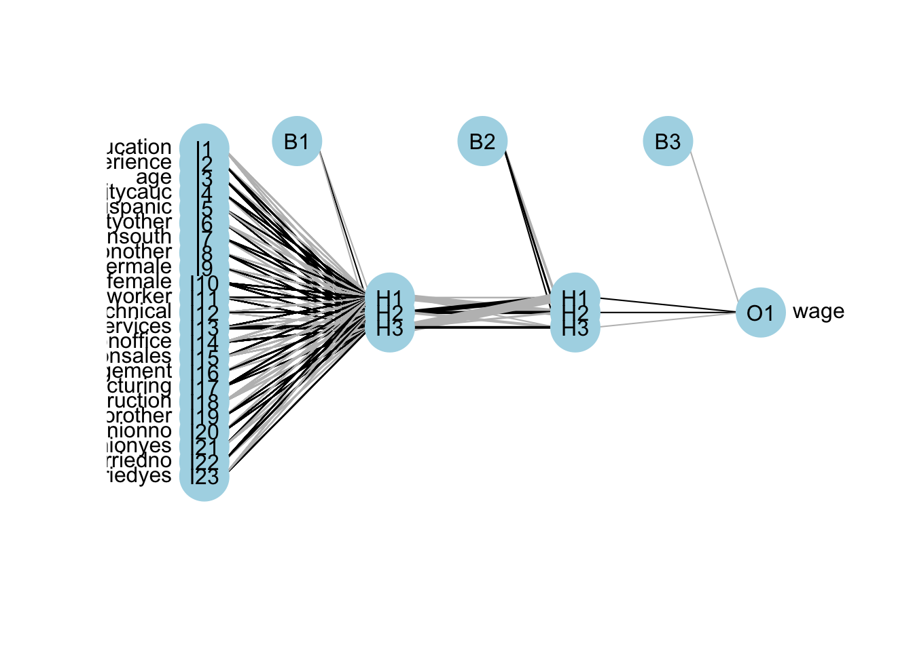


Deep neural networks can model complex non-linear relationships. With very complex problems, such as detecting hundreds of types of objects in high-resolution images, we need to train deeper NNs, perhaps with 10 layers or more each with hundreds of neurons.  Therefore, training a fully-connected DNN is a very slow process facing a severe risk of overfitting with millions of parameters.  Moreover, gradients problems make lower layers very hard to train.  A solution to these problems came with a different NN architect such as convolutional Neural Networks (CNN or ConvNets) and Recurrent Neural Networks (RNN)

Moreover, the interpretability of an artificial neural network (ANN), which is known to be a "blackbox" method, can be an issue regardless of the complexity of the network. However, it is generally easier to understand the decisions made by a simple ANN than by a more complex one.  

A simple ANN might have only a few layers and a relatively small number of neurons, making it easier to understand how the input data is processed and how the final output is produced. However, even a simple ANN can still be a black box in the sense that the specific calculations and decisions made by the individual neurons within the network are not fully visible or understood.  On the other hand, a more complex ANN with many layers and a large number of neurons can be more difficult to interpret, as the internal workings of the network are more complex and harder to understand. In these cases, it can be more challenging to understand how the ANN is making its decisions or to identify any biases or errors in its output. Overall, the interpretability of an ANN depends on the complexity of the network and the specific task it is being used for. Simple ANNs may be more interpretable, but even they can be considered black boxes to some extent.  

Here are a few resources that provide information about the interpretability of artificial neural networks (ANNs):  
  
- [Interpretable Machine Learning](https://christophm.github.io/interpretable-ml-book/) by Christoph Molnar (2021) is a online book that provides an overview of interpretability in machine learning, including techniques for interpreting ANNs. 
- [Interpretability of Deep Neural Networks](https://ieeexplore.ieee.org/document/8397411) by Chakraborty et al. (2017) is a survey paper that discusses the interpretability of deep neural networks and presents an overview of the various techniques and approaches that have been developed to improve their interpretability.  

Before concluding this section we apply DNN to a classification problem using the same data that we had earlier.  


``` r
library(ISLR)
df <- Carseats
str(df)
```

```
## 'data.frame':	400 obs. of  11 variables:
##  $ Sales      : num  9.5 11.22 10.06 7.4 4.15 ...
##  $ CompPrice  : num  138 111 113 117 141 124 115 136 132 132 ...
##  $ Income     : num  73 48 35 100 64 113 105 81 110 113 ...
##  $ Advertising: num  11 16 10 4 3 13 0 15 0 0 ...
##  $ Population : num  276 260 269 466 340 501 45 425 108 131 ...
##  $ Price      : num  120 83 80 97 128 72 108 120 124 124 ...
##  $ ShelveLoc  : Factor w/ 3 levels "Bad","Good","Medium": 1 2 3 3 1 1 3 2 3 3 ...
##  $ Age        : num  42 65 59 55 38 78 71 67 76 76 ...
##  $ Education  : num  17 10 12 14 13 16 15 10 10 17 ...
##  $ Urban      : Factor w/ 2 levels "No","Yes": 2 2 2 2 2 1 2 2 1 1 ...
##  $ US         : Factor w/ 2 levels "No","Yes": 2 2 2 2 1 2 1 2 1 2 ...
```

``` r
#Change SALES to a factor variable
df$Sales <- as.factor(ifelse(Carseats$Sales <= 8, 0, 1))
dff <- df[, -1]

# Scaling and Dummy coding
dff[,sapply(dff, is.numeric)] <- scale((dff[, sapply(dff, is.numeric)]))
ddf <- model.matrix(~.-1, data= dff, contrasts.arg =
                       lapply(dff[, sapply(dff, is.factor)],
                              contrasts, contrasts = FALSE))

ddf <- data.frame(Sales = df$Sales, ddf)

# Formula
w.ind <- which(colnames(ddf) == "Sales")
frm <- as.formula(paste("Sales~", paste(colnames(ddf[-w.ind]),
                                        collapse = '+')))
```


``` r
library(ROCR)

n <- 10
AUC1 <- c()
AUC2 <- c()

for (i in 1:n) {
  set.seed(i)
  ind <- unique(sample(nrow(ddf), nrow(ddf), replace = TRUE))
  train <- ddf[ind, ]
  test <- ddf[-ind, ]
  
  # Models
  fit.ln <- glm(frm, data = train, family = binomial(link = "logit"))
  fit.dnn <- neuralnet(frm, data = train, hidden = 2, threshold = 0.05,
                       linear.output = FALSE, err.fct = "ce")
  
  #Predictions
  phat.ln <- predict(fit.ln, test, type = "response")
  phat.dnn <- predict(fit.dnn, test, type = "repsonse")[,2]

  #AUC for predicting Y = 1
  pred_rocr1 <- ROCR::prediction(phat.ln, test$Sales)
  auc_ROCR1 <- ROCR::performance(pred_rocr1, measure = "auc")
  AUC1[i] <- auc_ROCR1@y.values[[1]]

  pred_rocr2 <- ROCR::prediction(phat.dnn, test$Sales)
  auc_ROCR2 <- ROCR::performance(pred_rocr2, measure = "auc")
  AUC2[i] <- auc_ROCR2@y.values[[1]]
}

(c(mean(AUC1), mean(AUC2)))
```

```
## [1] 0.9471081 0.9186785
```

Again the results are not very convincing to use DNN in this example.
   
We now take on a more complex classification task using the Red Wine dataset from Kaggle (Cortez et al., 2009), available at [Wine Quality Data Set](https://archive.ics.uci.edu/ml/datasets/wine+quality). The dataset contains 1,599 observations and 12 variables. Our goal is to predict wine quality (rated from 3 to 8) based on 11 physicochemical attributes such as acidity, residual sugar, and sulfur dioxide.


``` r
dfr <- read.csv("wineQualityReds.csv", header = TRUE)
dfr <- dfr[, -1] # removing the index
table(dfr$quality)
```

```
## 
##   3   4   5   6   7   8 
##  10  53 681 638 199  18
```

``` r
# Let's remove the outlier qualities:
indo <- which(dfr$quality == "3" | dfr$quality == "8")
dfr <- dfr[-indo, ]
dfr$quality <- as.factor(dfr$quality)
table(dfr$quality)
```

```
## 
##   4   5   6   7 
##  53 681 638 199
```

Then scale the data and get the formula,


``` r
# Scaling and Dummy coding
dfr[, sapply(dfr, is.numeric)] <-
  scale((dfr[, sapply(dfr, is.numeric)]))

ddf <- model.matrix( ~ quality - 1, data = dfr)
w.ind <- which(colnames(dfr) == "quality")
dfr <- dfr[, -w.ind] # removing 'quality`
df <- cbind(ddf, dfr)

frm <- as.formula(paste(
  paste(colnames(ddf), collapse = '+'),
  "~",
  paste(colnames(dfr), collapse = '+')
))
frm
```

```
## quality4 + quality5 + quality6 + quality7 ~ fixed.acidity + volatile.acidity + 
##     citric.acid + residual.sugar + chlorides + free.sulfur.dioxide + 
##     total.sulfur.dioxide + density + pH + sulphates + alcohol
```

And, our simple DNN application


``` r
ind <- sample(nrow(df), nrow(df) * .7)
train <- df[ind, ]
test <- df[-ind, ]

fit.nn <-
  neuralnet(
    frm,
    data = train,
    hidden = c(3, 2),
    threshold = 0.05,
    linear.output = FALSE,
    err.fct = "ce"
  )

plot(fit.nn, rep = "best")
```

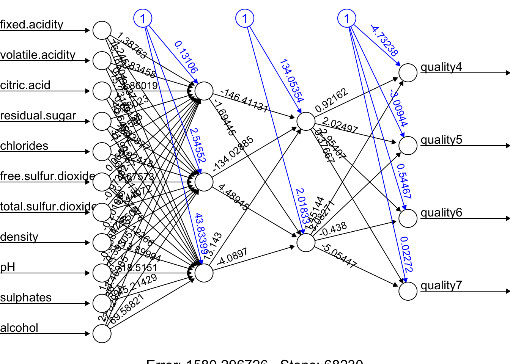

And our prediction:


``` r
library(utiml)

phat <- predict(fit.nn, test)
head(phat)
```

```
##          [,1]      [,2]      [,3]        [,4]
## 11 0.04931942 0.6859165 0.2825146 0.007453298
## 14 0.02015208 0.2300976 0.5716617 0.050629158
## 16 0.08538068 0.8882124 0.0550048 0.009824072
## 17 0.03592572 0.5136539 0.5273030 0.006685037
## 22 0.03616818 0.5173671 0.5263112 0.006541895
## 27 0.03092853 0.4318134 0.5389403 0.011412135
```

``` r
# Assigning label by selecting the highest phat
label.hat <- t(apply(phat, 1, function(x) as.numeric(x == max(x))))
head(label.hat)
```

```
##    [,1] [,2] [,3] [,4]
## 11    0    1    0    0
## 14    0    0    1    0
## 16    0    1    0    0
## 17    0    0    1    0
## 22    0    0    1    0
## 27    0    0    1    0
```

``` r
# Confusion Table
pred <- apply(phat, 1, which.max)
fck <- colnames(test)[1:4]
predicted <- fck[pred]

act<- apply(test[,1:4], 1, which.max)
actual <- fck[act]

table(predicted, actual)
```

```
##           actual
## predicted  quality4 quality5 quality6 quality7
##   quality5        4      107       32        3
##   quality6        7       78      160       51
##   quality7        1        0       11       18
```

This is just an example and the results are not reflecting a trained model.

Advance DNN applications with a proper training requires a longer time and more capable machines.  We can do a grid search on different number of hidden layers and neurons.  However, a large datasets and more complex DNNs need better applications, like, `Keras` that uses GPU with capable operating systems allowing a much better efficiency in training. So far, we have used the `neuralnet` package.  There are several packages in R that are also capable of implementing and training artificial neural networks. The most suitable one for our needs will depend on our specific requirements and preferences.  For a powerful and flexible package for building and training ANNs, `neuralnet` or `deepnet` may be good options. When we just need a simple and easy-to-use package for training feedforward networks and making predictions, `nnet` may be another good choice. If we want a general-purpose package that can handle a wide range of machine learning tasks, including ANNs, `caret` would be a good option.  

Deep neural networks (DNNs) are neural networks with many layers, which can be difficult to train because of the large number of parameters that need to be optimized. This can make the training process computationally intensive and prone to overfitting.  Convolutional neural networks (CNNs), on the other hand, are specifically designed to process data that has a grid-like structure, such as an image. One key aspect of CNNs is that they use convolutional layers, which apply a set of filters to the input data and produce a set of transformed feature maps. These filters are able to detect specific features in the input data, such as edges, corners, or textures, and are able to share these features across the input data. This means that the number of parameters in a CNN is typically much smaller than in a DNN, which makes the model easier to train and less prone to overfitting.  Overall, CNNs are well-suited for tasks such as image classification, object detection and, speech recognition. We will not cover the details of CNN here.  There are several packages available in R for working with CNNs. 

Finally, in a deep neural network, "dropout" and "regularization" are techniques used to prevent overfitting.  Dropout is a regularization technique that randomly drops out, or removes, a certain percentage of neurons from the network during training. This has the effect of reducing the complexity of the model, as it can't rely on any one neuron or group of neurons to make predictions. Regularization is a general term that refers to any method used to prevent overfitting in a machine learning model. There are many types of regularization techniques, which add a penalty term to the parameters of the the activation functions.

## Deep Learning with `keras` package

The `keras` package in R provides an interface to the Keras deep learning library, which is a high-level neural networks API written in Python. Keras allows you to build and train deep learning models with minimal code and provides a wide range of pre-built layers, activation functions, optimizers, and loss functions to choose from.  The `keras` package in R provides an interface to the Keras deep learning library, which is a high-level neural networks API written in Python. 

To use Keras with GPU acceleration with M processors, you'll need to set up TensorFlow to work with Apple's Metal Performance Shaders (MPS) framework. The M series Apple computers have powerful Apple Silicon GPUs that can be leveraged for machine learning tasks. Here's how to set it up:

1.  Install TensorFlow with MPS support:

``` bash
pip install tensorflow-macos
pip install tensorflow-metal
```

2.  For R users specifically, you'll need to set up the proper environment:

    -   Install R and RStudio
    -   Install the `keras` and `tensorflow` R packages

    ``` r
    install.packages("keras")
    install.packages("tensorflow")
    ```

3.  Initialize and configure Keras to use the MPS backend:

``` r
library(keras)
library(tensorflow)

# Install TensorFlow for R with MPS support
install_tensorflow(extra_packages = c("tensorflow-metal"))

# Configure to use Metal
use_backend("tensorflow")
```

4.  Verify GPU availability:

``` r
library(tensorflow)
tf$config$list_physical_devices('GPU')
```

This should show your Apple GPU device if everything is set up correctly.

When building Keras models, your code will automatically utilize the GPU acceleration provided by the Metal framework when available.

Keep in mind that while the Metal GPU acceleration provides good performance, some TensorFlow operations may not be fully optimized for Apple Silicon yet. The M chips should provide excellent performance for most deep learning tasks, especially with the properly configured environment.

The following program trains a deep neural network regression model using the CPS1985 dataset (from the `AER` package) to predict log wages based on demographic and job characteristics. The code below trains a deep neural network with two hidden layers, each containing 64 neurons. The model is trained on the training data and evaluated on the test data using the Mean Squared Error (MSE) and Mean Absolute Error (MAE) as metrics. The results show the test loss and test MAE for the model.  More details can be found here [TensorFlow for R](https://tensorflow.rstudio.com/guides/).


``` r
library(keras)
library(tensorflow)
library(AER)

# Check for GPU availability (if any)
print(tf$config$list_physical_devices("GPU"))
```

```
## [[1]]
## PhysicalDevice(name='/physical_device:GPU:0', device_type='GPU')
```

``` r
# Clear any previous Keras session
keras::k_clear_session()

# Load the dataset from the AER package
data("CPS1985")
df <- CPS1985

# Scale numeric features
numeric_vars <- sapply(df, is.numeric)
df[, numeric_vars] <- scale(df[, numeric_vars])

# Create dummy variables for factor variables using model.matrix
ddf <- model.matrix(~ . - 1, data = df,
contrasts.arg = lapply(df[, sapply(df, is.factor)],contrasts,contrasts = FALSE))
ddf <- as.data.frame(ddf)

# Split the data into training (80%) and testing (20%) sets
set.seed(123)  # for reproducibility
train_indices <- sample(1:nrow(ddf), size=round(0.8 * nrow(ddf)),replace =FALSE)
train <- ddf[train_indices, ]
test <- ddf[-train_indices, ]

# Prepare predictor matrices and target vectors. Here 'wage' is the target.
train_x <- as.matrix(train[, -which(colnames(train) == "wage")])
train_y <- matrix(train$wage, ncol = 1)
test_x <- as.matrix(test[, -which(colnames(test) == "wage")])
test_y <- matrix(test$wage, ncol = 1)

# Define the input layer using the number of predictors
inputs <- layer_input(shape = ncol(train_x))

# Build the model using the functional API
outputs <- inputs %>%
  layer_dense(units = 64, activation = "relu") %>%
  layer_dense(units = 64, activation = "relu") %>%
  layer_dense(units = 1)  # Output layer for regression

# Create the model by specifying inputs and outputs
model <- keras_model(inputs = inputs, outputs = outputs)

# Compile the model with MSE loss and MAE as metric, using the RMSprop optimizer
model$compile(
  loss = "mean_squared_error",
  optimizer = optimizer_rmsprop(),
  metrics = list("mean_absolute_error")
)

# Fit the model. Setting verbose = 0 will suppress progress output.
history <- model$fit(
  x = train_x, 
  y = train_y,
  epochs = as.integer(100),
  batch_size = as.integer(128),
  validation_split = 0.2,
  verbose = 0  # change to 1 if you wish to see training progress
)

# Evaluate the model on the test set
score <- model$evaluate(
  x = test_x, 
  y = test_y,
  verbose = 0
)

cat("Test loss:", score[[1]], "\n")
```

```
## Test loss: 0.6035181
```

``` r
cat("Test mean absolute error:", score[[2]], "\n")
```

```
## Test mean absolute error: 0.5967063
```
  
**Test Loss**: This is the value of the loss function for our test dataset. In a regression problem like yours, where you might be using Mean Squared Error (MSE) as the loss function, this represents the average of the squares of the differences between the predicted and actual values across all observations in the test set. It's a measure of how well the model is able to predict the target variable on unseen data. A lower test loss indicates better model performance.

**Test MAE (Mean Absolute Error)**: MAE is another metric used to evaluate the performance of a regression model. It's calculated as the average of the absolute differences between the predicted and actual values across all observations in the test set. Unlike the MSE, the MAE gives a linear score, meaning all individual differences are weighted equally in the average. It's particularly useful because it's easy to interpret; for instance, an MAE of 5 would mean that, on average, the predicted values differ from the actual values by 5 units of the target variable.


### Setting up a Keras Model

**Step 1: Defining the Model**

In Keras, a model is essentially a graph of layers. The most common type of model is a stack of layers called the Sequential model, which allows you to create models layer-by-layer in a linear fashion.

-   Sequential Model: This is a linear stack of layers. You start by creating an instance of Sequential and then add layers to it. Each layer has weights that correspond to the connections between units (neurons) in this layer and the next layer.
-   Layers: The building blocks of models. Layers extract representations out of the data fed into them. For most deep learning models, dense (fully connected) layers are used. The first Dense layer we add plays a special role. While technically every Dense layer is just a layer of neurons fully connected to the previous layer, the first Dense layer you add to the model also implicitly serves as the input layer. This is because it needs to know the shape of the input data it will be receiving, which you specify with the input_shape parameter.
-   Activation Functions: These are applied to the output of a layer to introduce non-linearity into the model, allowing it to learn complex patterns in the data. Common activation functions include ReLU, Sigmoid, and Tanh.
-   Input Shape: This specifies the shape of the input data. The input shape is the number of features in your dataset. For example, if you have 10 features, the input shape would be 10.
  
**Step 2: Compiling the Model**

After defining the model, you need to compile it. This involves specifying the loss function, optimizer, and metrics to be used during training.

-   Loss Function: This is the objective that the model will try to minimize during training. For regression problems, Mean Squared Error (MSE) is commonly used.
-   Optimizer: This is the algorithm used to update the weights of the model during training. Common optimizers include Stochastic Gradient Descent (SGD), Adam, and RMSprop.
-   Metrics: These are used to evaluate the performance of the model. For regression problems, Mean Absolute Error (MAE) is a common metric.

**Step 3: Training the Model**

Once the model is compiled, you can train it on your training data. This involves passing the input data and target labels to the model and specifying the number of epochs (iterations over the entire dataset) and batch size (number of samples per gradient update).

-   Epochs: One epoch is when an entire dataset is passed forward and backward through the neural network once.
-   Batch Size: The number of training examples utilized in one iteration.
-   Validation Split: The fraction of the training data to be used as validation data. The model will set apart this fraction of the training data, won't train on it, and will evaluate the loss and any model metrics on this data at the end of each epoch.

**Step 4: Evaluating the Model**

After training the model, you can evaluate its performance on the test data. This involves passing the test data to the model and calculating the loss and metrics specified during compilation.

### Keras with Python

Lets do the same thing with Python. First, we need to save the `ddf` dataframe to a CSV file so that we can load it in Python.


``` r
write.csv(ddf, "ddf.csv", row.names = FALSE)
```

Now, we can run the following Python code to train a deep neural network on the same data and evaluate its performance on the test set.


``` python
from tensorflow.keras import backend as K
from tensorflow.keras.models import Sequential
from tensorflow.keras.layers import Dense
from tensorflow.keras.optimizers import RMSprop
import numpy as np
import pandas as pd

# Clearing the session
K.clear_session()

# Loading the ddf dataframe from the CSV file
ddf = pd.read_csv("ddf.csv")

# Let's split the data into training and testing sets
np.random.seed(42)  # For reproducibility
sample_indices = np.random.choice(ddf.index, size = len(ddf), replace = True)
train = ddf.loc[sample_indices]
out_of_bag_indices = np.setdiff1d(ddf.index, sample_indices, assume_unique = False)
test = ddf.loc[out_of_bag_indices]

# Preparing the data
train_x = train.drop(columns=['wage']).values
train_y = train['wage'].values
test_x = test.drop(columns=['wage']).values
test_y = test['wage'].values

# Define the model
model = Sequential([
    Dense(64, activation='relu', input_shape=(train_x.shape[1],)),
    Dense(64, activation='relu'),
    Dense(1)
])

# Compile the model
model.compile(optimizer = RMSprop(), loss = 'mean_squared_error', 
              metrics = ['mean_absolute_error'])

# Fit the model
history = model.fit(
    train_x, 
    train_y, 
    epochs=100, 
    batch_size=128, 
    validation_split=0.2, 
    verbose=0
)

# Evaluate the model
score = model.evaluate(test_x, test_y, verbose=0)

print('Test loss:', score[0])
```

```
## Test loss: 0.6547542810440063
```

``` python
print('Test mean absolute error:', score[1])
```

```
## Test mean absolute error: 0.5949416160583496
```

### Tuning a Keras Model

Tuning a Keras model involves experimenting with various configurations of the model's architecture, the compilation settings, and the training process to find the best performance. Here are some common ways to tune a simple Keras model:

#### Adjusting Layer Configurations:

-   Number of Units: Vary the number of neurons in the Dense layers. More neurons can capture more complex patterns but can also lead to overfitting.
-   Activation Functions: Try different activation functions (e.g., relu, tanh, sigmoid) to see how they affect model performance.

#### Experimenting with Optimizers:

-   Different optimizers (e.g., adam, sgd, rmsprop) have different optimization algorithms and hyperparameters (like learning rate). Switching optimizers or adjusting their parameters (e.g., learning rate) can significantly impact model performance.
-   Varying the Loss Functions: Depending on the problem type (regression vs. classification), different loss functions might be more appropriate. Even within a problem type, experimenting with different loss functions can yield better results.

#### Regularization Techniques:

To combat overfitting, try adding regularization methods such as L1 or L2 regularization, dropout layers, or batch normalization. These techniques can help the model generalize better to unseen data. L1 and L2 regularization add a penalty term to the loss function based on the weights, while dropout randomly sets a fraction of input units to zero during training to prevent overfitting. Dropout is a regularization technique that helps prevent overfitting by randomly setting a fraction of input units to zero during training. This forces the model to learn more robust features and reduces the risk of overfitting.

#### Model Training Adjustments:

-   Epochs and Batch Size: The number of epochs and the batch size can affect how well your model learns. Too few epochs might underfit, while too many can overfit. The batch size can influence the stability and speed of the learning process. Experiment with different values to find the optimal combination.
-   Validation Split: Adjusting the proportion of data used for validation can provide a better estimate of model performance on unseen data. A common choice is 20% of the training data.
-   Early Stopping: Implement early stopping to halt training when the validation performance stops improving. This prevents overfitting and saves time by avoiding unnecessary epochs.

#### Hyperparameter Tuning Tools:

Consider using tools like Keras Tuner, Hyperopt, or scikit-learn's `GridSearchCV` or `RandomizedSearchCV` for systematic hyperparameter tuning. These tools can help you search through a large hyperparameter space efficiently and find the best configuration for your model.

In the following example, L1 and L2 regularization, dropout, and batch normalization are added to combat overfitting. An early stopping callback halts training when the validation loss hasn't improved for a specified number of epochs (patience), preventing overfitting and saving computational resources.


``` python
from tensorflow.keras.layers import Input, Dense, Dropout, BatchNormalization
from tensorflow.keras.models import Sequential
from tensorflow.keras.optimizers.legacy import RMSprop
from tensorflow.keras.regularizers import l1_l2
from tensorflow.keras.callbacks import EarlyStopping

model = Sequential([
    Input(shape=(train_x.shape[1],)),
    Dense(64, activation='relu', kernel_regularizer=l1_l2(l1=0.01, l2=0.01)),
    Dropout(0.5),
    BatchNormalization(),
    Dense(64, activation='relu'),
    Dense(1)
])

model.compile(optimizer='adam', loss='mean_squared_error', 
              metrics=['mean_absolute_error'])

early_stopping = EarlyStopping(monitor='val_loss', patience=10)

history = model.fit(train_x, train_y, epochs=100, batch_size=128, 
          validation_split=0.2, callbacks=[early_stopping], verbose=0)
```

In this example, L1 and L2 regularization are added to the first hidden layer to penalize large weights, dropout is used to prevent overfitting, and batch normalization is applied to stabilize training. The early stopping callback monitors the validation loss and stops training if it doesn't improve for 10 epochs. These techniques can help improve the model's generalization performance and prevent overfitting.


``` python
score = model.evaluate(test_x, test_y, verbose=0)

print('Test loss:', score[0])
```

```
## Test loss: 0.6547542810440063
```

``` python
print('Test mean absolute error:', score[1])
```

```
## Test mean absolute error: 0.5949416160583496
```

### Visualizing Model Performance


``` python
import pydot
from tensorflow.keras.utils import plot_model

plot_model(model, to_file='png/model_plot.png', 
           show_shapes=True, show_layer_names=True)
```

```{=html}
```

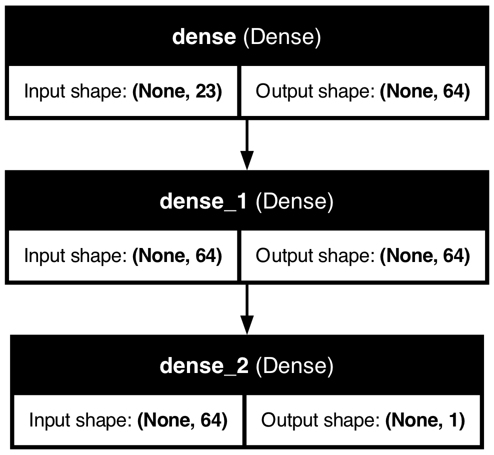

The `plot_model` function generates a visual representation of the model architecture, showing the connections between layers and the flow of data through the network. This can be useful for understanding the model's structure and sharing it with others.

And we can plot the training history to visualize the model's performance during training:


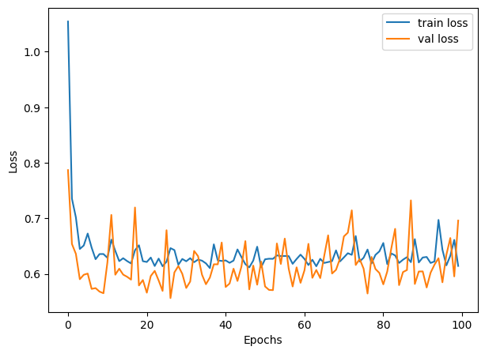

### Grid Search with Keras Tuner

**Step 1: Import Libraries**: First, you import necessary libraries and modules. This includes Keras Tuner itself, TensorFlow's Keras API for building neural network models, and specific classes for model layers and the sequential model type.

**Step 2: Define the Model-Building Function**: The `build_model` function is where you define the architecture of your neural network. This function takes a `HyperParameters` object (`hp`) as its argument, which is used to define the space of hyperparameters you want to explore.

-   Sequential Model: You start by initializing a Sequential model, indicating you're building a model layer by layer in sequence.
-   Dense Layers: You then add Dense layers, which are fully connected neural network layers. The number of units (neurons) in these layers is what you're tuning, so instead of hardcoding a number, you use `hp.Int('units', min_value=32, max_value=512, step=32)` to define a range of values to explore during the tuning process.
-   Compilation: Finally, you compile the model, specifying the optimizer, loss function, and metrics to monitor.

**Step 3: Initialize the Tuner**: You instantiate a `RandomSearch` tuner object. This object will manage the tuning process, including:

-   Running trials (each trial tests a unique set of hyperparameters).
-   Evaluating model performance for each set of hyperparameters.
-   Selecting the next set of hyperparameters to test.

Parameters for the tuner include:

-   The model-building function (`build_model`).
-   The optimization objective (`val_loss`).
-   The maximum number of trials (`max_trials`) and executions per trial (`executions_per_trial`).
-   Directories for storing tuning results (`directory` and `project_name`).

**Step 4: Perform the Search**: Using the `tuner.search()` method, you start the hyperparameter search process. This method requires your training data (`train_x`, `train_y`), the number of epochs for training each model, and the validation split. The tuner will train different models using varying hyperparameters within the defined space and evaluate their performance.

**Step 5: Get the Best Model and Hyperparameters**: After the search concludes, you retrieve the best-performing model and its hyperparameters using `tuner.get_best_models()` and `tuner.get_best_hyperparameters()`.


``` python
import keras_tuner as kt
from keras_tuner import RandomSearch
from keras_tuner.engine.hyperparameters import HyperParameters
from tensorflow.keras.models import Sequential
from tensorflow.keras.layers import Dense

def build_model(hp):
    model = Sequential()
    # Define the hyperparameter space for 'units'
    units = hp.Int('units', min_value=32, max_value=512, step=32)
    
    model.add(Dense(units=units, activation='relu', input_shape=(train_x.shape[1],)))
    model.add(Dense(units=units, activation='relu'))  # Reuse the 'units' variable
    model.add(Dense(1))
    model.compile(optimizer='adam', loss='mean_squared_error',
                               metrics=['mean_absolute_error'])
    return model

tuner = RandomSearch(
    build_model,
    objective='val_loss',
    max_trials=5,
    executions_per_trial=3,
    directory='my_dir',
    project_name='helloworld'
)

tuner.search(train_x, train_y, epochs=100, validation_split=0.2, verbose=0)

best_model = tuner.get_best_models(num_models=1)[0]
best_hyperparameters = tuner.get_best_hyperparameters(num_trials=1)[0]

# best_model.summary()

score = best_model.evaluate(test_x, test_y, verbose=0)

print('Test loss:', score[0])
```

```
## Test loss: 0.663371741771698
```

``` python
print('Test mean absolute error:', score[1])
```

```
## Test mean absolute error: 0.6027512550354004
```


### Grid Search with R

Hyperparameter tuning in R, especially for Keras models, can be approached in several ways, but it does not directly support `keras_tuner` like Python. However, you can use a combination of custom loops or grid search strategies to achieve a similar outcome. Below is an R version that approximates the hyperparameter tuning process described in your Python script. This example uses a manual grid search approach:


``` r
library(keras)
library(dplyr)

# Clear the Keras session
keras::k_clear_session()

train_x <- as.matrix(ddf %>% select(-wage))
train_y <- matrix(ddf$wage, ncol = 1)

# Define the model-building function accepting hyperparameters
build_model <- function(units) {
  # Clear session for each model
  keras::k_clear_session()
  
  # Define model using functional API instead of sequential
  inputs <- layer_input(shape = ncol(train_x))
  outputs <- inputs %>%
    layer_dense(units = units, activation = 'relu') %>%
    layer_dense(units = units, activation = 'relu') %>%
    layer_dense(units = 1)
  
  # Create model
  model <- keras_model(inputs = inputs, outputs = outputs)
  
  # Compile model
  model$compile(
    optimizer = 'adam',
    loss = 'mean_squared_error',
    metrics = list('mean_absolute_error')
  )
  
  return(model)
}

# Manual hyperparameter tuning setup
units_grid <- seq(32, 512, by = 32)
val_losses <- numeric(length(units_grid))
names(val_losses) <- as.character(units_grid)

# Grid search loop
for (units in units_grid) {
  cat("Training with units =", units, "\n")
  model <- build_model(units)
  
  history <- model$fit(
    x = train_x, 
    y = train_y,
    epochs = as.integer(100), 
    batch_size = as.integer(32),
    validation_split = 0.2,
    verbose = 0
  )
  
  val_losses[as.character(units)] <- min(history$history$val_loss)
}
```

```
## Training with units = 32 
## Training with units = 64 
## Training with units = 96 
## Training with units = 128 
## Training with units = 160 
## Training with units = 192 
## Training with units = 224 
## Training with units = 256 
## Training with units = 288 
## Training with units = 320 
## Training with units = 352 
## Training with units = 384 
## Training with units = 416 
## Training with units = 448 
## Training with units = 480 
## Training with units = 512
```

``` r
# Find the best performing model
best_units <- as.numeric(names(which.min(val_losses)))
cat("Best units:", best_units, "\n")
```

```
## Best units: 64
```

``` r
# Build and evaluate the best model
best_model <- build_model(best_units)
best_model$fit(
  x = train_x, 
  y = train_y, 
  epochs = as.integer(100), 
  batch_size = as.integer(32),
  verbose = 0
)
```

```
## <keras.src.callbacks.history.History object at 0x3a8f8dee0>
```

``` r
# Evaluate on test data
score <- best_model$evaluate(
  x = test_x, 
  y = test_y, 
  verbose = 0
)

cat('Test loss:', score[[1]], '\n')
```

```
## Test loss: 0.7158464
```

``` r
cat('Test mean absolute error:', score[[2]], '\n')
```

```
## Test mean absolute error: 0.6791759
```

In this R script, we define a `build_model` function that creates a Keras model with a specified number of units in the Dense layers. We then set up a manual grid search loop to iterate over different values of `units` and train models with those hyperparameters. The best-performing model is selected based on the validation loss, and its performance is evaluated on the test set.

## Clasification with `keras` package

Applying deep learning to classification problems introduces some differences in model architecture, training process, and evaluation compared to regression problems. Here's an overview of these differences and some key considerations:

### Model Outcome and Activation Function

Regression models typically have a single output unit without an activation function (or with a linear activation function), predicting a continuous quantity. For binary classification, there's usually a single output unit with a sigmoid activation function. The sigmoid function maps the output to a probability score between 0 and 1, indicating the likelihood of the input belonging to the positive class.

For multi-class classification, the output layer has one unit per class and uses the softmax activation function. The softmax function converts the model outputs to probabilities that sum to 1, with each value representing the probability that the input belongs to one of the classes.

Regression models commonly use mean squared error (MSE) or mean absolute error (MAE) as the loss function. For binary classification, the binary cross-entropy loss function is standard.
  
For multi-class classification, categorical cross-entropy (or softmax cross-entropy) loss is typically used. This loss function compares the predicted class probabilities with the true class labels and penalizes the model based on the difference between them.

Cross-entropy loss is a measure of the difference between two probability distributions: the predicted distribution (output of the model) and the true distribution (one-hot encoded labels). The goal is to minimize this difference during training.  The cross-entropy loss is defined as:

\begin{equation}
\text{Cross-Entropy Loss} = -\sum_{i} y_i \log(p_i)
\end{equation}

where $y_i$ is the true class label (0 or 1 for binary classification, one-hot encoded for multi-class classification), and $p_i$ is the predicted probability for class $i$.  For a binary classification, we have two possible outcomes: the true label $y$ is either 0 or 1 , and the predicted probability (from the neural network) is $p$. The binary cross-entropy loss for a single observation is:

\begin{equation}
L(y, p)=-[y \log (p)+(1-y) \log (1-p)]
\end{equation}
  
- If the true label $y=1$, the loss becomes $L(1, p)=-\log (p)$. As $p$ (the predicted probability of the positive class) decreases, $-\log (p)$ increases, meaning the loss increases when the model's prediction is further from the actual class. 
- If the true label $y=0$, the loss becomes $L(0, p)=-\log (1-p)$. As $p$ increases, $-\log (1-p)$ increases, meaning the loss increases when the model's prediction is incorrectly confident in the positive class.

This loss function effectively penalizes predictions that are confident and wrong, encouraging the model to produce probabilities close to the actual labels.  And the total loss is

\begin{equation}
J=\sum_{i=1}^n y_i \log p\left(x_i\right)+\left(1-y_i\right) \log \left(1-p\left(x_i\right)\right),
\end{equation}
  
where $n$ is the number of observations, $y_i$ is the true label (0 or 1), and $p\left(x_i\right)$ is the predicted probability for observation $i$. For each observation,
  
\begin{equation}
p\left(\mathbf{x}_{\mathbf{i}}\right)=\frac{e^{\beta_0+\beta x_i}}{1+e^{\beta_0+\beta x_i}}
\end{equation}
  
where $\beta_0$ is the intercept and $\beta$ is the coefficient vector. The sigmoid function maps the linear combination of features to a probability between 0 and 1.

### Probabilistic Model and Thresholding

Neural networks can be considered probabilistic in the context of classification. The output layer (using sigmoid or softmax) provides probabilities indicating the likelihood of each class. Although the raw output of the network provides these probabilities, making a final class decision often requires thresholding

As before, we cannot use a common threshold, like 0.5, for the sigmoid output. We need to rely on AUC. In multi-class classification, the class with the highest probability (from the softmax output) is typically selected as the model's prediction.

Unlike regression, where you might use MSE or MAE, classification models are often evaluated using accuracy, precision, recall, F1 score.  We use, however, a complex metrics like ROC-AUC or confusion matrices, depending on the specific requirements of the problem.


### `keras` Package

First the preprocessing


``` r
library(keras)
library(tensorflow)
library(caret) # for dummyVars
library(dplyr) # for data manipulation

# Clearing the workspace
rm(list = ls())

# Clearing the Keras session
keras::k_clear_session()

# Load the data 
dfr <- read.csv("wineQualityReds.csv", header = TRUE)
dfr <- dfr[, -1] # removing the index column
# Ensure quality is treated as numeric, not string
indo <- which(dfr$quality == 3 | dfr$quality == 8) 
dfr <- dfr[-indo, ]

# Convert quality to a factor for one-hot encoding
dfr$quality <- as.factor(dfr$quality)

# One-hot encode the quality variable
quality_one_hot <- model.matrix(~ quality - 1, data = dfr)

# Prepare the data excluding the original quality column
df_transformed <- dfr[, -which(names(dfr) == "quality")]

# Splitting the dataset into training and test sets
set.seed(123) # For reproducibility
# Randomly sample 80% of the data
indexes <- sample(1:nrow(dfr), size = 0.8 * nrow(dfr), replace = FALSE) 

train_x <- df_transformed[indexes, ]
test_x <- df_transformed[-indexes, ]
train_y <- quality_one_hot[indexes, ]
test_y <- quality_one_hot[-indexes, ]

# Define the input layer using the number of predictors
inputs <- layer_input(shape = ncol(train_x))

# There are 4 classes after your preprocessing
outputs<- inputs %>%
  layer_dense(units = 32, activation = 'relu') %>%
  layer_dense(units = 32, activation = 'relu') %>%
  # Update the following to match the number of classes
  layer_dense(units = 4, activation = 'softmax') 

# Create the model by specifying inputs and outputs
model <- keras_model(inputs = inputs, outputs = outputs)

# Compile the model for multi-class classification
model$compile(
  loss = 'categorical_crossentropy', # Correct loss function for multi-class
  optimizer = 'adam', # Accuracy is a common metric for classification
  metrics = list(metric_binary_accuracy(), tf$keras$metrics$AUC(name = "auc")) 
)

# Fit the model
history <- model$fit(
  x = as.matrix(train_x), 
  y = train_y,
  epochs = as.integer(100), 
  batch_size = as.integer(128), 
  validation_split = 0.2, 
  verbose = 0
)

# Predictions as probabilities
predictions <- model$predict(as.matrix(test_x), verbose = 0)
head(predictions)
```

```
##             [,1]      [,2]       [,3]        [,4]
## [1,] 0.044143885 0.7623327 0.16293451 0.030588955
## [2,] 0.029552383 0.8353922 0.11699457 0.018060893
## [3,] 0.003167969 0.9610149 0.03366369 0.002153398
## [4,] 0.025320221 0.7990472 0.14731379 0.028318819
## [5,] 0.066049874 0.5134937 0.33042157 0.090034865
## [6,] 0.081720673 0.4161651 0.35481209 0.147302240
```

``` r
# Evaluate the model on the test set
test_x_matrix <- as.matrix(test_x)

model$evaluate(test_x_matrix, test_y, verbose = 0)
```

```
## [1] 1.0376946 0.7714286 0.8213639
```

Now AUC


``` r
library(pROC)

# Initialize an empty vector to store AUC for each class
aucs <- c()

# Calculate AUC for each class
for (i in 1:ncol(test_y)) {
  roc_res <- roc(response = test_y[, i], predictor = predictions[, i])
  aucs[i] <- auc(roc_res)
}

# Calculate mean AUC across all classes
mean_auc <- mean(aucs)

print(aucs)
```

```
## [1] 0.7787570 0.7779464 0.6203074 0.7928395
```

``` r
print(mean_auc)
```

```
## [1] 0.7424626
```

As you can see test and OOB AUC's are close!

In Keras, when compiling the model, the metrics parameter is used to specify the metrics that will be evaluated by the model during training and testing. However, directly measuring AUC during training as a metric within the compile function wasn't originally supported in earlier versions of Keras. This limitation was primarily due to AUC being a more complex calculation that requires the entire dataset's predictions to compute accurately, as opposed to metrics like accuracy, which can be calculated batch-wise.

However, with updates to TensorFlow and Keras, you now have the ability to include AUC as a metric during model compilation if you are using a version of TensorFlow that supports it (TensorFlow 2.2.0 and later).

## PyTorch and Keras

PyTorch and Keras are both popular open-source libraries for deep learning, but they have different design philosophies, ecosystems, and usage patterns. Here's a brief overview of both:

**PyTorch**
  
Developed by Facebook's AI Research lab (FAIR).
  
- Dynamic Computation Graphs: PyTorch uses dynamic computation graphs (also known as define-by-run paradigm), which means the graph is built on the fly as operations are executed. This feature provides a more intuitive approach for dynamic models and iterative processes, making debugging easier and more interactive. 
- Pythonic Nature: It seamlessly integrates with the Python data science stack (e.g., NumPy, SciPy) and supports native Python debugging tools. Its API and model definitions are very Pythonic, so it feels more like writing standard Python code. 
- Strong GPU Acceleration: PyTorch provides strong support for CUDA and cuDNN, allowing efficient and easy GPU computation. 
- Research and Flexibility: Initially favored more by researchers due to its flexibility and dynamic graph feature, which is ideal for experimental projects and rapid prototyping.

**Keras**
  
Developed by François Chollet - initially as an independent project, now part of TensorFlow under the TensorFlow umbrella managed by Google.
  
- High-Level API: Keras is designed as a high-level neural networks library. It runs on top of other deep learning libraries like TensorFlow, Theano, or Microsoft Cognitive Toolkit (CNTK). However, since TensorFlow 2.0, Keras has been integrated more deeply into TensorFlow as tf.keras. 
- Ease of Use: It focuses on being user-friendly, modular, and extensible. It provides high-level building blocks for developing deep learning models with a few lines of code, making it accessible for beginners. 
- Static Computation Graphs (with TensorFlow backend): TensorFlow (and thereby Keras, when used with TensorFlow as the backend) primarily uses static computation graphs, meaning the model's structure is defined and compiled before it's run. This approach can lead to faster execution and easier deployment of models but might be less intuitive for dynamic model adjustments. 
- Wide Adoption in Industry: Due to its simplicity and TensorFlow's strong support, Keras has seen wide adoption in the industry for developing and deploying production models.
  
**Differences at a Glance**

PyTorch offers a more dynamic and intuitive approach (dynamic computation graphs) that's particularly suited for research and projects where model architectures change frequently. Keras, especially as part of TensorFlow, focuses on ease of use and quick deployment, making it an excellent choice for beginners and applied deep learning projects.

Both have strong communities. PyTorch is often cited as the go-to for academic research and projects requiring dynamic models, while Keras (through TensorFlow) has a broad adoption in industry with extensive support for production deployment. Keras is generally considered easier to learn for beginners due to its high-level API, while PyTorch, with its Pythonic design and dynamic nature, is also very approachable, especially for those who have a solid grounding in Python.

Choosing between PyTorch and Keras (TensorFlow) often comes down to personal preference, project requirements, and specific features or functionalities that one might need for their deep learning tasks.
  
**Is R Competitive in Neural Networks?**
  
R is a programming language and environment primarily used for statistical computing and graphics. It's heavily used in academia, research, and industry for statistical analysis, data visualization, and data science.

When it comes to neural networks and deep learning, R is not as prominently featured as Python. The Python ecosystem, with libraries like TensorFlow, Keras, and PyTorch, has become the de facto standard for deep learning research and development due to its extensive libraries, community support, and flexibility.

However, this does not mean R is not competitive or incapable of deep learning tasks. R has packages such as `keras` and `tensorflow` that provide interfaces to Keras and TensorFlow, respectively, allowing R users to build and train deep learning models within the R environment. There are also other packages and tools for machine learning and advanced statistical modeling.

The choice between R and Python often comes down to personal preference, specific project requirements, and the ecosystem one is more comfortable with. For users deeply embedded in the R ecosystem, especially those working in statistics, bioinformatics, or fields where R has strong domain-specific libraries, continuing in R for deep learning tasks might be preferable. For new projects or users starting from scratch, especially with a focus on deep learning, Python might offer a more direct path to a wide range of tools and community support.


