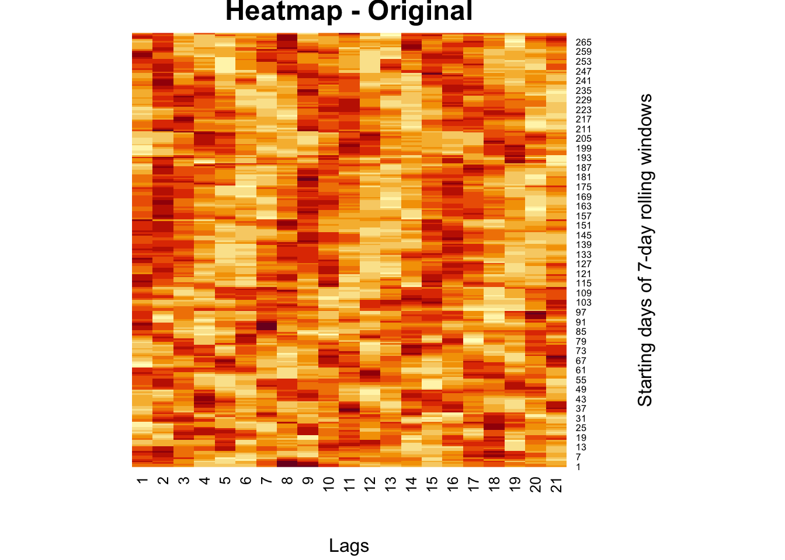
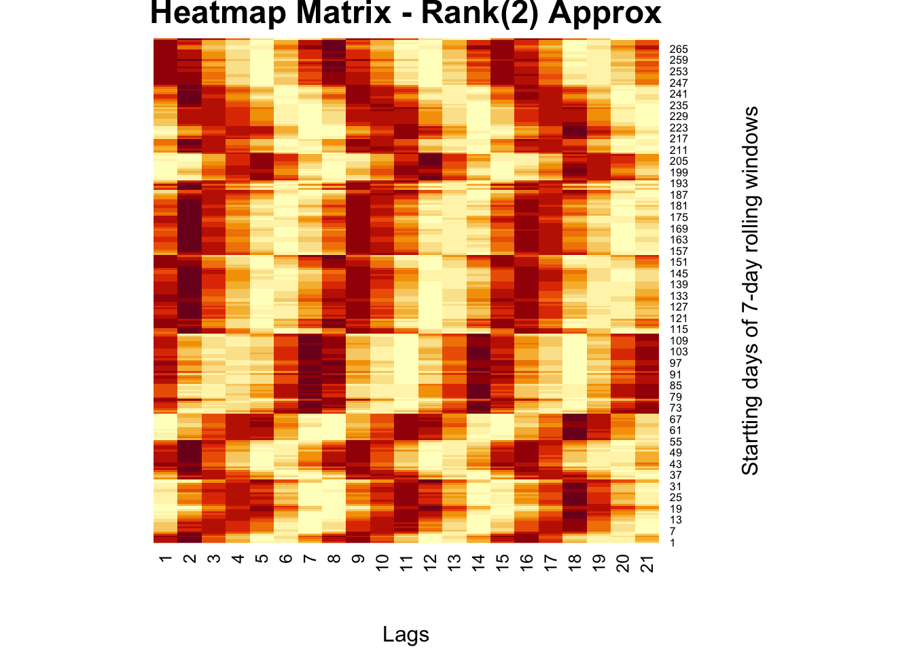
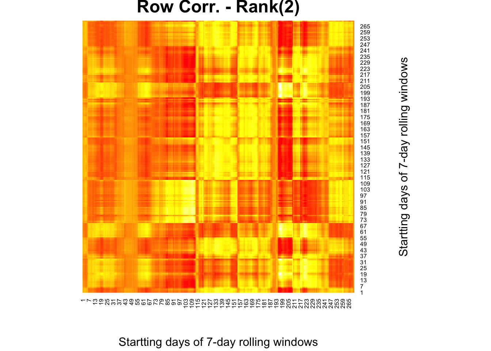
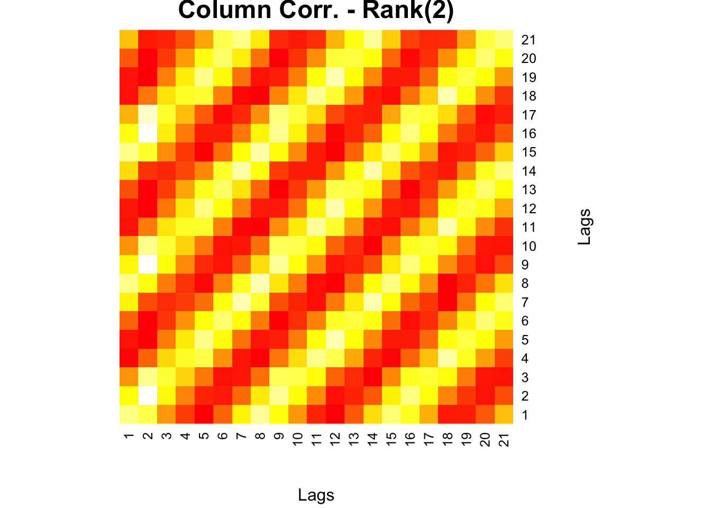
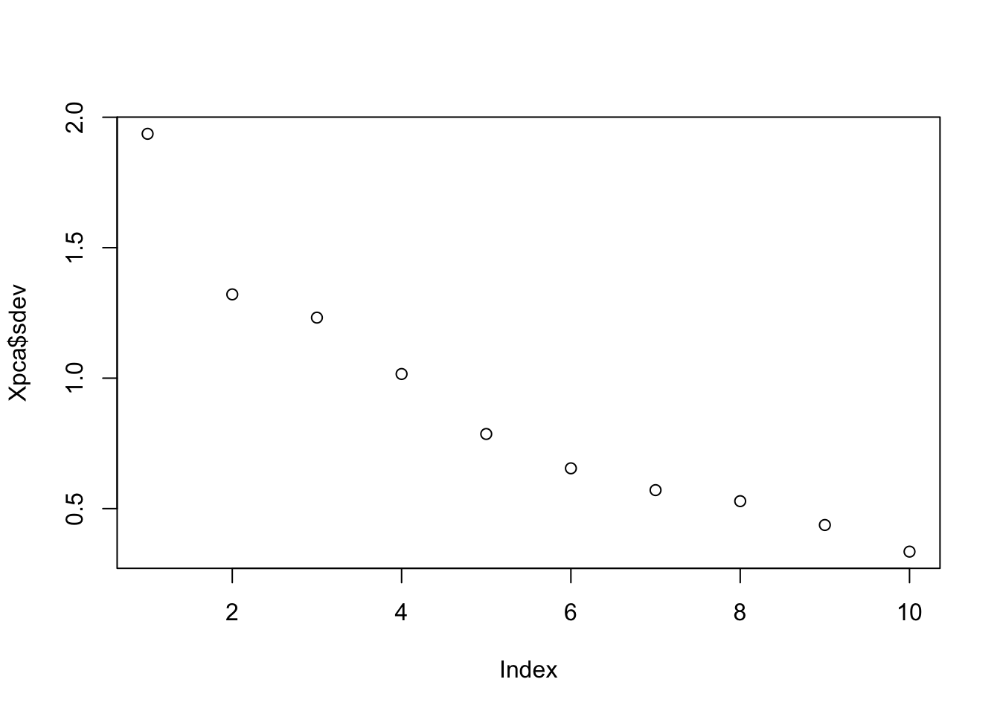
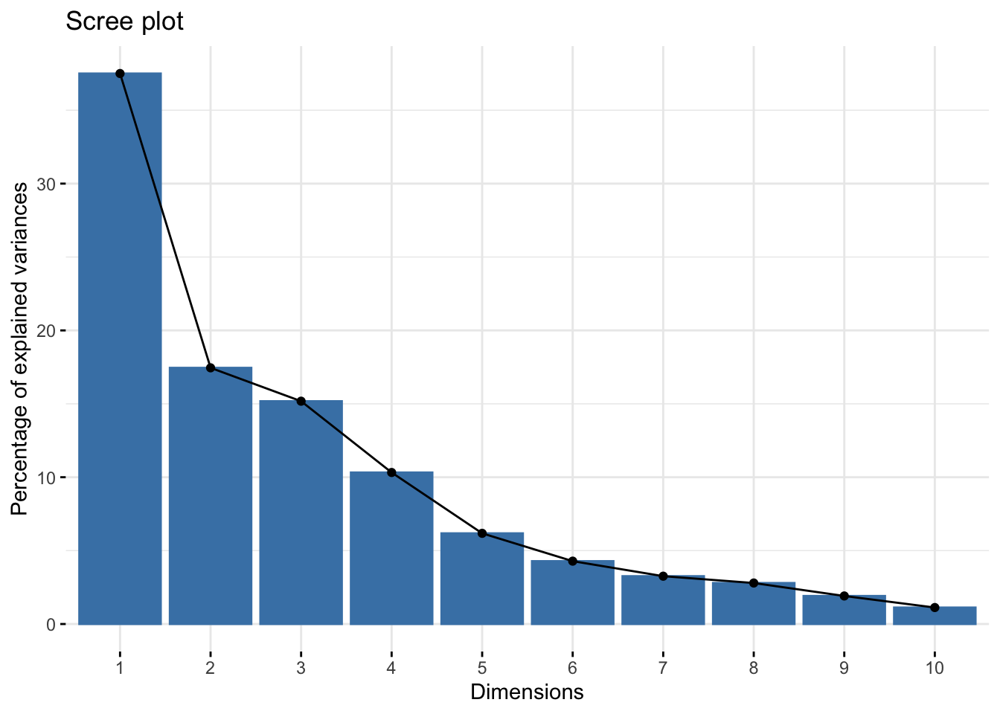
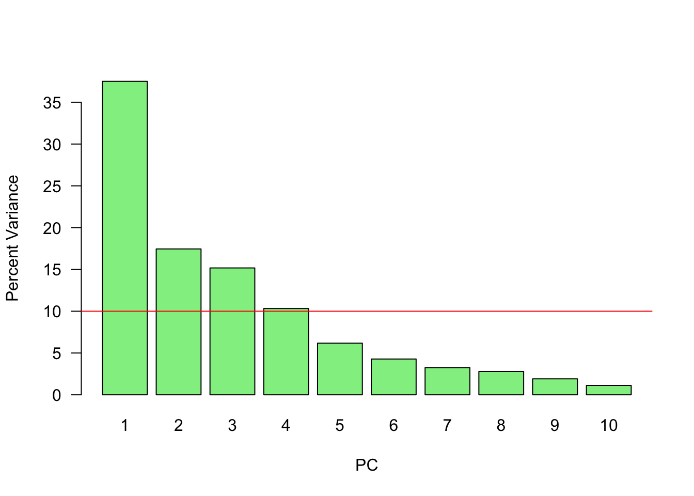
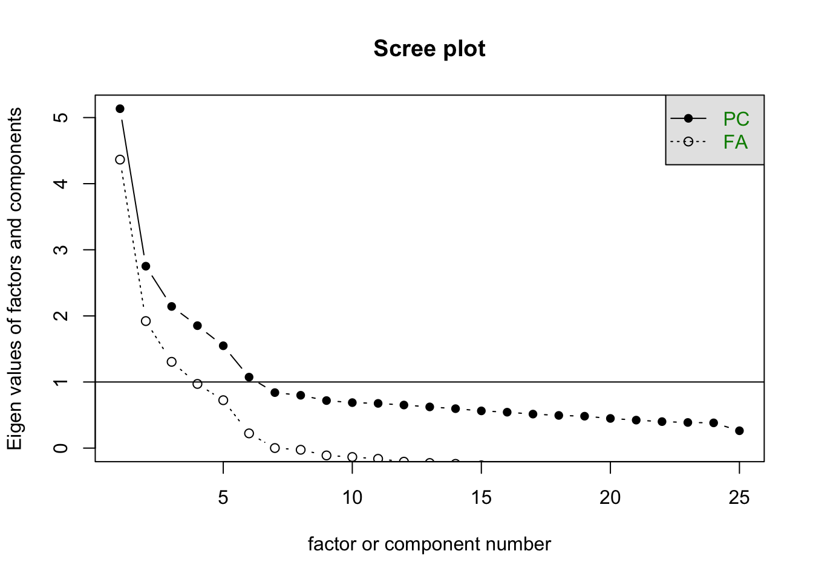

# Matrix Decomposition and Applications

Matrix decomposition, or matrix factorization, plays a central role in modern data analysis and machine learning. It refers to the process of breaking down a complex matrix into simpler, constituent components that uncover hidden patterns, simplify computation, and enable dimensionality reduction. This chapter systematically explores a suite of decomposition techniques and their powerful applications.

We begin with **Eigenvectors and Eigenvalues**, the foundational concepts behind many decomposition methods. These mathematical constructs reveal how matrices stretch or compress space along particular directions. They form the basis of **Eigenvalue Decomposition (EVD)**, which allows certain square matrices to be represented in terms of their eigenvectors and eigenvalues, unlocking deeper insights into their structure and behavior.

We then turn to **Singular Value Decomposition (SVD)**, a more general technique that can be applied to any real or complex matrix, whether square or rectangular. SVD breaks a matrix into orthogonal components, exposing the latent features that drive its structure. This section connects SVD with familiar applications such as recommender systems and image compression.

Following this, we explore **Rank (r) Approximations**, which involve reconstructing a matrix using only its top singular values and associated vectors. This provides a powerful way to reduce dimensionality, eliminate noise, and compress data without significant information loss.

Next, we examine the **Moore-Penrose Inverse**, a generalized matrix inverse especially useful for non-square or singular matrices. Computed via SVD, the pseudoinverse is essential in solving **least-squares problems**, particularly in linear regression and under- or over-determined systems.

Building on these tools, we introduce **Principal Component Analysis (PCA)**, a widely-used method for dimensionality reduction. PCA reorients data along the directions of greatest variance using the eigenvectors of the covariance matrix or through SVD. This transformation reduces the number of variables while preserving the essential structure of the dataset, making PCA a staple in exploratory data analysis and preprocessing for machine learning models.

Finally, we explore **Factor Analysis (FA)**, a technique closely related to PCA but with a different conceptual foundation. FA models observed data as linear combinations of latent variables (factors) plus error terms. Unlike PCA, which focuses purely on variance, FA aims to uncover the underlying constructs that explain correlations among variables. It is especially useful in social sciences, psychometrics, and behavioral research, where latent structures such as personality traits or intelligence are of primary interest.

Together, these matrix decomposition techniques form a cohesive framework for understanding high-dimensional data. They simplify complex relationships, reveal structure, and provide the foundation for a wide range of analytical and machine learning tools.


## Eigenvectors and Eigenvalues 

In this section, we introduce the fundamental concepts of eigenvectors and eigenvalues, which are central to understanding matrix decomposition. These mathematical constructs offer deep insights into the internal structure of matrices and are foundational to numerous applications in mathematics, physics, and data science. From describing linear transformations to powering algorithms like Principal Component Analysis (PCA), eigenvectors and eigenvalues play a critical role.

At a high level, eigenvectors and eigenvalues arise in the context of matrix multiplication. While most vectors change both magnitude and direction when multiplied by a matrix $\mathbf{A}$, certain special vectors—called eigenvectors—only change in magnitude, not in direction. In other words, when a matrix $\mathbf{A}$ acts on an eigenvector $\mathbf{v}$, the result is a scaled version of the same vector:

\begin{equation} 
\label{eq:eigen} 
\mathbf{A} \mathbf{v} = \lambda \mathbf{v} 
\end{equation}

Here, $\mathbf{v}$ is a non-zero vector, and $\lambda$ is a scalar known as the eigenvalue associated with that eigenvector. This simple yet powerful equation captures the essence of how a matrix transforms space: eigenvectors point in invariant directions, and eigenvalues tell us how much those directions are stretched or compressed.

These concepts are especially important in machine learning. For example, PCA involves computing the eigenvectors and eigenvalues of a data set’s covariance matrix. The eigenvectors (also called principal components in this context) identify the directions of maximum variance in the data, while the eigenvalues indicate the amount of variance captured by each component. By selecting the top eigenvectors, we can project the data into a lower-dimensional space while preserving its most important patterns.

In the next section, we explore how these ideas underpin various matrix decomposition techniques, beginning with **Eigenvalue Decomposition (EVD)**. To obtain the eigenvalues and eigenvectors of a matrix \( \mathbf{A} \), we start from the fundamental condition ~\eqref{eq:eigen}.

This can be rewritten as:

\begin{equation}
\mathbf{A} \mathbf{v} - \lambda \mathbf{I} \mathbf{v} = 0
\end{equation}

which simplifies to:

\begin{equation}
(\mathbf{A} - \lambda \mathbf{I}) \mathbf{v} = 0
\end{equation}

Here, \( \mathbf{I} \) is the identity matrix. For this equation to have a **non-trivial solution** (i.e., \( \mathbf{v} \ne 0 \)), the matrix \( \mathbf{A} - \lambda \mathbf{I} \) must be **non-invertible**. Otherwise, we would get:

\begin{equation}
\mathbf{v} = (\mathbf{A} - \lambda \mathbf{I})^{-1} \cdot 0 = 0
\end{equation}

which is the trivial solution. A matrix is non-invertible if and only if its determinant is zero. Therefore, to find the eigenvalues \( \lambda \), we solve the **characteristic equation**:

\begin{equation} \label{eq:char_eq}
\det(\mathbf{A} - \lambda \mathbf{I}) = 0
\end{equation}

This equation gives all values of \( \lambda \) for which a non-zero eigenvector \( \mathbf{v} \) satisfies equation ~\eqref{eq:eigen}. Each solution \( \lambda \) corresponds to one or more eigenvectors that satisfy the original eigenvalue problem.

We start with a square matrix, $\mathbf{A}$, like

$$
A =\left[\begin{array}{cc}
1 & 2 \\
3 & -4
\end{array}\right]
$$
$$
\begin{aligned}
\operatorname{det}(\mathbf{A}-\lambda \mathbf{I}) & =\left|\begin{array}{cc}
1-\lambda & 2 \\
3 & -4-\lambda
\end{array}\right|=(1-\lambda)(-4-\lambda)-6 \\
& =-4-\lambda+4 \lambda+\lambda^2-6 \\
& =\lambda^2+3 \lambda-10 \\
& =(\lambda-2)(\lambda+5)=0 \\
& \therefore \lambda_1=2, \lambda_2=-5
\end{aligned}
$$

We have two eigenvalues.  We now need to consider each eigenvalue indivudally

$$
\begin{array}{r}
\lambda_1=2 \\
(A 1-\lambda I) \mathbf{v}=0 \\
{\left[\begin{array}{cc}
1-\lambda_1 & 2 \\
3 & -4-\lambda_1
\end{array}\right]\left[\begin{array}{l}
v_1 \\
v_2
\end{array}\right]=\left[\begin{array}{l}
0 \\
0
\end{array}\right]} \\
{\left[\begin{array}{cc}
-1 & 2 \\
3 & -6
\end{array}\right]\left[\begin{array}{l}
v_1 \\
v_2
\end{array}\right]=\left[\begin{array}{l}
0 \\
0
\end{array}\right]}
\end{array}
$$

Hence, 

$$
\begin{array}{r}
-v_1+2 v_2=0 \\
3 v_1-6 v_2=0 \\
v_1=2, v_2=1
\end{array}
$$

And for $\lambda_2=-5$, 

$$
\begin{aligned}
& {\left[\begin{array}{cc}
1-\lambda_2 & 2 \\
3 & -4-\lambda_2
\end{array}\right]\left[\begin{array}{l}
v_1 \\
v_2
\end{array}\right]=\left[\begin{array}{l}
0 \\
0
\end{array}\right]} \\
& {\left[\begin{array}{ll}
6 & 2 \\
3 & 1
\end{array}\right]\left[\begin{array}{l}
v_1 \\
v_2
\end{array}\right]=\left[\begin{array}{l}
0 \\
0
\end{array}\right]}
\end{aligned}
$$

Hence, 

$$
\begin{array}{r}
6 v_1+2 v_2=0 \\
3 v_1+v_2=0 \\
v_1=-1, v_2=3
\end{array}
$$

We have two eigenvalues

$$
\begin{aligned}
& \lambda_1=2 \\
& \lambda_2=-5
\end{aligned}
$$

And two corresponding eigenvectors

$$
\left[\begin{array}{l}
2 \\
1
\end{array}\right],\left[\begin{array}{c}
-1 \\
3
\end{array}\right]
$$

for $\lambda_1=2$

$$
\left[\begin{array}{cc}
1 & 2 \\
3 & -4
\end{array}\right]\left[\begin{array}{l}
2 \\
1
\end{array}\right]=\left[\begin{array}{l}
2+2 \\
6-4
\end{array}\right]=\left[\begin{array}{l}
4 \\
2
\end{array}\right]=2\left[\begin{array}{l}
2 \\
1
\end{array}\right]
$$

Let's see the solution in R


``` r
A <- matrix(c(1, 3, 2, -4), 2, 2)
eigen(A)
```

```
## eigen() decomposition
## $values
## [1] -5  2
## 
## $vectors
##            [,1]      [,2]
## [1,] -0.3162278 0.8944272
## [2,]  0.9486833 0.4472136
```

The eigenvectors are typically normalized by dividing by its length $\sqrt{v^{\prime} v}$, which is 5 in our case for $\lambda_1=2$.


``` r
# For the ev (2, 1), for lambda
c(2, 1) / sqrt(5)
```

```
## [1] 0.8944272 0.4472136
```

There some nice properties that we can observe in this application.


``` r
# Sum of eigenvalues = sum of diagonal terms of A (Trace of A)
ev <- eigen(A)$values
sum(ev) == sum(diag(A))
```

```
## [1] TRUE
```

``` r
# Product of eigenvalues = determinant of A
round(prod(ev), 4) == round(det(A), 4)
```

```
## [1] TRUE
```

``` r
# Diagonal matrix D has eigenvalues = diagonal elements
D <- matrix(c(2, 0, 0, 5), 2, 2)
eigen(D)$values == sort(diag(D), decreasing = TRUE)
```

```
## [1] TRUE TRUE
```

We can see that, if one of the eigenvalues is zero for a matrix, the determinant of the matrix will be zero.  We willl return to this issue in Singluar Value Decomposition.

Let's finish this section with Diagonalization and Eigendecomposition.

Suppose we have $m$ linearly independent eigenvectors ($\mathbf{v_i}$ is eigenvector $i$ in a column vector in $\mathbf{V}$) of $\mathbf{A}$.

$$
\mathbf{AV}=\mathbf{A}\left[\mathbf{v_1} \mathbf{v_2} \cdots \mathbf{v_m}\right]=\left[\mathbf{A} \mathbf{v_1} \mathbf{A} \mathbf{v_2} \ldots \mathbf{A} \mathbf{v_m}\right]=\left[\begin{array}{llll}
\lambda_1 \mathbf{v_1} & \lambda_2\mathbf{v_2}  & \ldots & \lambda_m \mathbf{v_m}
\end{array}\right]
$$

because 

$$
\mathbf{A} \mathbf{v}=\lambda \mathbf{v}
$$

$$
\mathbf{AV}=\left[\mathbf{v_1} \mathbf{v_2} \cdots \mathbf{v_m}\right]\left[\begin{array}{cccc}
\lambda_1 & 0 & \cdots & 0 \\
0 & \lambda_2 & \cdots & 0 \\
\vdots & \vdots & \ddots & \vdots \\
0 & 0 & \cdots & \lambda_m
\end{array}\right]=\mathbf{V}\Lambda
$$

So that

$$
\mathbf{A V=V \Lambda}
$$

Hence,   

$$
\mathbf{A}=\mathbf{V} \Lambda \mathbf{V}^{-1}
$$

Eigendecomposition (a.k.a. spectral decomposition) decomposes a matrix $\mathbf{A}$ into a multiplication of a matrix of eigenvectors $\mathbf{V}$ and a diagonal matrix of eigenvalues $\mathbf{\Lambda}$.
  
**This can only be done if a matrix is diagonalizable**. In fact, the definition of a diagonalizable matrix $\mathbf{A} \in \mathbb{R}^{n \times n}$ is that it can be eigendecomposed into $n$ eigenvectors, so that $\mathbf{V}^{-1} \mathbf{A} \mathbf{V}=\Lambda$.

$$
\begin{aligned}
\mathbf{A}^2 & =\left(\mathbf{V} \Lambda \mathbf{V}^{-1}\right)\left(\mathbf{V} \Lambda \mathbf{V}^{-1}\right) \\
& =\mathbf{V} \Lambda \mathbf{I} \Lambda \mathbf{V}^{-1} \\
& =\mathbf{V} \Lambda^2 \mathbf{V}^{-1}
\end{aligned}
$$

in general

$$
\mathbf{A}^k=\mathbf{V} \Lambda^k \mathbf{V}^{-1}
$$

Example:
  

``` r
A = matrix(sample(1:100, 9), 3, 3)
A
```

```
##      [,1] [,2] [,3]
## [1,]   26   51   19
## [2,]   63   18  100
## [3,]   76   90    3
```

``` r
eigen(A)
```

```
## eigen() decomposition
## $values
## [1] 146.61859 -80.33844 -19.28015
## 
## $vectors
##            [,1]       [,2]       [,3]
## [1,] -0.3849580  0.2621366 -0.7678982
## [2,] -0.6766000 -0.7654924  0.5824382
## [3,] -0.6277099  0.5876272  0.2666420
```

``` r
V = eigen(A)$vectors
Lam = diag(eigen(A)$values)
# Prove that AV = VLam
round(A %*% V, 4) == round(V %*% Lam, 4)
```

```
##      [,1] [,2] [,3]
## [1,] TRUE TRUE TRUE
## [2,] TRUE TRUE TRUE
## [3,] TRUE TRUE TRUE
```

``` r
# And decomposition
A == round(V %*% Lam %*% solve(V), 4)
```

```
##      [,1] [,2] [,3]
## [1,] TRUE TRUE TRUE
## [2,] TRUE TRUE TRUE
## [3,] TRUE TRUE TRUE
```

And, matrix inverse with eigendecomposition:

$$
\mathbf{A}^{-1}=\mathbf{V} \Lambda^{-1} \mathbf{V}^{-1}
$$

Example:
  

``` r
A = matrix(sample(1:100, 9), 3, 3)
A
```

```
##      [,1] [,2] [,3]
## [1,]   42   29   41
## [2,]   59   80   87
## [3,]   57    2   69
```

``` r
V = eigen(A)$vectors
Lam = diag(eigen(A)$values)

# Inverse of A
solve(A)
```

```
##             [,1]         [,2]        [,3]
## [1,]  0.07843080 -0.028153517 -0.01110589
## [2,]  0.01302779  0.008230392 -0.01811860
## [3,] -0.06516828  0.023018691  0.02419237
```

``` r
# And
V %*% solve(Lam) %*% solve(V)
```

```
##             [,1]         [,2]        [,3]
## [1,]  0.07843080 -0.028153517 -0.01110589
## [2,]  0.01302779  0.008230392 -0.01811860
## [3,] -0.06516828  0.023018691  0.02419237
```

The inverse of $\mathbf{\Lambda}$ is just the inverse of each diagonal element (the eigenvalues).  But, this can only be done if a matrix is diagonalizable.  So if $\mathbf{A}$ is not $n \times n$, then we can use $\mathbf{A'A}$ or $\mathbf{AA'}$, both symmetric now.

Example:
$$
\mathbf{A}=\left(\begin{array}{ll}
1 & 2 \\
2 & 4
\end{array}\right)
$$

As $\det(\mathbf{A})=0,$ $\mathbf{A}$ is singular and its inverse is undefined.  In other words, since $\det(\mathbf{A})$ equals the product of the eigenvalues $\lambda_j$ of $\mathrm{A}$, the matrix $\mathbf{A}$ has an eigenvalue which is zero.

To see this, consider the spectral (eigen) decomposition of $A$ :
  
$$
\mathbf{A}=\sum_{j=1}^{p} \theta_{j} \mathbf{v}_{j} \mathbf{v}_{j}^{\top}
$$
where $\mathbf{v}_{\mathrm{j}}$ is the eigenvector belonging to $\theta_{\mathrm{j}}$

The inverse of $\mathbf{A}$ is then:
  
$$
\mathbf{A}^{-1}=\sum_{j=1}^{p} \theta_{j}^{-1} \mathbf{v}_{j} \mathbf{v}_{j}^{\top}
$$

A has eigenvalues 5 and 0. The inverse of $A$ via the spectral decomposition is then undefined:
  
$$
\mathbf{A}^{-1}=\frac{1}{5} \mathbf{v}_{1} \mathbf{v}_{1}^{\top}+ \frac{1}{0} \mathbf{v}_{1} \mathbf{v}_{1}^{\top}
$$

While Eigenvalue Decomposition is a foundational tool, it is limited to square matrices—matrices with the same number of rows and columns. However, in practice, especially in data analysis and machine learning, we often work with rectangular matrices, where the number of features and observations differ. This is where Singular Value Decomposition (SVD) becomes invaluable. SVD generalizes the concept of eigendecomposition to any matrix, whether square or rectangular, making it one of the most widely used matrix factorization techniques in applied mathematics and machine learning.

## Single Value Decomposition

While **Eigenvalue Decomposition** is a foundational tool, it is limited to **square matrices**—matrices with the same number of rows and columns. However, in practice, especially in data analysis and machine learning, we often work with **rectangular matrices**, where the number of features and observations differ. This is where **Singular Value Decomposition (SVD)** becomes invaluable. SVD generalizes the concept of eigendecomposition to any matrix, whether square or rectangular, making it one of the most widely used matrix factorization techniques in applied mathematics and machine learning.

This section delves into **Singular Value Decomposition (SVD)**, a powerful and flexible matrix factorization technique with broad applications in data analysis, dimensionality reduction, and recommender systems. SVD reveals the latent structure of data by decomposing any real (or complex) matrix into three interpretable components.

Unlike **eigendecomposition**, which is only defined for **square matrices**, SVD can be applied to **rectangular matrices**, making it much more useful in real-world settings where data matrices often have more rows than columns, or vice versa. Given an $m \times n$ matrix $\mathbf{A}$, the SVD of $\mathbf{A}$ is given by:

$$
\mathbf{A} = \mathbf{U} \mathbf{\Sigma} \mathbf{V}^T
$$

Here:
  
- $\mathbf{U}$ is an $m \times m$ **orthogonal matrix** whose columns are the **left singular vectors**, 
- $\mathbf{\Sigma}$ is an $m \times n$ **diagonal matrix** with non-negative values called **singular values**, sorted in descending order, 
- $\mathbf{V}^T$ is the transpose of an $n \times n$ **orthogonal matrix** whose columns are the **right singular vectors**.  
  
The singular values in $\mathbf{\Sigma}$ represent the importance (or strength) of each corresponding singular vector. By retaining only the top $k$ singular values and their associated vectors, we can construct a **low-rank approximation** of $\mathbf{A}$ that captures the most important structure in the data. This is particularly useful for:
  
- **Dimensionality reduction** (e.g., Latent Semantic Analysis in NLP), 
- **Data compression** (e.g., image compression), 
- **Recommender systems** (e.g., collaborative filtering with user-item matrices). 

SVD provides not only a compact representation of data but also deep insight into its intrinsic geometry. In the next section, we will explore how this decomposition helps in approximating complex data sets efficiently using lower-dimensional representations.

For any matrix $\mathbf{A}$, both $\mathbf{A^{\top} A}$ and $\mathbf{A A^{\top}}$ are symmetric.  Therefore, they have $n$ and $m$ **orthogonal* eigenvectors, respectively. The proof is simple:

Suppose we have a 2 x 2 symmetric matrix, $\mathbf{A}$, with two distinct eigenvalues ($\lambda_1, \lambda_2$) and two corresponding eigenvectors ($\mathbf{v}_1$ and $\mathbf{v}_1$).  Following the rule, 

$$
\begin{aligned}
& \mathbf{A} \mathbf{v}_1=\lambda_1 \mathbf{v}_1 \\
& \mathbf{A} \mathbf{v}_2=\lambda_2 \mathbf{v}_2
\end{aligned}
$$

Let's multiply (inner product) the first one with $\mathbf{v}_2^{\top}$:

$$
\mathbf{v}_2^{\top}\mathbf{A} \mathbf{v}_1=\lambda_1 \mathbf{v}_2^{\top} \mathbf{v}_1
$$
And, the second one with  $\mathbf{v}_1^{\top}$

$$
\mathbf{v}_1^{\top}\mathbf{A} \mathbf{v}_2=\lambda_2 \mathbf{v}_1^{\top} \mathbf{v}_2
$$
If we take the transpose of both side of $\mathbf{v}_2^{\top}\mathbf{A} \mathbf{v}_1=\lambda_1 \mathbf{v}_2^{\top} \mathbf{v}_1$, it will be

$$
\mathbf{v}_1^{\top}\mathbf{A} \mathbf{v}_2=\lambda_1 \mathbf{v}_1^{\top} \mathbf{v}_2
$$
And, subtract these last two:

$$
\begin{aligned}
\mathbf{v}_1^{\top} \mathbf{A} \mathbf{v}_2=\lambda_2 \mathbf{v}_1^{\top} \mathbf{v}_2 \\
\mathbf{v}_1^{\top} \mathbf{A} \mathbf{v}_2=\lambda_1 \mathbf{v}_1^{\top} \mathbf{v}_2 \\
\hline 0 = \left(\lambda_2-\lambda_1\right) \mathbf{v}_1^{\top} \mathbf{v}_2
\end{aligned}
$$

Since , $\lambda_1$ and $\lambda_2$ are distinct, $\lambda_2- \lambda_1$ cannot be zero. Therefore,  $\mathbf{v}_1^{\top} \mathbf{v}_2 = 0$.  As we saw in Chapter 15, the dot products of two vectors can be expressed geometrically

$$
\begin{array}{r}
a \cdot b=\|a\|\|b\| \cos (\theta), \\
\cos (\theta)=\frac{a \cdot b}{\|a\|\|b\|}
\end{array}
$$

Hence, $\cos (\theta)$ has to be zero for $\mathbf{v}_1^{\top} \mathbf{v}_2 = 0$. Since $\cos (90)=0$, the two vectors are orthogonal.

We start with the following eigendecomposition for $\mathbf{A^{\top}A}$ and $\mathbf{A A^{\top}}$:

$$
\begin{array}{r}
\mathbf{A}^{\top} \mathbf{A}=\mathbf{V} \mathbf{D} \mathbf{V}^{\top} \\
\mathbf{A} \mathbf{A}^{\top}=\mathbf{U D}^{\prime} \mathbf{U}^{\top}
\end{array}
$$


where $\mathbf{V}$ is an $n \times n$ **orthogonal** matrix consisting of the eigenvectors of $\mathbf{A} \mathbf{A}^{\top}$ and, $\mathbf{D}$ is an $n \times n$ diagonal matrix with the eigenvalues of $\mathbf{A}^{\top} \mathbf{A}$ on the diagonal.  The same decomposition for $\mathbf{A} \mathbf{A}^{\top}$, now $\mathbf{U}$ is an $m \times m$ **orthogonal** matrix consisting of the eigenvectors of $\mathbf{A} \mathbf{A}^{\top}$, and $\mathbf{D}^{\prime}$ is an $m \times m$ diagonal matrix with the eigenvalues of $\mathbf{A} \mathbf{A}^{\top}$ on the diagonal.
  
It turns out that $\mathbf{D}$ and $\mathbf{D}^{\prime}$ have the same non-zero diagonal entries except that the order might be different.

We can write SVD for any real $m \times n$ matrix as  

$$
\mathbf{A=U \Sigma V^{\top}}
$$
  
where $\mathbf{U}$ is an $m \times m$ orthogonal matrix whose columns are the eigenvectors of $\mathbf{A} \mathbf{A}^{\top}$, $\mathbf{V}$ is an $n \times n$ orthogonal matrix whose columns are the eigenvectors of $\mathbf{A}^{\top} \mathbf{A}$, and $\mathbf{\Sigma}$ is an $m \times n$ diagonal matrix of the form:

$$
\boldsymbol{\Sigma}=\left(\begin{array}{ccc}
\sigma_1 & & \\
& \ddots & \\
& & \sigma_n \\
0 & 0 & 0 \\
0 & 0 & 0
\end{array}\right)
$$

with $\sigma_{1} \geq \sigma_{2} \geq \cdots \geq \sigma_{n}>0$ .  The number of non-zero singular values is equal to the rank of $\operatorname{rank}(\mathbf{A})$. In $\mathbf{\Sigma}$ above, $\sigma_{1}, \ldots, \sigma_{n}$ are the square roots of the eigenvalues of $\mathbf{A^{\top} A}$. They are called the **singular values** of $\mathbf{A}$.
  
One important point is that, although $\mathbf{U}$ in $\mathbf{U \Sigma V^{\top}}$ is $m \times m$, when it is multiplied by $\mathbf{\Sigma}$, it reduces to $n \times n$ due to zeros in $\mathbf{\Sigma}$.  Hence, we can actually select only those in $\mathbf{U}$ that are not going to be zeroed out due to that multiplication.  When we take only $n \times n$ from $\mathbf{U}$ matrix, it is called "Economy SVD", $\mathbf{\hat{U} \hat{\Sigma} V^{\top}}$, where all matrices will be $n \times n$.    
  
The singular value decomposition is very useful when our basic goal is to "solve" the system $\mathbf{A} x=b$ for all matrices $\mathbf{A}$ and vectors $b$ with a numerically stable algorithm. Some important applications of the SVD include computing the pseudoinverse, matrix approximation, and determining the rank, range, and null space of a matrix. We will see some of them in the following chapters

Here is an example:


``` r
set.seed(104)
A <- matrix(sample(100, 12), 3, 4)
A
```

```
##      [,1] [,2] [,3] [,4]
## [1,]   77   24   32   78
## [2,]   67   61   39   96
## [3,]   34   94   42   28
```

``` r
svda <- svd(A)
svda
```

```
## $d
## [1] 199.83933  70.03623  16.09872
## 
## $u
##           [,1]       [,2]       [,3]
## [1,] 0.5515235  0.5259321  0.6474699
## [2,] 0.6841400  0.1588989 -0.7118312
## [3,] 0.4772571 -0.8355517  0.2721747
## 
## $v
##           [,1]       [,2]       [,3]
## [1,] 0.5230774  0.3246068  0.7091515
## [2,] 0.4995577 -0.8028224 -0.1427447
## [3,] 0.3221338 -0.1722864  0.2726277
## [4,] 0.6107880  0.4694933 -0.6343518
```

``` r
# Singular values = sqrt(eigenvalues of t(A)%*%A))
ev <- eigen(t(A) %*% A)$values
round(sqrt(ev), 5)
```

```
## [1] 199.83933  70.03623  16.09872   0.00000
```

Note that this ""Economy SVD" using only the non-zero eigenvalues and their respective eigenvectors.


``` r
Ar <- svda$u %*% diag(svda$d) %*% t(svda$v)
Ar
```

```
##      [,1] [,2] [,3] [,4]
## [1,]   77   24   32   78
## [2,]   67   61   39   96
## [3,]   34   94   42   28
```

The true strength of Singular Value Decomposition lies not only in its ability to decompose any matrix, but also in how it enables us to create low-rank approximations of complex data. By retaining only the most significant singular values and their corresponding singular vectors, we can reconstruct a simplified version of the original matrix that preserves its most important features while discarding noise or redundancy. This leads us directly to one of the most powerful applications of SVD: Rank($r$) approximations.

## Rank($r$) Approximations

One of the most valuable applications of **Singular Value Decomposition (SVD)** is the ability to construct **rank approximations**, also known as **matrix approximations**. In this section, we explore the concept of **Rank($r$) approximations**, a critical technique for reducing the complexity of large matrices while maintaining their essential structure and information.

The idea is simple yet powerful: instead of keeping all singular values from the SVD, we keep only the top $r$ largest ones, along with their associated singular vectors. This produces a new matrix of rank $r$—a compressed version of the original—that closely approximates it in terms of structure and content. Rank approximations are widely used in machine learning, signal processing, and data compression, where balancing accuracy and efficiency is essential.

We can write $\mathbf{A=U \Sigma V^{\top}}$ as

$$
=\sigma_{1} u_{1} v_{1}^{\top}+\sigma_{2} u_{2} v_{2}^{\top}+\ldots+\sigma_{n} u_{n} v_{n}^{\top}+ 0.
$$
Each term in this equation is a Rank(1) matrix: $u_1$ is $n \times 1$ column vector and $v_1$ is $1 \times n$ row vector. Since these are the only orthogonal entries in the resulting matrix, the first term with $\sigma_1$ is a Rank(1) $n \times n$ matrix. All other terms have the same dimension. Since $\sigma$'s are ordered, the first term is the carries the most information.  So, Rank(1) approximation is taking only the first term and ignoring the others.  Here is a simple example:


``` r
#rank-one approximation
A <- matrix(c(1, 5, 4, 2), 2 , 2)
A
```

```
##      [,1] [,2]
## [1,]    1    4
## [2,]    5    2
```

``` r
v1 <- matrix(eigen(t(A) %*% (A))$vector[, 1], 1, 2)
sigma <- sqrt(eigen(t(A) %*% (A))$values[1])
u1 <- matrix(eigen(A %*% t(A))$vector[, 1], 2, 1)

# Rank(1) approximation of A
Atilde <- sigma * u1 %*% v1
Atilde
```

```
##           [,1]      [,2]
## [1,] -2.560369 -2.069843
## [2,] -4.001625 -3.234977
```
  
And, Rank(2) approximation can be obtained by adding the first 2 terms. As we add more terms, we can get the full information in the data.  But often times, we truncate the ranks at $r$ by removing the terms with small $sigma$.  This is also called noise reduction.
  
There are many examples on the Internet for real image compression, but we apply rank approximation to a heatmap from our own work. The heatmap shows moving-window partial correlations between daily positivity rates (Covid-19) and mobility restrictions for different time delays (days, "lags")  


``` r
comt <- readRDS("comt.rds")

heatmap(
  comt,
  Colv = NA,
  Rowv = NA,
  main = "Heatmap - Original",
  xlab = "Lags",
  ylab = "Starting days of 7-day rolling windows"
)
```



``` r
# Rank(2) with SVD
fck <- svd(comt)
r = 2
comt.re <-
  as.matrix(fck$u[, 1:r]) %*% diag(fck$d)[1:r, 1:r] %*% t(fck$v[, 1:r])

heatmap(
  comt.re,
  Colv = NA,
  Rowv = NA,
  main = "Heatmap Matrix - Rank(2) Approx",
  xlab = "Lags",
  ylab = "Startting days of 7-day rolling windows"
)
```




``` r
comt <- readRDS("comt.rds")

heatmap(
  comt,
  Colv = NA,
  Rowv = NA,
  col = gray.colors(256, start = 1, end = 0),
  main = "Heatmap - Original",
  xlab = "Lags",
  ylab = "Starting days of 7-day rolling windows"
)

# Rank(2) with SVD
fck <- svd(comt)
r = 2
comt.re <-
  as.matrix(fck$u[, 1:r]) %*% diag(fck$d)[1:r, 1:r] %*% t(fck$v[, 1:r])

heatmap(
  comt.re,
  Colv = NA,
  Rowv = NA,
  col = gray.colors(256, start = 1, end = 0),
  main = "Heatmap Matrix - Rank(2) Approx",
  xlab = "Lags",
  ylab = "Startting days of 7-day rolling windows"
)
```

This Rank(2) approximation reduces the noise in the moving-window partial correlations so that we can see the clear trend about the delay in the effect of mobility restrictions on the spread. 

We change the order of correlations in the original heatmap, and make it row-wise correlations: 


``` r
#XX' and X'X SVD
wtf <- comt %*% t(comt)
fck <- svd(wtf)
r = 2
comt.re2 <-
  as.matrix(fck$u[, 1:r]) %*% diag(fck$d)[1:r, 1:r] %*% t(fck$v[, 1:r])

heatmap(
  comt.re2,
  Colv = NA,
  Rowv = NA,
  col = heat.colors(256),
  main = "Row Corr. - Rank(2)",
  xlab = "Startting days of 7-day rolling windows",
  ylab = "Startting days of 7-day rolling windows"
)
```



This is now worse than the original heatmap we had ealier.  When we apply a Rank(2) approximation, however, we have a very clear picture:


``` r
wtf <- t(comt) %*% comt
fck <- svd(wtf)
r = 2
comt.re3 <-
  as.matrix(fck$u[, 1:r]) %*% diag(fck$d)[1:r, 1:r] %*% t(fck$v[, 1:r])

heatmap(
  comt.re3,
  Colv = NA,
  Rowv = NA,
  col = heat.colors(256),
  main = "Column Corr. - Rank(2)",
  xlab = "Lags",
  ylab = "Lags"
)
```


  
Low-rank approximations not only help us simplify data but also lead to efficient and stable solutions for problems involving large or ill-conditioned matrices. One such problem is solving systems of linear equations when the matrix is not square or not invertible in the usual sense. In these cases, we turn to a generalized notion of the matrix inverse—known as the Moore-Penrose inverse—which is closely tied to the SVD framework and provides a powerful tool for obtaining least-squares solutions.

## Moore-Penrose Inverse

In this section, we introduce the **Moore-Penrose inverse**, also known as the **pseudoinverse**, a generalized matrix inverse that plays a central role in solving linear systems, especially when the system is **underdetermined** or **overdetermined**. Unlike the standard inverse, which is only defined for square, full-rank matrices, the Moore-Penrose inverse can be computed for **any matrix**, whether square or rectangular, full-rank or rank-deficient.

Given a matrix $\mathbf{A}$, its Moore-Penrose inverse, denoted $\mathbf{A}^+$, is defined as the unique matrix that satisfies four specific conditions (known as the Penrose conditions). When $\mathbf{A}$ is decomposed using SVD as:

$$
\mathbf{A} = \mathbf{U} \mathbf{\Sigma} \mathbf{V}^T
$$

the pseudoinverse is given by:

$$
\mathbf{A}^+ = \mathbf{V} \mathbf{\Sigma}^+ \mathbf{U}^T
$$
where $\mathbf{\Sigma}^+$ is formed by taking the reciprocal of each non-zero singular value in $\mathbf{\Sigma}$ and transposing the resulting matrix.

The Moore-Penrose inverse is widely used in **least squares regression**, **dimensionality reduction**, and **neural networks**, particularly when dealing with non-invertible or non-square matrices. It allows us to find solutions that minimize the error between observed and predicted values, even in the absence of a true inverse.

The Singular Value Decomposition (SVD) can be used for solving Ordinary Least Squares (OLS) problems. In particular, the SVD of the design matrix $\mathbf{X}$ can be used to compute the coefficients of the linear regression model.  Here are the steps:
  
$$
\begin{gathered}
\mathbf{y}=\mathbf{X} \beta \\
\mathbf{y}=\mathbf{U} \boldsymbol{\Sigma} \mathbf{V}^{\prime} \beta \\
\mathbf{U}^{\prime} \mathbf{y}=\mathbf{U}^{\prime} \mathbf{U} \boldsymbol{\Sigma} \mathbf{V}^{\prime} \beta \\
\mathbf{U}^{\prime} \mathbf{y}=\boldsymbol{\Sigma} \mathbf{V}^{\prime} \beta \\
\mathbf{\Sigma}^{-1} \mathbf{U}^{\prime} \mathbf{y}=\mathbf{V}^{\prime} \beta \\
\mathbf{V} \boldsymbol{\Sigma}^{-1} \mathbf{U}^{\prime} \mathbf{y}=\beta
\end{gathered}
$$

This formula for beta is computationally efficient and numerically stable, even for ill-conditioned or singular $\mathbf{X}$ matrices. Moreover, it allows us to compute the solution to the OLS problem without explicitly computing the inverse of $\mathbf{X}^T \mathbf{X}$. 

Menawhile, the term

$$
\mathbf{V\Sigma^{-1}U' = M^+}
$$

is called **"generalized inverse" or The Moore-Penrose Pseudoinverse**.  

If $\mathbf{X}$ has full column rank, then the pseudoinverse is also the unique solution to the OLS problem. However, if $\mathbf{X}$ does not have full column rank, then its pseudoinverse may not exist or may not be unique. In this case, the OLS estimator obtained using the pseudoinverse will be a "best linear unbiased estimator" (BLUE), but it will not be the unique solution to the OLS problem.

To be more specific, the OLS estimator obtained using the pseudoinverse will minimize the sum of squared residuals subject to the constraint that the coefficients are unbiased, i.e., they have zero expected value. However, there may be other linear unbiased estimators that achieve the same minimum sum of squared residuals. These alternative estimators will differ from the OLS estimator obtained using the pseudoinverse in the values they assign to the coefficients.

In practice, the use of the pseudoinverse to estimate the OLS coefficients when $\mathbf{X}$ does not have full column rank can lead to numerical instability, especially if the singular values of $\mathbf{X}$ are very small. In such cases, it may be more appropriate to use regularization techniques such as ridge or Lasso regression to obtain stable and interpretable estimates. These methods penalize the size of the coefficients and can be used to obtain sparse or "shrunken" estimates, which can be particularly useful in high-dimensional settings where there are more predictors than observations.


Here are some application of SVD and Pseudoinverse.  


``` r
library(MASS)

##Simple SVD and generalized inverse
A <- matrix(c(1, 1, 1, 1, 1, 1, 1, 1, 1, 1, 1, 1, 0, 0, 0, 0, 0,
              0, 0, 0, 0, 1, 1, 1, 0, 0, 0, 0, 0, 0, 0, 0, 0, 1, 1, 1), 9, 4)

a.svd <- svd(A)
ds <- diag(1 / a.svd$d[1:3])
u <- a.svd$u
v <- a.svd$v
us <- as.matrix(u[, 1:3])
vs <- as.matrix(v[, 1:3])
(a.ginv <- vs %*% ds %*% t(us))
```

```
##             [,1]        [,2]        [,3]        [,4]        [,5]        [,6]
## [1,]  0.08333333  0.08333333  0.08333333  0.08333333  0.08333333  0.08333333
## [2,]  0.25000000  0.25000000  0.25000000 -0.08333333 -0.08333333 -0.08333333
## [3,] -0.08333333 -0.08333333 -0.08333333  0.25000000  0.25000000  0.25000000
## [4,] -0.08333333 -0.08333333 -0.08333333 -0.08333333 -0.08333333 -0.08333333
##             [,7]        [,8]        [,9]
## [1,]  0.08333333  0.08333333  0.08333333
## [2,] -0.08333333 -0.08333333 -0.08333333
## [3,] -0.08333333 -0.08333333 -0.08333333
## [4,]  0.25000000  0.25000000  0.25000000
```

``` r
ginv(A)
```

```
##             [,1]        [,2]        [,3]        [,4]        [,5]        [,6]
## [1,]  0.08333333  0.08333333  0.08333333  0.08333333  0.08333333  0.08333333
## [2,]  0.25000000  0.25000000  0.25000000 -0.08333333 -0.08333333 -0.08333333
## [3,] -0.08333333 -0.08333333 -0.08333333  0.25000000  0.25000000  0.25000000
## [4,] -0.08333333 -0.08333333 -0.08333333 -0.08333333 -0.08333333 -0.08333333
##             [,7]        [,8]        [,9]
## [1,]  0.08333333  0.08333333  0.08333333
## [2,] -0.08333333 -0.08333333 -0.08333333
## [3,] -0.08333333 -0.08333333 -0.08333333
## [4,]  0.25000000  0.25000000  0.25000000
```

We can use SVD for solving a regular OLS on simulated data:  


``` r
#Simulated DGP
x1 <- rep(1, 20)
x2 <- rnorm(20)
x3 <- rnorm(20)
u <- matrix(rnorm(20, mean = 0, sd = 1), nrow = 20, ncol = 1)
X <- cbind(x1, x2, x3)
beta <- matrix(c(0.5, 1.5, 2), nrow = 3, ncol = 1)
Y <- X %*% beta + u

#OLS
betahat_OLS <- solve(t(X) %*% X) %*% t(X) %*% Y
betahat_OLS
```

```
##         [,1]
## x1 0.6310514
## x2 1.5498699
## x3 1.7014166
```

``` r
#SVD
X.svd <- svd(X)
ds <- diag(1 / X.svd$d)
u <- X.svd$u
v <- X.svd$v
us <- as.matrix(u)
vs <- as.matrix(v)
X.ginv_mine <- vs %*% ds %*% t(us)

# Compare
X.ginv <- ginv(X)
round((X.ginv_mine - X.ginv), 4)
```

```
##      [,1] [,2] [,3] [,4] [,5] [,6] [,7] [,8] [,9] [,10] [,11] [,12] [,13] [,14]
## [1,]    0    0    0    0    0    0    0    0    0     0     0     0     0     0
## [2,]    0    0    0    0    0    0    0    0    0     0     0     0     0     0
## [3,]    0    0    0    0    0    0    0    0    0     0     0     0     0     0
##      [,15] [,16] [,17] [,18] [,19] [,20]
## [1,]     0     0     0     0     0     0
## [2,]     0     0     0     0     0     0
## [3,]     0     0     0     0     0     0
```

``` r
# Now OLS
betahat_ginv <- X.ginv %*% Y
betahat_ginv
```

```
##           [,1]
## [1,] 0.6310514
## [2,] 1.5498699
## [3,] 1.7014166
```

``` r
betahat_OLS
```

```
##         [,1]
## x1 0.6310514
## x2 1.5498699
## x3 1.7014166
```

The Moore-Penrose inverse is one example of how matrix decomposition techniques can be used to solve complex problems involving data structure and linear systems. Another key application—perhaps the most widely used dimensionality reduction technique in data science—is Principal Component Analysis (PCA). Rooted in the mathematics of eigendecomposition and closely related to SVD, PCA allows us to simplify high-dimensional datasets while preserving the most important patterns in the data.
  
## Principle Component Analysis

In this section, we explore **Principal Component Analysis (PCA)**, a foundational technique in data analysis and machine learning for **dimensionality reduction** and **feature extraction**. PCA transforms a high-dimensional dataset into a lower-dimensional space in a way that retains as much of the original variance (i.e., information) as possible.

The core idea behind PCA is to identify the directions—called **principal components**—along which the data varies the most. These directions are obtained by computing the **eigenvectors** and **eigenvalues** of the **covariance matrix** of the data. The eigenvectors determine the new coordinate system (axes), and the eigenvalues indicate how much variance is captured along each axis.

Mathematically, PCA can be understood as follows:
  
1. Center the data (subtract the mean). 
2. Compute the covariance matrix. 
3. Perform eigendecomposition on the covariance matrix. 
4. Select the top $k$ eigenvectors corresponding to the largest eigenvalues. 
5. Project the data onto the new $k$-dimensional subspace formed by these eigenvectors.  

Alternatively, PCA can be performed using **Singular Value Decomposition (SVD)**, which often provides a more stable and computationally efficient solution, especially for large datasets.
  
PCA is extensively used in applications such as **data visualization**, **noise reduction**, **compression**, and **preprocessing** before applying other machine learning models. By reducing dimensionality, PCA helps us simplify complex datasets, uncover latent structure, and reduce computational costs—all while minimizing information loss.

In short, **PCA is a eigenvalue decomposition of a covariance matrix** (of data matrix $\mathbf{X}$). Since a covariance matrix is a square symmetric matrix, we can apply the eigenvalue decomposition, which reveals the unique orthogonal directions (variances) in the data so that their orthogonal linear combinations maximize the total variance.

The goal is here a dimension reduction of the data matrix.  Hence by selecting a few loading, we can reduce the dimension of the data but capture a substantial variation in the data at the same time.  

Principal components are the ordered (orthogonal) lines (vectors) that best account for the maximum variance in the data by their magnitude. To get the (unique) variances (direction and the magnitude) in data, we first obtain the mean-centered covariance matrix.  

When we use the covariance matrix of the data, we can use eigenvalue decomposition to identify the unique variation (eigenvectors) and their relative magnitudes (eigenvalues) in the data.  Here is a simple procedure:  
  
1. $\mathbf{X}$ is the data matrix, 
2. $\mathbf{B}$ is the mean-centered data matrix, 
3. $\mathbf{C}$ is the covariance matrix ($\mathbf{B}^T\mathbf{B}$). Note that, if $\mathbf{B}$ is scaled, i.e. "z-scored", $\mathbf{B}^T\mathbf{B}$ gives correlation matrix. We will have more information on covariance and correlation in Chapter 32. 
4. The eigenvectors and values of $\mathbf{C}$ by $\mathbf{C} = \mathbf{VDV^{\top}}$.  Thus, $\mathbf{V}$ contains the eigenvectors (loadings) and $\mathbf{D}$ contains eigenvalues. 
5. Using $\mathbf{V}$, the transformation of $\mathbf{B}$ with $\mathbf{B} \mathbf{V}$ maps the data of $p$ variables to a new space of $p$ variables which are uncorrelated over the dataset. $\mathbf{T} =\mathbf{B} \mathbf{V}$ is called the **principle component or score matrix**. 
6. Since SVD of $\mathbf{B} = \mathbf{U} \Sigma \mathbf{V}^{\top}$, we can also get $\mathbf{B}\mathbf{V} = \mathbf{T} = \mathbf{U\Sigma}$. Hence the principle components are $\mathbf{T} = \mathbf{BV} = \mathbf{U\Sigma}$. 
7. However, not all the principal components need to be kept. Keeping only the first $r$ principal components, produced by using only the first $r$ eigenvectors, gives the truncated transformation $\mathbf{T}_{r} = \mathbf{B} \mathbf{V}_{r}$.  Obviously you choose those with higher variance in each directions by the order of eigenvalues. 
8. We can use $\frac{\lambda_{k}}{\sum_{i=1} \lambda_{k}}$ to identify $r$. Or cumulatively, we can see how much variation could be captured by $r$ number of $\lambda$s, which gives us an idea how many principle components to keep:  

$$
\frac{\sum_{i=1}^{r} \lambda_{k}}{\sum_{i=1}^n \lambda_{k}}
$$

We use the `factorextra` package and the `decathlon2` data for an example.  


``` r
library("factoextra")
data(decathlon2)

X <- as.matrix(decathlon2[, 1:10])
head(X)
```

```
##           X100m Long.jump Shot.put High.jump X400m X110m.hurdle Discus
## SEBRLE    11.04      7.58    14.83      2.07 49.81        14.69  43.75
## CLAY      10.76      7.40    14.26      1.86 49.37        14.05  50.72
## BERNARD   11.02      7.23    14.25      1.92 48.93        14.99  40.87
## YURKOV    11.34      7.09    15.19      2.10 50.42        15.31  46.26
## ZSIVOCZKY 11.13      7.30    13.48      2.01 48.62        14.17  45.67
## McMULLEN  10.83      7.31    13.76      2.13 49.91        14.38  44.41
##           Pole.vault Javeline X1500m
## SEBRLE          5.02    63.19  291.7
## CLAY            4.92    60.15  301.5
## BERNARD         5.32    62.77  280.1
## YURKOV          4.72    63.44  276.4
## ZSIVOCZKY       4.42    55.37  268.0
## McMULLEN        4.42    56.37  285.1
```

``` r
n <- nrow(X)
B <- scale(X, center = TRUE)
C <- t(B) %*% B / (n - 1)
head(C)
```

```
##                   X100m  Long.jump   Shot.put  High.jump      X400m
## X100m         1.0000000 -0.7377932 -0.3703180 -0.3146495  0.5703453
## Long.jump    -0.7377932  1.0000000  0.3737847  0.2682078 -0.5036687
## Shot.put     -0.3703180  0.3737847  1.0000000  0.5747998 -0.2073588
## High.jump    -0.3146495  0.2682078  0.5747998  1.0000000 -0.2616603
## X400m         0.5703453 -0.5036687 -0.2073588 -0.2616603  1.0000000
## X110m.hurdle  0.6699790 -0.5521158 -0.2701634 -0.2022579  0.5970140
##              X110m.hurdle     Discus  Pole.vault    Javeline      X1500m
## X100m           0.6699790 -0.3893760  0.01156433 -0.26635476 -0.17805307
## Long.jump      -0.5521158  0.3287652  0.07982045  0.28806781  0.17332597
## Shot.put       -0.2701634  0.7225179 -0.06837068  0.47558572  0.00959628
## High.jump      -0.2022579  0.4210187 -0.55129583  0.21051789 -0.15699017
## X400m           0.5970140 -0.2545326  0.11156898  0.02350554  0.18346035
## X110m.hurdle    1.0000000 -0.4213608  0.12118697  0.09655757 -0.10331329
```

``` r
#Check it
head(cov(B))
```

```
##                   X100m  Long.jump   Shot.put  High.jump      X400m
## X100m         1.0000000 -0.7377932 -0.3703180 -0.3146495  0.5703453
## Long.jump    -0.7377932  1.0000000  0.3737847  0.2682078 -0.5036687
## Shot.put     -0.3703180  0.3737847  1.0000000  0.5747998 -0.2073588
## High.jump    -0.3146495  0.2682078  0.5747998  1.0000000 -0.2616603
## X400m         0.5703453 -0.5036687 -0.2073588 -0.2616603  1.0000000
## X110m.hurdle  0.6699790 -0.5521158 -0.2701634 -0.2022579  0.5970140
##              X110m.hurdle     Discus  Pole.vault    Javeline      X1500m
## X100m           0.6699790 -0.3893760  0.01156433 -0.26635476 -0.17805307
## Long.jump      -0.5521158  0.3287652  0.07982045  0.28806781  0.17332597
## Shot.put       -0.2701634  0.7225179 -0.06837068  0.47558572  0.00959628
## High.jump      -0.2022579  0.4210187 -0.55129583  0.21051789 -0.15699017
## X400m           0.5970140 -0.2545326  0.11156898  0.02350554  0.18346035
## X110m.hurdle    1.0000000 -0.4213608  0.12118697  0.09655757 -0.10331329
```

Eigenvalues and vectors ...


``` r
#Eigens
evalues <- eigen(C)$values
evalues
```

```
##  [1] 3.7499727 1.7451681 1.5178280 1.0322001 0.6178387 0.4282908 0.3259103
##  [8] 0.2793827 0.1911128 0.1122959
```

``` r
evectors <- eigen(C)$vectors
evectors #Ordered
```

```
##              [,1]       [,2]         [,3]        [,4]       [,5]        [,6]
##  [1,]  0.42290657 -0.2594748 -0.081870461 -0.09974877  0.2796419 -0.16023494
##  [2,] -0.39189495  0.2887806  0.005082180  0.18250903 -0.3355025 -0.07384658
##  [3,] -0.36926619 -0.2135552 -0.384621732 -0.03553644  0.3544877 -0.32207320
##  [4,] -0.31422571 -0.4627797 -0.003738604 -0.07012348 -0.3824125 -0.52738027
##  [5,]  0.33248297 -0.1123521 -0.418635317 -0.26554389 -0.2534755  0.23884715
##  [6,]  0.36995919 -0.2252392 -0.338027983  0.15726889 -0.2048540 -0.26249611
##  [7,] -0.37020078 -0.1547241 -0.219417086 -0.39137188  0.4319091  0.28217086
##  [8,]  0.11433982  0.5583051 -0.327177839  0.24759476  0.3340758 -0.43606610
##  [9,] -0.18341259 -0.0745854 -0.564474643  0.47792535 -0.1697426  0.42368592
## [10,] -0.03599937  0.4300522 -0.286328973 -0.64220377 -0.3227349 -0.10850981
##              [,7]        [,8]        [,9]       [,10]
##  [1,]  0.03227949 -0.35266427  0.71190625 -0.03272397
##  [2,] -0.24902853 -0.72986071  0.12801382 -0.02395904
##  [3,] -0.23059438  0.01767069 -0.07184807  0.61708920
##  [4,] -0.03992994  0.25003572  0.14583529 -0.41523052
##  [5,] -0.69014364  0.01543618 -0.13706918 -0.12016951
##  [6,]  0.42797378 -0.36415520 -0.49550598  0.03514180
##  [7,]  0.18416631 -0.26865454 -0.18621144 -0.48037792
##  [8,] -0.12654370  0.16086549 -0.02983660 -0.40290423
##  [9,]  0.23324548  0.19922452  0.33300936 -0.02100398
## [10,]  0.34406521  0.09752169  0.19899138  0.18954698
```

Now with `prcomp()`.  First, eigenvalues:  


``` r
# With `prcomp()`
Xpca <- prcomp(X, scale = TRUE)
#Eigenvalues
Xpca$sdev 
```

```
##  [1] 1.9364846 1.3210481 1.2320016 1.0159725 0.7860272 0.6544393 0.5708855
##  [8] 0.5285666 0.4371645 0.3351059
```

They are the square root of the eigenvalues that we calculated before and they are ordered.# 


``` pca2b
sqrt(evalues)
```

And, the "loadings" (Eigenvectors):


``` r
#Eigenvectors 
Xpca$rotation # 10x10
```

```
##                      PC1        PC2          PC3         PC4        PC5
## X100m        -0.42290657 -0.2594748  0.081870461  0.09974877 -0.2796419
## Long.jump     0.39189495  0.2887806 -0.005082180 -0.18250903  0.3355025
## Shot.put      0.36926619 -0.2135552  0.384621732  0.03553644 -0.3544877
## High.jump     0.31422571 -0.4627797  0.003738604  0.07012348  0.3824125
## X400m        -0.33248297 -0.1123521  0.418635317  0.26554389  0.2534755
## X110m.hurdle -0.36995919 -0.2252392  0.338027983 -0.15726889  0.2048540
## Discus        0.37020078 -0.1547241  0.219417086  0.39137188 -0.4319091
## Pole.vault   -0.11433982  0.5583051  0.327177839 -0.24759476 -0.3340758
## Javeline      0.18341259 -0.0745854  0.564474643 -0.47792535  0.1697426
## X1500m        0.03599937  0.4300522  0.286328973  0.64220377  0.3227349
##                      PC6         PC7         PC8         PC9        PC10
## X100m         0.16023494 -0.03227949 -0.35266427  0.71190625  0.03272397
## Long.jump     0.07384658  0.24902853 -0.72986071  0.12801382  0.02395904
## Shot.put      0.32207320  0.23059438  0.01767069 -0.07184807 -0.61708920
## High.jump     0.52738027  0.03992994  0.25003572  0.14583529  0.41523052
## X400m        -0.23884715  0.69014364  0.01543618 -0.13706918  0.12016951
## X110m.hurdle  0.26249611 -0.42797378 -0.36415520 -0.49550598 -0.03514180
## Discus       -0.28217086 -0.18416631 -0.26865454 -0.18621144  0.48037792
## Pole.vault    0.43606610  0.12654370  0.16086549 -0.02983660  0.40290423
## Javeline     -0.42368592 -0.23324548  0.19922452  0.33300936  0.02100398
## X1500m        0.10850981 -0.34406521  0.09752169  0.19899138 -0.18954698
```

``` r
loadings <- Xpca$rotation
```

The signs of eigenvectors are flipped and opposites of what we calculated with `eigen()` above. This is because the definition of an eigenbasis is ambiguous of sign. There are multiple discussions about the sign reversals in eignevectores.  

Let's visualize the order:   


``` r
plot(Xpca$sdev) # Eigenvalues
```



``` r
fviz_eig(Xpca) # Cumulative with "factoextra"
```



``` r
# Or
var <- (Xpca$sdev) ^ 2
var_perc <- var / sum(var) * 100

barplot(
  var_perc,
  xlab = 'PC',
  ylab = 'Percent Variance',
  names.arg = 1:length(var_perc),
  las = 1,
  ylim = c(0, max(var_perc)),
  col = 'lightgreen'
)

abline(h = mean(var_perc), col = 'red')
```




``` r
plot(Xpca$sdev) # Eigenvalues
fviz_eig(Xpca, barfill = "gray70", barcolor = "black") + theme_minimal()

# Or
var <- (Xpca$sdev) ^ 2
var_perc <- var / sum(var) * 100

barplot(
  var_perc,
  xlab = 'PC',
  ylab = 'Percent Variance',
  names.arg = 1:length(var_perc),
  las = 1,
  ylim = c(0, max(var_perc)),
  col = 'gray'
)

abline(h = mean(var_perc), col = 'black')
```

Since we have ten variables, if each variable contributed equally, they would each contribute 10\% to the total variance (red line). This criterion suggests we should also include principal component 4 (but barely) in our interpretation. 

And principle component scores $\mathbf{T} = \mathbf{X}\mathbf{V}$ (a.k.a score matrix) with `prcomp()`:


``` r
pc <- scale(X) %*% Xpca$rotation
head(pc)
```

```
##                  PC1        PC2        PC3         PC4         PC5        PC6
## SEBRLE     0.2727622  0.5264068  1.5556058  0.10384438  1.05453531  0.7177257
## CLAY       0.8879389  2.0551314  0.8249697  1.81612193 -0.40100595 -1.5039874
## BERNARD   -1.3466138  1.3229149  0.9439501 -1.46516144 -0.17925232  0.5996203
## YURKOV    -0.9108536 -2.2390912  1.9063730  0.09501304  0.18735823  0.3754439
## ZSIVOCZKY -0.1018764 -1.0694498 -2.0596722  0.07056229 -0.03232182 -0.9321431
## McMULLEN   0.2353742 -0.9215376 -0.8028425  1.17942532  1.79598700 -0.3241881
##                   PC7         PC8         PC9        PC10
## SEBRLE    -0.04935537 -0.02990462  0.63079187  0.07728655
## CLAY      -0.75968352  0.06536612 -0.05920672  0.15812336
## BERNARD   -0.75032098  0.49570997 -0.07483747 -0.03288604
## YURKOV    -0.29565551 -0.09332310  0.06769776  0.13791531
## ZSIVOCZKY -0.30752133 -0.29476740  0.48055837  0.44234659
## McMULLEN   0.02896393  0.53358562 -0.05116850  0.37610188
```

``` r
dim(pc)
```

```
## [1] 27 10
```

``` r
# which is also given by `prcomp()`
head(Xpca$x)
```

```
##                  PC1        PC2        PC3         PC4         PC5        PC6
## SEBRLE     0.2727622  0.5264068  1.5556058  0.10384438  1.05453531  0.7177257
## CLAY       0.8879389  2.0551314  0.8249697  1.81612193 -0.40100595 -1.5039874
## BERNARD   -1.3466138  1.3229149  0.9439501 -1.46516144 -0.17925232  0.5996203
## YURKOV    -0.9108536 -2.2390912  1.9063730  0.09501304  0.18735823  0.3754439
## ZSIVOCZKY -0.1018764 -1.0694498 -2.0596722  0.07056229 -0.03232182 -0.9321431
## McMULLEN   0.2353742 -0.9215376 -0.8028425  1.17942532  1.79598700 -0.3241881
##                   PC7         PC8         PC9        PC10
## SEBRLE    -0.04935537 -0.02990462  0.63079187  0.07728655
## CLAY      -0.75968352  0.06536612 -0.05920672  0.15812336
## BERNARD   -0.75032098  0.49570997 -0.07483747 -0.03288604
## YURKOV    -0.29565551 -0.09332310  0.06769776  0.13791531
## ZSIVOCZKY -0.30752133 -0.29476740  0.48055837  0.44234659
## McMULLEN   0.02896393  0.53358562 -0.05116850  0.37610188
```

Now you can think that if we use `evectors` that we calculated earlier with filliped signs, the data would be different.  It's similar to multiply the entire data with -1.  So the data would not change in a sense that that captures the variation between observations and variables.  That's why the sign of eigenvalues are arbitraray.

Now, with SVD:  
  

``` r
# With SVD
Xsvd <- svd(scale(X))
pc_2 <- Xsvd$u %*% diag(Xsvd$d)
dim(pc_2)
```

```
## [1] 27 10
```

``` r
head(pc_2)
```

```
##            [,1]       [,2]       [,3]        [,4]        [,5]       [,6]
## [1,]  0.2727622  0.5264068  1.5556058  0.10384438  1.05453531  0.7177257
## [2,]  0.8879389  2.0551314  0.8249697  1.81612193 -0.40100595 -1.5039874
## [3,] -1.3466138  1.3229149  0.9439501 -1.46516144 -0.17925232  0.5996203
## [4,] -0.9108536 -2.2390912  1.9063730  0.09501304  0.18735823  0.3754439
## [5,] -0.1018764 -1.0694498 -2.0596722  0.07056229 -0.03232182 -0.9321431
## [6,]  0.2353742 -0.9215376 -0.8028425  1.17942532  1.79598700 -0.3241881
##             [,7]        [,8]        [,9]       [,10]
## [1,] -0.04935537 -0.02990462  0.63079187  0.07728655
## [2,] -0.75968352  0.06536612 -0.05920672  0.15812336
## [3,] -0.75032098  0.49570997 -0.07483747 -0.03288604
## [4,] -0.29565551 -0.09332310  0.06769776  0.13791531
## [5,] -0.30752133 -0.29476740  0.48055837  0.44234659
## [6,]  0.02896393  0.53358562 -0.05116850  0.37610188
```

Here we can reduce the dimensionality by selecting only 4 PC (the first 4 PC's are above the average, which explain more than 80% of the variation in the data - see the graph above)


``` r
reduced <- pc[, 1:4]
dim(reduced)
```

```
## [1] 27  4
```

``` r
head(reduced)
```

```
##                  PC1        PC2        PC3         PC4
## SEBRLE     0.2727622  0.5264068  1.5556058  0.10384438
## CLAY       0.8879389  2.0551314  0.8249697  1.81612193
## BERNARD   -1.3466138  1.3229149  0.9439501 -1.46516144
## YURKOV    -0.9108536 -2.2390912  1.9063730  0.09501304
## ZSIVOCZKY -0.1018764 -1.0694498 -2.0596722  0.07056229
## McMULLEN   0.2353742 -0.9215376 -0.8028425  1.17942532
```

The individual columns of $\mathbf{T}$ successively inherit the maximum possible variance from $\mathbf{X}$, with each coefficient vector in $\mathbf{V}$ constrained to be a unit vector. In $\mathbf{T}=\mathbf{X V}$, $\mathbf{V}$ is a $p \times p$ matrix of weights whose columns are the eigenvectors of $\mathbf{X}^{\top} \mathbf{X}$. The columns of $\mathbf{V}$ multiplied by the square root of corresponding eigenvalues, that is, eigenvectors scaled up by the variances, are called loadings in PCA and Factor analysis.

Note that if we make a singular value decomposition for a covariance matrix 

$$
\begin{aligned}
\mathbf{X}^{T} \mathbf{X} &=\mathbf{V} \mathbf{\Sigma}^{\top} \mathbf{U}^{\top} \mathbf{U} \mathbf{\Sigma} \mathbf{V}^{\top} \\
&=\mathbf{V} \mathbf{\Sigma}^{\top} \mathbf{\Sigma} \mathbf{V}^{\top} \\
&=\mathbf{V} \hat{\mathbf{\Sigma}}^{2} \mathbf{V}^{\top}
\end{aligned}
$$

where $\hat{\boldsymbol{\Sigma}}$ is the square diagonal matrix with the singular values of $\mathbf{X}$ and the excess zeros are chopped off so that it  satisfies $\hat{\boldsymbol{\Sigma}}^{2}=\boldsymbol{\Sigma}^{\top} \boldsymbol{\Sigma}$.
  
Comparison with the eigenvector factorization of $\mathbf{X}^{\top} \mathbf{X}$ establishes that the right singular vectors $\mathbf{V}$ of $\mathbf{X}$ are equivalent to the eigenvectors of $\mathbf{X}^{\top} \mathbf{X}$, while the singular values $\sigma_{(k)}$ of $\mathbf{X}$ are equal to the square-root of the eigenvalues $\lambda_{(k)}$ of $\mathbf{X}^{\top} \mathbf{X}$.

While Principal Component Analysis (PCA) focuses on capturing the directions of maximum variance in the observed data, it does not attempt to model any underlying latent causes. In contrast, Factor Analysis (FA) takes a more probabilistic approach. It assumes that the observed variables are influenced by a smaller number of unobserved latent factors, along with some measurement error. This shift in perspective—from explaining variance to modeling hidden structure—marks a key distinction between PCA and Factor Analysis.


## Factor Analysis

**Factor Analysis (FA)** is a statistical technique used to model the underlying relationships between observed variables and a smaller set of **unobserved latent variables**, called **factors**. Unlike PCA, which is purely algebraic and focused on maximizing explained variance, FA is based on a **generative model** of the data. It assumes that the observed data can be expressed as a linear combination of latent factors plus some noise.

Mathematically, the FA model is:

$$
\mathbf{x} = \mathbf{\Lambda} \mathbf{f} + \boldsymbol{\epsilon}
$$

where:
- $\mathbf{x}$ is the observed data vector,
- $\mathbf{f}$ is a vector of latent factors (typically fewer in number than the observed variables),
- $\mathbf{\Lambda}$ is the **factor loading matrix** that relates the factors to the observed variables,
- $\boldsymbol{\epsilon}$ is the vector of **unique errors**, assumed to be uncorrelated with the factors.

The goal of factor analysis is to estimate the loading matrix $\mathbf{\Lambda}$ and understand the structure of relationships among variables by identifying which latent factors drive them. FA is particularly useful in **psychometrics**, **survey analysis**, **finance**, and **social sciences**, where researchers seek to uncover hidden constructs like intelligence, satisfaction, or market forces from observed indicators.

Unlike PCA, which treats all variance as meaningful, FA separates **shared variance** (explained by common factors) from **unique variance** (attributable to measurement error or other sources), making it more suitable when latent structure is of primary interest.

Factor analysis and Principal Component Analysis (PCA) both involve reducing the dimensionality of a dataset, but they are not the same.  PCA is a mathematical technique that transforms a dataset of possibly correlated variables into a smaller set of uncorrelated variables known as principal components. The principal components are linear combinations of the original variables, and each principal component accounts for as much of the variation in the data as possible.

The main difference between FA and PCA lies in their objectives. PCA aims to reduce the number of variables by identifying the most important components, while factor analysis aims to identify the underlying factors that explain the correlations among the variables. Therefore, PCA is more commonly used for data reduction or data compression, while factor analysis is more commonly used for exploring the relationships among variables.

As shown below, a factor model can be represented by as a series of multiple regressions, where each $X_{i}$ ($i = 1, \cdots, p$) is a function of $m$ number of unobservable common factors $f_{i}$:

$$
\begin{gathered}
X_{1}=\mu_{1}+\beta_{11} f_{1}+\beta_{12} f_{2}+\cdots+\beta_{1m} f_{m}+\epsilon_{1} \\
X_{2}=\mu_{2}+\beta_{21} f_{1}+\beta_{22} f_{2}+\cdots+\beta_{2 m} f_{m}+\epsilon_{2} \\
\vdots \\
X_{p}=\mu_{p}+\beta_{p 1} f_{1}+\beta_{p 2} f_{2}+\cdots+\beta_{p m} f_{m}+\epsilon_{p}
\end{gathered}
$$

where $\mathrm{E}\left(X_i\right)=\mu_i$, $\epsilon_{i}$ are called the **specific factors**.  The coefficients, $\beta_{i j},$ are the factor **loadings**.  We can expressed all of them in a matrix notation.

\begin{equation}
\mathbf{X}=\boldsymbol{\mu}+\mathbf{L f}+\boldsymbol{\epsilon}
\end{equation} 

where

$$
\mathbf{L}=\left(\begin{array}{cccc}
\beta_{11} & \beta_{12} & \ldots & \beta_{1 m} \\
\beta_{21} & \beta_{22} & \ldots & \beta_{2 m} \\
\vdots & \vdots & & \vdots \\
\beta_{p 1} & \beta_{p 2} & \ldots & \beta_{p m}
\end{array}\right)
$$

There are multiple assumptions:
  
- $E\left(\epsilon_{i}\right)=0$ and $\operatorname{var}\left(\epsilon_{i}\right)=\psi_{i}$, which is called as "specific variance", 
- $E\left(f_{i}\right)=0$ and $\operatorname{var}\left(f_{i}\right)=1$,
- $\operatorname{cov}\left(f_{i}, f_{j}\right)=0$ for $i \neq j$,
- $\operatorname{cov}\left(\epsilon_{i}, \epsilon_{j}\right)=0$ for $i \neq j$,
- $\operatorname{cov}\left(\epsilon_{i}, f_{j}\right)=0$,

Given these assumptions, the variance of $X_i$ can be expressed as

$$
\operatorname{var}\left(X_{i}\right)=\sigma_{i}^{2}=\sum_{j=1}^{m} \beta_{i j}^{2}+\psi_{i}
$$

There are two sources of the variance in $X_i$: $\sum_{j=1}^{m} \beta_{i j}^{2}$, which is called the **Communality** for variable $i$, and **specific variance**, $\psi_{i}$.  

Moreover, 
  
- $\operatorname{cov}\left(X_{i}, X_{j}\right)=\sigma_{i j}=\sum_{k=1}^{m} \beta_{i k} \beta_{j k}$, 
- $\operatorname{cov}\left(X_{i}, f_{j}\right)=\beta_{i j}$

The factor model for our variance-covariance matrix of $\mathbf{X}$ can then be expressed as:

$$
\text{var-cov}(\mathbf{X}) = \Sigma=\mathbf{L L}^{\prime}+\mathbf{\Psi}
$$

which is the sum of the shared variance with another variable, $\mathbf{L} \mathbf{L}^{\prime}$ (the common variance or **communality**) and the unique variance, $\mathbf{\Psi}$, inherent to each variable (**specific variance**)

We need to look at $\mathbf{L L}^{\prime}$, where $\mathbf{L}$ is the $p \times m$ matrix of loadings. In general, we want to have $m \ll p$.  

The $i^{\text {th }}$ diagonal element of $\mathbf{L L}^{\prime}$, the sum of the squared loadings, is called the $i^{\text {th }}$ communality. The communality values represent the percent of variability explained by the common factors. The sizes of the communalities and/or the specific variances can be used to evaluate the goodness of fit.

To estimate factor loadings with PCA, we first calculate the principal components of the data, and then compute the factor loadings using the eigenvectors of the correlation matrix of the standardized data.  When PCA is used, the matrix of estimated factor loadings, $\mathbf{L},$ is given by:

$$
\widehat{\mathbf{L}}=\left[\begin{array}{lll}
\sqrt{\hat{\lambda}_1} \hat{\mathbf{v}}_1 & \sqrt{\hat{\lambda}_2} \hat{\mathbf{v}}_2 & \ldots \sqrt{\hat{\lambda}_m} \hat{\mathbf{v}}_m
\end{array}\right]
$$

where 

$$
\hat{\beta}_{i j}=\hat{\mathbf{v}}_{i j} \sqrt{\hat{\lambda}_j}
$$
where $i$ is the index of the original variable, $j$ is the index of the principal component, eigenvector $(i,j)$ is the $i$-th component of the $j$-th eigenvector of the correlation matrix, eigenvalue $(j)$ is the $j$-th eigenvalue of the correlation matrix

This method tries to find values of the loadings that bring the estimate of the total communality close to the total of the observed variances. The covariances are ignored.  Remember, the communality is the part of the variance of the variable that is explained by the factors. So a larger communality means a more successful factor model in explaining the variable. 

Let's have an example.  The data set is called `bfi` and comes from the `psych` package. 

The data includes 25 self-reported personality items from the International Personality Item Pool, gender, education level, and age for 2800 subjects.  The personality items are split into 5 categories: Agreeableness (A), Conscientiousness (C), Extraversion (E), Neuroticism (N), Openness (O). Each item was answered on a six point scale: 1 Very Inaccurate to 6 Very Accurate.


``` r
library(psych)
library(GPArotation)
data("bfi")
str(bfi)
```

```
## 'data.frame':	2800 obs. of  28 variables:
##  $ A1       : int  2 2 5 4 2 6 2 4 4 2 ...
##  $ A2       : int  4 4 4 4 3 6 5 3 3 5 ...
##  $ A3       : int  3 5 5 6 3 5 5 1 6 6 ...
##  $ A4       : int  4 2 4 5 4 6 3 5 3 6 ...
##  $ A5       : int  4 5 4 5 5 5 5 1 3 5 ...
##  $ C1       : int  2 5 4 4 4 6 5 3 6 6 ...
##  $ C2       : int  3 4 5 4 4 6 4 2 6 5 ...
##  $ C3       : int  3 4 4 3 5 6 4 4 3 6 ...
##  $ C4       : int  4 3 2 5 3 1 2 2 4 2 ...
##  $ C5       : int  4 4 5 5 2 3 3 4 5 1 ...
##  $ E1       : int  3 1 2 5 2 2 4 3 5 2 ...
##  $ E2       : int  3 1 4 3 2 1 3 6 3 2 ...
##  $ E3       : int  3 6 4 4 5 6 4 4 NA 4 ...
##  $ E4       : int  4 4 4 4 4 5 5 2 4 5 ...
##  $ E5       : int  4 3 5 4 5 6 5 1 3 5 ...
##  $ N1       : int  3 3 4 2 2 3 1 6 5 5 ...
##  $ N2       : int  4 3 5 5 3 5 2 3 5 5 ...
##  $ N3       : int  2 3 4 2 4 2 2 2 2 5 ...
##  $ N4       : int  2 5 2 4 4 2 1 6 3 2 ...
##  $ N5       : int  3 5 3 1 3 3 1 4 3 4 ...
##  $ O1       : int  3 4 4 3 3 4 5 3 6 5 ...
##  $ O2       : int  6 2 2 3 3 3 2 2 6 1 ...
##  $ O3       : int  3 4 5 4 4 5 5 4 6 5 ...
##  $ O4       : int  4 3 5 3 3 6 6 5 6 5 ...
##  $ O5       : int  3 3 2 5 3 1 1 3 1 2 ...
##  $ gender   : int  1 2 2 2 1 2 1 1 1 2 ...
##  $ education: int  NA NA NA NA NA 3 NA 2 1 NA ...
##  $ age      : int  16 18 17 17 17 21 18 19 19 17 ...
```
  
To get rid of missing observations and the last three variables,


``` r
df <- bfi[complete.cases(bfi[, 1:25]), 1:25]
```

The first decision that we need make  is the number of factors that we will need to extract.  For $p=25$, the variance-covariance matrix $\Sigma$ contains
$$
\frac{p(p+1)}{2}=\frac{25 \times 26}{2}=325
$$
unique elements or entries. With $m$ factors, the number of parameters in the factor model would be
  
$$
p(m+1)=25(m+1)
$$

Taking $m=5$, we have 150 parameters in the factor model.  How do we choose $m$?  Although it is  common to look at the results of the principal components analysis, often in social sciences, the underlying theory within the field of study indicates how many factors to expect.  


``` r
scree(df)
```



Let's use the `factanal()` function of the build-in `stats` package,  which performs maximum likelihood estimation.  


``` r
pa.out <- factanal(df, factors = 5)
pa.out
```

```
## 
## Call:
## factanal(x = df, factors = 5)
## 
## Uniquenesses:
##    A1    A2    A3    A4    A5    C1    C2    C3    C4    C5    E1    E2    E3 
## 0.830 0.576 0.466 0.691 0.512 0.660 0.569 0.677 0.510 0.557 0.634 0.454 0.558 
##    E4    E5    N1    N2    N3    N4    N5    O1    O2    O3    O4    O5 
## 0.468 0.592 0.271 0.337 0.478 0.507 0.664 0.675 0.744 0.518 0.752 0.726 
## 
## Loadings:
##    Factor1 Factor2 Factor3 Factor4 Factor5
## A1  0.104                  -0.393         
## A2          0.191   0.144   0.601         
## A3          0.280   0.110   0.662         
## A4          0.181   0.234   0.454  -0.109 
## A5 -0.124   0.351           0.580         
## C1                  0.533           0.221 
## C2                  0.624   0.127   0.140 
## C3                  0.554   0.122         
## C4  0.218          -0.653                 
## C5  0.272  -0.190  -0.573                 
## E1         -0.587          -0.120         
## E2  0.233  -0.674  -0.106  -0.151         
## E3          0.490           0.315   0.313 
## E4 -0.121   0.613           0.363         
## E5          0.491   0.310   0.120   0.234 
## N1  0.816                  -0.214         
## N2  0.787                  -0.202         
## N3  0.714                                 
## N4  0.562  -0.367  -0.192                 
## N5  0.518  -0.187           0.106  -0.137 
## O1          0.182   0.103           0.524 
## O2  0.163          -0.113   0.102  -0.454 
## O3          0.276           0.153   0.614 
## O4  0.207  -0.220           0.144   0.368 
## O5                                 -0.512 
## 
##                Factor1 Factor2 Factor3 Factor4 Factor5
## SS loadings      2.687   2.320   2.034   1.978   1.557
## Proportion Var   0.107   0.093   0.081   0.079   0.062
## Cumulative Var   0.107   0.200   0.282   0.361   0.423
## 
## Test of the hypothesis that 5 factors are sufficient.
## The chi square statistic is 1490.59 on 185 degrees of freedom.
## The p-value is 1.22e-202
```

The first chunk provides the "uniqueness" (specific variance) for each variable, which range from 0 to 1 . The uniqueness explains the proportion of variability, which cannot be explained by a linear combination of the factors. That's why it's referred to as noise. This is the $\hat{\Psi}$ in the equation above. A high uniqueness for a variable implies that the factors are not the main source of its variance.

The next section reports the loadings ranging from $-1$ to $1.$ This is the $\hat{\mathbf{L}}$ in the equation (31.2) above. Variables with a high loading are well explained by the factor. Note that R does not print loadings less than $0.1$.

The communalities for the $i^{t h}$ variable are computed by taking the sum of the squared loadings for that variable. This is expressed below:

$$
\hat{h}_i^2=\sum_{j=1}^m \hat{\beta}_{i j}^2
$$

A well-fit factor model has low values for uniqueness and high values for communality. One way to calculate the communality is to subtract the uniquenesses from 1. 


``` r
apply(pa.out$loadings ^ 2, 1, sum) # communality
```

```
##        A1        A2        A3        A4        A5        C1        C2        C3 
## 0.1703640 0.4237506 0.5337657 0.3088959 0.4881042 0.3401202 0.4313729 0.3227542 
##        C4        C5        E1        E2        E3        E4        E5        N1 
## 0.4900773 0.4427531 0.3659303 0.5459794 0.4422484 0.5319941 0.4079732 0.7294156 
##        N2        N3        N4        N5        O1        O2        O3        O4 
## 0.6630751 0.5222584 0.4932099 0.3356293 0.3253527 0.2558864 0.4815981 0.2484000 
##        O5 
## 0.2740596
```

``` r
1 - apply(pa.out$loadings ^ 2, 1, sum) # uniqueness
```

```
##        A1        A2        A3        A4        A5        C1        C2        C3 
## 0.8296360 0.5762494 0.4662343 0.6911041 0.5118958 0.6598798 0.5686271 0.6772458 
##        C4        C5        E1        E2        E3        E4        E5        N1 
## 0.5099227 0.5572469 0.6340697 0.4540206 0.5577516 0.4680059 0.5920268 0.2705844 
##        N2        N3        N4        N5        O1        O2        O3        O4 
## 0.3369249 0.4777416 0.5067901 0.6643707 0.6746473 0.7441136 0.5184019 0.7516000 
##        O5 
## 0.7259404
```
  
The table under the loadings reports the proportion of variance explained by each factor. `Proportion Var` shows the proportion of variance explained by each factor. The row `Cumulative Var` is the cumulative `Proportion Var`. Finally, the row `SS loadings` reports the sum of squared loadings. This can be used to determine a factor worth keeping (Kaiser Rule).

The last section of the output reports a significance test: The null hypothesis is that the number of factors in the model is sufficient to capture the full dimensionality of the data set. Hence, in our example, we fitted not an appropriate model. 

Finally, we may compare estimated correlation matrix, $\hat{\Sigma}$ and the observed correlation matrix:


``` r
Lambda <- pa.out$loadings
Psi <- diag(pa.out$uniquenesses)
Sigma_hat <- Lambda %*% t(Lambda) + Psi
```

Let's check the differences:


``` r
round(head(cor(df)) - head(Sigma_hat), 2)
```

```
##       A1    A2    A3    A4    A5    C1    C2    C3    C4    C5    E1    E2
## A1  0.00 -0.12 -0.03  0.01  0.04  0.05  0.06  0.03  0.09  0.00  0.08  0.03
## A2 -0.12  0.00  0.03  0.02 -0.03 -0.04 -0.05  0.03 -0.03  0.02 -0.04 -0.01
## A3 -0.03  0.03  0.00  0.02  0.02 -0.02 -0.02 -0.02 -0.01 -0.01  0.03  0.01
## A4  0.01  0.02  0.02  0.00 -0.02 -0.04  0.04 -0.06  0.01 -0.04  0.01  0.01
## A5  0.04 -0.03  0.02 -0.02  0.00  0.02 -0.01  0.01  0.00  0.00  0.03  0.03
## C1  0.05 -0.04 -0.02 -0.04  0.02  0.00  0.07  0.01  0.01  0.05  0.01  0.01
##       E3    E4    E5    N1    N2    N3    N4    N5    O1    O2    O3    O4
## A1  0.07  0.05  0.01 -0.01 -0.02  0.02  0.01  0.00  0.06  0.06  0.02 -0.02
## A2 -0.06 -0.04  0.07  0.00  0.04 -0.03 -0.01 -0.01 -0.01 -0.01 -0.03  0.01
## A3  0.01 -0.03 -0.01  0.02  0.01 -0.01 -0.02 -0.05  0.00 -0.02  0.00 -0.03
## A4 -0.01  0.01 -0.02  0.02 -0.02  0.01 -0.02  0.00  0.02 -0.02  0.00 -0.02
## A5  0.03  0.04 -0.01  0.00  0.00 -0.01 -0.01  0.00  0.00  0.00  0.00  0.00
## C1 -0.02  0.06  0.02 -0.02 -0.01  0.02  0.01  0.01 -0.01  0.02  0.00  0.04
##       O5
## A1  0.07
## A2 -0.05
## A3 -0.01
## A4 -0.01
## A5  0.00
## C1  0.02
```

This matrix is also called as the **residual matrix**. 

In this chapter, we explored the foundational role of matrix decomposition in the broader context of dimension reduction and data analysis. We began with the concepts of eigenvectors and eigenvalues, which provide critical insight into how matrices transform space and underlie many decomposition techniques.

We then examined Singular Value Decomposition (SVD), a versatile tool that extends decomposition to rectangular matrices and serves as the basis for a range of applications—including Rank($r$) approximations, which allow us to represent complex data using lower-dimensional structures. These approximations play a vital role in data compression, noise reduction, and algorithm efficiency.

From there, we introduced the Moore-Penrose inverse, a generalized matrix inverse that enables us to find least-squares solutions to linear systems even when a traditional inverse does not exist. This concept is particularly useful in overdetermined or underdetermined systems, and its computation via SVD highlights the deep connection between decomposition and problem-solving in linear algebra.

Finally, we explored two major applications of decomposition in machine learning: Principal Component Analysis (PCA), which identifies the directions of greatest variance in data for dimensionality reduction, and Factor Analysis (FA), which models data as driven by latent, unobserved variables. While PCA is primarily focused on variance and orthogonal transformations, FA emphasizes the discovery of hidden factors that account for observed relationships.

Taken together, these tools provide a powerful framework for simplifying data, uncovering structure, and improving the performance and interpretability of machine learning models. As we move forward, these techniques will serve as a foundation for more advanced topics such as supervised learning, neural networks, and probabilistic modeling—where the ability to manage high-dimensional inputs is both essential and transformative.

